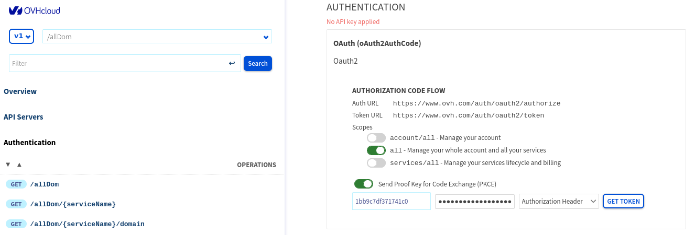
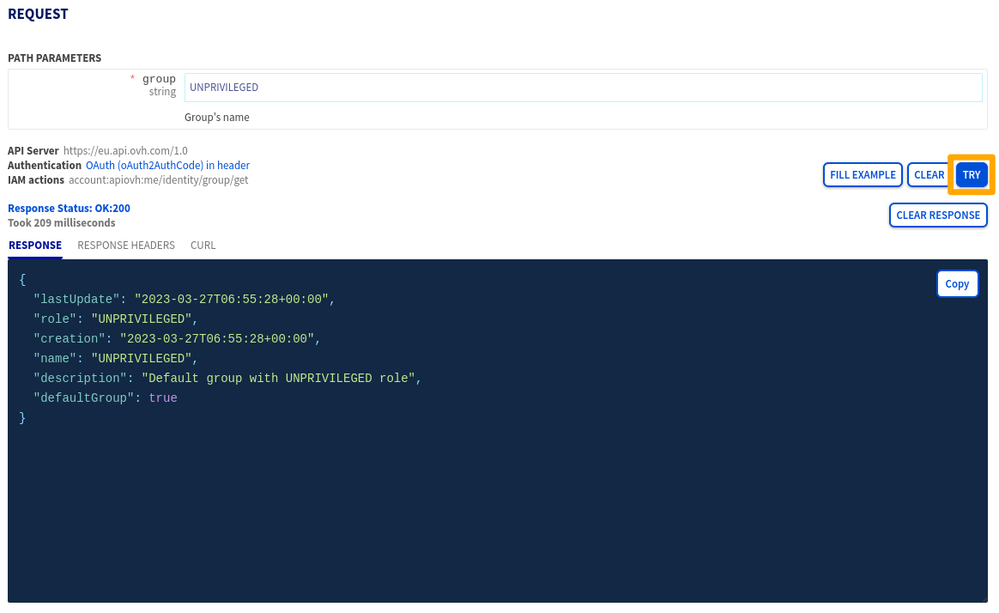

**Dernière mise à jour le 24/03/2023**

## Objectif

Les API disponibles sur [https://eu.api.ovh.com/](https://eu.api.ovh.com/){.external} vous permettent d'acheter, gérer, mettre à jour et configurer des produits OVHcloud sans utiliser une interface graphique comme l'espace client.

**Découvrez comment explorer les API OVHcloud à travers notre nouvelle console.**

## Prérequis

- Disposer d'un compte OVHcloud actif et connaître ses identifiants.
- Être sur la page web des [API OVHcloud](https://eu.api.ovh.com/){.external}.

## En pratique

> [!warning]
>
> OVHcloud met à votre disposition des services dont la configuration, la gestion et la responsabilité vous incombent. Il vous revient de ce fait d'en assurer le bon fonctionnement.
> 
> Nous mettons à votre disposition ce guide afin de vous accompagner au mieux sur des tâches courantes. Néanmoins, nous vous recommandons de faire appel à un [prestataire spécialisé](https://partner.ovhcloud.com/fr/directory/) et/ou de contacter l'éditeur du service si vous éprouvez des difficultés. En effet, nous ne serons pas en mesure de vous fournir une assistance. Plus d'informations dans la section « [Aller plus loin ](#gofurther) » de ce guide.
> 

### Se connecter aux API OVHcloud

Sur la page des [API OVHcloud](https://eu.api.ovh.com/), cliquez sur `Try the new OVHcloud API console`{.action} pour afficher la liste des API.

Pour utiliser les API sur vos produits, vous devez vous connecter sur ce site grâce à vos identifiants OVHcloud.

- Cliquez sur `Authentication`{.action} en haut à gauche.
- L'authentification utilise le protocole OAuth2 et un système de scopes. Pour vous authentifier, vous devez choisir un ou plusieurs scope(s) parmi la liste proposée. Ceux-ci limiteront l'accès du token généré à une sous-partie des opérations de l'API. Pour ce tutoriel, sélectionnez simplement le scope `all` qui donne accès à toutes les opérations de l'API, puis cliquez sur le bouton `GET TOKEN`{.action}.
- Vous serez alors redirigé vers la page d'authentification sur laquelle vous devez saisir vos identifiants OVHcloud.
- Une fois vos identifiants validés, vous serez redirigé sur la console et pourrez essayer des appels sur les routes de l'API OVHcloud.

{.thumbnail}

> [!primary]
>
> Si votre compte OVHcloud est protégé par une [double authentification](https://docs.ovh.com/fr/customer/securiser-son-compte-avec-une-2FA/), vous devrez également saisir le code généré par SMS ou application OTP ou clé U2F.
>

### Explorer les produits disponibles sur les API

#### Sélection de la branche d'API

Plusieurs branches des API OVHcloud sont disponibles :

- **V1** : l'API disponible à l'URL [https://eu.api.ovh.com/v1](https://eu.api.ovh.com/v1)
- **V2** : la nouvelle API OVHcloud, disponible à l'URL [https://eu.api.ovh.com/v2](https://eu.api.ovh.com/v2)

La branche d'API peut être sélectionnée à l'aide du menu déroulant en haut à gauche de la console.

{.thumbnail}

#### Selection de la section d'API

Après avoir choisi la branche d'API, vous pouvez naviguer dans les différentes sections de la branche sélectionnée. Par défaut, la première section dans l'ordre alphabétique est sélectionnée.
Les sections sont disponibles dans le menu déroulant à droite du menu permettant de choisir la branche. Il est possible de filtrer la liste des sections en commençant à taper le nom de la section recherchée.

{.thumbnail}

Une fois une section sélectionnée, la liste des opérations qu'elle contient est affichée dans le menu de gauche.

#### Exploration des opérations

La liste des opérations de la section d'API sélectionnée est visible dans la partie basse du menu de gauche.

{.thumbnail}

Chaque ligne contient les informations suivantes :

- Le verbe HTTP de l'operation (GET, PUT, POST, PATCH, DELETE)
- Le nom de la route
- L'état de l'opération : si l'opération est en état *alpha* ou *beta*, vous pourrez observer un badge sur la droite du nom de la route.

{.thumbnail}

Si l'opération a été marquée comme dépréciée, le nom de la route apparaitra grisé dans la liste. Dans l'exemple suivant, la deuxième opération est marquée comme dépréciée.

{.thumbnail}

Une fois que vous aurez sélectionné une opération, les informations de celle-ci s'afficheront sur la partie droite de la page.

Cette vue est découpée en quatre parties décrites ci-après.

##### **Informations générales**

Cette partie contient les informations générales à propos de l'opération d'API :

- L'état de l'opération (par exemple *Beta version*)
- La description de l'opération
- Le nom de la route et le verbe HTTP de l'opération

{.thumbnail}

##### **Requête**

Cette partie décrit les paramètres d'entrée de l'opération. Selon l'opération, plusieurs sous-sections vont être affichées :

- **Paramètres de chemin**

{.thumbnail}

L'étoile rouge située sur la gauche du nom du paramètre indique que celui-ci est obligatoire pour pouvoir exécuter la requête.

- **Paramètres d'en-tête**

{.thumbnail}

- **Paramètres de requête**

{.thumbnail}

- **Corps de la requête**

Cette zone permet de décrire les paramètres du corps de la requête. La vue par défaut montre un exemple de ce que l'opération accepte pour ces paramètres.
Ces valeurs peuvent être modifiées directement dans cette vue pour pouvoir tester l'appel avec des valeurs correspondantes à vos services.

{.thumbnail}

Il existe aussi un onglet *SCHEMA* qui vous permet de visualiser plus précisément le type, la description, et les valeurs possibles pour chacun de ces paramètres.

{.thumbnail}

##### **Réponse**

Cette section est similaire à la précédente et présente un exemple de réponse de l'API.

{.thumbnail}

L'onglet *SCHEMA* est également disponible pour avoir le détail des champs retournés et leur description.

{.thumbnail}

#### Recherche avancée

Une recherche avancée est disponible en cliquant sur le bouton `Search`{.action} en haut à gauche.

{.thumbnail}

Une fenêtre de recherche avancée s'ouvre et permet de rechercher suivant les critères suivants :

- Nom de la route d'API
- Description de la route d'API
- Paramètres de l'opération
- Champ du corps de la requête de l'opération
- Description de la réponse de l'opération
- État de l'opération

{.thumbnail}

### Exécuter des requêtes

Depuis la console, il est possible d'interagir directement avec l'API en utilisant le bouton `TRY`{.action}.

{.thumbnail}

Après avoir rempli (si nécessaire) les paramètres requis pour une opération, ce bouton permet de faire un vrai appel à l'API OVHcloud.
La réponse sera ensuite affichée en dessous des paramètres de l'opération.

Trois onglets sont disponibles dans cette vue :

- **RESPONSE** : le corps de la réponse renvoyée par l'API
- **RESPONSE HEADERS** : les en-têtes renvoyés par l'API
- **CURL** : montre l'équivalent de la requête envoyée à l'API en utilisant l'utilitaire `curl`

## Aller plus loin 

[Gestion d'un nom de domaine via les APIs OVHcloud](https://docs.ovh.com/fr/domains/api/)

[Comment gérer le compte d'un client OVHcloud via les APIs](https://docs.ovh.com/gb/en/api/api-rights-delegation/) (guide en anglais)

Échangez avec notre communauté d'utilisateurs sur [https://community.ovh.com](https://community.ovh.com).
