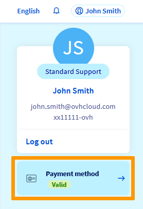

**Última actualización: 06/01/2021**

## Objetivo
En el área de cliente de OVHcloud, puede registrar y gestionar diferentes formas de pago.

## Requisitos
- Haber iniciado sesión en el [área de cliente de OVHcloud](https://ca.ovh.com/auth/?action=gotomanager&from=https://www.ovh.com/world/&ovhSubsidiary=ws){.external}.
- Disponer de un medio de pago válido.

## Procedimiento

Inicie sesión en el [área de cliente de OVHcloud](https://ca.ovh.com/auth/?action=gotomanager&from=https://www.ovh.com/world/&ovhSubsidiary=ws){.external}, haga clic en su nombre en la esquina superior derecha y, seguidamente, seleccione `Forma de pago`{.action}.

{.thumbnail}

Se abre la página contentiva de las formas de pago registradas en su área de cliente, sobre todo, las utilizadas al hacer sus pedidos. Allí, podrá:

- Añadir una forma de pago
- Cambiar su forma de pago por defecto
- Eliminar una forma de pago

### Añadir una forma de pago

Al realizar un pedido de un producto OVHcloud por primera vez, deberá registrar una forma de pago para garantizar la renovación de su servicio mediante cargo automático.

Esta forma de pago se utilizará por defecto en todas sus renovaciones y se propondrá al realizar nuevas compras.

Por supuesto, puede registrar nuevas formas de pago para que le sean propuestas al hacer nuevos pedidos o para sus futuros cargos.

Es posible registrar tres tipos de formas de pago:

- Tarjeta bancaria
- Cuenta PayPal

Para ello, haga clic en el botón `Añadir una forma de pago`{.action}.

{.thumbnail}

Siga los siguientes pasos para registrar una forma de pago. Primero, podrá establecer la nueva forma de pago como «forma de pago por defecto», la que utilizará en sus futuras compras o cargos automáticos.

### Cambiar su forma de pago por defecto

Las facturas correspondientes a la renovación de sus servicios siempre se cargarán a su forma de pago por defecto. Si desea modificarla, deberá añadir primeramente una nueva forma de pago en su área de cliente.

Para ello, haga clic en el botón `...`{.action} a la derecha de la nueva forma de pago y, seguidamente, en `Establecer como forma de pago por defecto`{.action}.

{.thumbnail}

### Eliminar una forma de pago

Si ya no desea utilizar alguna de sus formas de pago, puede eliminarla haciendo clic en el botón `...`{.action} a la derecha de esta. A continuación, haga clic en `Eliminar esta forma de pago`{.action}.

{.thumbnail}

Solo podrá eliminar una forma de pago si se cumple una de las siguientes condiciones:

- otra forma de pago activa está registrada en su área de cliente de OVHcloud.
- todos sus servicios de OVHcloud están en [renovación manual](../renovacion-automatica-ovh/#renovacion-manual).

> [!warning]
>
La forma de pago por defecto no puede eliminarse. Si quiere eliminarla, debe establecer primeramente otra forma de pago por defecto.
>

#### Eliminar una forma de pago a través de las API OVHcloud

La eliminación de una forma de pago puede realizarse a través de las API conectándose a [https://ca.api.ovh.com/](https://ca.api.ovh.com/){.external}.

En primer lugar, debe obtener el id. de la forma de pago: 

> [!api]
>
> @api {GET} /me/payment/method 
>

A continuación, elimine la forma de pago utilizando el id. que obtuvo en el paso anterior:

> [!api]
>
> @api {DELETE} /me/payment/method/{paymentMethodId}
>

## Más información

Interactúe con nuestra comunidad de usuarios en <https://community.ovh.com/en/>.
