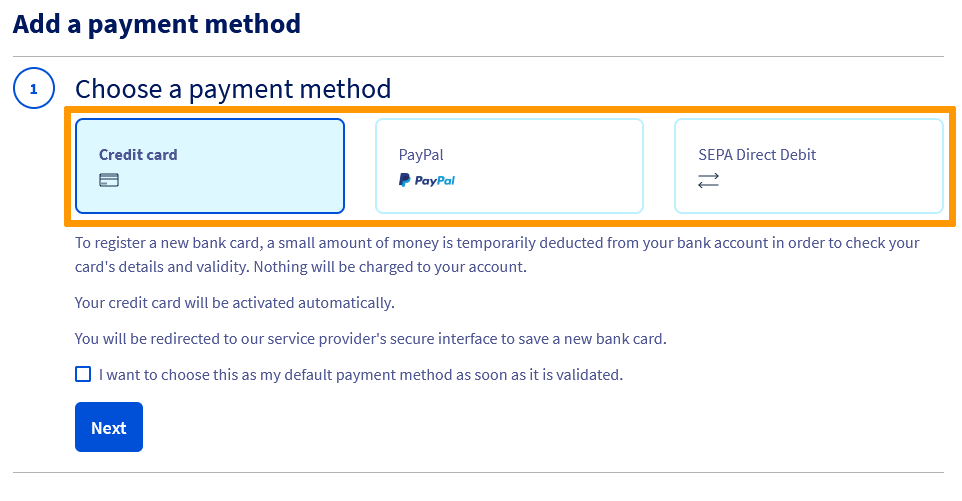
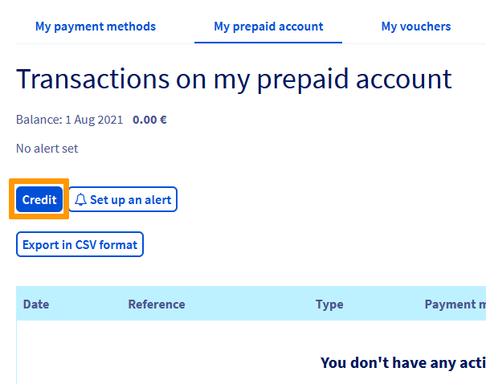

**Dernière mise à jour le 06/05/2022**

## Objectif

L'espace client OVHcloud vous permet d'enregistrer et gérer différents moyens de paiement.

<iframe width="560" height="315" src="https://vimeo.com/showcase/9276741/video/696215450" frameborder="0" allow="accelerometer; autoplay; encrypted-media; gyroscope; picture-in-picture" allowfullscreen></iframe>

## Prérequis

- Être connecté à votre [espace client OVHcloud](https://www.ovh.com/auth/?action=gotomanager&from=https://www.ovh.com/fr/&ovhSubsidiary=fr).
- Disposer d'un moyen de paiement valide.

## En pratique 

Dans votre [espace client OVHcloud](https://www.ovh.com/auth/?action=gotomanager&from=https://www.ovh.com/fr/&ovhSubsidiary=fr), cliquez sur votre nom en haut à droite puis sélectionnez `Moyen de paiement`{.action}.

{.thumbnail}

La page qui s’affiche contient un tableau répertoriant les moyens de paiement enregistrés sur votre compte client. Vous pourrez y :

- Ajouter un moyen de paiement
- Modifier votre moyen de paiement par défaut
- Modifier la description de votre moyen de paiement
- Supprimer un moyen de paiement

### Ajouter un moyen de paiement

Lors de votre première commande, il vous est demandé d'enregistrer un moyen de paiement, afin d'assurer le renouvellement de votre service par prélèvement automatique.

Ce moyen de paiement est alors utilisé par défaut pour tous vos renouvellements et vous est proposé pour régler de nouvelles commandes.

Vous avez la possibilité d'enregistrer d'autres moyens de paiement, afin qu'ils vous soient proposés lors de vos nouvelles commandes ou utilisés par défaut pour vos futurs prélèvements.

Il est possible d'enregistrer 3 types de moyens de paiement :

- Carte bancaire
- Compte bancaire
- Compte PayPal

Pour cela, cliquez simplement sur le bouton `Ajouter un moyen de paiement`{.action}.

{.thumbnail}

Puis choisissez la méthode de paiement que vous souhaitez utiliser : 

{.thumbnail}

Suivez les étapes successives d'enregistrement du moyen de paiement. A la première étape, il vous est proposé de cocher la case `Je veux sélectionner ce moyen de paiement par défaut dès sa validation`{.action}, afin qu'il soit utilisé pour vos futurs achats ou prélèvements automatiques.

#### Carte bancaire

{.thumbnail}

Pour enregistrer une nouvelle carte bancaire, une empreinte financière est faite auprès de votre organisme bancaire afin de valider la saisie et la validité de votre carte. **Aucun montant ne sera prélevé**.

Votre carte bancaire sera activée au bout de quelques minutes.

Vous serez redirigé vers l’interface sécurisée de notre prestataire pour enregistrer une nouvelle carte bancaire.

#### Compte bancaire

{.thumbnail}

> [!warning]
>
> L'utilisation de prélèvement SEPA n'est possible que pour les comptes clients français et allemands.
>

En cas d'enregistrement d'un compte bancaire, vous recevrez un e-mail de notre partenaire Yousign&#174;, vous permettant de signer électroniquement votre mandat de prélèvement.

{.thumbnail}

> [!primary]
>
> Tant que cette autorisation n'est pas signée et validée par vos soins, la mention `En cours de validation` sera indiquée à côté de votre compte bancaire, celui-ci ne pouvant alors être pris en compte pour vos paiements.
>

Suite à la réception de votre autorisation de prélèvement SEPA, votre compte bancaire sera validé en tant que moyen de paiement sur votre compte client sous 48 heures environ.

#### Compte paypal

En cliquant sur le bouton `Paypal`{.action}, une fenêtre contextuelle s'ouvrira afin de finaliser l'ajout du moyen de paiement.

{.thumbnail}

Cliquez sur le bouton `Paypal`{.action}. Une fenêtre contextuelle s'ouvrira alors pour vous connecter à votre compte Paypal&#174; et enregistrer celui-ci comme moyen de paiement autorisé auprès de OVHcloud.

Votre compte Paypal&#174; sera activé sous quelques minutes.

### Modifier votre moyen de paiement par défaut

Les factures de renouvellement de vos services sont toujours prélevées sur votre moyen de paiement par défaut. Si vous souhaitez modifier celui-ci, il vous faut d'abord ajouter un nouveau moyen de paiement dans votre espace client.

Cliquez alors sur le bouton `...`{.action} à droite du nouveau moyen de paiement, puis sur `Définir ce moyen de paiement par défaut`{.action}.

{.thumbnail}

> **Je souhaite remplacer mon moyen de paiement par défaut par un autre, comment faire ?**
>
> - Étape 1 : ajoutez le nouveau moyen de paiement
> - Étape 2 : définissez le nouveau moyen de paiement comme moyen de paiement par défaut
> - Étape 3 : supprimez l'ancien moyen de paiement
>

Si vous souhaitez supprimer l'intégralité de vos moyens de paiement, l'ensemble de vos services doit être en [renouvellement manuel](https://docs.ovh.com/fr/billing/renouvellement-automatique-ovh/#le-renouvellement-manuel).

### Supprimer un moyen de paiement

Si vous ne souhaitez plus utiliser l'un de vos moyens de paiement, vous pouvez le supprimer en cliquant sur le bouton `...`{.action} à droite de celui-ci. Cliquez alors sur `Supprimer ce moyen de paiement`{.action}.

{.thumbnail}

> [!warning]
>
> Le droit de rétraction ne concerne que les particuliers et ne s'applique qu'aux nouvelles commandes. Vous ne pouvez donc pas l'utiliser :
>
> - pour des renouvellements;
> - si votre compte client OVHcloud est d'un [autre type que Particulier](https://docs.ovh.com/fr/customer/tout-savoir-sur-identifiant-client/#modifier-le-type-de-compte).
>
> De plus, le droit de rétractation ne s'applique pas aux commandes non-payées, car celles-ci sont automatiquement annulées lorsque le bon de commande expire.
>

#### Supprimer un moyen de paiement via les API OVHcloud

La suppression d'un moyen de paiement peut être effectuée via les API en vous connectant sur [https://eu.api.ovh.com/](https://eu.api.ovh.com/).

Commencez par obtenir l'ID du moyen de paiement :

> [!api]
>
> @api {GET} /me/payment/method
>

Supprimez ensuite le moyen de paiement en utilisant l’ID que vous avez obtenu à l’étape précédente :

> [!api]
>
> @api {DELETE} /me/payment/method/{paymentMethodId}
>

> [!primary]
>
> Pour plus d'informations, consultez le guide [Premiers pas avec les API OVHcloud](https://docs.ovh.com/fr/api/api-premiers-pas/)/
>
> En cas de difficultés pour identifier vos moyens de paiement via les API OVHcloud, utilisez la fonction `Modifier la description`{.action} (bouton `...`{.action} à droite de votre écran) dans la partie [Moyens de paiement](#payment_methods) de votre [espace client OVHcloud](https://www.ovh.com/auth/?action=gotomanager&from=https://www.ovh.com/fr/&ovhSubsidiary=fr).
>

### Le compte prépayé

#### Qu'est-ce que le compte prépayé ?

Le *compte prépayé* est présent sur votre [espace client OVHcloud](https://www.ovh.com/auth/?action=gotomanager&from=https://www.ovh.com/fr/&ovhSubsidiary=fr) dès sa création. Il vous permet de créditer à l'avance votre compte client et d'utiliser ces fonds pour le règlement de vos commandes et de vos factures de renouvellement.

En créditant régulièrement votre compte, vous vous assurerez ainsi que le [renouvellement automatique](https://docs.ovh.com/fr/billing/renouvellement-automatique-ovh/) de vos services ne sera jamais interrompu pour défaut de paiement.

Pour cela, il vous suffit de vous rendre dans la section `Moyens de paiement` de votre espace client :

- Cliquez en haut à droite sur votre nom puis sur `Moyen de paiement`{.action} dans le menu de droite;
- Sélectionner l'onglet `Mon compte prépayé`{.action}.

{.thumbnail}

#### Comment fonctionne t-il ?

A chaque échéance, lorsque vous possédez des services paramétrés en *renouvellement automatique*, le montant de votre facture est prioritairement prélevé sur votre compte prépayé.

En l'absence de fonds suffisants, le solde de votre compte passera en négatif et restera en attente de paiement.

Si vous disposez d'un moyen de paiement valide enregistré sur votre compte client, ce montant sera automatiquement prélevé dans les 24 heures et votre solde remis à zéro. Ceci sans aucun impact sur l'état de vos services.

En revanche, si vous n'avez pas enregistré de moyen de paiement, vous devrez régler ce solde depuis votre espace client sous 7 jours pour éviter toute coupure de service.

Si vous n'avez pas de moyen de paiement enregistré, nous vous recommandons donc de paramétrer un **seuil d'alerte**, afin de vous assurer que vous disposerez des fonds suffisants pour vos prochaines factures :

{.thumbnail}

Si le crédit disponible sur votre compte prépayé descend sous la limite définie, un e-mail de notification vous sera immédiatement envoyé.

#### Comment créditer votre compte prépayé ?

Dans l'onglet `Mon compte prépayé`{.action}, cliquez sur le bouton `Créditer`{.action}.

{.thumbnail}

Dans la fenêtre qui s'affiche, indiquez le montant à créditer, cliquez sur `Suivant`{.action} puis sur `Commander`{.action}.

{.thumbnail}

Sur le bon de commande qui s'affiche, sélectionnez le moyen de paiement de votre choix.

{.thumbnail}

## Aller plus loin

Échangez avec notre communauté d'utilisateurs sur <https://community.ovh.com>