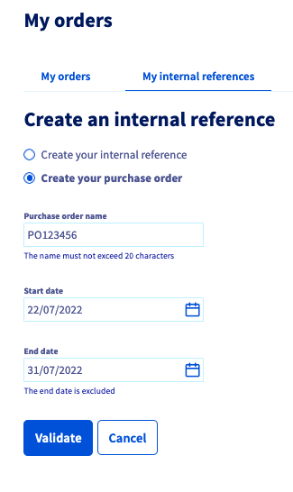

**Dernière mise à jour le 22/07/2022**

## Objectif

Ce guide vous explique la notion de Numéro de commande ou Purchase Order (PO) appliqué à la facturation OVHCloud.

## En pratique

### Numéro de commande et Purchase Order (PO) Number

Dans le cadre d'achats de biens ou de services, les entreprises sont amenées à valider des bons de commandes. La plupart du temps, cette validation est effectuée en retournant un document (format papier ou numérique) à en-tête de l'entreprise qui rappelle les biens ou services achetés tout en  précisant un numéro de commande.
Dans le monde anglo-saxon, ce document est appelé **Purchase Order** et est abrégé en **PO**.

Pour l'entreprise qui émet le PO, ce document a pour objectif de contrôler les achats de biens et de services auprès de ses fournisseurs, notamment en imposant que l'ensemble des factures émises indiquent un numéro de commande (ou PO Number).

Il existe essentiellement deux types de commandes, décrites ci-dessous.

#### Commande fermée / Purchase Order (PO)

Il s'agit d'un document confirmant la commande de biens ou services pour une quantité fixe et pour une durée fixe.

Pour OVHcloud, le document doit donc contenir a minima les informations suivantes :

* Raison sociale du contractant
* Numéro de commande
* Type(s) de services commandés
* Quantités
* Prix unitaires
* Date de début de validité
* Date de fin de validité

#### Commande ouverte / Blancket Purchase Order (BPO)

Il s'agit d'un document confirmant la commande de biens ou services pour une quantité variable avec un montant maximum et pour une durée fixe.

Pour OVHcloud, le document doit donc contenir a minima les informations suivantes :

* Raison sociale du contractant
* Numéro de commande
* Type(s) de services commandés
* Prix unitaires
* Montant total de la commande
* Date de début de validité
* Date de fin de validité

### Comment renseigner un Numéro de Purchase Order (PO) dans votre espace client OVHcloud

Connectez-vous à votre [espace client OVHcloud](https://www.ovh.com/auth/?action=gotomanager&from=https://www.ovh.com/fr/&ovhSubsidiary=fr) puis, dans l'onglet `Tableau de bord`{.action}, cliquez sur `Voir mes commandes`{.action}.

{.thumbnail}

Cliquez sur l'onglet `Mes références internes`{.action} puis sur le bouton `+ Ajouter une référence interne`{.action}.

{.thumbnail}

Deux terminologies s'offrent à vous, selon que vous souhaitez afficher sur vos factures la mention `Référence interne` **ou** la mention `Purchase Order`. 
Sélectionnez ainsi soit  `Créer une référence interne`{.action}, soit `Créer votre purchase order`{.action}.

Donnez un nom à votre référence interne / Purchase Order dans le champ prévu à cet effet, renseignez une **date de début** et une **date de fin** (la date de fin est exclue) puis cliquez sur  `Valider`{.action}.

> [!primary]
> Vous ne pouvez pas créer 2 références internes / Purchase Orders sur la même période de temps.

{.thumbnail}

Cette référence apparaîtra alors sur vos prochaines factures correspondant à l'intervalle de temps défini par vos soins.

{.thumbnail}

Depuis l'onglet `Mes références internes`{.action}, vous pouvez modifier ou désactiver une référence déjà créée en cliquant sur le bouton `...`{.action} à droite de la référence concernée.

{.thumbnail}

> [!primary]
> Si vous souhaitez désactiver/modifier une référence au profit d'une autre **sur le même intervalle de temps**, vous devez utiliser l'option  `Modifier`{.action} afin de modifier l'intervalle de temps de la première référence.

## Aller plus loin

Échangez avec notre communauté d'utilisateurs sur <https://community.ovh.com>.