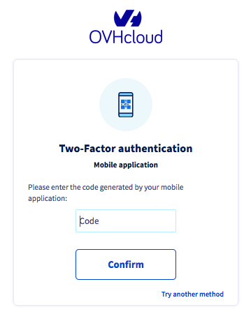

**Dernière mise à jour le 28/06/2021**

## Objectif

La double authentification avec le système *one-time password* (OTP) disponible via une application mobile est l'une des méthodes proposées par OVHcloud pour vous permettre de sécuriser l'accès à votre espace client.

**Ce guide vous permettra d'activer la double authentification par application OTP et de comprendre comment l'utiliser pour vos prochaines connexions à votre espace client.**

## Prérequis

- Avoir pris connaissance des [différentes méthodes de double authentification proposées par OVHcloud](https://docs.ovh.com/fr/customer/securiser-son-compte-avec-une-2FA/).
- Être connecté à l'[espace client OVHcloud](https://www.ovh.com/auth/?action=gotomanager&from=https://www.ovh.com/fr/&ovhSubsidiary=fr){.external}.
- Avoir installé une application OTP sur un smartphone ou une tablette Android ou iOS.

> [!primary]
>**Les applications mobiles OTP**
>
> De nombreuses applications OTP existent. En voici deux, gratuites :
>
> - sur Android : Free OTP ;
> - sur iOS : OTP Auth.
>

## En pratique

### Étape 1 : activer la double authentification

Connectez-vous à votre [espace client OVHcloud](https://www.ovh.com/auth/?action=gotomanager&from=https://www.ovh.com/fr/&ovhSubsidiary=fr){.external}. Cliquez sur votre nom en haut à droite (1), puis sur vos initiales (2). Cliquez ensuite sur `Sécurité`{.action} (3) et enfin sur `Activer la double authentification`{.action} (4).

{.thumbnail}

### Étape 2 : choisir la méthode par application mobile

Choisissez la méthode par application mobile et validez.

{.thumbnail}

### Étape 3 : valider la double authentification

Scannez le QR code via votre application OTP. Dans le champ dédié à droite de ce QR code, renseignez alors le code donné par l'application. Vous pouvez également ajouter une description à cette méthode d'authentification. Celle-ci peut être utile pour identifier les personnes susceptibles d'utiliser cette méthode sur votre compte.

{.thumbnail}

### Étape 4 : sauvegarder les codes de sécurité

Au premier ajout d'une méthode de sécurité par double authentification, des codes de secours vous sont communiqués. **Ils sont à conserver précieusement**. Nous vous conseillons donc de les sauvegarder dans un gestionnaire de mots de passe, tel que [KeePass](https://keepass.info/){.external}.

{.thumbnail}

Vous pourrez les supprimer ou les regénérer depuis votre espace client.

{.thumbnail}

> [!warning]
>
> Nous vous rappelons qu’il est indispensable de **sauvegarder ces codes de secours** et de vous assurer qu’ils sont valides. En cas d’indisponibilité de votre ou vos méthodes de sécurité sélectionnées (vol ou perte de votre téléphone ou de votre clé de sécurité), l’accès à votre espace client pourrait être bloqué.
>

### Étape 5 : se connecter à l'espace client avec la double authentification

Une fois l'authentification à double facteur activée, l'écran d'identification vous présentera l'une de vos méthodes de sécurité. Si vous souhaitez en utiliser une autre, cliquez sur le bouton `Essayer une autre méthode`{.action}.

{.thumbnail}

Tous les choix que vous avez activés apparaîtront alors :

{.thumbnail}

## Aller plus loin

[Sécuriser son compte OVHcloud avec la double authentification](https://docs.ovh.com/fr/customer/securiser-son-compte-avec-une-2FA/)

[Désactiver la double authentification sur son compte OVHcloud](https://docs.ovh.com/fr/customer/securiser-son-compte-avec-une-2FA/#desactivation)

Échangez avec notre communauté d'utilisateurs sur <https://community.ovh.com>