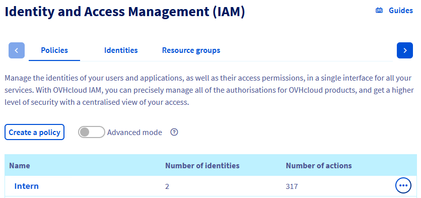
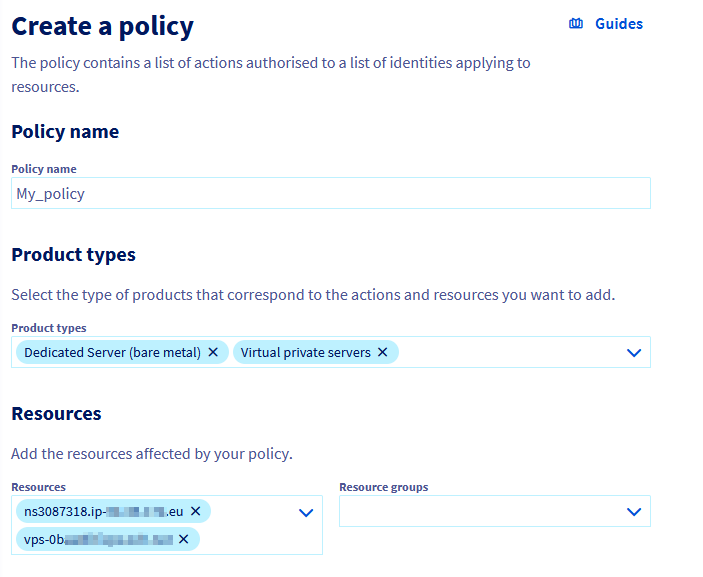
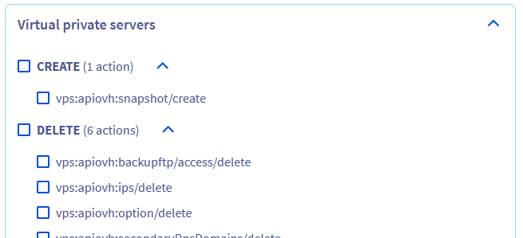

> [!warning]
>
> This feature is currently in beta. To join the beta, subscribe here: <https://labs.ovhcloud.com/en/>
>

## Objective

This guide will explain how to provide specific access rights to users of an OVHcloud account.

The access management of OVHcloud is based on a "policy" management system. It is possible to write different "policies" that give users access to specific features on the products linked to an OVHcloud account.

In details, a policy contains:

- One or more **identities** targeted by this policy. 
    - It can be account IDs, users or user groups (like the ones used in [Federation](/pages/account/customer/ovhcloud-account-connect-saml-adfs)). 
- One or more **resources** impacted by this policy. 
    - A resource is an OVHcloud product that will be impacted by this policy (a domain name, a Nutanix server, a Load Balancer, etc.).
- One or more **actions** allowed or excepted by this policy. 
    - Actions are the specific rights affected by this policy (reboot the server, create an email account, terminate a product, etc.)

For instance, we can create a policy to give to a user called John, for a VPS, access to the action "reboot".

**This guide explains in details how these policies can be declared using the OVHcloud API, and how to list the identities, resources and actions available for them.**

{.thumbnail}

## Requirements

- An [OVHcloud account](/pages/account/customer/ovhcloud-account-creation).
- Knowing [how to manage account users](/pages/account/customer/ovhcloud-users-management).
- One or more OVHcloud products linked to this OVHcloud account (Load Balancer, domain name, VPS, etc.).

## Instructions

### Accessing the IAM menu

Click your name in the top-right corner, then on your name again on the panel.

{.thumbnail}

You can access to the IAM menu via the dedicated entry on your account management.

{.thumbnail}

The menu will give you the list of all the current policies created on your account

{.thumbnail}

Each policy is identified by its name, the number of identities linked to it, and the number of actions it contains.

> [!primary]
>
> The "Advanced mode" button displays the list of all the OVHcloud Managed policies. These policies are automatically created by OVHcloud to convert the preexisting NIC Tech and NIC Admin delegation on the new IAM feature. 
>
> Customers are not allowed to edit or delete these policies.

### Managing policies

#### Create a policy

Click the `Create a policy`{.action} button.

The following form will be displayed :

{.thumbnail}

- **Name of the policy** (mandatory): This is the name that will appear on the interfaces. The name should be unique and cannot contain any space.
- **Product type**: Select the types of product you want to scope the policy to. One or more product types can be selected on the same policy
- **Resources**: Select the list of resources or of resources groups scoped by the policy. The resources available are filtered by the product type selected beforehand.
- **Actions**.

There are 3 differents ways to add actions :

- Activating the `Enable all the actions`{.action} option.

{.thumbnail}

When activating this option, you allow all actions related to the selected products. This includes all existing actions, but will include also actions that will be added in the future for these products categories.

- Adding actions manually

If you know the action name, you can add it manually

{.thumbnail}

You can use a wildcard at the beginning or at the end of the action name with `*`.

For example, adding `vps:apiovh:ips/*` will grant the following rights :

vps:apiovh:ips/edit
vps:apiovh:ips/delete
vps:apiovh:ips/get 

- Selecting actions from the list

Finally, you can select actions from the list.

{.thumbnail}

Actions are categorized by resource type and in 5 categories :

- **Read**: list and show existing information of a product
- **Create**: action that allows to create anything on a product
- **Delete**: action that allows to delete existing thing on a product
- **Edit**: action to change something already existing on a product
- **Operate**: apply changes over the infrastructure related to the product

A search field is available to help identifying a specific action within the list.

#### Edit a policy

To edit an existing policy, click the `...`{.action} button to the right of the policy and click `Edit the policy`{.action}.

{.thumbnail}

Then you ca change the scope of the policy.

#### Delete a policy

To delete an existing policy, click the `...`{.action} button to the right of the policy and click `Delete the policy`{.action}.

A pop-up window will ask you for confirmation of deletion.

### Link a identity to a policy

To link an identity to a policy, click the `...`{.action} button to the right of the policy and click `Manage the identities`{.action}.

{.thumbnail}

This will allow you to add and delete the users or the groups to whom the policy should apply.

{.thumbnail}

### Managing identities

The identities available for policies are managed via the `User management`{.action} tab, in the `My account`{.action} menu.

The identity tab on the IAM menu will redirect you to the this menu.

Details about user management are available in the [dedicated documentation](/pages/account/customer/ovhcloud-users-management).

### Managing Resource groups

Policies can target resource groups instead of resources. These resource groups can regroup resources from different products, e.g. for testing environment purposes.

#### Create a resource group

To create a resource group, access the dedicated tab on the IAM menu:

{.thumbnail}

Click `Create a resource group`{.action}.

{.thumbnail}

- **Name of the resource group**: This is the name that will appear on the interfaces. The name should be unique and cannot contain any space.
- **Product type**: The list of product types concerned by this resource group.
- **Resources**: The list of resources the group will contain.

#### Edit a resource group

To edit a resource group, click its name from the list.

#### Delete a resource group

To delete an existing resource group, click the `...`{.action} button to the right of the group and click `Delete the resource group`{.action}.

A pop-up window will ask you for confirmation of deletion.

## Go further

Join our community of users on <https://community.ovh.com/en/>.
