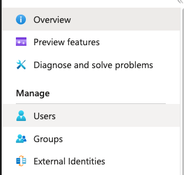
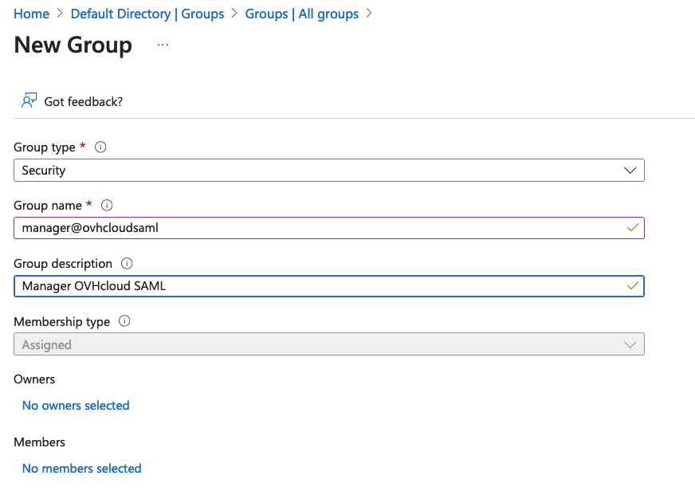
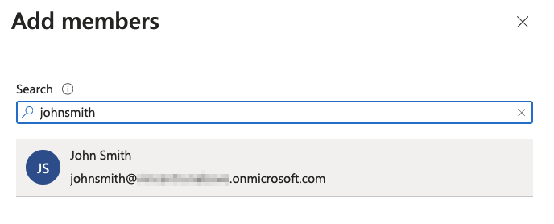
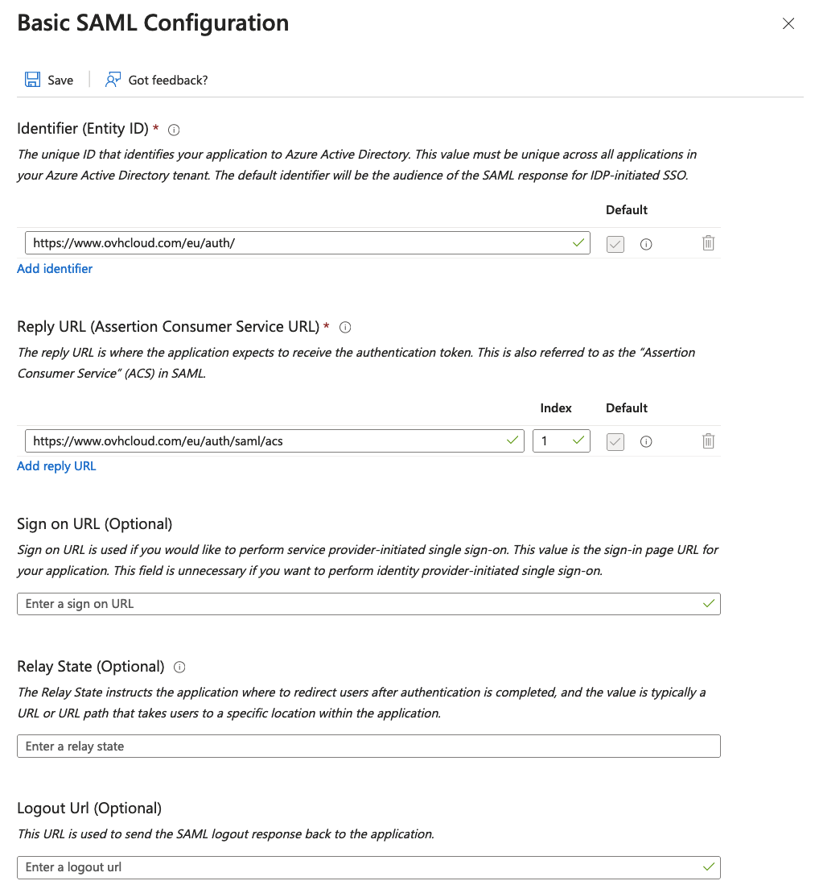
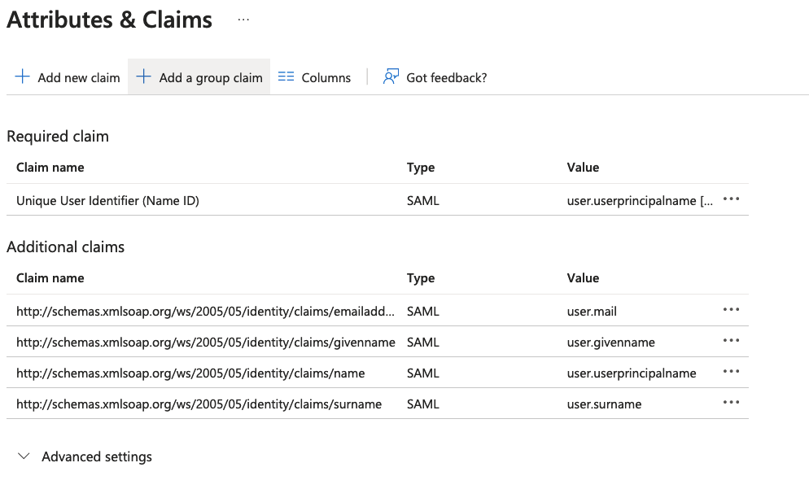
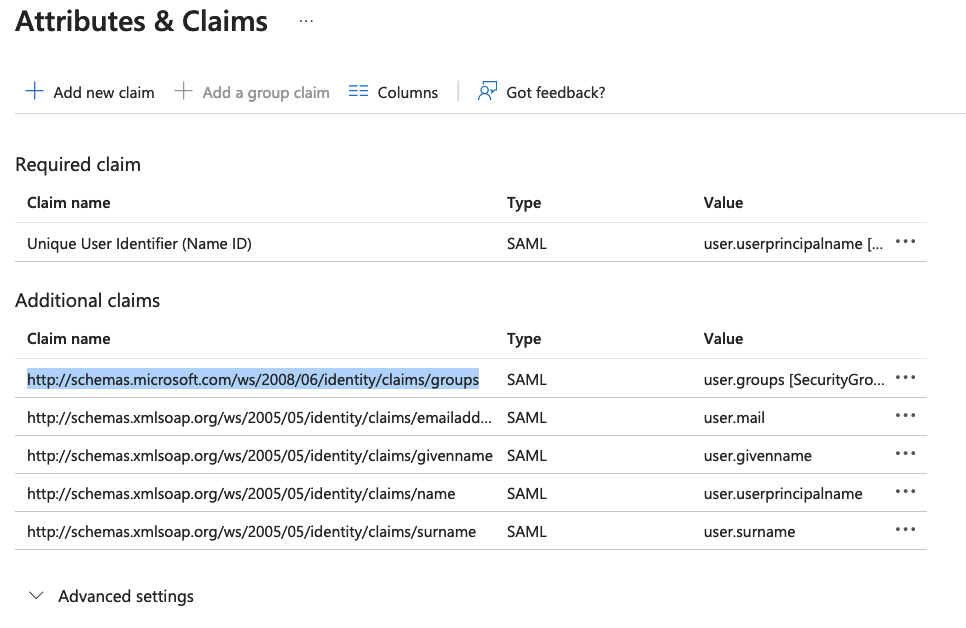
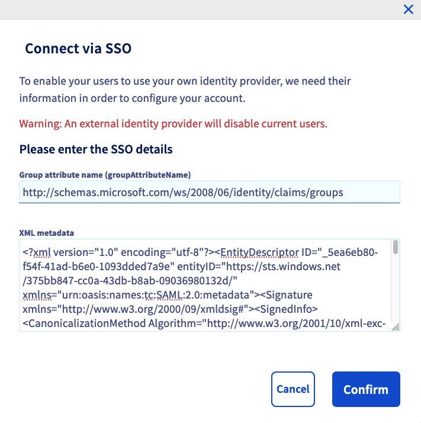
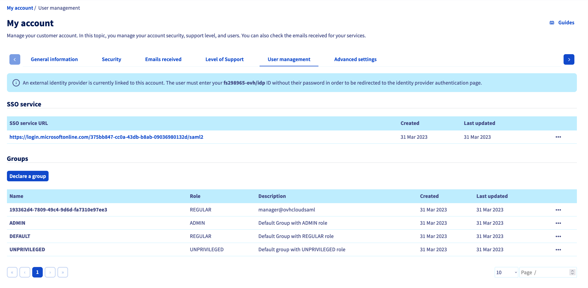
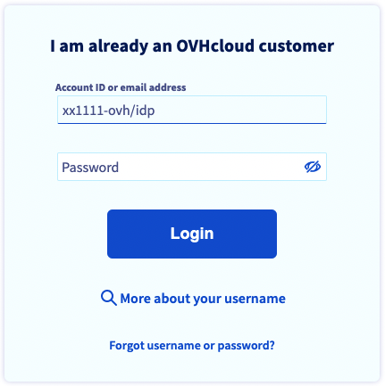

> [!primary]
> Diese Übersetzung wurde durch unseren Partner SYSTRAN automatisch erstellt. In manchen Fällen können ungenaue Formulierungen verwendet worden sein, z.B. bei der Beschriftung von Schaltflächen oder technischen Details. Bitte ziehen Sie im Zweifelsfall die englische oder französische Fassung der Anleitung zu Rate. Möchten Sie mithelfen, diese Übersetzung zu verbessern? Dann nutzen Sie dazu bitte den Button "Beitragen" auf dieser Seite.
>

**Letzte Aktualisierung am 05.04.2023**

## Ziel

Sie können die Authentifizierungsmethode **Single Sign-On** (SSO) verwenden, um sich in Ihren OVHcloud Kunden-Account einzuloggen. Um diese Verbindungen zu aktivieren, müssen Ihr Account und Ihr Azure AD (Active Directory) mithilfe von SAML-Authentifizierungen (*Security Serving Markup Language*) konfiguriert werden.

**Diese Anleitung erklärt, wie Sie Ihren OVHcloud Kunden-Account mit einem externen AD Azure verbinden.**

## Voraussetzungen

- Sie haben Zugriff auf die Rollen **Application Administrator** und **User Administrator** eines Azure AD Dienstes.
- Sie verfügen über einen [OVHcloud Kunden-Account](https://docs.ovh.com/de/customer/ovhcloud-account-erstellen/).
- Sie haben Zugriff auf Ihr [OVHcloud Kundencenter](https://www.ovh.com/auth/?action=gotomanager&from=https://www.ovh.de/&ovhSubsidiary=de).

## In der praktischen Anwendung

> [!primary]
>
> Damit ein Service Provider (Ihr OVHcloud Account) eine SSO-Verbindung zu einem Identity Provider (Ihr Azure AD) herstellen kann, ist es notwendig, das gegenseitige Vertrauensverhältnis zu konfigurieren (*Party Trust*).
>

### Azure AD Benutzer und Gruppen

Ihr Azure AD fungiert als Identity Provider. Authentifizierungsanfragen für Ihren OVHcloud Account werden nur dann akzeptiert, wenn Sie diesen zuerst als vertrauenswürdig deklariert haben.

Konfigurieren Sie zunächst Identitäten auf der Seite des Identity Providers.

#### Azure AD Benutzer

Gehen Sie auf Ihr Azure AD Dashboard.

{.thumbnail}

Klicken Sie auf `Users`{.action} im linken Menü.

{.thumbnail}

Erstellen Sie neue Benutzer oder überprüfen Sie Ihre vorhandenen Benutzer, indem Sie darauf klicken.

Für dieses Beispiel wird der Benutzer **John Smith** verwendet.

{.thumbnail}

Bei Ausführung einer SSO-Authentifizierung wird die Identität von **John Smith** von Azure AD für den OVHcloud Account bereitgestellt. Diese Identität muss jedoch mindestens eine Gruppe enthalten. Wenn noch keine Gruppe existiert, fügen Sie den Benutzer **John Smith** wie folgt hinzu.

#### Azure-AD-Gruppen

Klicken Sie auf `Groups`{.action} im linken Menü.

{.thumbnail}

Klicken Sie oben auf `New group`{.action} und geben Sie alle notwendigen Daten ein.

Für dieses Beispiel wird die Gruppe **manager@ovhcloudsaml** verwendet.

{.thumbnail}

Klicken Sie auf den Button `Create`{.action}, um alle Informationen zu dieser Gruppe anzuzeigen.

{.thumbnail}

Alle Benutzer, die für die SSO-Authentifizierung verwendet werden sollen, müssen zu einer Gruppe hinzugefügt werden.

In diesem Beispiel gehört der Benutzer **John Smith** zur Gruppe **manager@ovhcloudsaml**.

Klicken Sie im Interface der ausgewählten Gruppe links auf `Members`{.action} und klicken Sie im oberen Menü auf `Add Members`{.action}.

{.thumbnail}

Wählen Sie den Benutzer aus, der zu dieser Gruppe hinzugefügt werden soll, und klicken Sie dann auf den Button `Select`{.action}.

{.thumbnail}

Damit ist der Benutzer der Gruppe zugewiesen.

Um SSO-Authentifizierungen durchzuführen, muss eine Azure AD Anwendung erstellt werden.

SSO muss für diese Anwendung konfiguriert werden.

### Azure AD Anwendungen

Erstellen Sie zunächst eine Anwendung, wenn diese noch nicht existiert.

#### Eine Azure AD Anwendung erstellen

Klicken Sie auf `Enterprise applications`{.action} im linken Menü.

{.thumbnail}

Klicken Sie oben auf `New application`{.action}.

{.thumbnail}

Klicken Sie oben auf `Create your own application`{.action}.

{.thumbnail}

Wählen Sie links `Non-gallery`{.action} aus und klicken Sie auf den Button `Create`{.action}.

{.thumbnail}

Die Anwendungsdetails werden angezeigt.

{.thumbnail}

Die Azure AD Anwendung wird nun erstellt. Benutzer, die SSO-Authentifizierungen über diese Anwendung durchführen sollen, müssen zur *Application* hinzugefügt werden.

#### Azure AD Anwendung - Zuweisung von Benutzern

> [!primary]
>
> Damit ein Benutzer eine SSO-Authentifizierung von einer Azure AD-Anwendung aus durchführen kann, muss er zu dieser Anwendung hinzugefügt werden. Nachfolgend wird beschrieben, wie Sie einen Benutzer zu einer Azure AD Anwendung hinzufügen.
>
> Wenn Sie über **Azure AD Premium** verfügen, ist es jedoch besser, eine Benutzergruppe statt Benutzern hinzuzufügen.
>

Öffnen Sie `Users and groups`{.action} im linken Menü und klicken Sie oben auf `Add user/group`{.action}.

Klicken Sie dann auf den Bereich `Users`{.action}, wählen Sie den Benutzer aus, der zur Anwendung hinzugefügt werden soll, und klicken Sie auf den Button `Select`{.action}.

{.thumbnail}

{.thumbnail}

Wenn die Anwendung erstellt und einem Benutzer zugewiesen wurde, kann SSO via SAML eingerichtet werden.

#### Azure AD Application SSO

Klicken Sie links auf den Button `Overview`{.action} und öffnen Sie den Bereich `Set up single sign on`{.action}.

{.thumbnail}

Klicken Sie auf `SAML`{.action}.

{.thumbnail}

Klicken Sie oben auf `Upload metadata file`{.action}.

{.thumbnail}

Klicken Sie auf das Icon `Select a file`{.action} und wählen Sie die Metadaten-Datei für den OVHcloud Service Provider aus. Klicken Sie auf den Button `Add`{.action}.

Sie erhalten die passende Metadatendatei über folgende Links:

- [Metadaten der EU-Region](https://www.ovh.com/auth/sso/saml/sp/metadata.xml)
- [Metadaten der CA-Region](https://ca.ovh.com/auth/sso/saml/sp/metadata.xml)

Laden Sie die Metadatendatei herunter.

{.thumbnail}

Die SAML-Konfiguration wird angezeigt.

{.thumbnail}

Klicken Sie im Bereich `Attributes & Claims`{.action} auf den Button `Edit`{.action}.

{.thumbnail}

Klicken Sie oben auf `Add a group claim`{.action}.

{.thumbnail}

Wählen Sie `Security Groups`{.action} und **Group ID** aus `Source attribute`{.action} und klicken Sie dann auf `Save`{.action}.

{.thumbnail}

Der *Claim* **groups** sollte nun in der Liste erscheinen.

Kopieren und speichern Sie den Wert des **Claim name** (etwa in einem Texteditor), da er später benötigt wird.

{.thumbnail}

Kopieren Sie aus `SAML certificates`{.action} den Wert im Feld `App Federation Metadata Url`{.action}.

Verwenden Sie diesen Link zum Herunterladen der Metadaten-Datei der *Application* von Azure AD, um sie später im OVHcloud Kunden-Account zu verwenden.

{.thumbnail}

### Das Vertrauen zum OVHcloud Account und die Verbindung konfigurieren

Das Hinzufügen Ihres Google Workspace als vertrauenswürdiger Identity Provider erfolgt im [OVHcloud Kundencenter](https://www.ovh.com/auth/?action=gotomanager&from=https://www.ovh.de/&ovhSubsidiary=de), in dem Sie die Metadaten des Identity Providers hinterlegen können.

#### OVHcloud Vertrauen aufbauen

Wenn Sie eingeloggt sind, klicken Sie oben rechts auf Ihren Account-Namen.

{.thumbnail}

Klicken Sie auf die Initialen, um auf die Verwaltungsseite Ihres Accounts zuzugreifen.

{.thumbnail}

Öffnen Sie den Tab `Verwaltung der Nutzer`{.action}.

{.thumbnail}

Klicken Sie auf den Button `SSO-Verbindung`{.action}.

{.thumbnail}

Geben Sie im Feld **Group Attribute Name** den Wert des **Claim name** der Azure *Application*-Gruppe ein. Klicken Sie auf `Bestätigen`{.action}.

Geben Sie die XML-Metadaten der Azure *Application* aus der zuvor gespeicherten Datei ein.

Klicken Sie auf den Button `Bestätigen`{.action}.

{.thumbnail}

Ihre Azure AD *Application* gilt nun als vertrauenswürdiger Identity Provider. Dennoch müssen im OVHcloud Account Gruppen hinzugefügt werden.

> [!warning]
> Wenn Sie sich in diesem Schritt über SSO verbinden, wird wahrscheinlich eine Fehlermeldung `Not in valid groups` angezeigt.
>
> Ihr OVHcloud Account überprüft, ob der authentifizierende Benutzer zu einer bestehenden Gruppe auf dem Account gehört.
>

Um dies zu erreichen, überprüfen Sie das Attribut "Group", das von Ihrer Azure AD *Application* zurückgegeben wird: das Feld **Object Id**.

#### Deklaration von Gruppen für OVHcloud

{.thumbnail}

Klicken Sie auf den Button `Gruppe deklarieren`{.action}.

{.thumbnail}

Vervollständigen Sie die Felder und klicken Sie dann auf den Button `Bestätigen`{.action}.

{.thumbnail}

Die erstellte Gruppe sollte in der Liste erscheinen.

{.thumbnail}

### Verbindung via SSO

Geben Sie auf der [OVHcloud Login-Seite](https://www.ovh.com/auth/?action=gotomanager&from=https://www.ovh.de/&ovhSubsidiary=de) Ihre [Kundenkennung](https://docs.ovh.com/de/customer/ovhcloud-account-erstellen/#was-ist-meine-kundenkennung) ein, gefolgt von **/idp***. Klicken Sie ohne ein Passwort einzugeben auf `Login`{.action}.

{.thumbnail}

Sie werden dann auf die Loginseite Ihrer Azure AD Anwendung weitergeleitet. Wählen Sie `Use another account`{.action}.

{.thumbnail}

Geben Sie die E-Mail-Adresse des Benutzers der Azure AD Anwendung ein und klicken Sie dann auf den Button `Next`{.action}.

{.thumbnail}

Geben Sie das Passwort des Benutzers der Azure AD Anwendung ein und klicken Sie dann auf den Button `Sign In`{.action}.

{.thumbnail}

Sie sind nun mit derselben Kundenkennung eingeloggt, jedoch über Azure AD SSO und mit Ihrem Azure *Application* Benutzer.

{.thumbnail}

## Weiterführende Informationen

[OVHcloud Kunden-Account erstellen](/pages/account/customer/ovhcloud-account-creation)

[OVHcloud Kunden-Account absichern und persönliche Informationen verwalten](/pages/account/customer/all_about_username)

[Das Passwort Ihres Kunden-Accounts anlegen und verwalten](/pages/account/customer/manage-ovh-password)

[Den OVHcloud Kunden-Account mit der Zwei-Faktor-Authentifizierung absichern](/pages/account/customer/secure-ovhcloud-account-with-2fa)

Für den Austausch mit unserer User Community gehen Sie auf <https://community.ovh.com/en/>.