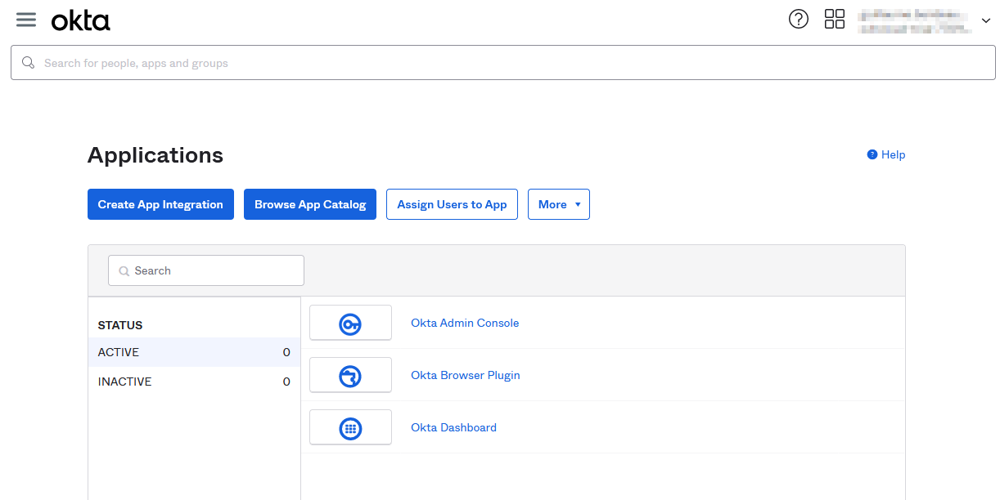
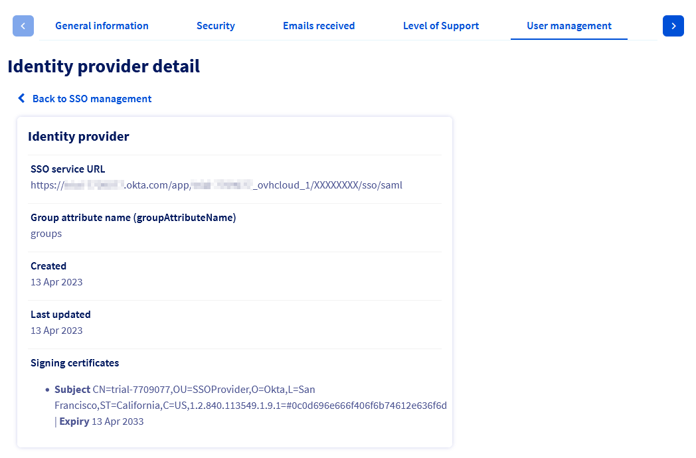
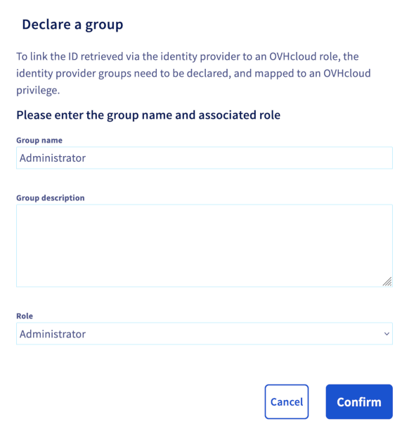

## Ziel

Sie können die Authentifizierungsmethode **Single Sign-On** (SSO) verwenden, um sich in Ihren OVHcloud Kunden-Account einzuloggen. Um diese Verbindungen zu aktivieren, müssen Ihr Account und Ihre Okta Accounts mithilfe von SAML-Authentifizierungen (*Security Serving Markup Language*) konfiguriert werden.

**In dieser Anleitung erfahren Sie, wie Sie Ihren OVHcloud Account mit einem externen Okta Dienst verbinden.**

## Voraussetzungen

- Sie sind Administrator eines Okta Dienstes.
- Sie verfügen über einen [OVHcloud Kunden-Account](/pages/account/customer/ovhcloud-account-creation).
- Sie haben Zugriff auf Ihr [OVHcloud Kundencenter](https://www.ovh.com/auth/?action=gotomanager&from=https://www.ovh.de/&ovhSubsidiary=de).

## In der praktischen Anwendung

> [!primary]
>
> Damit ein Service Provider (Ihr OVHcloud Account) eine SSO-Verbindung zu einem Identity Provider (Ihr Azure AD) herstellen kann, ist es notwendig, das gegenseitige Vertrauensverhältnis zu konfigurieren (*Party Trust*).
>

### OVHcloud bei Okta registrieren

Ihr Okta Dienst fungiert als Identity Provider. Authentifizierungsanfragen für Ihren OVHcloud Account werden nur dann akzeptiert, wenn Sie diesen zuerst als vertrauenswürdig deklariert haben.

Das bedeutet in diesem Fall, dass er zu `Applications` hinzugefügt werden muss.

Loggen Sie sich mit Ihrem Administrator-Account in das Okta Verwaltungsinterface ein.

Gehen Sie zu `Applications`{.action} und dann wieder auf `Applications`{.action}.

{.thumbnail}

Klicken Sie auf `Create App Integration`{.action} und wählen Sie `SAML 2.0`{.action}.

{.thumbnail}

Fügen Sie im Schritt "General Settings" einen Namen für diese Anwendung hinzu, zum Beispiel **OVHcloud**, und ggf. ein Logo. Klicken Sie auf `Next`{.action}.

{.thumbnail}

Geben Sie im Schritt "Configure SAML" in die Felder `Single sign-on URL` und `Audience URI` die Werte Ihrer Region ein: 

- EU-Region: **Single sign-on URL**: `https://www.ovhcloud.com/eu/auth/saml/acs` und **Audience URI**: `https://www.ovhcloud.com/eu/auth/`
- CA-Region: **Single sign-on URL**: `https://www.ovhcloud.com/ca/auth/saml/acs` und **Audience URI**: `https://www.ovhcloud.com/ca/auth/`

{.thumbnail}

Konfigurieren Sie anschließend die `Attribute Statements`:

- **Name**: `http://schemas.xmlsoap.org/ws/2005/05/identity/claims/upn` und **Value**: `user.login`
- **Name**: `http://schemas.xmlsoap.org/ws/2005/05/identity/claims/emailaddress` und **Value**: `user.email`
- **Name**: `http://schemas.xmlsoap.org/ws/2005/05/identity/claims/name` und **Value**: `user.displayName`

Legen Sie die `Group Attribute Statements` fest:

- **Name**: `groups` und **Filter**: `Matches regex:.*` (Passen Sie den Filter an, wenn Sie genauer konfigurieren möchten.)

Klicken Sie auf `Next`{.action}.

{.thumbnail}

Wählen Sie im Schritt "Feedback" die passende Option aus und klicken Sie auf `Finish`{.action}.

Öffnen Sie anschließend die Anwendung, gehen Sie zum Tab `Assignments`{.action} und weisen Sie der Anwendung Benutzer oder Gruppen zu.

{.thumbnail}

Bevor Sie zum nächsten Bereich übergehen, öffnen Sie den Tab `Sign On`{.action}, gehen Sie auf **Metadata URL** und speichern Sie die bereitgestellte XML-Datei.

{.thumbnail}

Ihr Okta Dienst vertraut nun OVHcloud als Service Provider. Stellen Sie im nächsten Schritt sicher, dass der OVHcloud Account Ihrem Okta als Identity Provider. vertraut.

### Das Vertrauen zum OVHcloud Account und die Verbindung konfigurieren

Um Okta als vertrauenswürdigen Identity Provider hinzuzufügen, liefern Sie die Metadaten des Identity Providers in Ihrem [OVHcloud Kundencenter](https://www.ovh.com/auth/?action=gotomanager&from=https://www.ovh.de/&ovhSubsidiary=de).

Wenn Sie eingeloggt sind, klicken Sie oben rechts auf Ihren Account-Namen.

{.thumbnail}

Klicken Sie auf die Initialen, um auf die Verwaltungsseite Ihres Accounts zuzugreifen.

{.thumbnail}

Öffnen Sie den Tab `Verwaltung der Nutzer`{.action}.

{.thumbnail}

Klicken Sie auf den Button `SSO-Verbindung`{.action}.

{.thumbnail}

Geben Sie die XML-Metadaten Ihres Okta Dienstes ein. Geben Sie `groups` als "Group Attribute Name" ein und klicken Sie auf `Bestätigen`{.action}.

{.thumbnail}

Sie sollten nun Ihren Okta Dienst als Identity Provider sowie die Standardgruppen sehen können.

{.thumbnail}

Für weitere Informationen klicken Sie auf den Link unter der `URL des SSO Dienstes`.

{.thumbnail}

Mit dem Button `...`{.action} können Sie den SSO aktualisieren oder löschen und die Details einsehen.

{.thumbnail}

Ihr Okta gilt nun als vertrauenswürdiger Identity Provider. Dennoch müssen im OVHcloud Account Gruppen hinzugefügt werden.

> [!warning]
> Wenn Sie sich in diesem Schritt über SSO verbinden, wird wahrscheinlich eine Fehlermeldung `Not in valid groups` angezeigt.
>
> Ihr OVHcloud Account überprüft, ob der authentifizierende Benutzer zu einer bestehenden Gruppe auf dem Account gehört.
>

Sie müssen nun den Nutzergruppen in Okta **Rollen** bei OVHcloud zuweisen. Andernfalls weiß Ihr OVHcloud Account nicht, welche Berechtigungen ein Benutzer hat und es werden keine Rechte zugewiesen.

Fügen Sie über Ihr OVHcloud Kundencenter eine Gruppe hinzu, indem Sie auf den Button `Gruppe deklarieren`{.action} klicken und die Felder ausfüllen:

- **Group name**: Name der Gruppe in Okta
- **Role**: Berechtigungsstufe für diese Gruppe

{.thumbnail}

{.thumbnail}

Anschließend können Sie überprüfen, ob die Gruppe zu Ihrem OVHcloud Account im Bereich `Gruppen` hinzugefügt wurde:

{.thumbnail}

Wenn sich später ein Benutzer aus der Gruppe **Intern** einloggt, erkennt Ihr OVHcloud Account, dass der Benutzer die von seiner Gruppe definierte Rolle "UNPRIVILEGED" hat.

Anschließend können Sie sich von Ihrem Account ausloggen und sich mit Okta als Identity Provider neu verbinden.

### Verbindung via SSO

Geben Sie auf der [OVHcloud Login-Seite](https://www.ovh.com/auth/?action=gotomanager&from=https://www.ovh.de/&ovhSubsidiary=de) Ihre [Kundenkennung](/pages/account/customer/ovhcloud-account-creation#was-ist-meine-kundenkennung) ein, gefolgt von **/idp***. Klicken Sie ohne ein Passwort einzugeben auf `Login`{.action}.

{.thumbnail}

Sie werden dann auf die Loginseite von Okta weitergeleitet. Geben Sie Login und Passwort eines Benutzers Ihres Okta ein und klicken Sie dann auf den Button `Sign in`{.action}.

{.thumbnail}

Sie sind nun mit derselben Kundenkennung eingeloggt, jedoch über Ihren Okta Benutzer.

{.thumbnail}

## Weiterführende Informationen

[OVHcloud Kunden-Account erstellen](/pages/account/customer/ovhcloud-account-creation)

[OVHcloud Kunden-Account absichern und persönliche Informationen verwalten](/pages/account/customer/all_about_username)

[Das Passwort Ihres Kunden-Accounts anlegen und verwalten](/pages/account/customer/manage-ovh-password)

[Den OVHcloud Kunden-Account mit der Zwei-Faktor-Authentifizierung absichern](/pages/account/customer/secure-ovhcloud-account-with-2fa)

Für den Austausch mit unserer User Community gehen Sie auf <https://community.ovh.com/en/>.