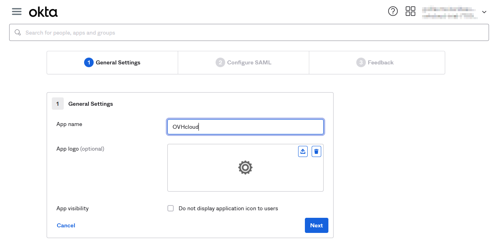
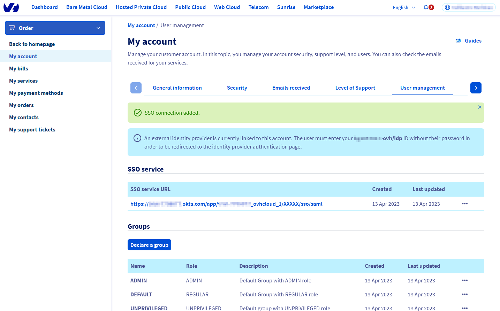

## Objectif

Vous pouvez utiliser l'authentification SSO (*Single Sign-On*) pour vous connecter à votre compte OVHcloud. Pour activer ces connexions, votre compte et vos comptes Okta doivent être configurés à l'aide de SAML (*Security Assertion Markup Language*).

**Ce guide vous explique comment associer votre compte OVHcloud à un service Okta externe.**

## Prérequis

- Être administrateur d'un service Okta
- Disposer d'un [compte OVHcloud](/pages/account/customer/ovhcloud-account-creation)
- Être connecté à votre [espace client OVHcloud](https://www.ovh.com/auth/?action=gotomanager&from=https://www.ovh.com/fr/&ovhSubsidiary=fr)

## En pratique

> [!primary]
>
> Afin qu’un prestataire de services (par exemple, votre compte OVHcloud) établisse une connexion SSO avec un fournisseur d'identité (par exemple, votre service Okta), l’essentiel est d’établir une relation de confiance mutuelle en enregistrant la connexion SSO dans les deux services.
>

### Enregistrer OVHcloud auprès d'Okta

Votre service Okta agit en tant que fournisseur d'identité. Les demandes d'authentification de votre compte OVHcloud ne seront acceptées que si vous l'avez préalablement déclaré comme organisme tiers de confiance.

Cela signifie qu'il doit être ajouté en tant qu'`Application`.

Connectez-vous à l'interface d'administration d'Okta avec votre compte administrateur.

Rendez-vous dans `Applications`{.action} puis de nouveau dans `Applications`{.action}.

{.thumbnail}

Cliquez sur `Create App Integration`{.action} et sélectionnez `SAML 2.0`{.action}.

{.thumbnail}

À l'étape « General Settings », ajoutez un nom pour cette application, **OVHcloud** par exemple, et un logo si vous le souhaitez. Cliquez sur `Next`{.action}.

{.thumbnail}

À l'étape « Configure SAML », complétez les champs `Single sign-on URL` et `Audience URI` avec les valeurs de votre région : 

- Région UE : **URL** d'authentification unique : `https://www.ovhcloud.com/eu/auth/saml/acs` et **Audience URI** : `https://www.ovhcloud.com/eu/auth/`
- Région CA : **URL** d'authentification unique : `https://www.ovhcloud.com/ca/auth/saml/acs` et **Audience URI** : `https://www.ovhcloud.com/ca/auth/`

{.thumbnail}

Définissez ensuite les `Attribute Statements` :

- **Name** : `http://schemas.xmlsoap.org/ws/2005/05/identity/claims/upn` et **Value** : `user.login`
- **Name** : `http://schemas.xmlsoap.org/ws/2005/05/identity/claims/emailaddress` et **Value** : `user.email`
- **Name** : `http://schemas.xmlsoap.org/ws/2005/05/identity/claims/name` et **Value** : `user.displayName`

Définissez les `Group Attribute Statements` :

- **Name** : `groups` et **Filter**: `Matches regex:.*` (Adaptez le filtre si vous souhaitez être plus précis)

Cliquez sur `Next`{.action}.

{.thumbnail}

À l'étape « Feedback », sélectionnez l'option en fonction et cliquez sur `Finish`{.action}.

Ouvrez ensuite l'application, accédez à l'onglet `Sign On`{.action} et affectez des utilisateurs ou des groupes à l'application.

{.thumbnail}

Avant de passer à la section suivante, rendez-vous dans l'onglet `Sign On`{.action}, accédez à **Metadata URL** et enregistrez le fichier XML fourni.

{.thumbnail}

Votre service Okta fait désormais confiance à OVHcloud en tant que prestataire de services. L'étape suivante consiste à vous assurer que le compte OVHcloud fait confiance à votre Okta en tant que fournisseur d'identité.

### Enregistrer Okta sur le compte OVHcloud et configurer la connexion

Pour ajouter Okta en tant que fournisseur d'identité de confiance, vous devez fournir les métadonnées du fournisseur d'identité dans votre [espace client OVHcloud](https://www.ovh.com/auth/?action=gotomanager&from=https://www.ovh.com/fr/&ovhSubsidiary=fr).

Une fois connecté, cliquez sur votre profil en haut à droite.

{.thumbnail}

Cliquez sur votre nom pour accéder à la page de gestion de votre profil.

{.thumbnail}

Ouvrez l'onglet `Gestion des utilisateurs`{.action}.

{.thumbnail}

Cliquez sur le bouton `Connexion SSO`{.action} .

{.thumbnail}

Renseignez les métadonnées XML de votre service Okta. Complétez le champ « Nom d'attribut de groupe » avec la valeur `groups`. Cliquez sur `Confirmer`{.action}.

{.thumbnail}

Vous devez maintenant retrouver votre Okta en tant que fournisseur d'identité, ainsi que les groupes par défaut.

{.thumbnail}

Pour plus d'informations, cliquez sur le lien sous « URL du service SSO ».

{.thumbnail}

Le bouton `...`{.action} permet de mettre à jour ou de supprimer le SSO, et d'en consulter les détails.

{.thumbnail}

Votre service Okta est désormais considéré comme un fournisseur d'identité de confiance. Cependant, vous devez tout de même ajouter des groupes à votre compte OVHcloud.

> [!warning]
> Si vous essayez à ce stade de vous connecter via SSO, un message d'erreur `Not in valid groups` s'affichera probablement.
>
> En effet, votre compte OVHcloud vérifie si l'utilisateur s'authentifiant appartient à un groupe existant sur le compte.
>

Vous devez à présent attribuer des **rôles** aux groupes d'utilisateurs Okta chez OVHcloud. Dans le cas contraire, votre compte OVHcloud ne sait pas ce que l'utilisateur est autorisé à faire et, par défaut, aucun droit n'est attribué.

Depuis votre espace client, ajoutez un groupe en cliquant sur le bouton `Déclarer un groupe`{.action} et en remplissant les champs :

- **Group name** : Nom du groupe dans Okta
- **Role**: Niveau de droits accordés à ce groupe

{.thumbnail}

{.thumbnail}

Vous pourrez ensuite vérifier que le groupe est ajouté à votre compte OVHcloud dans la section « Groupes » :

{.thumbnail}

Lorsque vous vous connecterez ultérieurement avec un utilisateur du groupe **Intern**, votre compte OVHcloud reconnaîtra que l'utilisateur a le rôle "UNPRIVILEGED" spécifié par son groupe.

Vous pourrez ensuite vous déconnecter de votre compte et vous reconnecter avec votre Okta en tant que fournisseur d'identité.

### Connexion via SSO

Sur [la page d'identification OVHcloud](https://www.ovh.com/auth/?action=gotomanager&from=https://www.ovh.com/fr/&ovhSubsidiary=fr), renseignez votre [identifiant](/pages/account/customer/ovhcloud-account-creation#quel-est-mon-identifiant-client) suivi de **/idp** sans mot de passe et cliquez sur le bouton `Connexion`{.action}.

{.thumbnail}

Vous serez ensuite redirigé vers votre page de connexion à Okta. Entrez l'identifiant et le mot de passe d'un utilisateur de votre Okta, puis cliquez sur le bouton `Sign in`{.action} .

{.thumbnail}

Vous êtes maintenant connecté avec le même identifiant client, mais via votre utilisateur Okta.

{.thumbnail}

## Aller plus loin

[Création d'un compte OVHcloud](/pages/account/customer/ovhcloud-account-creation)

[Sécuriser mon compte OVHcloud et gérer mes informations personnelles](/pages/account/customer/all_about_username)

[Configuration et gestion du mot de passe de votre compte](/pages/account/customer/manage-ovh-password)

[Sécuriser son compte OVHcloud avec la double authentification](/pages/account/customer/secure-ovhcloud-account-with-2fa)

Échangez avec notre communauté d'utilisateurs sur <https://community.ovh.com/>.