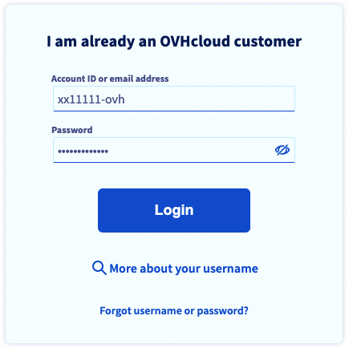
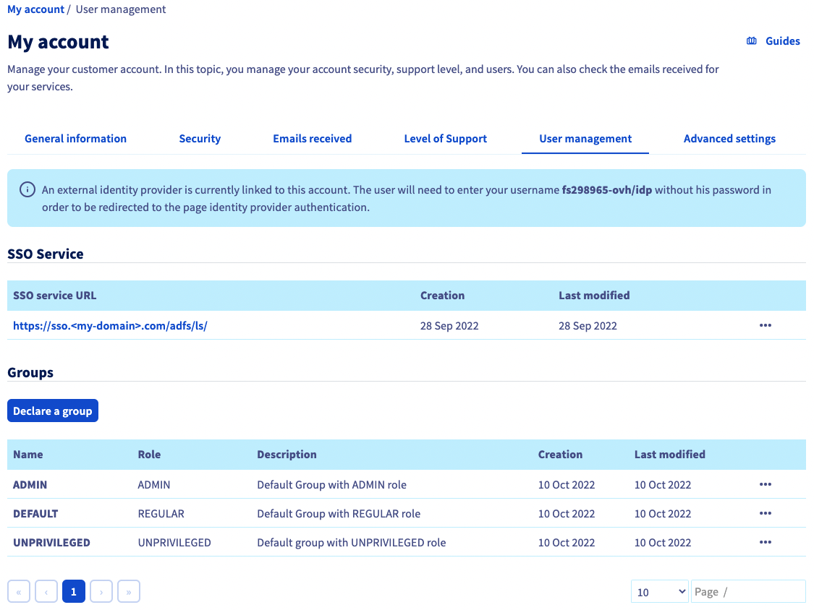
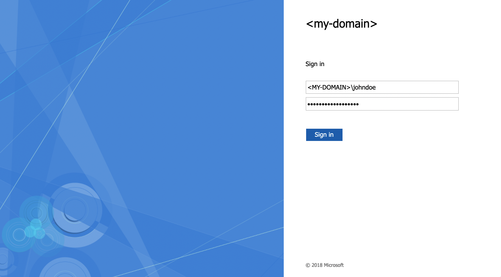

**Last updated 13th October 2022**

## Objective

To link your OVHcloud account to your own Active Directory, you must federate it in SAML.

**Find out how to federate your OVHcloud account to an external Active Directory.**

## Requirements

- An Active Directory Federation Services (ADFS) running
- An [OVHcloud account](https://docs.ovh.com/us/en/customer/create-ovhcloud-account/)

## Instructions

### Establishing AD FS trust

> [!primary]
>
> In order for a service provider (as your OVHcloud account) to perform an SSO connection with an identity provider (as your ADFS), the essential part is to establish a mutual trust.
>

Let's start with the ADFS. Your ADFS is your identity provider, it must trust your OVHcloud account otherwise it will never accept any authentication request from it.

In the Active Directory world, that means adding a relying party trust.

From your Server Manager, go to `Tools`{.action} > `AD FS Management`{.action}.

{.thumbnail}

Click on `Relying Party Trusts`{.action}.

{.thumbnail}

Then click on `Add Relying Party Trust...`{.action}.

{.thumbnail}

Select `Claims aware`{.action}.

Click on the `Start`{.action} button.

{.thumbnail}

Here, you can either import the OVHcloud SP metadata, or enter data about the relying party manually.

Here's how to import the OVHcloud SP metadata.

Select `Import data about the relying party from a file`{.action} then select the metadata file.

Here are the metadata files for the EU, CA and US regions:

- [EU metadata](https://www.ovh.com/auth/sso/saml/sp/metadata.xml)
- [CA metadata](https://ca.ovh.com/auth/sso/saml/sp/metadata.xml)
- [US metadata](https://us.ovhcloud.com/auth/sso/saml/sp/metadata.xml)

Then click the `Next`{.action} button.

{.thumbnail}

Enter a name then click the `Next`{.action} button.

{.thumbnail}

Click `Next`{.action}.

{.thumbnail}

Click `Next`{.action} again.

{.thumbnail}

Then click the `Close`{.action} button. You've now added your relying party trust.

{.thumbnail}

> [!primary]
>
> Your relying party is now trusted, so you should now be able to log in via an SSO connection, but you won't be able to get any information about the identity of the user yet (in the SAML assertion in the case of SAML).
>

In order to do that, you have to set the mapping between the Active Directory LDAP fields and the attributes in the SAML assertion.

Click on your relying party trust.

{.thumbnail}

Then click on `Edit Claim Issuance Policy...`{.action}.

{.thumbnail}

Click the `Add Rule...`{.action} button.

{.thumbnail}

Click `Next`{.action}.

Enter a rule name, then define your mapping.

Select "Active Directory" as "Attribute store";

> [!primary]
>
> Theoretically you're free to do whatever you want, but there are some standards if you want your Active Directory LDAP data being read correctly by most of the service providers. See the example below.
>
> {.thumbnail}

When you are done, click the `Finish`{.action} button.

{.thumbnail}

Click `Apply`{.action} then `OK`{.action}.

{.thumbnail}

Your mapping is set up. So now your ADFS trusts OVHcloud as a service provider. You now have to make sure that your OVHcloud account trusts your ADFS as identity provider.

### Establishing OVHcloud account trust

Let's now add your ADFS as identity provider to your OVHcloud account, by providing the identity provider metadata.

First, log in to your OVHcloud account.

{.thumbnail}

Click on your profile in the top-right corner.

{.thumbnail}

Click your name to access your profile management.

{.thumbnail}

Click the `User management`{.action} tab.

{.thumbnail}

Click the `Connect SSO`{.action} button.

{.thumbnail}

Fill in the XML metadata of your ADFS. For an ADFS, the group attribute name is optional.

{.thumbnail}

You should now see your ADFS as identity provider, as well as the default groups.

{.thumbnail}

Click the `SSO service URL`{.action} link to get more details about it.

{.thumbnail}

{.thumbnail}

The `...`{.action} button enables you to update or delete the SSO, or to see details.

{.thumbnail}

The trust of your ADFS as identity provider is established, but you still have to add groups to your OVHcloud account.

> [!warning]
> If you try to connect at this stage using your SSO, you will probably run into the "Not in valid groups" error.
>
> That's because your OVHcloud account checks if the user you are trying to authenticate with belongs to a group that actually exists to the account.
>

The first thing to do is to watch what information is mapped to the "Group" attribute that your ADFS sends back to you.

Let's take the example of the user "John Doe" from your Active Directory:

{.thumbnail}

Then, let's take a look at the mapping:

{.thumbnail}

Here, the "Group" attribute sent back by the Active Directory for the user "John Doe" is "title". That corresponds to his "job title", so `manager@<my-domain>.com`.

You can also check it in the SAML assertion:

```xml
<AttributeStatement>
    <Attribute Name="http://schemas.xmlsoap.org/claims/Group">
        <AttributeValue>manager@<my-domain>.com</AttributeValue>
    </Attribute>
    ...
</AttributeStatement>
```

So that means that you need to add the `manager@<my-domain>.com` group to your OVHcloud account, attaching a role to it. Otherwise, your OVHcloud account wouldn't know what is the user allowed to do.

To do that, you need to add it, using the `Declare a group`{.action} button:

{.thumbnail}

{.thumbnail}

You can then check that the group is added to your OVHcloud account:

{.thumbnail}

From now on, when you will connect using the Active Directory "johndoe" user, your OVHcloud account will recognize that the user has the "REGULAR" role thanks to its group.

You can then disconnect from your account and log in again with your ADFS as identity provider.

Enter your [NIC handle](https://docs.ovh.com/us/en/customer/create-ovhcloud-account/#what-is-my-nic-handle) followed by **/idp** without entering any password, and click the `Login`{.action} button.

{.thumbnail}

You are then redirected to your ADFS log-in page. Enter a login/password of a user of your LDAP Active Directory, then click the `Sign in`{.action} button.

{.thumbnail}

You are now logged in with the same NIC handle, but via your Active Directory user using your ADFS SSO.

{.thumbnail}

## Go further

[Creating an OVHcloud account](https://docs.ovh.com/gb/en/customer/create-ovhcloud-account/)

[Securing my OVHcloud account and manage my personal information](https://docs.ovh.com/gb/en/customer/all-about-your-username/)

[Setting and managing an account password](https://docs.ovh.com/gb/en/customer/manage-password/)

[Securing your OVHcloud account with two-factor authentication](https://docs.ovh.com/gb/en/customer/secure-account-with-2FA/)

Join our community of users on <https://community.ovh.com/en/>.
