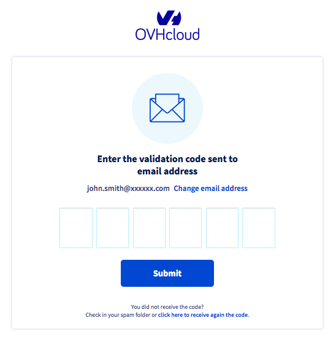

> [!primary]
> Diese Übersetzung wurde durch unseren Partner SYSTRAN automatisch erstellt. In manchen Fällen können ungenaue Formulierungen verwendet worden sein, z.B. bei der Beschriftung von Schaltflächen oder technischen Details. Bitte ziehen Sie beim geringsten Zweifel die englische oder französische Fassung der Anleitung zu Rate. Möchten Sie mithelfen, diese Übersetzung zu verbessern? Dann nutzen Sie dazu bitte den Button “Mitmachen“ auf dieser Seite.
>

**Letzte Aktualisierung am 01.07.2021**

## Ziel

Um die Dienste von OVHcloud zu nutzen muss zuerst ein Kunden-Account erstellt werden.
Die Erstellung eines Accounts kann vor oder während der Bestellung Ihres ersten OVHcloud Dienstes erfolgen.

**In dieser Anleitung erfahren Sie, wie Sie einen OVHcloud Kunden-Account erstellen.**

## Voraussetzungen

- Sie verfügen über eine gültige und verwendbare E-Mail-Adresse

## In der praktischen Anwendung

### Wie erstellt man einen OVHcloud Kunden-Account?

Um einen OVHcloud Kunden-Account zu erstellen, gehen Sie einfach auf [diese Seite](https://www.ovh.com/auth/?action=gotomanager&from=https://www.ovh.de/&ovhSubsidiary=de) und füllen Sie das Online-Formular aus.

{.thumbnail}

|Information|Beschreibung|
|---|---|
|Vorname - Name|Geben Sie hier einen nachweisbaren Vor- und Nachnamen ein.|
|E-Mail-Adresse|Geben Sie eine gültige **E-Mail-Adresse, auf die Sie Zugriff haben**, ein.  Vermeiden Sie hierbei generell E-Mail-Adressen mit Domainnamen, die über denselben Kunden-Account verwaltet werden. Sollte der Domainname eine Dienstunterbrechung erleiden, erhalten Sie unsere Benachrichtigungen nicht mehr.|
|Passwort|Das Passwort muss einzigartig sein (erstellt und ausschließlich verwendet für Ihren OVHcloud Kunden-Account) und hinreichend komplex sein.  Um ein effizientes Passwort [zu erstellen, lesen Sie unsere](https://docs.ovh.com/de/customer/Passwort-verwalten/#in-der-praktischen-anwendung) Anleitung zur Passwortverwaltung.|

Sobald Sie das erste Formular ausgefüllt haben, wird Ihnen ein Code zur einmaligen Verwendung an die von Ihnen angegebene E-Mail-Adresse zugesandt. Mit diesem Code können Sie Ihre E-Mail-Adresse validieren. Geben Sie ihn in die dafür vorgesehenen Felder ein.

{.thumbnail}

> [!primary]
> Wenn Sie die E-Mail mit dem Code nicht erhalten haben, überprüfen Sie bitte den Ordner "Spam" / "unerwünschte E-Mails" Ihres Accounts.
>
> Sie können den Versand eines neuen Codes anfordern, indem Sie auf den dafür vorgesehenen Link unten auf der Seite klicken.
>
> Ist die von Ihnen angegebene E-Mail-Adresse nicht gültig oder verfügbar, klicken Sie auf den Button `E-Mail-Adresse ändern`{.action}.
>

Nachdem Sie den Code eingegeben und bestätigt haben, füllen Sie bitte das Formular aus. Achten Sie insbesondere darauf, den **Account-Typ** korrekt auszuwählen.

{.thumbnail}

Ihr Account wird angelegt und Sie werden automatisch auf der Startseite ("Dashboard") Ihres Kundencenters eingeloggt.

### Was ist meine Kundenkennung?

Jeder OVHcloud Kunden-Account ist mit einer individuellen Kundenkennung verbunden, unter Umständen auch als *NIC-handle* oder Benutzername bezeichnet.

Sie besteht in der Regel aus zwei Buchstaben gefolgt von Ziffern. Zum Beispiel: **xx11111-ovh**.

Diese Kundenkennung erlaubt Ihnen:

- Online-Bestellungen durchzuführen
- sich in Ihrem Kundencenter einzuloggen, um alle Ihre Dienstleistungen zu verwalten
- sich beim Kontakt mit dem OVHcloud Support zu identifizieren und so die Bearbeitung Ihrer Anfragen zu erleichtern.

Ihre Kundenkennung ist oben rechts unter Ihrem Namen und Ihrer E-Mail-Adresse angezeigt.

{.thumbnail}

> [!warning]
> Sichern Sie Ihre Kundenkennung, da Sie diese für jede Verbindung zu Ihrem Account benötigen.

## Weiterführende Informationen

Nun, da Ihr OVHcloud Kunden-Account erstellt ist, empfehlen wir Ihnen, [unseren Anleitungen zur Sicherheit Ihres Accounts und zur Verwaltung Ihrer persönlichen Daten](https://docs.ovh.com/de/customer/alles_uber_ihre_ovh_kundenkennung/) zu folgen.

Lesen Sie auch unsere zugehörigen Anleitungen:

[In das OVHcloud Kundencenter einloggen](https://docs.ovh.com/de/customer/sich-mit-ovhcloud-kundencenter-verbinden)

[Passwort Ihres OVHcloud Kunden-Accounts ändern](https://docs.ovh.com/de/customer/Passwort-verwalten/)

[Ihren OVHcloud Kunden-Account mit der Zwei-Faktor-Authentifizierung absichern](https://docs.ovh.com/de/customer/Account-mit-2FA-absichern/)

Für den Austausch mit unserer User Community gehen Sie auf <https://community.ovh.com/en/>.
