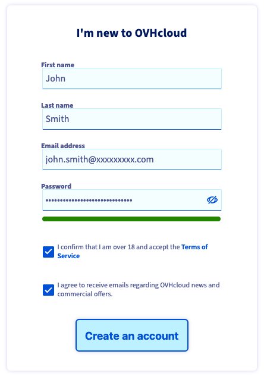
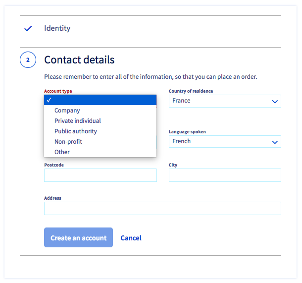

> [!primary]
> Diese Übersetzung wurde durch unseren Partner SYSTRAN automatisch erstellt. In manchen Fällen können ungenaue Formulierungen verwendet worden sein, z.B. bei der Beschriftung von Schaltflächen oder technischen Details. Bitte ziehen Sie beim geringsten Zweifel die englische oder französische Fassung der Anleitung zu Rate. Möchten Sie mithelfen, diese Übersetzung zu verbessern? Dann nutzen Sie dazu bitte den Button “Mitmachen“ auf dieser Seite.
>

**Stand 01.07.2021**

## Ziel

Um die Dienste von OVHcloud zu nutzen müssen Sie zuerst Ihren Account erstellen.
Die Erstellung eines Accounts kann vor oder während der Bestellung Ihres ersten OVHcloud Dienstes erfolgen.

**In dieser Anleitung erfahren Sie, wie Sie einen OVHcloud Account erstellen.**

## Voraussetzungen

- Sie verfügen über eine gültige und zugängliche E-Mail-Adresse

## In der praktischen Anwendung

### Wie erstellt man meinen OVHcloud Account?

Um einen OVHcloud Account zu erstellen, gehen Sie einfach auf [diese Seite](https://www.ovh.com/auth/?action=gotomanager&from=https://www.ovh.de/&ovhSubsidiary=de){.external} und füllen Sie das Online-Formular aus.

{.thumbnail}

|Information|Beschreibung|
|---|---|
|Vorname - Name|Geben **Sie** hier zwingend einen gewohnten Vornamen und Namen ein.|
|E-Mail-Adresse|Geben Sie eine gültige **E-Mail-Adresse ein, auf die Sie derzeit zugreifen**.  Vermeiden Sie die Verwendung einer E-Mail-Adresse, die zu einer Domain gehört, die Sie über Ihr Kundencenter verwalten. Bei einer Unterbrechung der Nutzung dieser Domain erhalten Sie unsere Benachrichtigungen nicht mehr.|
|Passwort|Ihr Passwort muss einzigartig (erstellt und ausschließlich für Ihren OVHcloud-Account verwendet) und hinreichend komplex sein.  Um ein effizientes Passwort [zu erstellen, lesen Sie unsere](https://docs.ovh.com/de/customer/Passwort-verwalten/#in-der-praktischen-anwendung) Anleitung zur Passwortverwaltung.|

Sobald Sie das erste Formular ausgefüllt haben, wird Ihnen ein Code zur einmaligen Verwendung an die von Ihnen angegebene E-Mail-Adresse zugesandt. Mit diesem Code können Sie Ihre E-Mail-Adresse validieren. Geben Sie ihn in die dafür vorgesehenen Felder ein.

{.thumbnail}

> [!primary]
> Wenn Sie die E-Mail mit dem Code nicht erhalten haben, überprüfen Sie bitte die Ordner "Spam" / "unerwünschte E-Mail" Ihrer E-Mail-Adresse.
>
> Sie können den Versand eines neuen Codes starten, indem Sie auf den dafür vorgesehenen Link unten auf dieser Seite klicken.
>
> Ist die von Ihnen angegebene E-Mail-Adresse nicht gültig oder verfügbar, klicken Sie auf den Button `E-Mail-Adresse ändern`{.action}.
>

Nachdem Sie den Code eingegeben und bestätigt haben, füllen Sie bitte das Formular aus. Achten Sie insbesondere darauf, die **Art der** angebotenen Accounts genau festzulegen.

{.thumbnail}

Ihr Account wurde erstellt und Sie werden automatisch auf der Startseite "Dashboard"Ihres Accounts eingeloggt.

### Was ist meine Kundenkennung?

Jeder OVHcloud Kundenaccount ist mit einer individuellen Kundenkennung verbunden, auch *NIC-handle*.

Sie besteht in der Regel aus zwei Buchstaben gefolgt von Ziffern. Zum Beispiel: **xx11111-ovh**.

Diese Kundenkennung erlaubt Ihnen:

- Online-Bestellungen durchführen
- sich mit Ihrem Kundencenter zu verbinden, um alle Ihre Dienstleistungen zu verwalten
- sich beim Kontakt mit dem OVHcloud Support zu identifizieren und so die Bearbeitung Ihrer Fragen zu erleichtern.

Ihre Kundenkennung ist oben rechts unter Ihrem Namen und Ihrer E-Mail-Adresse angezeigt.

{.thumbnail}

> [!warning]
> Achten Sie auf Ihre Kundenkennung, da Sie diese für jede Verbindung zu Ihrem Account benötigen.

## Weiterführende Informationen

Nun, da Ihr OVHcloud Account erstellt ist, empfehlen wir Ihnen, [unseren Empfehlungen zur Sicherheit Ihres Accounts und zur Verwaltung Ihrer persönlichen Daten zu folgen](https://docs.ovh.com/de/customer/alles_uber_ihre_ovh_kundenkennung/).

Lesen Sie auch unsere Anleitungen für:

[In das OVHcloud Kundencenter einloggen](https://docs.ovh.com/de/customer/sich-mit-ovhcloud-kundencenter-verbinden)

[Passwort Ihres OVHcloud Accounts ändern](https://docs.ovh.com/de/customer/Passwort-verwalten/)

[Ihren OVHcloud Account mit der Zwei-Faktor-Authentifizierung absichern](https://docs.ovh.com/de/customer/Account-mit-2FA-absichern/)

Für den Austausch mit unserer User Community gehen Sie auf <https://community.ovh.com/en/>.
