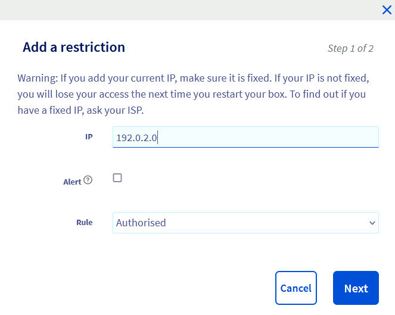
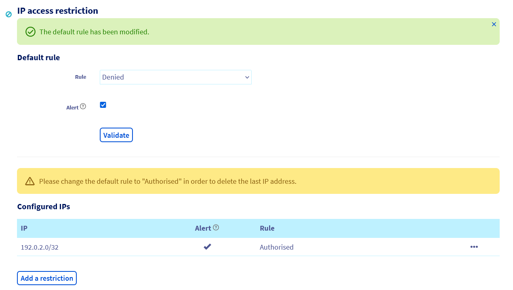

> [!primary]
> Diese Übersetzung wurde durch unseren Partner SYSTRAN automatisch erstellt. In manchen Fällen können ungenaue Formulierungen verwendet worden sein, z.B. bei der Beschriftung von Schaltflächen oder technischen Details. Bitte ziehen Sie beim geringsten Zweifel die englische oder französische Fassung der Anleitung zu Rate. Möchten Sie mithelfen, diese Übersetzung zu verbessern? Dann nutzen Sie dazu bitte den Button «Mitmachen» auf dieser Seite.
>

**Letzte Aktualisierung am 12.12.2022**
  
## Ziel

OVHcloud stellt Ihnen Optionen zur Verfügung, um die Sicherheit Ihres OVHcloud Kundencenters und Ihrer Dienste zu erhöhen.

Sie können insbesondere den Zugang zu Ihrem [OVHcloud Kundencenter](https://www.ovh.com/auth/?action=gotomanager&from=https://www.ovh.de/&ovhSubsidiary=de) auf bestimmte IP-Adressen beschränken.
Die Einrichtung dieser Option kombiniert mit der Absicherung Ihres Accounts durch eine [Zwei-Faktor-Authentifizierung](https://docs.ovh.com/de/customer/Account-mit-2FA-absichern/) ermöglicht die optimale Absicherung Ihres OVHcloud Kundencenters gegen mögliche Einbruchsversuche.

**Diese Anleitung erklärt, wie Sie Ihren OVHcloud Account absichern, indem Sie die IP-Adressen, auf die zugegriffen werden darf, einschränken**

> [!warning]
>
> Zugriffsbeschränkungen nach IP und/oder Zwei-Faktor-Authentifizierung sichern nur den Zugang zum OVHcloud Kundencenter ab, über das Sie Ihre OVHcloud Dienste bestellen, verwalten, verlängern oder löschen können. Diese Optionen sichern Ihre Dienste nicht per se ab, für die Sie spezifische Sicherheitsmaßnahmen einrichten müssen.
>

## Voraussetzungen

- Sie sind im [OVHcloud Kundencenter](https://www.ovh.com/auth/?action=gotomanager&from=https://www.ovh.de/&ovhSubsidiary=de) eingeloggt.
- Sie haben die [Empfehlungen zur Verwaltung des Zugangspassworts zu Ihrem Account](https://docs.ovh.com/de/customer/Passwort-verwalten/) zur Kenntnis genommen.

## In der praktischen Anwendung

### Schritt 1 - Abruf der öffentlichen IP-Adressen, die zum Zugriff auf Ihr OVHcloud Kundencenter berechtigt sind

Es gibt zwei IP-Adressen:

- **Öffentliche IP-Adressen**: sie sind im gesamten Internet sichtbar. Diese werden zum Beispiel über Ihren Internet-Zugang/Router verwendet, damit Sie über eine Internetadresse verfügen, um auf das gesamte Netzwerk zuzugreifen.
- **Private IP-Adressen**: unsichtbar und im Internet nicht nutzbar, werden sie einem lokalen Netzwerk zugewiesen. Um unser Beispiel zu nennen: Ihr Internet-Router wird jedem der mit ihm verbundenen Geräte (Computer, Smartphones, Tablets...) eine private IP-Adresse zuweisen. Ihr Internet-Zugangspunkt/Router ermöglicht es diesen Geräten, ihre öffentliche IP für den Internetzugang zu verwenden. Diese IP-Adressen lassen sich leicht erkennen, da sie in der Regel mit 10.0.X.X, 172.16.X.X oder 192.168.X.X beginnen (wobei X Werte zwischen 0 und 255 sind).

Um die IP-basierte Einschränkungsoption im OVHcloud Kundencenter zu verwenden, geben Sie **nur** Ihre öffentliche(n) IP(s) ein.

Um die öffentliche IP-Adresse eines Geräts abzurufen, dem der Zugriff auf Ihr OVHcloud Kundencenter gestattet wird, gehen Sie auf die Seite [mon-ip.com](https://mon-ip.com){.external} (nicht von OVHcloud verwaltet).

Achten Sie auf die angezeigte IP-Adresse und wiederholen Sie die Operation für jedes Gerät, das Zugriff auf Ihr OVHcloud Kundencenter erhält.

Wenn Sie zusätzlich ein 4G/5G-Netzwerk verwenden, vergessen Sie nicht, auch die IP-Adresse(n) dieses Netzwerks(s) abzurufen.

> [!warning]
>
> Die meisten Internet Access Provider (ISPs) weisen Ihrem Internet/Box Access Point eine **dynamisch** IP-Adresse zu. Diese dynamischen IP-Adressen ändern sich beim Neustart Ihres Routers oder alle 24/48 Stunden. Einige Internetprovider können Ihnen jedoch auf Anfrage **Festnetz** IP-Adressen zuweisen.
>
> Für eine 3G/4G/5G Verbindung sind IP-Adressen systematisch **dynamisch**.
>
> **Bevor** Sie in Ihrem OVHcloud Kundencenter eine IP-Einschränkung einrichten, überprüfen Sie bei Ihrem ISP, dass es sich bei den zuvor abgerufenen IP-Adressen um IP-Adressen handelt **Festnetz**. Andernfalls könnten Sie den Zugang zu Ihrem OVHcloud Kundencenter schnell verlieren, indem Sie eine dynamische IP angeben.
>

### Schritt 2 - Einschränkung des Zugangs nach IP einrichten

Verbinden Sie sich mit Ihrem [OVHcloud Kundencenter](https://www.ovh.com/auth/?action=gotomanager&from=https://www.ovh.de/&ovhSubsidiary=de). Klicken Sie auf Ihren `Namen und Vornamen` oben rechts **und dann** auf Ihre `Initialen` in der blauen Spalte auf der rechten Seite.

{.thumbnail}

Klicken Sie anschließend auf den Tab `Sicherheit`{.action}, um auf folgende Seite zu gelangen:

{.thumbnail}

Klicken Sie auf `Aktivieren`{}.action} rechts neben der `Einschränkung des Zugangs nach IP`{.action}.

#### Vorstellung des Interfaces

{.thumbnail}

Es sind zwei Abschnitte zur Umsetzung der IP-Einschränkungen vorhanden:

- **Standardregel**. Dieses Feld erlaubt:
    - entweder den Zugriff auf alle IP-Adressen verweigern, es sei denn, diese wurden zuvor im zweiten Abschnitt *IP konfiguriert* als **autorisiert** gemeldet. 
    - oder erlauben, auf alle IP-Adressen zuzugreifen, außer auf diejenigen, die zuvor im zweiten Abschnitt *IP konfiguriert* als **abgelehnt** gemeldet wurden.
    > Setzen Sie einen Haken bei `Alarm`{.action}, wenn Sie per E-Mail über Ihre Kontakt-E-Mail-Adresse benachrichtigt werden möchten, wenn ein unbefugter Verbindungsversuch unternommen wurde, um auf Ihr Kundencenter zuzugreifen.

- **IP konfiguriert**. In diesem Feld können IP-Adressen eingetragen werden, für die eine Zugriffsbeschränkung oder Zugriffsberechtigung gilt. Es ermöglicht auch die Anzeige der zuvor eingerichteten Regeln.

> [!alert]
>
> Achtung, bevor Sie fortfahren.
>
> Im Bereich `Standardregel`{.action} bestätigen Sie **niemals** die Standard-Regel als Status: `Abgelehnt`{.action} abgelehnt ***ohne vorherige korrekte Autorisierung** und mindestens einer Ihrer öffentlichen IP-Adressen im `Konfigurierte IP`. 
>
> Andernfalls blockieren Sie **absolut alle öffentlichen IPs (einschließlich Ihrer eigenen)** ohne Ausnahme. Niemand hat mehr Zugriff auf Ihr [OVHcloud Kundencenter](https://www.ovh.com/auth/?action=gotomanager&from=https://www.ovh.de/&ovhSubsidiary=de) und Sie müssen einen Verwaltungsvorgang durchführen, um Ihre Situation zu entsperren.
>
> Seien Sie daher in diesem Punkt sehr wachsam.
>

#### Alle IP-Adressen mit Ausnahme der legitimen Adressen ablehnen

Um den Zugriff auf das OVHcloud Kundencenter nur für eine oder mehrere rechtmäßige IP-Adressen zu erlauben, klicken Sie auf den Button `Eine Einschränkung hinzufügen`{.action}.

> In den folgenden Screenshots wird die IP-Adresse **192.0.2.0** durch eine IP-Adresse ersetzt, die Sie betrifft.
> 

{.thumbnail}

Geben Sie im nächsten Fenster im Formular `IP`{.action} die öffentliche IP-Adresse ein, die Sie autorisieren möchten. Setzen Sie einen Haken im Feld `Alarm`{.action}, wenn Sie per E-Mail über den Verbindungsversuch über diese IP-Adresse informiert werden möchten, und legen Sie dann die `Regel`{.action} für den Status `Berechligt`{.action} fest.

Klicken Sie auf `Weiter`{.action} und überprüfen Sie Ihre IP-Adresse sowie die Regel, bevor Sie auf `Bestätigen`{.action} klicken.

{.thumbnail}

Die Regel sollte dann im Bereich `Konfigurierte IP`{.action} angezeigt werden.

{.thumbnail}

> [!primary]
>
> **Bevor** Sie mit den in diesem Schritt beschriebenen Aktionen fortfahren, wiederholen Sie die vorstehende Operation für alle anderen IP-Adressen, denen Sie den Zugriff auf Ihr OVHcloud Kundencenter erlauben möchten.
>

Nachdem Sie **alle** Ihre öffentlichen IP-Adressen in der Rubrik `Konfigurierte IP`{.action} angegeben haben, gehen Sie in den Bereich `Standardregeln`{.action} und klicken Sie auf die Regel `Abgelehnt`{.action}. Setzen Sie ein Häkchen bei `Alarm`{.action}, wenn Sie per E-Mail über die Login-Versuche informiert werden möchten, und klicken Sie dann auf `Bestätigen`{.action}.

{.thumbnail}

> Ab sofort **Nur** Zugriff auf Ihr OVHcloud Kundencenter haben bereits autorisierte öffentliche IP-Adressen im Bereich `konfigurierte IP`.

#### Alle IP-Adressen mit Ausnahme bestimmter Adressen erlauben

Mit der Option der Zugriffsbeschränkung nach IP können auch alle IP-Adressen auf Ihr OVHcloud Kundencenter zugreifen, mit Ausnahme einiger Adressen, die Sie zuvor als rechtswidrig identifiziert haben.

Um den Zugang zu Ihrem OVHcloud Kundencenter für eine oder mehrere IP-Adressen zu sperren, klicken Sie im Bereich `konfigurierte IP` auf den Button `Eine Einschränkung hinzufügen`{.action}.

{.thumbnail}

Geben Sie im nächsten Fenster die öffentliche IP-Adresse ein, die Sie im `IP`{.action} Feld blockieren möchten. Setzen Sie einen Haken im Feld `Alarm`{.action}, wenn Sie über die Anmeldeversuche über diese IP-Adresse per E-Mail benachrichtigt werden möchten. Gehen Sie dann zur `Regel`{.action} über den Status `abgelehnt`{.action} .

Klicken Sie auf `Weiter`{.action}, überprüfen Sie die IP-Adresse und die Regel, bevor Sie auf `Bestätigen`{.action} klicken.

{.thumbnail}

Die Regel sollte dann im Bereich `konfigurierte IP` angezeigt werden.

{.thumbnail}

> [!primary]
>
> **Bevor** Sie mit den in diesem Schritt beschriebenen Aktionen fortfahren, wiederholen Sie den Vorgang für alle anderen IP-Adressen, deren Zugriff auf Ihr OVHcloud Kundencenter Sie blockieren möchten.
>

Nachdem alle öffentlichen IP-Adressen in der `konfigurierte IP` angegeben sind, geben Sie in der Rubrik `Standardregeln` die Regel für den Status `Autorisiert`{.action} ein. Setzen Sie ein Häkchen bei `Alarm`{.action}, wenn Sie per E-Mail über die Login-Versuche informiert werden möchten, und klicken Sie dann auf `Bestätigen`{.action}.

{.thumbnail}

> Ab sofort **alle** können öffentliche IP-Adressen auf Ihr OVHcloud Kundencenter zugreifen, **mit Ausnahme von** auf die im Bereich `konfigurierte IP`.

## Weiterführende Informationen

[Zwei-Faktor-Authentifizierung in Ihrem OVHcloud Kundencenter einrichten](https://docs.ovh.com/de/customer/Account-mit-2FA-absichern/)
 
Kontaktieren Sie für spezialisierte Dienstleistungen (SEO, Web-Entwicklung etc.) die [OVHcloud Partner](https://partner.ovhcloud.com/de/directory/).

Wenn Sie Hilfe bei der Nutzung und Konfiguration Ihrer OVHcloud Lösungen benötigen, beachten Sie unsere [Support-Angebote](https://www.ovhcloud.com/de/support-levels/).

Für den Austausch mit unserer User Community gehen Sie auf <https://community.ovh.com/en/>.