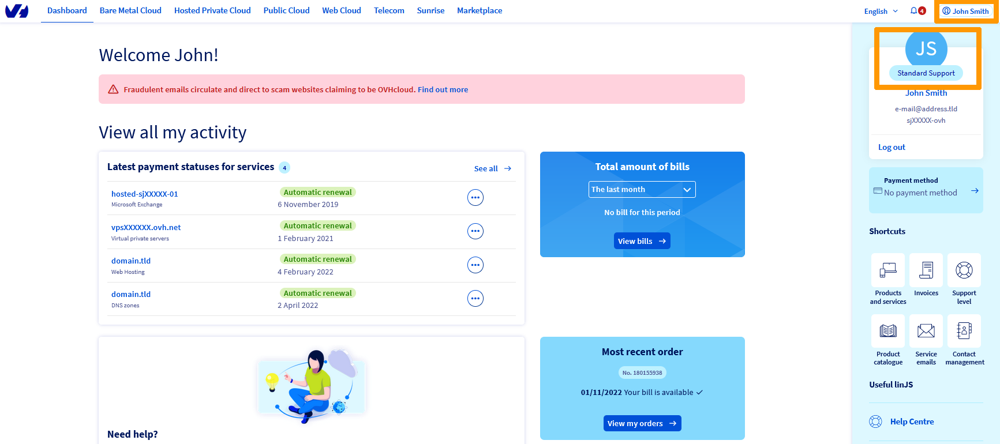
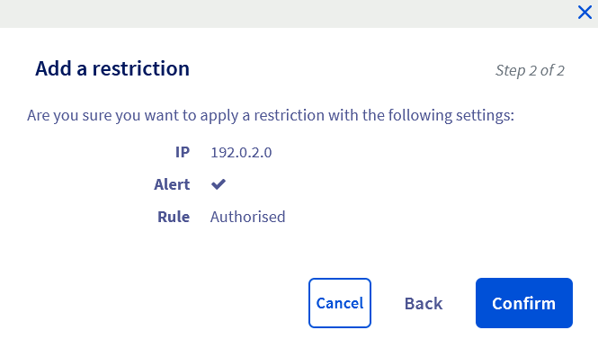
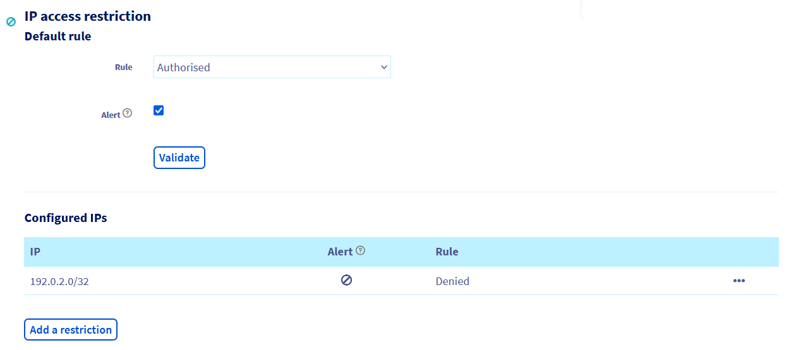

> [!primary]
> Esta traducción ha sido generada de forma automática por nuestro partner SYSTRAN. En algunos casos puede contener términos imprecisos, como en las etiquetas de los botones o los detalles técnicos. En caso de duda, le recomendamos que consulte la versión inglesa o francesa de la guía. Si quiere ayudarnos a mejorar esta traducción, por favor, utilice el botón «Contribuir» de esta página.
>

**Última actualización: 13/12/2022**
  
## Objetivo

OVHcloud pone a su disposición opciones para reforzar la seguridad de su área de cliente de OVHcloud y de sus servicios.

En particular, puede restringir el acceso a su [área de cliente de OVHcloud](https://www.ovh.com/auth/?action=gotomanager&from=https://www.ovh.com/fr/&ovhSubsidiary=fr) a determinadas direcciones IP.
Esta opción, combinada con la seguridad de su cuenta mediante una [doble autenticación](https://docs.ovh.com/fr/customer/securiser-son-compte-avec-une-2FA/), permite proteger de forma óptima su área de cliente de OVHcloud contra posibles intentos de intrusión.

**Descubra cómo proteger su cuenta de OVHcloud limitando las direcciones IP autorizadas a acceder a ellas**

> [!warning]
>
> La restricción de acceso por IP y/o la doble autenticación solo protegen el acceso al área de cliente de OVHcloud desde el que puede contratar, gestionar, renovar o eliminar sus servicios de OVHcloud. Estas opciones no protegen sus propios servicios, para los que debe implementar medidas de seguridad específicas.
>

## Requisitos

- Estar conectado al [área de cliente de OVHcloud](https://www.ovh.com/auth/?action=gotomanager&from=https://www.ovh.com/fr/&ovhSubsidiary=fr).
- Haber consultado las [recomendaciones sobre la gestión de la contraseña de acceso a su cuenta](https://docs.ovh.com/fr/customer/gerer-son-mot-de-passe/).
  
## Procedimiento

### Etapa 1 - recuperar las direcciones IP públicas autorizadas a acceder al área de cliente de OVHcloud

Existen dos tipos de direcciones IP:

- **Las direcciones IP públicas**: pueden verse en toda la red de Internet. Estas direcciones, por ejemplo, se utilizan en el punto de acceso/router de internet para que usted tenga una dirección de internet que le permita acceder a toda la red.
- **Las direcciones IP privadas**: son invisibles e inutilizables en la red de Internet, se distribuyen en una red local. Para retomar nuestro ejemplo, su router de internet va a asignar una dirección IP privada a cada uno de los dispositivos (ordenadores, smartphones, tabletas...) conectados a esta. Su punto de acceso/router Internet permite que estos dispositivos utilicen su IP pública para acceder a Internet. Estas direcciones IP son fáciles de reconocer, ya que suelen empezar por 10.0.X.X, 172.16.X.X o 192.168.X.X (donde las X son valores entre 0 y 255).

Para utilizar la opción de restricción por IP del área de cliente de OVHcloud, deberá introducir **únicamente** su(s) IP pública(s).

Para obtener la dirección IP pública de un dispositivo que estará autorizado a acceder al área de cliente de OVHcloud, acceda al sitio web [mon-ip.com](https://mon-ip.com){.external} (no gestionado por OVHcloud).

Anote la dirección IP que se indica y repita la operación para cada uno de los dispositivos que tengan acceso al área de cliente de OVHcloud.

Si utiliza una red 4G/5G como complemento, no olvide recuperar también la dirección IP de esta(s) red(es).

> [!warning]
>
> La mayoría de los proveedores de acceso a Internet (ISP) asignan una dirección IP **dinámica** a su punto de acceso a Internet/box. Estas direcciones IP dinámicas cambian al reiniciar el router o cada 24/48 horas. Sin embargo, algunos ISP pueden asignarle direcciones IP **fijas* bajo petición.
>
> Para una conexión en 3G/4G/5G, las direcciones IP son sistemáticamente **dinámicas*.
>
> **Antes** de aplicar una restricción por IP en su área de cliente de OVHcloud, compruebe con su proveedor de acceso a internet que las direcciones IP recuperadas anteriormente son efectivamente direcciones IP **fijas**. De lo contrario, podría perder rápidamente el acceso al área de cliente de OVHcloud declarando una IP dinámica.
>

### Etapa 2: aplicar una restricción de acceso por IP

Conéctese a su [área de cliente de OVHcloud](https://www.ovh.com/auth/?action=gotomanager&from=https://www.ovh.com/fr/&ovhSubsidiary=fr). Haga clic en su `Nombre y apellido` situado en la parte superior derecha **después** en sus `iniciales` en la columna azul que aparece a la derecha.

{.thumbnail}

A continuación, haga clic en la pestaña `Seguridad`{.action} para acceder a la siguiente página:

{.thumbnail}

Haga clic en `Activar`{.action} a la derecha de `Restricción de acceso por IP`.

#### Presentación de la interfaz

{.thumbnail}

Existen dos secciones para implementar las restricciones por IP:

- **Regla por defecto**. Este campo permite:
    - denegar el acceso a todas las direcciones IP, excepto las previamente declaradas como **autorizadas** en la segunda sección *IP configuradas*. 
    - autorizar el acceso a todas las direcciones IP, excepto las previamente declaradas como **denegadas** en la segunda sección *IP configuradas*.
    > Marque la casilla `Alerta`{.action} si desea recibir una notificación por correo electrónico en su dirección de correo electrónico de contacto cuando se haya producido un intento de conexión no autorizada para acceder al área de cliente.

- **IP configuradas** Este campo permite declarar las direcciones IP que serán objeto de una restricción o de una autorización de acceso. También permite visualizar las reglas previamente implementadas.

> [!alert]
>
> Atención antes de continuar con sus acciones.
>
> En la sección `Regla por defecto`{.action}, no acepte **nunca** la regla por defecto en estado `Denegado`{.action} **sin haber autorizado correctamente** y previamente al menos una de sus direcciones IP públicas en la sección `IP configuradas`. 
>
> En caso contrario, bloqueará **absolutamente todas las IP públicas (incluidas las suyas)* sin excepción. Nadie tendrá acceso a su [área de cliente de OVHcloud](https://www.ovh.com/auth/?action=gotomanager&from=https://www.ovh.com/fr/&ovhSubsidiary=fr) y deberá realizar un procedimiento administrativo para desbloquear su situación.
>
> Esté muy atento a este punto.
>

#### Denegar todas las direcciones IP excepto las direcciones legítimas

Para autorizar el acceso al área de cliente de OVHcloud a una o varias direcciones IP legítimas, haga clic en el botón `Añadir una restricción`{.action}.

> En las capturas de pantalla que se indican a continuación, la IP **192.0.2.0** se sustituirá por una IP suya.
> 

{.thumbnail}

En la nueva ventana, introduzca la dirección IP pública que quiera autorizar en el formulario `IP`{.action}. Marque la casilla `Alerta`{.action} si desea recibir una notificación por correo electrónico de los intentos de conexión a través de esta dirección IP y deje la `regla`{.action} en el estado `Autorizado`{.action}.

Haga clic en `Siguiente`{.action} y compruebe su dirección IP y la regla antes de hacer clic en `Aceptar`{.action}.

{.thumbnail}

La regla debería aparecer en la sección `IP configuradas`.

{.thumbnail}

> [!primary]
>
> **Antes** de continuar con las acciones descritas en esta etapa, repita la operación anterior para todas las demás direcciones IP que quiera autorizar a acceder al área de cliente de OVHcloud.
>

Una vez **el conjunto** de sus direcciones IP públicas indicadas en la sección `IP configuradas`, pase a la sección `Reglas por defecto` la regla en estado `Denegado`{.action}. Marque la casilla `Alerta`{.action} si desea recibir una notificación por correo electrónico de los intentos de conexión y haga clic en `Aceptar`{.action}.

{.thumbnail}

> Desde ahora, **solo** las direcciones IP públicas previamente autorizadas en la sección `IP configuradas` pueden acceder al área de cliente de OVHcloud.

#### Autorizar todas las direcciones IP, excepto algunas direcciones

La opción de restricción de acceso por IP permite autorizar a todas las direcciones IP a acceder al área de cliente de OVHcloud, a excepción de algunas que haya identificado previamente como ilegítimas.

Para bloquear el acceso a su área de cliente de OVHcloud a una o varias direcciones IP, haga clic en el botón `Añadir una restricción`{.action} en el menú `IP configuradas`.

{.thumbnail}

En la nueva ventana, introduzca la dirección IP pública que quiera bloquear en el campo `IP`{.action}. Marque la casilla `Alerta`{.action} si desea recibir una notificación por correo electrónico de los intentos de conexión a través de esta dirección IP y, a continuación, haga clic en la `regla`{.action} en el estado `Denegado`{.action}.

Haga clic en `Siguiente`{.action}, compruebe la dirección IP y la regla antes de hacer clic en `Aceptar`{.action}.

{.thumbnail}

La regla debería aparecer en la sección `IP configuradas`.

{.thumbnail}

> [!primary]
>
> **Antes** de continuar con las acciones descritas en esta etapa, repita la operación para todas las demás direcciones IP de las que quiera bloquear el acceso a su área de cliente de OVHcloud.
>

Una vez que haya configurado todas las direcciones IP públicas que figuran en el apartado `IP configuradas`, deje la regla en estado `Autorizado` en el apartado `Reglas por defecto`. Marque la casilla `Alerta`{.action} si desea recibir la notificación por correo electrónico de los intentos de conexión y haga clic en `Aceptar`{.action}.

{.thumbnail}

> Desde ahora, **todas** las direcciones IP públicas pueden acceder al área de cliente de OVHcloud, **excepto** las indicadas en el apartado `IP configuradas`.

## Más información

[Iniciar la doble autenticación en su área de cliente de OVHcloud](https://docs.ovh.com/fr/customer/securiser-son-compte-avec-une-2FA/)

Para servicios especializados (posicionamiento, desarrollo, etc.), contacte con [partners de OVHcloud](https://partner.ovhcloud.com/es-es/).

Si quiere disfrutar de ayuda para utilizar y configurar sus soluciones de OVHcloud, puede consultar nuestras distintas soluciones [pestañas de soporte](https://www.ovhcloud.com/es-es/support-levels/).

Interactúe con nuestra comunidad de usuarios en <https://community.ovh.com/en/>.