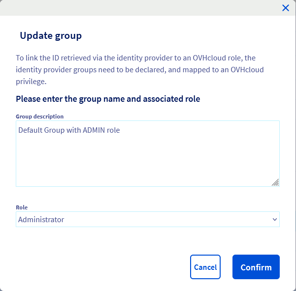

## Objectif

OVHcloud vous donne la possibilité de créer des utilisateurs, qui peuvent agir en lecture ou en écriture sur votre espace client. Cela vous permet de donner aux membres de votre entreprise un accès à vos services OVHcloud. Et ce, sans avoir à recourir à des pratiques hasardeuses de partage de mot de passe ou de code de double authentification.

> [!primary]
>
> La gestion des utilisateurs est différente de la gestion des contacts. Un utilisateur aura accès à toutes les sections de l'espace client en fonction du niveau de droits qui lui est accordé.
>
> La gestion de contacts vise quant à elle à déléguer l'administration complète des aspects administratifs, techniques ou de facturation d'un ou plusieurs services sur votre compte OVHcloud. Pour plus de détails sur la gestion des contacts, consultez [ce guide](/pages/account/customer/managing_contacts).
>

**Ce guide détaille les différents privilèges qu'un utilisateur peut détenir ainsi que la méthode pour ajouter et gérer vos utilisateurs.**

## Prérequis

- Disposer d'un compte OVHcloud actif.
- Être connecté à votre espace client.

## En pratique

### Gestion des utilisateurs

#### Ajouter un utilisateur

Connectez-vous à votre [espace client OVHcloud](https://www.ovh.com/auth/?action=gotomanager&from=https://www.ovh.com/fr/&ovhSubsidiary=fr){.external}, cliquez en haut à droite sur`votre nom`{.action} (1), puis sur vos initiales (2). 
Cliquez alors sur l'onglet `Gestion des utilisateurs`{.action} (3) puis sur `Ajouter un utilisateur`{.action} (4).

{.thumbnail}

Une fenêtre apparaît et vous devez y compléter les champs requis. Cliquez sur `Valider`{.action} pour créer l'utilisateur.

{.thumbnail}

| Champ | Détails |
|--------------|----------------------------------------------------------------------------------------------------------------------------------------------------------------------------------------------------------------------------------------------------------------------------------------------------------|
| Identifiant | Renseignez, par exemple, le nom de l'utilisateur ou sa fonction. |
| E-mail | Renseignez l'adresse e-mail de l'utilisateur. |
| Mot de passe | Définissez le mot de passe de l'utilisateur. Il pourra modifier ce mot de passe lorsque son accès aura été créé.  Nous vous conseillons également de consulter [le guide sur la gestion du mot de passe](/pages/account/customer/manage-ovh-password){.external} pour définir ce mot de passe. |
| Groupe | Choisissez un groupe parmi ceux disponibles |
| Description | Vous pouvez ajouter une description de l'utilisateur. Exemple : son rôle dans votre entreprise. |

L'utilisateur obtiendra alors son propre identifiant composé de l'identifiant numérique de votre compte (qui vous est rappelé dans le menu « Gestion des utilisateurs ») et de son nom d'utilisateur, les deux valeurs étant séparées par un « / ».

Exemple : **1234-567-89/johnsmith**.

{.thumbnail}

L'utilisateur créé pourra dès lors se connecter à [l'espace client OVHcloud](https://www.ovh.com/auth/?action=gotomanager&from=https://www.ovh.com/fr/&ovhSubsidiary=fr){.external} en utilisant cet identifiant. 

Il pourra également modifier son mot de passe et sécuriser son propre accès à votre compte en activant une mesure de double authentification (celle-ci concernera uniquement son accès en tant qu'utilisateur). Vous pouvez consulter à cet effet [le guide sur la mise en place de la double authentification](/pages/account/customer/secure-ovhcloud-account-with-2fa){.external}.

#### Gérer les utilisateurs

Vous pouvez modifier, désactiver/activer ou supprimer un utilisateur en cliquant sur les `…`{.action} à droite de celui-ci.

{.thumbnail}

La modification de l'utilisateur vous permettra de mettre à jour son adresse e-mail, ses privilèges ainsi que sa description.

{.thumbnail}

### Gestion des groupes

#### Ajouter un groupe

Dans l'onglet `Gestion des utilisateurs`{.action}, cliquez sur `Déclarer un groupe`{.action}.

{.thumbnail}

Une fenêtre s'affiche et vous devez compléter les champs requis. Cliquez sur `Valider`{.action} pour créer l'utilisateur.

{.thumbnail}

Les groupes attribuent un niveau de privilège par défaut aux utilisateurs qu'ils contiennent, en fonction du rôle que vous choisissez :

| Rôle | Détails |
|------------------|----------------------------------------------------------------------------------------------------------------------|
| Aucun | Ne donne aucun accès à l'espace client OVHcloud si aucune politique IAM n'est mise en place. |
| Lecture Seule | Donne un accès en lecture à l'espace client OVHcloud et à toutes ses sections. |
| Administration restreinte | Donne un accès en écriture à l'espace client OVHcloud et à toutes ses sections, à l'**exception de la gestion des** utilisateurs. |
| Administrateur | Donne un accès en écriture à l'espace client OVHcloud et à toutes ses sections, **y compris** la gestion des utilisateurs. |

#### Gérer les groupes

Vous pouvez mettre à jour ou supprimer un groupe en cliquant sur le bouton `...`{.action} à droite du nom de groupe.

{.thumbnail}

Lorsque vous modifiez un groupe, vous pouvez modifier sa description et son rôle.

{.thumbnail}

### Gestion des droits

En plus du rôle associé aux groupes d'utilisateurs, vous pouvez affiner les privilèges d'accès à l'aide de l'IAM OVHcloud.

Consultez notre guide sur [la gestion des politiques IAM OVHcloud](/pages/account/customer/iam-policy-ui).

## Aller plus loin

Échangez avec notre communauté d'utilisateurs sur <https://community.ovh.com>.