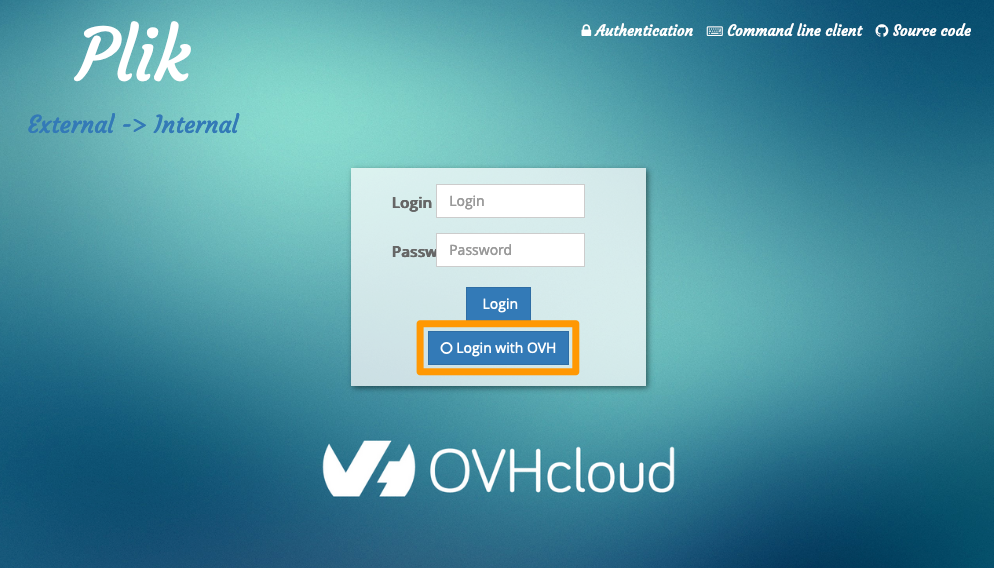
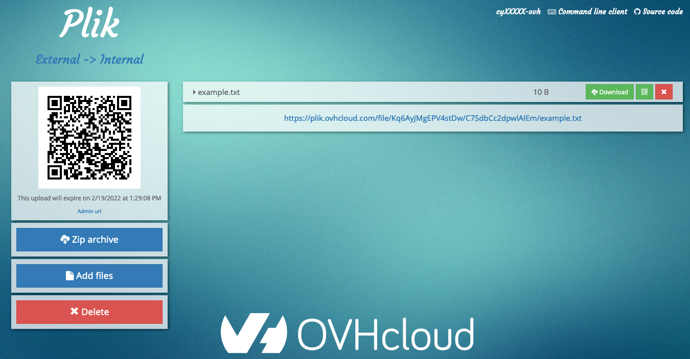

**Stand 14.02.2022**

## Ziel

Das Online-Tool [Plik](https://plik.ovhcloud.com) erlaubt es, Dateien zwischen verschiedenen Personen zu teilen, indem es Optionen zur Absicherung des Zugriffs auf diese Dateien bietet.

**Hier erfahren Sie, wie Sie das Online-Tool Plik verwenden, um Dateien zu teilen.**

## Voraussetzungen

- Sie verfügen über einen [OVHcloud Account](https://docs.ovh.com/de/customer/ovhcloud-account-erstellen/)

## In der praktischen Anwendung

### API Verbindung

Gehen Sie zuerst zur Seite <https://plik.ovhcloud.com>.

Um Dateien hochzuladen, müssen Sie authentifiziert sein. Klicken Sie auf `Login with OVH`{.action}.

Verbinden Sie sich mit Ihrem OVHcloud Account, was der OVHcloud API Zugriff auf das Plik Tool gibt. 
Geben Sie Ihre Login-Daten ein und klicken Sie auf den Button `Log in`{.action}, um fortzufahren.

> [!primary]
>
> Wenn Sie die [Zwei-Faktor-Authentifizierung](https://docs.ovh.com/de/customer/Account-mit-2FA-absichern/) für Ihren Account aktiviert haben, geben Sie den Code ein, den Sie für die Authentifizierungsmethode angegeben haben. 

### Dateien hochladen

Wenn Sie eingeloggt sind, klicken Sie oben links auf das Wort `Plik`{.action}, um auf das Hinzufügen von Dateien zuzugreifen.

Klicken Sie auf `Add Files`{.action} und wählen Sie die Datei aus, die Sie hinzufügen möchten, oder "Drag and Drop" aus Ihren Dateien.

> [!primary]
>
> Die Dateigröße ist auf 10 GB begrenzt.
>

Für die Konfiguration Ihrer Auszahlungen stehen mehrere Optionen zur Verfügung:

- `Destruct after the first download` - Nach dem ersten Download wird Ihre Datei im Internet gelöscht.
- `Streaming` - Die Datei wird nicht auf dem Server gespeichert. Stattdessen beginnt die Dateiübertragung, wenn der Remote-Benutzer mit dem Download beginnt.
- `Removable` - Erlaubt es den Endbenutzern, die Televerse-Datei zu löschen.
- `Password` - Schützen Sie Ihre Auszahlung, indem Sie eine Kennung und ein Passwort festlegen, die der Remote-Benutzer eingeben muss.
- `Comments` - Sie Ihrem Download Kommentare hinzu. Sprache *Markdown* wird unterstützt.
- `Files will be automatically removed in` - Wählen Sie die Anzahl an Tagen (maximal 30), Stunden oder Minuten aus, nach deren Ablauf Sie möchten, dass Ihre Dateien automatisch gelöscht werden.

> [!primary]
>
> Wenn Sie Ihre Übertragung mit einem Passwort schützen, ist der Standardbenutzername "plik".
>

Nachdem Sie Ihre Dateien hinzugefügt und die gewünschten Optionen ausgewählt haben, klicken Sie auf der linken Seite auf den grünen `Upload`{.action} button. Dadurch wird eine neue Seite mit Ihren beigefügten Dateien geöffnet.

Die Download-Optionen sind dann verfügbar.

### Dateien herunterladen

Auf der Download-Seite sind neue Optionen verfügbar:

- `Zip Archive` - Legen Sie alle Dateien, die Sie fernübertragen haben, in einen komprimierten Ordner.
- `Add Files` - Sie können weitere Dateien hinzufügen.
- `Delete` - Löschung sämtlicher im Voraus hochgeladener Dateien.

Sie können auch Dateien einzeln löschen, indem Sie rechts neben jeder Datei auf den `X`{.action}-Button klicken.

Damit andere Personen Ihre Dateien herunterladen können, geben Sie ihnen den Link zur Datei unter dem Namen der Datei. 
Sie können ihnen auch den Link zu allen Dateien der Session geben, indem Sie die URL in der Adresszeile Ihres Browsers teilen. 
Sie können auch den QR-Code links teilen. Wenn Sie mehrere Dateien hochgeladen haben, können Sie mit dem QR-Code jede Datei herunterladen.

### Kontooptionen

Klicken Sie auf Ihre Kundenkennung oben rechts, um auf die Kontooptionen zuzugreifen.

Über dieses Menü können Sie sich trennen, Token generieren, um das Plik-Tool in der Kommandozeile zu verwenden, jede Telezahlung (über den `Remove`{.action}-Button rechts neben jeder Telezahlung) löschen oder alle (über den `DELETE UPLOADS`{.action} Button) löschen.

## Weiterführende Informationen

Für den Austausch mit unserer User Community gehen Sie auf <https://community.ovh.com/en/>.
