> [!primary]
> Questa traduzione è stata generata automaticamente dal nostro partner SYSTRAN. I contenuti potrebbero presentare imprecisioni, ad esempio la nomenclatura dei pulsanti o alcuni dettagli tecnici. In caso di dubbi consigliamo di fare riferimento alla versione inglese o francese della guida. Per aiutarci a migliorare questa traduzione, utilizza il pulsante "Contribuisci" di questa pagina.
>

## Obiettivo

L'autenticazione **SSO** (*Single Sign-On*) è disponibile per accedere al tuo account OVHcloud. Per attivare queste connessioni, l'account e l'Entra ID (in precedenza Azure Active Directory) devono essere configurati utilizzando SAML (*Security Assertion Markup Language*)..

**Questa guida ti mostra come associare il tuo account OVHcloud a un Entra ID esterno.**

## Prerequisiti

- Avere accesso ai ruoli **Amministratore applicazioni** e **Amministratore utenti** di Entra ID
- Disporre di un [account OVHcloud attivo](/pages/account_and_service_management/account_information/ovhcloud-account-creation)
- Avere accesso allo [Spazio Cliente OVHcloud](https://www.ovh.com/auth/?action=gotomanager&from=https://www.ovh.it/&ovhSubsidiary=it)

## Procedura

> [!primary]
>
> Affinché un provider di servizi (ad esempio, l'account OVHcloud) stabilisca una connessione SSO con un provider (ad esempio, Entra ID), è necessario stabilire un rapporto di fiducia reciproca registrando la connessione SSO in entrambi i servizi.
>

### Utenti e gruppi Entra ID

Il vostro Entra ID agisce come fornitore di identità. Le richieste di autenticazione per il tuo account OVHcloud saranno accettate solo se l'hai precedentemente dichiarato come terza parte di fiducia.

Concentriamoci per un attimo sulle identità dal lato del provider.

#### Utenti Entra ID

Per iniziare, accedi alla dashboard Entra ID.

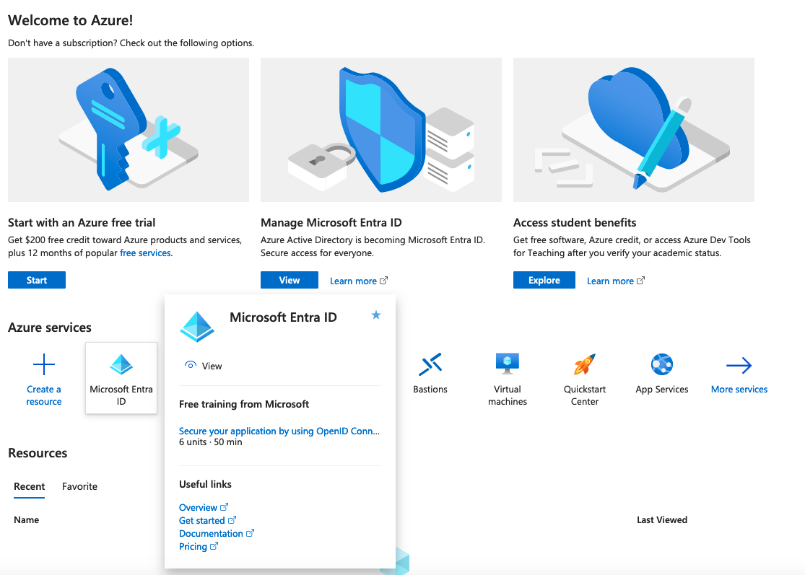{.thumbnail}

Clicca su `Users`{.action} nel menu a sinistra.

{.thumbnail}

Crea tutti gli utenti che vuoi e/o verifica i tuoi utenti cliccando su di essi.

Per questo esempio, verrà utilizzato l'utente **John Smith**.

{.thumbnail}

Quando viene effettuata un'autenticazione SSO, l'identità di **John Smith** è fornita da Entra ID sull'account OVHcloud. È tuttavia necessario che tale identità contenga almeno un gruppo. Se nessun gruppo esiste, ecco come crearne uno per aggiungervi **John Smith**.

#### Gruppi Entra ID

Clicca su `Groups`{.action} nel menu a sinistra.

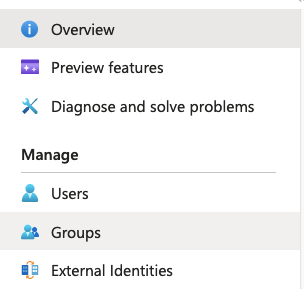{.thumbnail}

Clicca su `New group`{.action} nel menu in alto e inserisci tutte le informazioni necessarie.

Per questo esempio, verrà utilizzato il gruppo **manager@ovhcloudsaml**.

{.thumbnail}

Clicca sul pulsante `Create`{.action} per visualizzare tutte le informazioni su questo gruppo.

{.thumbnail}

Ora, gli utenti che saranno utilizzati per l'autenticazione SSO devono essere aggiunti a un gruppo.

In questo esempio, associamo l'utente **John Smith** al gruppo **manager@ovhcloudsaml**.

Nell'interfaccia del gruppo selezionato, clicca sugli `Members`{.action} nel menu a sinistra e poi su `Add members`{.action} nel menu in alto.

{.thumbnail}

Seleziona l'utente da aggiungere a questo gruppo e clicca sul pulsante `Select`{.action}.

{.thumbnail}

Ora, l'utente è assegnato al gruppo.

Per effettuare le credenziali SSO, è necessario creare un'applicazione Entra ID.

L'autenticazione unica deve essere configurata su questa applicazione.

### Applicazioni Entra ID

Per prima cosa, crea un'applicazione se non esiste ancora.

#### Crea un'applicazione Entra ID

Clicca su `Enterprise applications`{.action} nel menu a sinistra.

{.thumbnail}

Clicca su `New application`{.action} nel menu in alto.

{.thumbnail}

Clicca su `Create your own application`{.action} nel menu in alto.

{.thumbnail}

Seleziona `Non-gallery`{.action} nel menu a sinistra e clicca sul pulsante `Create`{.action}.

{.thumbnail}

I dettagli dell'applicazione verranno mostrati

{.thumbnail}

L'applicazione Entra ID è stata creata. Gli utenti che intendono effettuare le credenziali di sicurezza tramite questa applicazione devono essere aggiunti.

#### Applicazione Entra ID - Destinazione degli utenti

> [!primary]
>
> Affinché un utente effettui un'autenticazione SSO a partire da un'applicazione Entra ID, deve essere aggiunta a questa applicazione. Di seguito trovi come aggiungere un utente a un'applicazione Entra ID.
>
> Tuttavia, se disponi di **Entra ID Premium**, è preferibile aggiungere un gruppo di utenti piuttosto che utenti.
>

Clicca su `Users and groups`{.action} nel menu a sinistra e poi clicca su `Add user/group`{.action} nel menu in alto.

Clicca sulla sezione `Users`{.action}, seleziona l'utente da aggiungere all'applicazione e poi clicca sul pulsante `Select`{.action}.

{.thumbnail}

{.thumbnail}

L'applicazione è creata, l'utente è assegnato, non ti resta che installare il SSO via SAML.

#### Entra ID app SSO

Per visualizzare l'immagine, clicca sul pulsante `Overview`{.action} nel menu a sinistra e poi su `Set up single sign on`{.action}.

{.thumbnail}

Clicca sulla sezione `SAML`{.action}.

{.thumbnail}

Clicca su `Upload metadata`{.action} nel menu in alto.

{.thumbnail}

Clicca sull'icona del pulsante `Select a file`{.action}, seleziona il file di metadati OVH Service Provider e clicca sul pulsante `Add`{.action}.

Puoi ottenere il file di metadati appropriato tramite questi link:

- [Metadati della regione UE](https://www.ovh.com/auth/sso/saml/sp/metadata.xml)
- [Metadati della regione CA](https://ca.ovh.com/auth/sso/saml/sp/metadata.xml)

Scarica il file di metadati, ne avrai bisogno più tardi.

{.thumbnail}

Si apre la configurazione SAML.

{.thumbnail}

Nella sezione `Attributes & Claims`{.action}, clicca sul pulsante `Edit`{.action}.

{.thumbnail}

Aggiungere l'attributo UPN (User Principal Name) alle informazioni SAML per notificare a OVHcloud l'indirizzo e-mail dell'utente. Questo step è indispensabile.

Clicca su `Add a new claim`{.action} nel menu in alto.

Nel campo `Name`{.action}, inserisci il valore `http://schemas.xmlsoap.org/ws/2005/05/identity/claims/upn`.

Nel campo `Source attribute`{.action}, inserisci `user.mail`{.action}.

L'interfaccia dovrebbe quindi essere abbastanza simile al seguente screenshot:

{.thumbnail}

Clicca su `Save`{.action}

Dichiarare l'attributo utilizzato per il gruppo dell'utente.

Clicca su `Add a group claim`{.action} nel menu in alto.

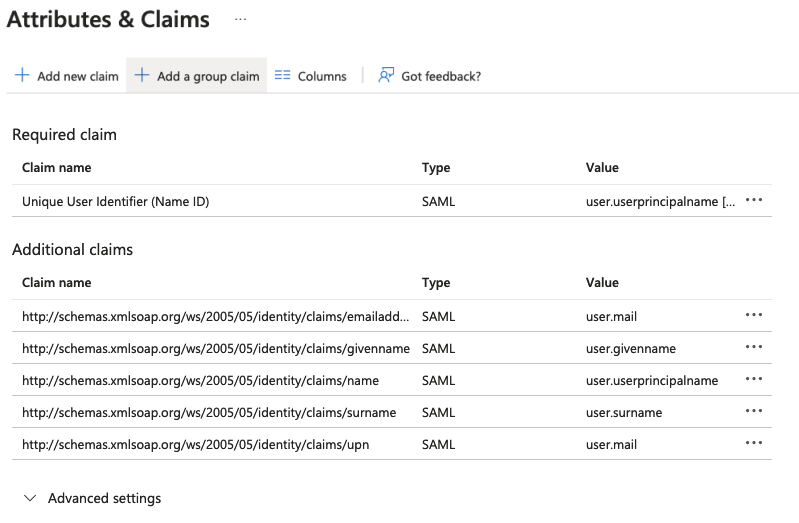{.thumbnail}

Seleziona `Security groups`{.action} e **Group ID** nella `Source attribute`{.action} e clicca sul pulsante `Save`{.action}.

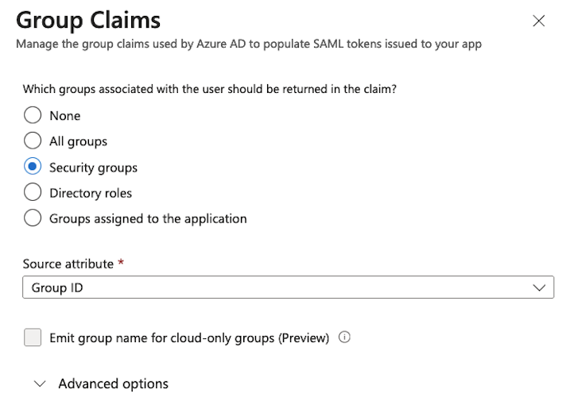{.thumbnail}

La richiesta dei **groups** deve ora essere inclusa nella lista.

Copia e registra il valore del **Claim name** da qualche parte (ad esempio un blocco note), ne avrai bisogno in un secondo momento.

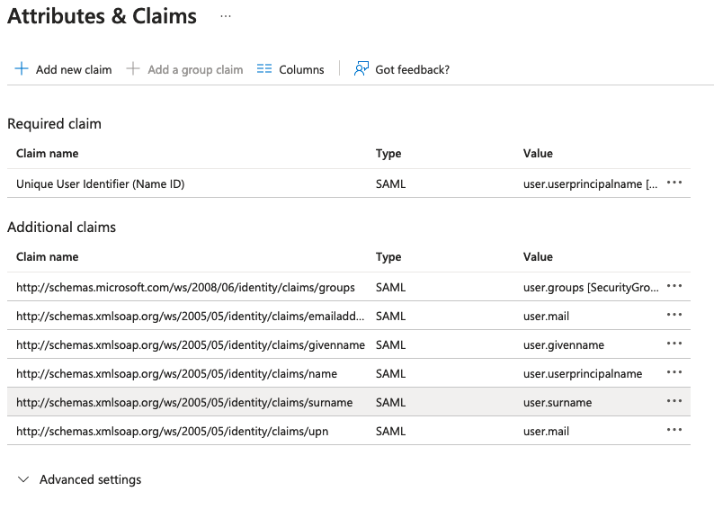{.thumbnail}

Nella sezione `SAML certificates`{.action}, copia il valore del campo `App Federation Metadata Url`{.action}.

Utilizza questo link per scaricare il file di metadati dell'applicazione Entra ID per utilizzarlo in seguito nell'account OVHcloud.

{.thumbnail}

### Creare la fiducia di un account OVHcloud e configurare la connessione

L'applicazione Entra ID viene aggiunta come provider di identità approvato tramite [lo Spazio Cliente OVHcloud](https://www.ovh.com/auth/?action=gotomanager&from=https://www.ovh.it/&ovhSubsidiary=it), dove è possibile fornire i metadati del provider.

#### Creare la fiducia di OVHcloud

[Accedi allo Spazio Cliente](https://www.ovh.com/auth/?action=gotomanager&from=https://www.ovh.it/&ovhSubsidiary=it) e clicca sul tuo profilo in alto a destra.

{.thumbnail}

Clicca sul tuo nome per accedere alla pagina di gestione del tuo profilo.

{.thumbnail}

Apri la scheda `Gestione utenti`{.action}.

{.thumbnail}

Clicca sul pulsante `Connessione SSO`{.action}.

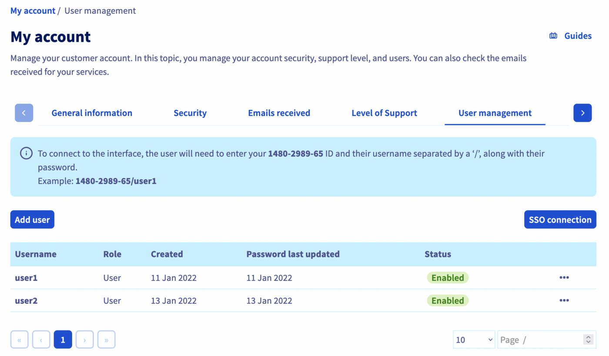{.thumbnail}

Completa il campo **Group Attribute Name** con il valore di **Claim name** dei gruppi di applicazioni Entra ID precedentemente registrato.

Compila i metadati XML della tua applicazione Entra ID a partire dal file registrato precedentemente.

Clicca sul pulsante `Conferma`{.action}.

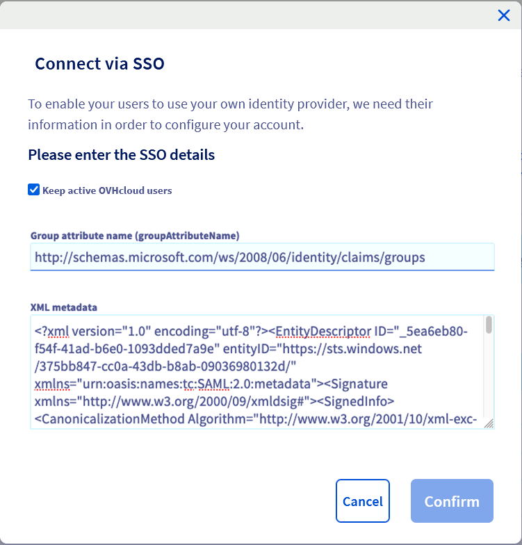{.thumbnail}

È quindi possibile aggiungere Entra ID come provider, ma è necessario aggiungere gruppi al tuo account OVHcloud.

> [!warning]
> Se stai cercando di connetterti via SSO, probabilmente comparirà un messaggio di errore "`Not in valid groups`".
>
> Infatti, il tuo account OVHcloud verifica se l'utente autenticato appartiene a un gruppo esistente sull'account.
>

Per risolvere il problema, verifica l'attributo "Group" restituito dalla tua applicazione Entra ID: il campo **Object Id**.

#### Dichiarazione dei gruppi OVHcloud

{.thumbnail}

Per aggiungerlo, clicca sul pulsante `Declarer un gruppo`{.action}.

{.thumbnail}

Completa i campi e clicca su `Conferma`{.action}.

{.thumbnail}

Il gruppo creato deve figurare sull'elenco.

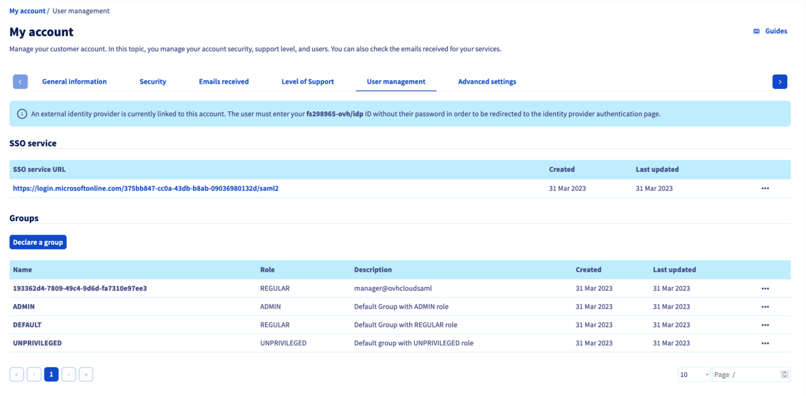{.thumbnail}

### Connexion via SSO

Nella [pagina di identificazione OVHcloud](https://www.ovh.com/auth/?action=gotomanager&from=https://www.ovh.it/&ovhSubsidiary=it), inserisci il tuo [identificativo cliente](/pages/account_and_service_management/account_information/ovhcloud-account-creation#qual-e-il-mio-identificativo-cliente) seguito da **/idp** senza password e clicca sul pulsante `Login`{.action}.

{.thumbnail}

Verrai reindirizzato alla pagina di connessione dell'applicazione Entra ID. Seleziona `Use another account`{.action}.

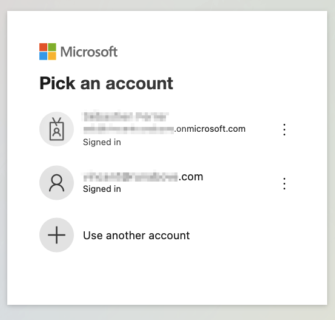{.thumbnail}

Inserisci l'email dell'utente dell'applicazione Entra ID e poi clicca sul pulsante `Next`{.action}.

{.thumbnail}

Inserisci la password dell'utente Entra ID e clicca sul pulsante `Sign In`{.action}.

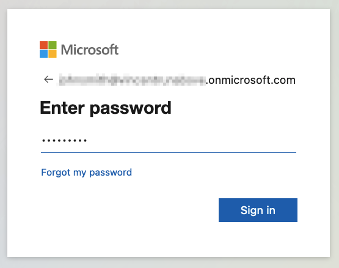{.thumbnail}

Adesso sei connesso con lo stesso NIC handle, ma tramite il tuo utente Active Directory e utilizzando il tuo SSO di applicazione Entra ID.

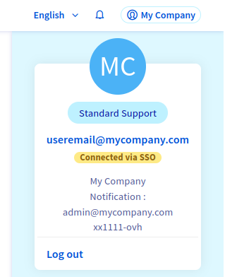{.thumbnail}

Se la tua email non compare sotto `Connected via SSO`, significa che non hai configurato correttamente l’attributo **UPN** e quindi alcune delle funzionalità non potranno funzionare.

## Per saperne di più

[Crea un account OVHcloud](/pages/account_and_service_management/account_information/ovhcloud-account-creation)

[Rendere sicuro il tuo account OVHcloud e gestire le tue informazioni personali](/pages/account_and_service_management/account_information/all_about_username)

[Definizione e gestione della password del tuo account](/pages/account_and_service_management/account_information/manage-ovh-password)

[Rendere sicuro il tuo account OVHcloud con la doppia autenticazione](/pages/account_and_service_management/account_information/secure-ovhcloud-account-with-2fa)

Contatta la nostra Community di utenti all’indirizzo <https://community.ovh.com/en/>.

