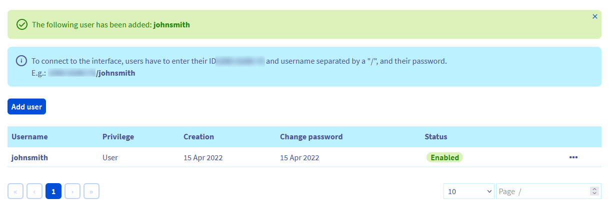

> [!primary]
> Diese Übersetzung wurde durch unseren Partner SYSTRAN automatisch erstellt. In manchen Fällen können ungenaue Formulierungen verwendet worden sein, z.B. bei der Beschriftung von Schaltflächen oder technischen Details. Bitte ziehen Sie im Zweifelsfall die englische oder französische Fassung der Anleitung zu Rate. Möchten Sie mithelfen, diese Übersetzung zu verbessern? Dann nutzen Sie dazu bitte den Button "Beitragen" auf dieser Seite.
>

## Ziel

Bei OVHcloud haben Sie die Möglichkeit, lokale Benutzer zu erstellen und diesen Lese- oder Schreibrechte für Ihren Kunden-Account zu erteilen. So können Sie Mitgliedern Ihres Unternehmens Zugriff auf Ihre OVHcloud Dienste gewähren, ohne einen riskanten Umweg zu nehmen, indem Sie etwa Ihr Passwort oder Login-Codes weitergeben.

> [!primary]
>
> Die Benutzerverwaltung unterscheidet sich von der Kontaktverwaltung. Ein Benutzer erhält abhängig von der zugewiesenen Berechtigungsstufe Zugriff auf alle Bereiche des Kundencenters.
>
> Bei der Kontaktverwaltung hingegen geht es darum, die vollständige Verwaltung der administrativen, technischen oder rechnungsrelevanten Aspekte eines oder mehrerer Dienste Ihres OVHcloud Accounts auf eine andere Person zu delegieren. Für weitere Informationen zur Verwaltung der Kontakte lesen Sie [unsere Anleitung](/pages/account_and_service_management/account_information/managing_contacts).
>

**Diese Anleitung erklärt, über welche Rechte ein lokaler Benutzer verfügen kann und wie Sie Benutzer hinzufügen und verwalten.**

## Voraussetzungen

- Sie verfügen über einen aktiven OVHcloud Kunden-Account.
- Sie haben Zugriff auf Ihr [OVHcloud Kundencenter](https://www.ovh.com/auth/?action=gotomanager&from=https://www.ovh.de/&ovhSubsidiary=de).

## In der praktischen Anwendung

### Grundlegendes zu Identitäten

Lokale Benutzer sind einer der Identitätstypen, die in Ihrem OVHcloud Kunden-Account eingerichtet werden können. Diese Typen werden in der [zugehörigen Dokumentation](/pages/manage_and_operate/iam/identities-management) beschrieben.

### Benutzerverwaltung

#### Benutzer hinzufügen

Wenn Sie in Ihrem [OVHcloud Kundencenter](https://www.ovh.com/auth/?action=gotomanager&from=https://www.ovh.de/&ovhSubsidiary=de) eingeloggt sind, klicken Sie oben rechts auf Ihren `Account-Namen`{.action} (1) und klicken Sie dann auf die Initialen (2).

Klicken Sie anschließend auf den Tab `Verwaltung der Nutzer`{.action} (3) und dann auf `Nutzer hinzufügen`{.action} (4).

{.thumbnail}

Füllen Sie im neu geöffneten Fenster alle erforderlichen Felder aus. Klicken Sie auf `Bestätigen`{.action}, um den Benutzer zu erstellen.

{.thumbnail}
 
| Feld | Beschreibung |
|--|--|
| Kennung | Geben Sie zum Beispiel den Namen des Benutzers oder dessen Funktion ein. |
| E-Mail | Geben Sie die E-Mail-Adresse des Benutzers ein. |
| Passwort | Legen Sie das Passwort des Benutzers fest. Er kann dieses ändern, nachdem der Zugang erstellt wurde.  Wir empfehlen Ihnen, hierzu [die Anleitung zur Passwortverwaltung](/pages/account_and_service_management/account_information/manage-ovh-password) zu lesen. |
| Gruppe | Wählen Sie eine der verfügbaren Gruppen aus (siehe unten stehende Tabelle). |
| Beschreibung | Sie können eine Benutzerbeschreibung hinzufügen, beispielsweise die Rolle in Ihrem Unternehmen. |

**Standardgruppendetails:**

| Rolle | Details |
|--|--|
| UNPRIVILEGED (Nur Lesen) | Lesezugriff auf alle Bereiche des OVHcloud Kundencenters. |
| DEFAULT (Eingeschränkter Administrator) | Schreibzugriff auf das OVHcloud Kundencenter und alle Bereiche **ausschließlich** Benutzerverwaltung. |
| ADMIN (Administrator) | Schreibzugriff auf das OVHcloud Kundencenter und alle Bereiche **einschließlich** Benutzerverwaltung. |

Der Benutzer erhält im Anschluss eine eigene Kundenkennung bestehend aus der numerischen ID Ihres Accounts (die Sie im Bereich "Verwaltung der Nutzer" finden können) und dem Benutzernamen getrennt mit einem “/”.

Beispiel: **1234-567-89/johnsmith**.

{.thumbnail}

Der Benutzer kann sich von nun an mit dieser Kennung im [OVHcloud Kundencenter](https://www.ovh.com/auth/?action=gotomanager&from=https://www.ovh.de/&ovhSubsidiary=de) einloggen. 

Darüber hinaus kann er sein Passwort ändern und seinen eigenen Zugang zu Ihrem Account mithilfe einer Zwei-Faktor-Authentifizierung zusätzlich schützen (diese betrifft nur den Zugriff als Benutzer). Um mehr über die Einrichtung der Zwei-Faktor-Authentifizierung zu erfahren, lesen Sie [diese Anleitung](/pages/account_and_service_management/account_information/secure-ovhcloud-account-with-2fa).

#### Benutzer verwalten

Sie können einen Benutzer bearbeiten, deaktivieren/aktivieren oder löschen, indem Sie rechts auf `...`{.action} klicken.

{.thumbnail}

Durch Bearbeiten des Benutzers können Sie dessen E-Mail-Adresse, Rechte und die Beschreibung aktualisieren.

{.thumbnail}

### Verwaltung der Gruppen

#### Gruppe hinzufügen

Klicken Sie im Tab `Verwaltung der Nutzer`{.action} auf `Gruppe deklarieren`{.action}.

{.thumbnail}

Füllen Sie die erforderlichen Felder im neuen Fenster aus. Klicken Sie auf `Bestätigen`{.action}, um die Gruppe zu erstellen.

{.thumbnail}

Gruppen weisen den darin enthaltenen Benutzern je nach ausgewählter Rolle eine Standardberechtigungsstufe zu:

| Rolle | Details |
|--|--|
| Keine | Gewährt keinen Zugriff auf das OVHcloud Kundencenter, solange keine IAM-Richtlinie existiert. |
| Nur Lesen| Lesezugriff auf alle Bereiche des OVHcloud Kundencenters. |
| Eingeschränkter Administrator| Schreibzugriff auf das OVHcloud Kundencenter und alle Bereiche **ausschließlich** Benutzerverwaltung. |
| Administrator | Schreibzugriff auf das OVHcloud Kundencenter und alle Bereiche **einschließlich** Benutzerverwaltung. |

#### Gruppen verwalten

Sie können eine Gruppe aktualisieren oder löschen, indem Sie auf den Button `...`{.action} rechts neben dem Gruppennamen klicken.

{.thumbnail}

Wenn Sie eine Gruppe bearbeiten, können Sie ihre Beschreibung und Rolle ändern.

{.thumbnail}

### Rechteverwaltung

Zusätzlich zur Rolle für Benutzergruppen können Sie die Zugriffsrechte mithilfe der OVHcloud IAM-Verwaltung präzisieren.

Beachten Sie dazu unsere Anleitung zur [Verwaltung der IAM-Richtlinien](/pages/account_and_service_management/account_information/iam-policy-ui).

## Weiterführende Informationen

Für den Austausch mit unserer User Community gehen Sie auf <https://community.ovh.com/en/>.
