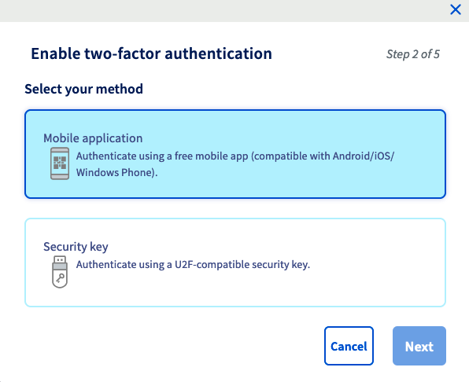
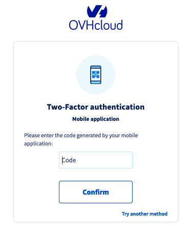

## Objective

OVHcloud offers tools to enhance the security of your account and services.
You can enable two-factor authentication (2FA) on your OVHcloud account. This two-factor authentication is added to your username/password pair, and is managed from a device you own: a phone, tablet, or security key.

**Find out more about the two-factor authentication methods available, and how to enable them.**

This guide will help you:

- [Understand the different two-factor authentication methods](#instructions)
- [Enable your first two-factor authentication method](#enabling-2fa)
- [Find out how to log in with two-factor authentication](#login-2fa)
- [Find out what to do if your phone/tablet/key is lost/stolen/damaged](#lost-device)
- [Find out how to disable two-factor authentication completely](#desactivation)

## Requirements

- Access to the [OVHcloud Control Panel](https://ca.ovh.com/auth/?action=gotomanager&from=https://www.ovh.com.au/&ovhSubsidiary=au)
- A phone (for the SMS method), a smartphone or tablet (for the mobile application method), or a Universal Second Factor (U2F) security key
- An understanding of the [password management recommendations for accessing your account](/pages/account_and_service_management/account_information/manage-ovh-password)

## Instructions 

You can enable one or more two-factor authentication methods to secure and control access to your Control Panel.

We offer three different methods (click on the tabs below to view their presentation):

> [!tabs]
> Mobile App
>> 
>> For this method, you will need to install an **OTP** application on your Android or iOS smartphone or tablet.
>> Many OTP applications exist (no OTP applications have been developed by OVHcloud) and can be downloaded from the Google Play Store for Android or from the Apple Store for iOS. The following two applications are free:
>>
>> - FreeOTP for Android
>> - OTP Auth for iOS
>>
>> Once the application is linked to your OVHcloud account, the application generates a one-time code that is valid for a short period of time (a few seconds) each time you try to log in.
>>
>> > [!success]
>> > **Advantages of this method**:
>>>
>> > - Once you have linked the application to your account for the first time, you no longer need to be connected to the internet on your smartphone/tablet for the codes to be generated.
>> > - You can use a single OTP application for all of your services or sites that require two-factor authentication.
>>
> Security key
>> 
>> For this method, you must have a **U2F** physical key that you plug into a USB port on your computer each time you log in to your OVHcloud account. The authentication is then carried out automatically. 
>>
>> This method offers a higher level of security as it is based on an independent security equipment, totally separate from your computer, smartphone or tablet, and which is less exposed to the risk of hacking.
> Backup codes
>> 
>> When you configure two-factor authentication (via **SMS**, **Mobile App** or **Security Key**) for the first time, you will see 10 **single-use backup codes** displayed in the Control Panel.
>>
>> This two-factor authentication method complements an already activated method (via **SMS**, **Mobile Application** or **Security key**). It cannot be activated alone.
>>
>> Each time you try to log in, you can enter one of the 10 one-time codes.
>> It is essential to always have at least 1 remaining backup code. Remember to regenerate them via the OVHcloud Control Panel if you have used all of them, or if you have lost them.

### Step 1 - Enable your first two-factor authentication method 

Log in to the [OVHcloud Control Panel](https://ca.ovh.com/auth/?action=gotomanager&from=https://www.ovh.com.au/&ovhSubsidiary=au){.external}, click your name in the top right-hand corner (1), then click your initials (2). Then click `Security`{.action} (3) and finally `Enable two-factor authentication`{.action} (4).

{.thumbnail}

**Click on the tab corresponding to the method of your choice:**

> [!tabs]
> Mobile App
>> Choose the method by mobile application and click `Next`{.action}.
>>
>>{.thumbnail width="400"} 
>> A QR code is generated, scan it via your OTP application. If your OTP application does not offer this option, click `Show secret`{.action} to display a code to enter into the OTP application. 
>> Your application then generates a one-time code.
>> Enter this code in the field to the right of the QR code. You can also add a description for this authentication method.
>>
>>{.thumbnail width="400"} 
>> Two-factor authentication is now enabled.
> Security key
>> Choose the security key method and click `Next`{.action}.
>>
>>{.thumbnail width="400"} 
>> Plug in your security key when prompted. If it has a button, press it.
>>
>>{.thumbnail width="400"}
>>
>> > [!warning]
>> > A pop-up window will open, prompting you to validate the key. If you don't see this window appear, make sure your browser isn't blocking pop-ups.
>>
>> Once the key is recognized, you can also add a description.
>> Two-factor authentication is now enabled.

Once you have added the first method, you can also **add one or two other methods** to give you multiple ways of logging in to your account.

### Step 2 - Save backup codes 

When you add two-factor authentication for the first time, you will see 10 one-time **backup codes** displayed in the OVHcloud Control Panel.

**Please keep them safe**. We recommend saving them in a password manager, such as [KeePass](https://keepass.info/){.external} or [Bitwarden](https://bitwarden.com/) (both applications are free).

{.thumbnail width="544"}

You can regenerate or delete backup codes from your Control Panel:

{.thumbnail}

> [!warning]
>
> It is **strongly recommended that you save these backup codes** and ensure that they are valid.
> If you don't have a security code and your phone/smartphone/tablet or security key is lost or stolen, access to your Control Panel and your services may be blocked.
>

### Step 3 - Log in to the OVHcloud Control Panel with two-factor authentication 

Go to the [login page for the OVHcloud Control Panel](https://ca.ovh.com/auth/?action=gotomanager&from=https://www.ovh.com.au/&ovhSubsidiary=au){.external} and enter your ID (or primary email address) and password.

The login screen displays the last two-factor authentication method used or entered. If you would like to use another method, click the `Try another method`{.action} button.

{.thumbnail width="400"}

All the methods you have enabled will then appear, including the backup codes method.

{.thumbnail width="400"}

By choosing this last method, you just need to enter one of your backup codes.

{.thumbnail width="400"}

> [!primary]
>
> The two-factor authentication method via SMS is only available for OVHcloud accounts in Europe.

### What do I do if I lose one of my devices, or if it stops working? 

If your device (mobile phone/smartphone/security key) is lost, stolen or no longer works, you can:

- use the active [backup codes](#codes) that you have backed up.
- use another two-factor authentication device, if you have enabled several.
- [disable two-factor authentication](#disable-2fa).

> [!warning]
>
> If one of your devices has been lost or stolen, this can compromise the security of your OVHcloud account.
> Once you regain access to your Control Panel, you must **remove this device from the list of devices used for two-factor authentication**.
>
> See the next chapter of this guide for details on removing a device.
>

#### Remove a device linked to two-factor authentication  

> [!warning]
>
> Before removing a device, and in order not to block access to your account, please check that you have:
>
> - another functional device;
> - another functional two-factor authentication method;
> - valid backup codes.
>

To remove a device, log in to your [OVHcloud Control Panel](https://ca.ovh.com/auth/?action=gotomanager&from=https://www.ovh.com.au/&ovhSubsidiary=au){.external}. Click your name in the top right-hand corner, then click your initials.

Next, click `Security`{.action} then the `...`{.action} button to the right of the device you want to delete, then click `Delete`{.action}.

{.thumbnail}

A final validation code will then be sent to the device you want to delete. Enter this code in the window that opens, then click `Confirm`{.action} to complete the deletion.

If you no longer have access to the device you want to delete, you cannot delete it yourself from the OVHcloud Control Panel.
In this case, **contact our support teams directly** by [creating a ticket from the Help Center](https://help.ovhcloud.com/csm?id=csm_get_help) or by following the process described [below](#2FA-deletion).

> [!warning]
>
> Removing a single device does not disable two-factor authentication on your OVHcloud account.

### Disabling two-factor authentication completely 

#### If you still have access to your OVHcloud Control Panel

To disable two-factor authentication completely on your OVHcloud account, you will need to delete **all** of the devices entered, **and also disable the emergency codes**.

To remove each device, please refer to the dedicated [part of this guide](#delete-device).

Once you have removed all your devices, disable the emergency codes by clicking the `Disable 2FA codes`{.action}  button.

{.thumbnail}

#### If you no longer have access to your OVHcloud Control Panel 

If you no longer have valid devices and if you no longer have valid emergency codes, you can request two-factor authentication to be disabled by contacting our support teams.

Before contacting us, you must gather the following documents:

|OVHcloud account type|Needed documents|
|---|---|
|Private individual|- Proof of identity (identity card, driving licence, passport) mentioning full name, date of birth and expiry date, in the name of the OVHcloud account holder  - One proof of address corresponding to the one registered in the OVHcloud account, less than two months old **If, following a move, you have not updated your address in your OVHcloud Control Panel, you will need to provide:** - A proof of address at the old address - A proof of address at the new address, less than two months old If you are now living with a third party, you will need to provide: - A proof of address in the name of the person hosting you, less than two months old - A certificate of accommodation signed by the person hosting you|
|Company|- Proof of identity (identity card, driving licence, passport) mentioning full name, date of birth and expiry date, in the name of the OVHcloud account holder, or in the name of a person authorized to represent the company.  - One proof of address for the company, corresponding to the one registered in the OVHcloud account, less than two months old. |

Once you have gathered your supporting documents, contact our OVHcloud support teams:

- UK: +44333 370 0425
- Ireland: +353 (0) 1 691 72 83
- Canada: 1-855-684-5463
- Australia: 1300 OVH AUS (684 287) (Calling from overseas? Dial +61 3 83 758 172)
- India: 000 800 040 4567
- Singapore: +65 6962 8979
- Asia: +65 6962 8978

> [!warning]
>
> Your documents must be sent to us from an email address **registered in your OVHcloud account**.

After verifying your documents, a support agent will manually disable two-factor authentication on your OVHcloud account and get back to you once done.

As a matter of security, once the access is regain, we recommend that you re-enable two-factor authentication on your account as soon as possible.

## Go further

For specialised services (SEO, development, etc.), contact [OVHcloud partners](https://partner.ovhcloud.com/en-au/directory/).

If you would like assistance using and configuring your OVHcloud solutions, please refer to our [support offers](https://www.ovhcloud.com/en-au/support-levels/).

Join our community of users on <https://community.ovh.com/en/>.