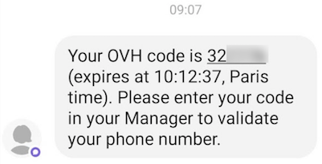
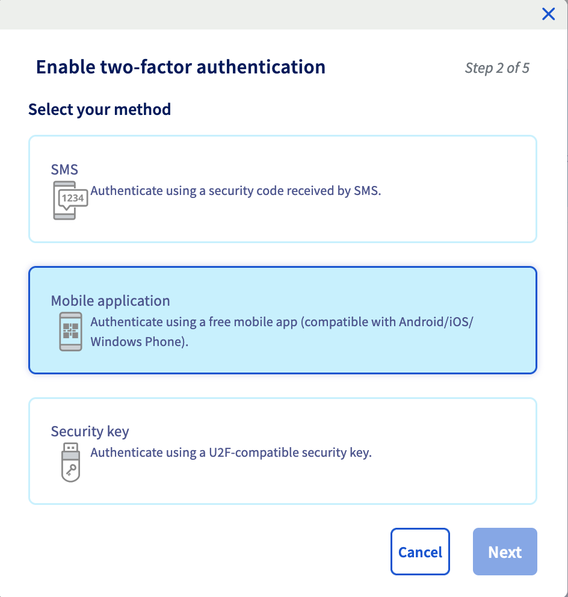
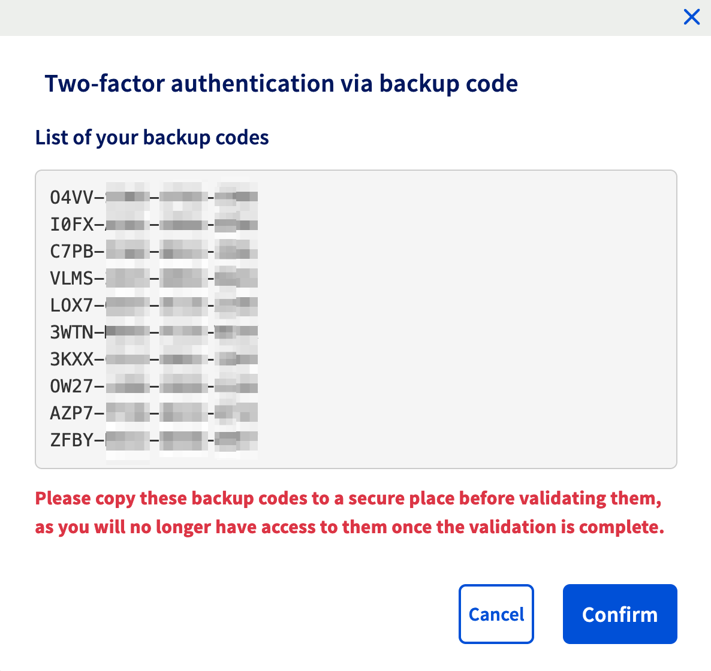

> [!primary]
> Questa traduzione è stata generata automaticamente dal nostro partner SYSTRAN. I contenuti potrebbero presentare imprecisioni, ad esempio la nomenclatura dei pulsanti o alcuni dettagli tecnici. In caso di dubbi consigliamo di fare riferimento alla versione inglese o francese della guida. Per aiutarci a migliorare questa traduzione, utilizza il pulsante "Contribuisci" di questa pagina.
>

## Obiettivo

OVHcloud mette a disposizione gli strumenti per rafforzare la sicurezza del tuo account e dei tuoi servizi.
Hai la possibilità di attivare un’autenticazione a due fattori (2FA) che si aggiunge alle tue credenziali di accesso (nome utente e password) ed è gestita dal tuo dispositivo: telefono, tablet o chiave di sicurezza. 

**Questa guida ti mostra i diversi metodi di autenticazione a due fattori e come attivarli.**

Questa guida ti mostra come:

- [Comprendere i diversi metodi di doppia autenticazione](#instructions)
- [Attivare il primo metodo di doppia autenticazione](#enabling-2fa)
- [Scopri come connettersi con l’autenticazione a due fattori](#login-2fa)
- [Procedura da seguire in caso di smarrimento del telefono/tablet/chiave/furto/danneggiamento](#lost-device)
- [Sapere come disattivare completamente l’autenticazione a due fattori](#disable-2fa)

## Prerequisiti

- Avere accesso allo [Spazio Cliente OVHcloud](https://www.ovh.com/auth/?action=gotomanager&from=https://www.ovh.it/&ovhSubsidiary=it)
- Disporre di un cellulare (per il metodo SMS), uno smartphone o un tablet (per il metodo applicazione mobile) o una chiave di sicurezza Universal Second Factor (U2F).
- Aver letto i [consigli su come gestire la password di accesso al tuo account](/pages/account_and_service_management/account_information/manage-ovh-password).

## Procedura 

Puoi attivare uno o più metodi di autenticazione a due fattori per proteggere e controllare l’accesso al tuo Spazio Cliente.

Ti proponiamo quattro diversi metodi (clicca sulle schede qui sotto per visualizzare la loro presentazione):

> [!tabs]
> SMS
>> 
>> Per questo metodo, inserisci il tuo numero di cellulare.
>> Ad ogni tentativo di connessione al tuo account OVHcloud ti viene inviato un codice monouso via SMS.
>>
>> Il vantaggio principale di questo metodo è quello di utilizzare un codice inviato su un dispositivo diverso dal computer. In caso di intrusione sul sito, ad esempio tramite un malware, l’account resterà sicuro.
>> È tuttavia necessaria una copertura di rete sufficiente per ricevere gli SMS.
>>
> Applicazione mobile
>> 
>> Per questo metodo, è necessario installare un'applicazione **OTP** sul tuo smartphone o tablet Android o iOS.
>> Esistono numerose applicazioni OTP (OVHcloud non ha sviluppato alcuna applicazione OTP) da scaricare da Google Play Store per Android o da Apple Store per iOS. Le due applicazioni seguenti sono gratuite:
>>
>> - FreeOTP per Android
>> - OTP Auth per iOS
>>
>> Una volta associata l’applicazione al tuo account OVHcloud, l’applicazione genera un codice monouso valido per un breve lasso di tempo (alcuni secondi) ad ogni tentativo di connessione.
>>
>> > [!success]
>> > **Vantaggi di questo metodo**:
>> >
>> > - Una volta effettuata la prima associazione dell'applicazione al tuo account, non è più necessario essere connessi a Internet sul tuo smartphone/tablet perché i codici siano generati.
>> > - Puoi utilizzare una sola applicazione OTP per tutti i tuoi servizi o siti che richiedono la doppia autenticazione.
>>
> Chiave di sicurezza
>> 
>> Per utilizzare questo metodo, è necessario disporre di una chiave fisica **U2F** che si collega a una porta USB del computer ogni volta che si accede al proprio account OVHcloud. L’autenticazione avviene quindi automaticamente.
>>
>> Questo metodo offre un livello di sicurezza più elevato perché si basa su un dispositivo di sicurezza indipendente, completamente separato dal vostro computer, smartphone o tablet e che è meno esposto al rischio di pirateria.
> Codici di sicurezza
>> 
>> La prima volta che configuri un’autenticazione a due fattori (con **SMS**, **Applicazione mobile** o **Chiave di sicurezza**), vengono visualizzati nello Spazio Cliente 10 codici di sicurezza **monouso**.
>>
>> Questo metodo di doppia autenticazione integra un metodo già attivo (con **SMS**, **Applicazione mobile** o **Chiave di sicurezza**) e non può essere attivato da solo.
>>
>> Ad ogni tentativo di connessione, potete inserire uno dei 10 codici monouso.
>> È fondamentale avere sempre a disposizione almeno un codice di sicurezza residuo. Ricordati di rigenerarli dal tuo Spazio Cliente se li hai utilizzati tutti o se li hai persi.

### Step 1 - Attiva il primo metodo di doppia autenticazione 

Accedi allo [Spazio Cliente OVHcloud](https://www.ovh.com/auth/?action=gotomanager&from=https://www.ovh.it/&ovhSubsidiary=it){.external}, clicca sul tuo nome in alto a destra (1) e poi sulle tue iniziali (2). Clicca su `Sicurezza`{.action} (3) e infine su `Attiva l'autenticazione a due fattori`{.action} (4).

{.thumbnail}

**Clicca sulla scheda corrispondente al metodo che preferisci:**

> [!tabs]
> SMS
>> Scegli il metodo SMS e clicca su `Continua`{.action}.
>>
>>{.thumbnail width="400"} 
>> Inserisci il tuo numero di cellulare nel formato internazionale (ad esempio, +33612345678 per un telefono cellulare in Francia) e conferma.
>> Un codice di conferma viene inviato via SMS al numero indicato.
>>
>>{.thumbnail width="400"} 
>> Inserisci il codice nel campo previsto. 
>> Potete anche aggiungere una descrizione per il numero di telefono inserito.
>>
>>{.thumbnail width="400"} 
>> L’autenticazione a due fattori è attiva. ed è possibile aggiungere altri numeri.
> Applicazione Mobile
>> Scegli il metodo applicazione mobile e clicca su `Continua`{.action}.
>>
>>{.thumbnail width="400"} 
>> Viene generato un codice QR, scansionalo tramite l’applicazione OTP. Se l’applicazione OTP non dispone di questa opzione, clicca su `Mostra il codice segreto`{.action} per visualizzare il codice da inserire nell’applicazione OTP. 
>> L’applicazione genera un codice monouso.
>> Inserisci il codice nel campo previsto (a destra del QR code). È inoltre possibile aggiungere una descrizione per questo metodo di autenticazione.
>>
>>{.thumbnail width="400"} 
>> L’autenticazione a due fattori è attiva.
> Chiave di sicurezza
>> Seleziona il metodo con chiave di sicurezza e clicca su `Continua`{.action}.
>>
>>{.thumbnail width="400"} 
>> Collega la chiave di sicurezza quando richiesto. Se è presente un pulsante, premerlo.
>>
>>{.thumbnail width="400"}
>>
>> > [!warning]
>> > Si aprirà una finestra di tipo pop-up in cui verrà richiesto di confermare la chiave. Se non vedi questa finestra, verifica che il tuo browser non blocchi i pop-up.
>>
>> Una volta riconosciuta la chiave, potete anche aggiungere una descrizione.
>> L’autenticazione a due fattori è attiva.

Una volta aggiunto il primo metodo, **aggiungi uno o due altri metodi** per avere più modi per accedere al tuo account.

### Step 2 - salvare i codici di sicurezza 

Quando aggiungi per la prima volta un metodo di autenticazione a due fattori, nello Spazio Cliente vengono visualizzati 10 codici di sicurezza** monouso.

**Conservali con cura**. Ti consigliamo di salvarli con un gestore di password, come [KeePass](https://keepass.info/){.external} o [Bitwarden](https://bitwarden.com/) (queste due applicazioni sono gratuite).

{.thumbnail width="544"}

I codici di sicurezza possono essere rigenerati o eliminati direttamente dallo Spazio Cliente:

{.thumbnail}

> [!warning]
>
> È **Consigliabile salvare i codici di sicurezza** e assicurarsi che siano validi.
> Senza codice di sicurezza in vostro possesso e in caso di furto o perdita del vostro telefono/smartphone/tablet o della vostra chiave di sicurezza, l'accesso al vostro spazio cliente e ai vostri servizi potrebbe essere bloccato.
>

### Step 3 - Accedi allo Spazio Cliente OVHcloud con la doppia autenticazione 

Accedi alla [pagina di accesso allo Spazio Cliente OVHcloud](https://www.ovh.com/auth/?action=gotomanager&from=https://www.ovh.it/&ovhSubsidiary=it){.external} e inserisci identificativo (o indirizzo email principale) e password.

Nella schermata di login viene visualizzato l’ultimo metodo di autenticazione a due fattori utilizzato o inserito. Per utilizzarne un altro, clicca sul pulsante `Prova un altro metodo`{.action}.

{.thumbnail width="400"}

A questo punto compariranno tutti i metodi attivati, incluso il metodo dei codici di sicurezza.

{.thumbnail width="400"}

Scegliendo quest’ultimo metodo, sarà sufficiente inserire uno dei codici di sicurezza.

{.thumbnail width="400"}

### Cosa fare se uno dei miei dispositivi viene perso/rubato o smette di funzionare? 

Se il dispositivo (telefono cellulare/smartphone/chiave di sicurezza) viene smarrito, rubato o non funziona più, è possibile:

- utilizzare [i codici di sicurezza](#codes) attivi di cui hai effettuato il backup;
- utilizzare un’altra periferica di doppia autenticazione a vostra disposizione, se ne avete attivati diversi;
- [disattivare l’autenticazione a due fattori](#disable-2fa).

> [!warning]
>
> In caso di furto o smarrimento di un dispositivo, la sicurezza dell’account OVHcloud potrebbe essere messa a repentaglio.
> Una volta ottenuto nuovamente l’accesso allo Spazio Cliente, è necessario **rimuovere questo dispositivo dall’elenco dei dispositivi utilizzati per la doppia autenticazione**.
>
> Per informazioni sulla rimozione di un dispositivo, vedere il capitolo successivo di questa guida.
>

#### Rimuovere una periferica 

> [!warning]
>
> Prima di rimuovere un dispositivo e per evitare di bloccare l'accesso al tuo account, assicurati di avere una di queste opzioni:
>
> - un altro dispositivo funzionante;
> - un altro metodo di doppia autenticazione valido;
> - codici di sicurezza validi.
>

Per rimuovere un dispositivo, accedi allo [Spazio Cliente OVHcloud](https://www.ovh.com/auth/?action=gotomanager&from=https://www.ovh.it/&ovhSubsidiary=it){.external}. Clicca sul tuo nome in alto a destra e poi sulle tue iniziali.

Clicca su `Sicurezza`{.action} e poi sui `...`{.action} a destra del dispositivo da rimuovere e infine su `Eliminare`{.action}.

{.thumbnail}

Verrà inviato un codice di conferma finale per il dispositivo da rimuovere. Inserisci il codice nella finestra che si apre e clicca su `Conferma`{.action} per completare l’eliminazione.

Se non hai più accesso al dispositivo che vuoi rimuovere, non puoi eliminarlo dallo Spazio Cliente OVHcloud.
In questo caso, **contatta direttamente** il nostro team di supporto [creando un ticket dal centro assistenza](https://help.ovhcloud.com/csm?id=csm_get_help) o seguendo il processo descritto [qui di seguito](#2FA-deletion).

> [!warning]
>
> L’eliminazione di un solo dispositivo non disattiva l’autenticazione a due fattori sul tuo account OVHcloud.

### Disattiva completamente la doppia autenticazione 

#### Se hai accesso allo Spazio Cliente OVHcloud

Per disattivare completamente la doppia autenticazione sul tuo account OVHcloud, è necessario eliminare **tutte** le periferiche **e disattivare anche i codici di backup**.

Per eliminare ogni periferica, consulta la [sezione dedicata di questa guida](#delete-device).

Una volta eliminati tutti i dispositivi, disattiva i codici di sicurezza cliccando sul pulsante `Disattiva i codici 2FA`{.action}.

{.thumbnail}

#### Se non hai più accesso allo Spazio Cliente OVHcloud 

Se non disponi più di periferiche valide e non disponi più di codici di sicurezza validi, puoi richiedere la disattivazione della doppia autenticazione contattando il nostro supporto.

Prima di contattarci, dovete raccogliere i seguenti elementi giustificativi:

|Tipo di account OVHcloud|Giustificativi da fornire|
|---|---|
|Privato|- Documento d'identità (carta d'identità, patente di guida, passaporto) con indicazione del nome completo, della data di nascita e di scadenza, a nome del titolare dell'account OVHcloud|
|Società|- Documenti d'identità di una persona autorizzata a rappresentare l'impresa (carta d'identità, patente di guida, passaporto) con indicazione del nome completo, della data di nascita e di scadenza.  - Documenti comprovanti le coordinate della società e la persona che rappresenta la società.|

Una volta raccolti i giustificativi, contatta il supporto OVHcloud al +39 02 5560 0423. 

> [!warning]
> I giustificativi da inviare devono provenire da un indirizzo email registrato sul tuo account OVHcloud.

Dopo aver verificato i documenti, un consulente può disattivare manualmente la doppia autenticazione sul tuo account OVHcloud.

## Per saperne di più

Per prestazioni specializzate (referenziamento, sviluppo, ecc...), contatta i [partner OVHcloud](https://partner.ovhcloud.com/it/directory/).

Per usufruire di un supporto per l'utilizzo e la configurazione delle soluzioni OVHcloud, è possibile consultare le nostre soluzioni [offerte di supporto](https://www.ovhcloud.com/it/support-levels/).

Contatta la nostra Community di utenti all'indirizzo <https://community.ovh.com/en/>.