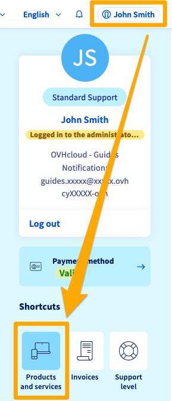
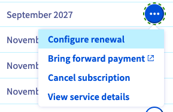
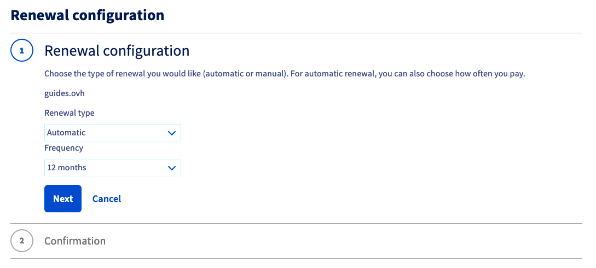
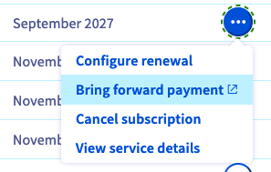
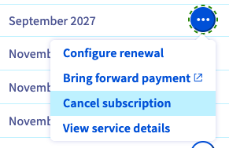
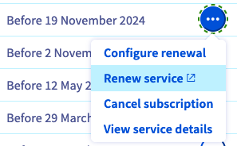
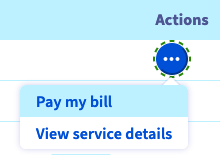
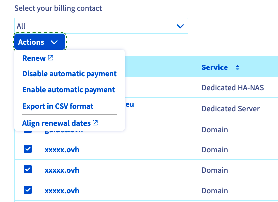

## Objective

The **My services** menu in the OVHcloud Control Panel allows you to check the status of your services, renew them, modify their renewal type, pay your bills, or pay in advance.

This guide will help you to:

- [Understand the differences between automatic and manual renewal](#auto-vs-manual)
- [Determine what type of renewal is applied to your services](#renewal-type)
- [Find out what actions you can take for each of your services](#actions)
- [Find out which actions can be grouped on multiple services](#group-actions)

**This guide explains how to manage your services and their renewal via the OVHcloud Control Panel.**

> [!primary]
>
> Depending on your place of residence, local legislation, and the solutions concerned, the details in this guide may vary or not apply to your situation. For further information, please refer to your OVHcloud contracts via the [OVHcloud Control Panel](https://www.ovh.com/auth/?action=gotomanager&from=https://www.ovh.co.uk/&ovhSubsidiary=GB): Click on your name in the top right-hand corner of your screen, then `Products and services`{.action}, then the `Contracts`{.action} tab.
>

<iframe width="560" height="315" src="https://www.youtube-nocookie.com/embed/dfpPCa0mUyo" frameborder="0" allow="accelerometer; autoplay; encrypted-media; gyroscope; picture-in-picture" allowfullscreen></iframe>

## Requirements

- You have access to your [OVHcloud Control Panel](https://www.ovh.com/auth/?action=gotomanager&from=https://www.ovh.co.uk/&ovhSubsidiary=GB).
- Your OVHcloud services are active.
- You are the [billing contact](/pages/account_and_service_management/account_information/managing_contacts#definition) of your OVHcloud services.
- You have a valid payment method in your OVHcloud account (see our guide [Managing your payment methods](/pages/account_and_service_management/managing_billing_payments_and_services/manage-payment-methods)).

## The different types of renewal

**Click on the tabs below.**

> [!tabs]
> **Automatic renewal**
>>
>> When you subscribe your services, they are set to **automatic renewal** as the default mode. This ensures that your services are systematically renewed when the subscription expires.
>> Example: You subscribed to a Web Hosting plan on 15 January 2024. It will be automatically renewed on 15 January 2025 and the amount corresponding to its annual subscription will be debited from your default payment method.
>>
>> If you have registered a payment method in the OVHcloud Control Panel, it will be used to pay for your bills automatically.
>> If you have not registered a [payment method](/pages/account_and_service_management/managing_billing_payments_and_services/manage-payment-methods), you will be sent an invoice via email. You will then need to pay it via an online form.
>>
>> For services with an automatic renewal frequency higher than 1 month (3 months, 6 months, 12 months), you will also be sent an email reminder the month before, listing the services that will need to be renewed soon.
>>If you do not want to extend one of these services, you just have to [cancel it in your OVHcloud Control Panel](/pages/account_and_service_management/managing_billing_payments_and_services/how_to_cancel_services).
>>
>> **Warning**: The absence of a payment method in your account does not trigger an automatic cancellation of your services. To cancel services, please read our guide on [Cancelling OVHcloud services](/pages/account_and_service_management/managing_billing_payments_and_services/how_to_cancel_services) .
>>
> **Manual renewal**
>>
>> If you do not want automatic renewal and therefore direct debit, you can change the renewal type for certain products (Domains, Hosting plans, VPS, Dedicated Servers) and switch them to **manual renewal**.
>>
>> This renewal method may be useful if:
>>
>> - You are not sure whether you want to keep the service after its expiry date.
>> - You do not want your bills to be debited automatically from your payment method.
>>
>> If you choose manual renewal, you will receive several reminders by email before the expiry date, each containing a link to renew services online when they expire.
>> You can also pay via the OVHcloud Control Panel.
>>
>> **Warning**, if you do not pay for a service that is renewed manually, it will be **suspended** on its expiry date, then **deleted** after a few days.
>> However, if you do not wish to keep this service, you do not need to request its cancellation.

## Instructions

Log in to your [OVHcloud Control Panel](https://www.ovh.com/auth/?action=gotomanager&from=https://www.ovh.com/en/&ovhSubsidiary=en). 
Click your name in the top right-hand corner, then choose `Products and services`{.action}.

{.thumbnail}

### Display renewal type 

The **My services** page contains a table for managing your OVHcloud services. You can find their names, the type of service, service availability (`Active` by default), its status (renewal type, action to be taken, etc.), the next renewal or cancellation date of effect, and a `...`{.action} button dedicated to the possible actions for each service.

{.thumbnail}

> [!success]
> Sorting, filtering, and searching tools are available above the table.
> You can sort the columns in ascending or descending order, search for the name of one of your services, or apply a filter to display only some of your services according to the criteria of your choice.
>
> Your filter criteria will then be displayed above the table. Here is an example of a filter that can be used to display domain names that are renewed manually and have a subscription end date that expires before one month.
>
> {.thumbnail}

### Actions for each service

> [!primary]
>
> Depending on the service and its eligibility to manual renewal, some actions may not be available.
>

To the right of a service, click the `...`{.action}' button in the `Actions` column, then click on the action you want to perform.

{.thumbnail}

**Each action is detailed in one of the tabs below.**

> [!tabs]
> **Configure renewal**
>>
>>{.thumbnail}
>>
>> Click the `Configure renewal`{.action} action. Depending on the service you have chosen, you can set it to manual renewal, or choose the automatic renewal frequency.
>>
>>{.thumbnail}
>>
>> Depending on your choice, you will be given information on future payment dates, the payment method that will be used, and the service’s expiry date.
>>
> **Bring forward payment**
>>
>>{.thumbnail}
>>
>> This action is available for services with **automatic renewal**.
>>
>> You will be redirected to an online payment interface.
>>
>> You can renew these services at any time before their expiry, as well as choose the renewal duration.
>> In this case, the duration of validity subscribed to will be added to the current validity period. You will not lose any remaining validity time.
>>
> **Cancel subscription**
>>
>>{.thumbnail}
>>
>> This action is available for services set to **automatic renewal**.
>>
>> When choosing this action, automatic payment and renewal will be disabled for the service you have selected.
>>
>> For more information on cancelling OVHcloud services, follow the instructions in our guide **[How to cancel your OVHcloud services ](/pages/account_and_service_management/managing_billing_payments_and_services/how_to_cancel_services)**.
>>
> **Renew service**
>>
>>{.thumbnail}
>>
>> This action is only available for services with **manual renewal**.
>>
>> You will then be redirected to an online payment interface.
>> You can renew these services at any time before their expiry, as well as choose the renewal duration.
>>
> **Pay my bill**
>>
>>{.thumbnail}
>>
>> A `Bill to pay` statement is displayed when an invoice is awaiting payment and when:
>>
>> - You have services that renew automatically.
>> - You have not registered a payment method that can be used to pay your bills.
>>
>> Simply click the `Pay my bill`{.action} action, which will redirect you to an online payment platform.
>>

### Bulk actions

You can perform group actions by selecting several services in the table, then clicking on the `Actions`{.action} button.

{.thumbnail}

The table below details the possible group actions.

|Possible actions|Description|
|---|---|
|Renew|Renew several services at once. You will be redirected to a page where you can choose the renewal duration you want, and pay online.|
|Disable automatic payment|Disable automatic payment for several services at once. If one or more of your services cannot be set to automatic renewal, this will be flagged when you confirm.|
|Enable automatic payment|Enable automatic payment for several services at once. Only eligible services will be updated.|
|Export as CSV|Export all of your services and their expiry dates into a csv-formatted file.|
|Align renewal dates|Aligns the expiry dates for your services on a single calendar day. Only eligible services can be updated.|

## FAQ

> [!faq]
>
> I am asked to enter an account ID and password when I want to anticipate payment for my service. What is the account ID?
>> The username, account ID or NIC handle is your OVHcloud customer ID, which is in the form of **xx11111-ovh**. The password requested is the password for accessing your OVHcloud account. If you have forgotten it, set up a new password by following [these instructions](/pages/account_and_service_management/account_information/manage-ovh-password).
> Where can I find my OVHcloud customer ID?
>> It is displayed in the OVHcloud Control Panel by clicking on your name in the top right-hand corner. It is also listed in the top right-hand corner of all your bills. It is also included in the account creation confirmation email, order confirmation emails, renewal emails, and account login notifications.
> I can't log in to my OVHcloud account to renew my services. What should I do?
>> Refer to the [What do I do if I can't log in?](/pages/account_and_service_management/account_information/ovhcloud-account-login#login-failure) section of our guide “[Logging in to the OVHcloud Control Panel](/pages/account_and_service_management/account_information/ovhcloud-account-login)”.
> I want to enable automatic renewal, but I get an error message. What should I do?
>> To enable automatic renewal on your services, you must have added a valid payment method to your OVHcloud account. If this is not the case, or if the payment method has expired, an error message will appear in the OVHcloud Control Panel when you try to enable automatic renewal. Please refer to our guide on [Managing your payment methods](/pages/account_and_service_management/managing_billing_payments_and_services/manage-payment-methods) to add a payment method or check the current method's status.
> My payment method has expired. How do I add a new payment method?
>> Refer to our guide on [Managing your payment methods](/pages/account_and_service_management/managing_billing_payments_and_services/manage-payment-methods). Before you can delete an obsolete payment method, you will need to add a new valid payment method into your OVHcloud account.
> I forgot to renew my domain name in time, what should I do?
>> Start by checking the domain name’s status using the [WHOIS domain name tool](https://www.ovhcloud.com/en-gb/domains/whois/).
>> If it is a generic domain name (.com, .org, .net, etc.), it remains reserved for a "grace period" (approximately 7 days), followed by a "redemption period" (approximately 35 to 40 additional days). These delays vary, and depend on the extension and the rules of the registry that owns the extension. During these two periods, only you will be able to renew the domain name.
>> During the grace period, you can renew it via the OVHcloud Control Panel by following the steps in this guide.
>> During the redemption period, the domain is no longer managed by OVHcloud. Renewal via the OVHcloud Control Panel will incur an additional fee (this will vary depending on the extension).
>> After the redemption period, the domain name will enter a deletion phase that can take several days, before becoming public again. If you would like to use it again, we recommend using the [WHOIS domain name tool](https://www.ovhcloud.com/en-gb/domains/whois/) to check its availability regularly.
> I do not want to renew my domain name, but transfer it to a registrar other than OVHcloud. How do I do this?
>> Follow the instructions in our guide “[Transferring a domain name to another registrar](/pages/web_cloud/domains/transfer_outgoing_domain)”.
> I no longer want to pay by direct debit, but I do not want to cancel my service. What should I do?
>> If your service allows it, you can use the [Configure renewal](#actions) action and choose a manual renewal.
> I have renewed my service for 12 months. Can I change my mind?
>> Once a service has been renewed, this renewal cannot be cancelled. You can still choose another renewal type or cancel the service, but these 2 options will only be taken into account at the end of the current subscription, i.e. after the 12 months.
> My website is suspended because I did not renew my services in time. I just did a renewal of my services. How long do I have to wait for my website to be accessible again?
>> The recovery time will vary depending on the services concerned.
>> If only your Web Hosting plan was suspended and renewed, you will need to wait an average of 2 hours for your website to be accessible again.
>> If your domain name was also suspended and has been renewed, the delay may be longer, and may take up to 48 hours, corresponding to the DNS propagation delay.
>> To protect your critical services from becoming inaccessible, we recommend to prioritise automatic renewal and to [check regularly that your payment methods are up to date](/pages/account_and_service_management/managing_billing_payments_and_services/manage-payment-methods).

## Go further

This guide did not answer your question? View our [Billing and Payment FAQ](/pages/account_and_service_management/managing_billing_payments_and_services/faq-billing)

[Manage your payment methods](/pages/account_and_service_management/managing_billing_payments_and_services/manage-payment-methods)

[How to cancel OVHcloud services](/pages/account_and_service_management/managing_billing_payments_and_services/how_to_cancel_services)

[Public Cloud billing information](/pages/public_cloud/compute/analyze_billing)

[Manage billing for your Exchange accounts](/pages/web_cloud/email_and_collaborative_solutions/microsoft_exchange/manage_billing_exchange)

Join our community of users on <https://community.ovh.com/en/>.
