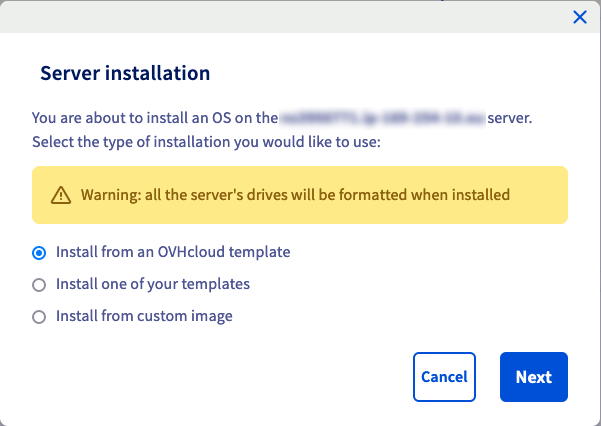

## Objective

With [OVHcloud Dedicated Servers](https://www.ovhcloud.com/en-gb/bare-metal/), you can [configure partitioning](/pages/bare_metal_cloud/dedicated_servers/partitioning_ovh). This gives the customer a very wide freedom for all OSs except for ESXi OSs because of their specificities: UNIX based and proprietary OS with a proprietary installer. OVHcloud is therefore dependent of the software editor for the OS installation. Since ESXi 7.0 it's possible to choose between 4 different pre-defined partitioning layouts. This article will show you how to choose a different partitioning layout in the [OVHcloud Control Panel](https://ovh.com/manager/#/dedicated/configuration) or via the [OVHcloud API](https://api.ovh.com/).

> [!primary]
>
> ESXi 7.0 is often used as an example but this documentation is valid for any further versions of ESXi 7.0 as well.
>

## Requirements

- A [dedicated server](https://www.ovhcloud.com/en-gb/bare-metal/) **ready to be installed/re-installed** in your OVHcloud account that is compatible with ESXi, whatever the version is.
- Access to the [OVHcloud Control Panel](https://ovh.com/manager/#/dedicated/configuration) and/or the [OVHcloud API](https://api.ovh.com/).

> [!alert]
>
> Reinstalling a dedicated server deletes all data currently stored on it.
>

## Instructions

ESXi 7.0 has introduced a [boot option to configure the size of ESXi system partitions](https://kb.vmware.com/s/article/81166). This feature has been introduced by the software editor because some customers complained about the useless presence of a datastore that fills all the remaining space of the installation disk or an OS that uses an oversized system partition. OVHcloud is now offering this feature that is available via the [OVHcloud Control Panel](https://ovh.com/manager/#/dedicated/configuration) and/or the [OVHcloud API](https://api.ovh.com/).

Despite your server has several disks, the ESXi OS installation is only on the first disk of the targeted disks group (see [Choosing the disk group to install an operating system](/pages/bare_metal_cloud/dedicated_servers/install_hybrid)), other disks can be configured afterwards by the user to be used for virtual machines (see [how to add a datastore](/pages/bare_metal_cloud/hgrstor2_system_configuration#add-datastore)).

There are 4 different values:

|Value|System size¹|Datastore³|
|---|---|---|
|`default`|130 GiB|all remaining space²|
|`min`|32 GiB|all remaining space²|
|`small`|64 GiB|❌⁴|
|`max`|all available space²|❌⁴|

¹ On the first disk of the targeted disks group for the OS installation.<br />
² Space of the disk in which the OS will be installed.<br />
³ A datastore is a disk partition (sometimes also called "container") that ESXi will use to store the virtual machines. [More details](https://docs.vmware.com/en/VMware-vSphere/7.0/com.vmware.vsphere.storage.doc/GUID-5EE84941-366D-4D37-8B7B-767D08928888.html).<br />
⁴ Customers can still [add a datastore](/pages/bare_metal_cloud/hgrstor2_system_configuration#add-datastore) afterwards but on the other disks.<br />

As you can see, all the space of that installation disk is used except for the `small` partitioning layout.

> [!primary]
>
> Did you know ?
> [VMware on OVHcloud solutions](https://www.ovhcloud.com/en-gb/hosted-private-cloud/vmware/) are based on ESXi with the partitioning layout `small`.
>

### How to select the partitioning scheme ?

As you can guess, if no partitioning scheme is provided, the `default` partitioning scheme will be used.

#### Via the OVHcloud Control Panel

> [!primary]
>
> The procedure is very similar [to other Operating Systems](/pages/bare_metal_cloud/dedicated_servers/getting-started-with-dedicated-server), with the exception that you cannot tick the checkbox `Customise the partitioning configuration`{.action} and that you have a dropdown menu to choose the partitioning layout at the 4th and final step.
>

Log in to the [OVHcloud Control Panel](https://www.ovh.com/auth/?action=gotomanager&from=https://www.ovh.co.uk/&ovhSubsidiary=GB). From the `General information`{.action} tab, click the `...`{.action} button next to the Operating System and then click `Install`{.action}.

{.thumbnail}

In the popup window, select `Install from an OVHcloud template`{.action}

Click `Next`{.action} to continue.

{.thumbnail}

Then choose `Virtualisation`{.action}, `UNIX`{.action} and choose the version of ESXi you want to install on your dedicated server.

> [!primary]
>
> The `Customise the hardware RAID configuration`{.action} option is available only if your dedicated server has a hardware RAID controller.
>

> [!primary]
>
> As you can see, you cannot tick the `Customise the partition configuration`{.action} option, as explained above.
>

Choose the disk group on which you want ESXi to be installed. Note that only the first disk of this disk group will be used to install the OS. Find more information in [this guide](/pages/bare_metal_cloud/dedicated_servers/install_hybrid).

Click `Next`{.action} to continue.

{.thumbnail}

In the `Partitioning scheme`{.action} dropdown menu, select the partitioning scheme you want to have: the overview is updated as soon as you select another partitioning scheme, so you can get an idea of how your partitioning will look like on your dedicated server.

Fill in the other details and click `Confirm`{.action} to start the ESXi installation on your dedicated server.

> [!primary]
>
>  The `Number of disks partitioned`{.action} field is greyed out and set to 1, even if your server has more than 1 disk on the disks group target for OS installation, as explained above.
>

{.thumbnail}

#### Via the OVHcloud API

When triggering an OS installation, the customer can optionally provide a `partitionSchemeName` in order to specify which partitioning layout must be used:

> [!api]
>
> @api {POST} /dedicated/server/{serviceName}/install/start
>

Example of payload:

```json
{
    "templateName": "esxi70_64",
    "partitionSchemeName": "small",
    "userMetadata": []
}
```

To list the different available partitioning schemes for an OVHcloud template, you can use the following API call:

> [!api]
>
> @api {GET} /dedicated/installationTemplate/{templateName}/partitionScheme
>

For example, for `esxi70_64` it will return:

```json
[
"default"
"max"
"small"
"min"
]
```

In order to get the details of the partitioning scheme dynamically, you can use the following API call:

> [!api]
>
> @api {GET}  /dedicated/installationTemplate/{templateName}/partitionScheme/{schemeName}/partition
>

You can use the following API call to get the details for each partition:

> [!api]
>
> @api {GET}  /dedicated/installationTemplate/{templateName}/partitionScheme/{schemeName}/partition/{mountpoint}
>

## Go further <a name="gofurther"></a>

[Boot option to configure the size of ESXi system partitions](https://kb.vmware.com/s/article/81166)

[Getting started with a dedicated server](/pages/bare_metal_cloud/dedicated_servers/getting-started-with-dedicated-server)

[Getting started with a Kimsufi, So You Start or Rise dedicated server](/pages/bare_metal_cloud/dedicated_servers/getting-started-with-dedicated-server-eco)

[OVHcloud API & Partitioning](/pages/bare_metal_cloud/dedicated_servers/partitioning_ovh)

[Choosing the disk group to install an operating system](/pages/bare_metal_cloud/dedicated_servers/install_hybrid)

[Managing hardware RAID](/pages/bare_metal_cloud/dedicated_servers/raid_hard)

[Hot Swap - Hardware RAID](/pages/bare_metal_cloud/dedicated_servers/hotswap_raid_hard)

Join our community of users on <https://community.ovh.com/en/>.
