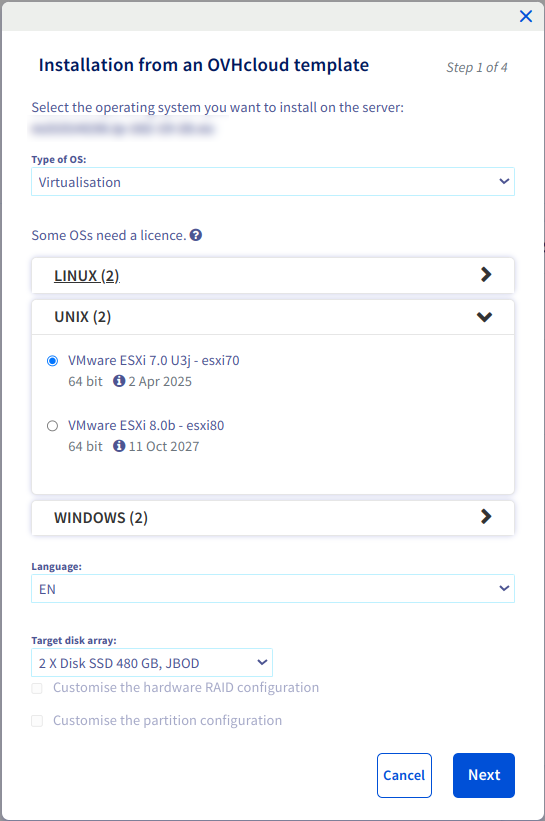

## Objectif

Avec les [serveurs dédiés](https://www.ovhcloud.com/fr/bare-metal/) OVHcloud, vous pouvez [personnaliser le partitionnement](/pages/bare_metal_cloud/dedicated_servers/partitioning_ovh). Cela donne au client des possibilités de configuration assez vastes pour tous les OSes à l'exception d'ESXi à cause de ses spécificités: système propriétaire UNIX avec un installateur propriétaire. OVHcloud est par conséquent depandant de l'éditeur pour l'installation de l'OS. Depuis ESXi 7.0, il est possible de choisir entre 4 schémas de partitionnement prédéfinis par l'éditeur. Cet article a pour objectif de vous montrer comment choisir un schéma de partitionnement dans l'[espace client OVHcloud](https://www.ovh.com/manager/#/dedicated/configuration) ou l’[API OVHcloud](https://api.ovh.com/).

> [!primary]
>
> ESXi 7.0 est souvent utilisé comme exemple sur cette page, mais la documentation est valable pour les versions 7.0 et ultérieures d'ESXi.
>

## Prérequis

* Un [serveur dédié](https://www.ovhcloud.com/fr/bare-metal/) **prêt à être installé/réinstallé** sur votre compte OVHcloud.
* Avoir accès à l'[API OVHcloud](https://api.ovh.com/).

> [!warning]
>
> La réinstallation d'un serveur dédié supprime toutes les données qui y sont actuellement stockées.
>

## En pratique

### Aperçu

ESXi 7.0 introduit une [option d'amorçage permettant de configurer la taille de la partition système ESXi [EN]](https://kb.vmware.com/s/article/81166). Cette fonctionnalité a été introduite par l'éditeur parce que certains clients se plaignaient de la présence parfois superflue d'un datastore qui remplissait tout l'espace disque ou un OS qui avait une partition système surdimensionnée. OVHcloud offre désormais cette fonctionnalité qui est disponible aussi bien depuis l'[espace client OVHcloud](https://www.ovh.com/manager/#/dedicated/configuration) et/ou l’[API OVHcloud](https://api.ovh.com/).

Malgré que votre serveur ait plusieurs disques, l'installation d'ESXi n'est possible que sur le premier disque de la grappe de disques sélectionnée pour l'installation (voir [Choisir une grappe de disques pour installer un système d’exploitation](/pages/bare_metal_cloud/dedicated_servers/install_hybrid)), les autres disques pouvant être configurés après par l'utilisateur pour être utilisés pour stocker les machines virtuelles (voir [Configuration du stockage d'un serveur HGR-STOR-2](/pages/bare_metal_cloud/hgrstor2_system_configuration#add-datastore)).

Il y a 4 valeurs possibles:

|Valeur|Taille Système¹|Datastore³|
|---|---|---|
|`default`|130 Gio|tout l'epace restant²|
|`min`|32 Gio|tout l'epace restant²|
|`small`|64 Gio|❌⁴|
|`max`|tout l'espace disponible²|❌⁴|

¹ seulement le premier disque de la grappe de disques sélectionnée pour l'installation OS.<br />
² espace disque sur lequel l'OS va être installé.<br />
³ Un datastore est une partition de disque (parfois aussi appelée "container") que ESXi va utiliser pour stocker ses machines virtuelles. [Plus de détails [EN]](https://docs.vmware.com/en/VMware-vSphere/7.0/com.vmware.vsphere.storage.doc/GUID-5EE84941-366D-4D37-8B7B-767D08928888.html).<br />
⁴ Le client pourra toujours [ajouter un datastore](/pages/bare_metal_cloud/hgrstor2_system_configuration#add-datastore) après, mais sur les autres disques uniquement.<br />

Comme vous pouvez le constater, tout l'espace du disque d'installation est utilisé sauf pour le schéma `small`.

> [!primary]
>
> La saviez-vous ?
> Les solutions [OVHcloud VMware® hosted private cloud](https://www.ovhcloud.com/en/hosted-private-cloud/vmware/) sont basées sur des installations ESXi avec le schéma de partitionnement `small`.
>

### Comment sélectionner le schéma de partitionnement ?

Comme vous pouvez le deviner, si le schéma n'est pas spécifié, le schéma de partitionnement `default` sera alors utilisée.

#### Espace Client OVHcloud

> [!primary]
>
> Cette procédure est très similaire à celle [des autres OSes](/pages/bare_metal_cloud/dedicated_servers/getting-started-with-dedicated-server), juste qu'il n'est pas possible de sélectionner `Personnaliser la configuration des partitions`{.action} et qu'il y a une liste déroulante permettant de sélectionner le schéma de partitionnment à l'`étape 4 sur 4`{.action}.
>

Dans l'[espace client OVHcloud](https://www.ovh.com/manager/#/dedicated/configuration). Sous l'onglet `Informations générales`{.action}, cliquez sur `...`{.action} en face du système d'exploitation, puis cliquez sur `Installer`{.action}.

{.thumbnail}

Dans la fenêtre qui apparaît, sélectionnez l'une des options d'installation : `Installer à partir d'un template OVHcloud`{.action}.

Cliquez sur `Suivant`{.action} pour continuer.

{.thumbnail}

Ensuite, choisissez `Virtualisation`{.action}, `UNIX`{.action} et choisissez la version d'ESXi que vous souhaitez installer sur votre serveur dédiée.

> [!primary]
>
> L'option `Personnaliser la configuration du hardware RAID`{.action} n'est disponible que si votre serveur dédié dispose d'un contrôleur RAID matériel.
>

> [!primary]
>
> Comme vous pouvez le constater, vous ne pouvez pas cocher `Personnaliser la configuration des partitions`{.action}, comme expliqué ci-dessus.
>

Choisissez la grappe de disques sur laquelle vous souhaitez qu'ESXi soit installé. Notez que seulement le premier disque de la grappe va être utilisé pour installer le système d'exploitation: [plus de détails](/pages/bare_metal_cloud/dedicated_servers/install_hybrid).

Cliquez sur `Suivant`{.action} pour continuer.

{.thumbnail}

Dans la liste déroulante `Schéma de partitionnement`{.action}, sélectionnez le schéma de partitionnement que vous souhaitez avoir: l'aperçu est mis à jour dès que vous basculer vers un autre schéma de partitionnement de telle sorte que vous puissiez avoir une idée de la configuration sur votre serveur dédié.

Complétez les autres détails et cliquez sur `Confirmer`{.action}, afin de démarrer l'installation d'ESXi sur votre serveur dédié.

> [!primary]
>
> Le champ `Nombre de disques partitionnés`{.action} est grisé et sa valeur est de 1 même si votre serveur dispose de plusieurs disques sur la grappe choisie, comme expliqué ci-dessus.

{.thumbnail}

#### API OVHcloud

Lorsque vous lancez une installation d'OS, le client peut fournir une option `partitionSchemeName`, afin de spécifier le schéma de partitionnement qui sera utilisé:

> [!api]
>
> @api {POST} /dedicated/server/{serviceName}/install/start
>

Payload example:

```json
{
    "templateName": "esxi70_64",
    "partitionSchemeName": "small",
    "userMetadata": []
}
```

Pour lister les différents schémas de partitionnement d'un template OS OVHcloud, vous pouvez utiliser le call API suivant:

> [!api]
>
> @api {GET} /dedicated/installationTemplate/{templateName}/partitionScheme
>

Par exemple pour `esxi70_64`, ça retourne :

```json
[
"default"
"max"
"small"
"min"
]
```

Afin d'obtenir les détails du schéma de partitionnement dynamiquement, vous pouvez utiliser le call API suivant:

> [!api]
>
> @api {GET}  /dedicated/installationTemplate/{templateName}/partitionScheme/{schemeName}/partition
>

Vous pouvez utiliser le call API suivant afin d'obtenir le détail de chaque partition :

> [!api]
>
> @api {GET}  /dedicated/installationTemplate/{templateName}/partitionScheme/{schemeName}/partition/{mountpoint}
>

## Aller plus loin <a name="gofurther"></a>

[Option d'amorçage permettant de configurer la taille de la partition système ESXi [EN]](https://kb.vmware.com/s/article/81166)

[Premiers pas avec un serveur dédié](/pages/bare_metal_cloud/dedicated_servers/getting-started-with-dedicated-server)

[Premiers pas avec un serveur dédié Kimsufi, So You Start ou Rise](/pages/bare_metal_cloud/dedicated_servers/getting-started-with-dedicated-server-eco)

[API OVHcloud & Partitionnement](/pages/bare_metal_cloud/dedicated_servers/partitioning_ovh)

[Choisir une grappe de disques pour installer un système d’exploitation](/pages/bare_metal_cloud/dedicated_servers/install_hybrid)

[Gestion du RAID matériel](/pages/bare_metal_cloud/dedicated_servers/raid_hard)

[Remplacement à chaud - RAID Matériel](/pages/bare_metal_cloud/dedicated_servers/hotswap_raid_hard)

Échangez avec notre communauté d'utilisateurs sur <https://community.ovh.com/>.
