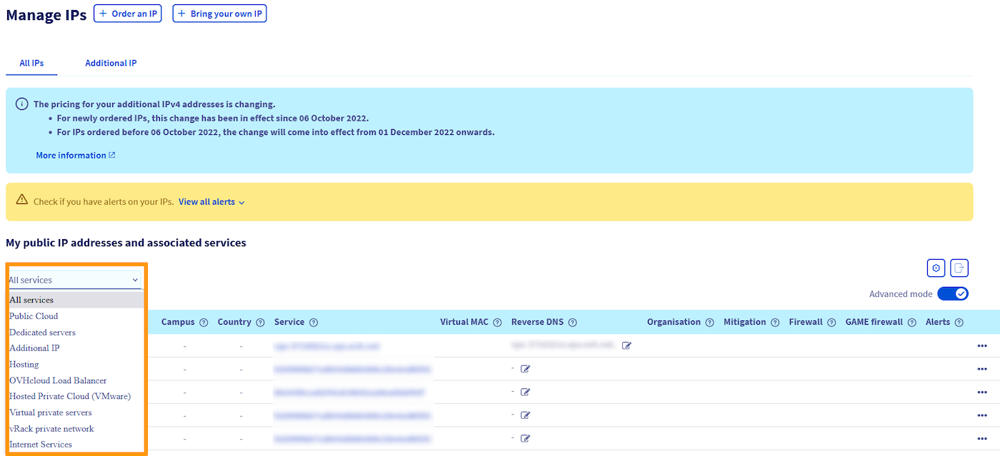
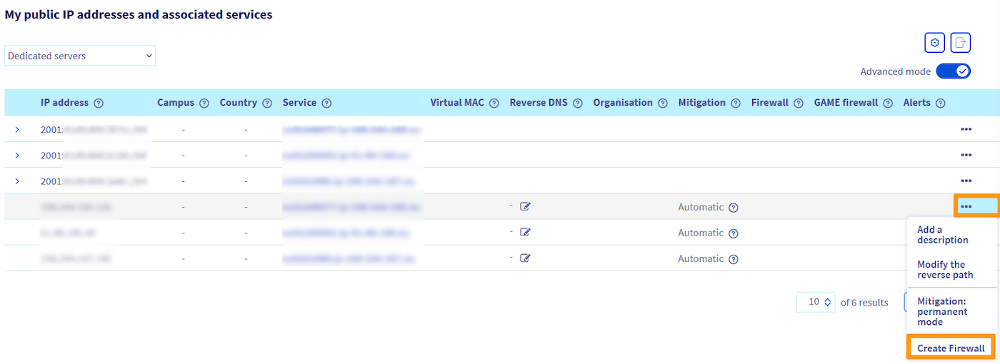
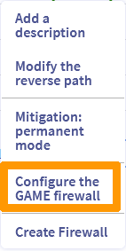

## Objective

To protect its global infrastructure and its customers’ servers, OVHcloud offers a firewall that can be configured and integrated into the **Anti-DDoS** solution: the Network Firewall. This is an option you can use to limit your service's exposure to attacks from the public network.

**This guide will show you how to configure your Network Firewall.**

> [!primary]
>
> You can read more information on our Anti-DDoS solution here: <https://www.ovhcloud.com/en/security/anti-ddos/>.
> 

{.thumbnail}

## Requirements

- An OVHcloud service with a Network Firewall ([Dedicated Server](https://www.ovhcloud.com/en/bare-metal/){.external}, [VPS](https://www.ovhcloud.com/en/vps/){.external}, [Public Cloud instance](https://www.ovhcloud.com/en/public-cloud/){.external}, [Hosted Private Cloud](https://www.ovhcloud.com/en/enterprise/products/hosted-private-cloud/){.external}, [Additional IP](https://www.ovhcloud.com/en/network/additional-ip/){.external}, etc.)
- Access to the [OVHcloud Control Panel](https://ca.ovh.com/auth/?action=gotomanager&from=https://www.ovh.com/world/&ovhSubsidiary=we)

> [!warning]
> This feature might be unavailable or limited on servers of the [**Eco** product line](https://eco.ovhcloud.com/en/about/).
>
> Please visit our [comparison page](https://eco.ovhcloud.com/en/compare/) for more information.

## Instructions

### Enable the Network Firewall

> [!primary]
>
> The Network Firewall protects the IP associated with a server. As a result, if you have a server with multiple IP addresses, you need to configure each IP separately. You cannot configure the firewall on the server as a whole.
> 

In the OVHcloud Control Panel, click on the `Bare Metal Cloud`{.action} menu and open `Network`{.action}. Then, click on `IP`{.action}. You can use the drop-down menu underneath **"My public IP addresses and associated services"** to filter your services according to category.

{.thumbnail}

Next, click the `...`{.action} button to the right of the relevant IPv4 and select `Create Firewall`{.action}.

{.thumbnail}

You will then be asked to confirm.

{.thumbnail}

Then click `Enable the firewall`{.action} (1), and click `Configure the firewall`{.action} (2) to start configuring it.

{.thumbnail}

You can set up to **20 rules per IP**.

> [!warning]
>
> The Network firewall is enabled automatically whenever a DDoS attack is launched, and cannot be disabled before the attack ends. As such, all the rules configured in the firewall are applied. This is why it is important to keep your firewall rules up-to-date.
> As a default setting you do not have any configured rules, so all connections can be set up.
> If you have any, we recommend checking them regularly, even if the firewall is disabled.
>

> [!primary]
>
> - The UDP fragmentation is blocked (DROP) by default. When you enable the Network Firewall, if you use a VPN, remember to configure your maximum transmission unit (MTU) correctly. For example, on OpenVPN, you can tick `MTU test`{.action}.
> - The Network Firewall is not taken into account within the OVHcloud network, so the rules set up do not affect the connections in this internal network.
>

### Configure the Network Firewall

> [!warning]
> Please note that the OVHcloud Network Firewall cannot be used to open ports on a server. To open ports on a server, you must go through the firewall of the operating system installed on the server. 
> For more information, please refer to the following guides: [Configuring the firewall on Windows](/pages/bare_metal_cloud/dedicated_servers/activate-port-firewall-soft-win) and [Configuring the firewall on Linux with iptables](/pages/bare_metal_cloud/dedicated_servers/firewall-Linux-iptable).
>

To add a rule, click on `Add a rule`{.action}:

{.thumbnail}

For each rule you must choose:

- A priority (from 0 to 19, 0 being the first rule to be applied, followed by the others)
- An action (`Authorise`{.action} or `Refuse`{.action})
- The protocol
- An IP (optional)
- The source port (TCP only)
- The destination port (TCP only)
- The TCP options (TCP only)

{.thumbnail}

> [!primary]
>
> - Priority 0: we advise authorising TCP protocol on all the IPs with an `established`{.action} option. With the established option, you can verify that the packet is part of a session that has previously been opened (already started). If you do not authorise it, the server will not receive the TCP protocol feedback from the SYN/ACK requests.
> - Priority 19: we advise to refuse all IPv4 protocol traffic that has not been accepted by any earlier rule.
> 

### Configuration example

To make sure that only the SSH (22), HTTP (80), HTTPS (443) and UDP (10,000) ports are left open when authorising the ICMP, follow the rules below:

{.thumbnail}

The rules are sorted from 0 (the first rule read) to 19 (the last). The chain stops being scanned as soon as a rule is applied to the packet.

For example, a packet for TCP port 80 will be captured by rule 2, and the rules that come after will not be applied. A packet for TCP port 25 will only be captured at the last rule (19) which will block it, because the Firewall does not authorise communication on port 25 in the previous rules.

> [!warning]
> As stated, the configuration above is just an example and should only be used as reference if the rules do not apply to services hosted on your server. It is absolutely necessary to configure the rules in your firewall according to the services hosted on your server. Improper configuration of your firewall rules can cause legitimate traffic to be blocked and server services to be inaccessible. 
> 

### Mitigation

Our Anti-DDoS (VAC) solution includes three mitigation modes: automatic, permanent or forced.

**Automatic mitigation**: By default, all OVHcloud IPs are under automatic mitigation. Automatic mitigation will be enabled automatically only if the traffic is detected as "unusual" compared to the normal traffic usually received by the server. 

**Permanent mitigation**: This mode can be enabled or disabled via the OVHcloud Control Panel. With permanent mitigation (if enabled), you apply a constant first level of filtering through our Shield hardware. 
All traffic at all times gets through the mitigation system before reaching the server. We recommend enabling this mode for services under frequent attacks. 
Please note that as permanent mitigation is part our Anti-DDoS (VAC) solution, you can activate it on your IP without enabling the Network Firewall.

To enable it, click on the `Bare Metal Cloud`{.action} menu and open `Network`{.action}. Then, click on `IP`{.action}. Next, click on the `...`{.action} to the right of the relevant IPv4 and select `Mitigation: permanent mode`{.action}.

**Forced mitigation**: This mode is automatically enabled once an attack is detected on the server. Once enabled on our Anti-DDoS infrastructure, it cannot be disabled. In order to protect our infrastructure, it will be enabled throughout the attack until it is completely mitigated.

> [!warning]
>
> If our Anti-DDoS solution mitigates an attack, your Network Firewall rules will eventually be applied, even if you have disabled the firewall. If you have disabled your firewall, remember to delete your rules as well.
> 
> Since the mitigation is part of our Anti-DDoS (VAC) solution, it cannot be disabled on a service. All OVHcloud products are delivered with the Anti-DDoS protection.

### Configuring Armor

> [!primary]
> By default, Armor is pre-configured with certain rules that OVHcloud has determined work with the most common games. However, for customers with a Game Dedicated Server, we allow you to go a step further and configure rules for ports as well.
>

In order to configure rules for your ports in Armor, you will first need to log into the OVHcloud Control Panel. 
In the `Bare Metal Cloud`{.action} menu, click on `Network`{.action} and open `IP`{.action}. Next, click on the `...`{.action} next to the IP address of your Game Server and click on `Configure the GAME firewall`{.action}.

{.thumbnail}

On the following screen, click the `Add a rule`{.action} button to add a rule to Armor.

You can set up to **30 rules per IP**.

{.thumbnail}

Enable the ports as needed on the following screen and click on the `Confirm`{.action} button when you are finished adding your rules. You have now successfully configured Armor.

### Conclusion

Having read this tutorial, you should now be able to configure the Network Firewall as well as Armor (for Game dedicated servers) to enhance the security of your OVHcloud services.

## Go further

Join our community of users on <https://community.ovh.com/en/>.
