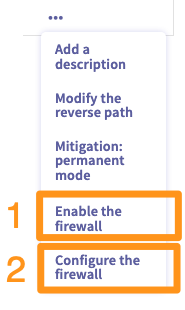
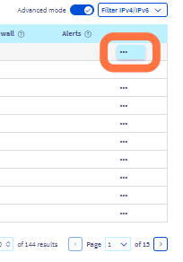

> [!primary]
> Esta traducción ha sido generada de forma automática por nuestro partner SYSTRAN. En algunos casos puede contener términos imprecisos, como en las etiquetas de los botones o los detalles técnicos. En caso de duda, le recomendamos que consulte la versión inglesa o francesa de la guía. Si quiere ayudarnos a mejorar esta traducción, por favor, utilice el botón «Contribuir» de esta página.
>

## Objetivo

Para proteger los servicios dde sus clientes expuestos en direcciones IP públicas, OVHcloud ofrece un firewall sin estado configurado e integrado en la **infraestructura anti-DDoS**: el Edge Network Firewall. Permite limitar la exposición de los servicios a los ataques DDoS, eliminando determinados flujos de red procedentes de fuera de la red de OVHcloud.

Para proteger su infraestructura mundial y los servidores de sus clientes, OVHcloud ofrece un cortafuegos configurable integrado en su solución **anti-DDoS**: el Network Firewall. Se trata de una opción que permite limitar la exposición de los servicios a los ataques procedentes de la red pública.

**Esta guía le mostrará cómo configurar el Edge Network Firewall para sus servicios.**

> [!primary]
>
> Para más información sobre la solución anti-DDoS de OVHcloud, consulte la página <https://www.ovhcloud.com/es/security/anti-ddos/>.
> 

|  |
|:--:|
| Diagrama de los servicios de protección de juegos e infraestructuras anti-DDoS en OVHcloud |

## Requisitos

- Un servicio de OVHcloud expuesto en una dirección IP pública dedicada ([Servidor Dedicado](https://www.ovhcloud.com/es/bare-metal/){.external}, [VPS](https://www.ovhcloud.com/es/vps/){.external}, [instancias de Public Cloud](https://www.ovhcloud.com/es/public-cloud/){.external}, [Hosted Private Cloud](https://www.ovhcloud.com/es/enterprise/products/hosted-private-cloud/){.external}, [Additional IP](https://www.ovhcloud.com/es/bare-metal/ip/){.external}, etc.).
- Tener acceso al [área de cliente de OVHcloud](https://ca.ovh.com/auth/?action=gotomanager&from=https://www.ovh.com/world/&ovhSubsidiary=ws){.external}.

> [!warning]
> Esta funcionalidad puede no estar disponible o estar limitada en los [servidores dedicados **Eco**](https://eco.ovhcloud.com/es-es/about/).
>
> Para más información, consulte nuestra [comparativa](https://eco.ovhcloud.com/es-es/compare/).

## Procedimiento

El Edge Network Firewall reduce la exposición a los ataques DDoS de red, ya que permite a los usuarios copiar algunas de las reglas del firewall del servidor en el perímetro de la red de OVHcloud. Esto bloquea los ataques entrantes lo más cerca posible de su origen, reduciendo el riesgo de saturación de los recursos del servidor o de las conexiones al rack en caso de ataques importantes.

### Activar el Edge Network Firewall

> [!primary]
>
> El Edge Network Firewall protege una IP específica asociada a un servidor (o servicio). Por lo tanto, si tiene un servidor con varias direcciones IP, debe configurar cada IP por separado.
> 

Conéctese al área de cliente de OVHcloud, haga clic en el menú `Bare Metal Cloud`{.action}, haga clic en el menú `Network`{.action} y abra la sección `IP`{.action}. 

Puede utilizar el menú desplegable "Mis direcciones IP públicas y servicios asociados" para filtrar sus servicios por categorías.

{.thumbnail}

A continuación, haga clic en el botón `...`{.action} situado a la derecha de la IPv4 correspondiente y seleccione primero `Crear firewall`{.action}.

{.thumbnail}

A continuación, se le pedirá que confirme. Se creará el firewall y podrá configurar las reglas.

> [!primary]
>
> El botón `Crear firewall`{.action} solo estará disponible para las IP que nunca hayan configurado un firewall. Si no es la primera vez que configura el firewall, puede omitir este paso.
>

|  |
|:--:|
| Haga clic en `Configuración del Edge Network Firewall`{.action} para empezar a configurarlo. |

En esta página puede elegir entre **Activar** o **Desactivar** el firewall utilizando el botón del switch.
También es posible hacerlo de otra manera explicada a continuación.

Puede configurar hasta **20 reglas por IP**.

> [!warning]
>
> El Edge Network Firewall se activa automáticamente cuando se detecta un ataque DDoS y no puede desactivarse hasta que finalice el ataque. Como resultado, todas las reglas configuradas en el firewall se aplican durante la duración del ataque. Esta lógica permite a nuestros clientes descargar las reglas del firewall del servidor al borde de la red de OVHcloud mientras dure el ataque.
>
> Tenga en cuenta que debe configurar sus propios firewalls locales aunque se haya configurado el Edge Network Firewall, ya que su función principal es gestionar el tráfico procedente de fuera de la red de OVHcloud.
>
> Si ha configurado algunas reglas, le recomendamos que las compruebe con regularidad o cuando cambie el funcionamiento de sus servicios. Como se mencionó anteriormente, el Edge Network Firewall se activará automáticamente en caso de ataque DDoS, incluso cuando esté desactivado en la configuración IP.
>

> [!primary]
>
> - La fragmentación UDP está bloqueada (DROP) por defecto. Cuando habilite el Edge Network Firewall, si está usando una VPN, recuerde configurar correctamente la unidad de transmisión máxima (MTU). Por ejemplo, con OpenVPN, puede comprobar `MTU test`.
> - El Edge Network Firewall (ENF) integrado en los centros de limpieza (*scrubbing centres* o VAC) solo gestiona el tráfico de red procedente de fuera de la red de OVHcloud.
>

### Configurar el Edge Network Firewall

> [!warning]
> Tenga en cuenta que el Edge Network Firewall de OVHcloud no puede utilizarse para abrir puertos en un servidor. Para abrir puertos en un servidor, debe pasar por el cortafuegos del sistema operativo instalado en el servidor.
>
> Para más información, consulte las siguientes guías: [Configuración del firewall en Windows](/pages/bare_metal_cloud/dedicated_servers/activate-port-firewall-soft-win) y [Configuración del firewall en Linux con iptables](/pages/bare_metal_cloud/dedicated_servers/firewall-Linux-iptable).
>

**Para añadir una regla:**

|  |
|:--:|
| Haga clic en `Añadir una regla`{.action}. |

Para cada regla (excluyendo TCP), debe elegir:

|  |
|:--|
| &bull; Una prioridad (de 0 a 19, siendo 0 la primera regla que se aplica, seguida de las demás)  &bull; Una acción (`Aceptar`{.action} o `Denegar`{.action})  &bull; El protocolo  &bull; IP de origen (opcional) |

Para cada regla **TCP**, debe elegir:

|  |
|:--|
| &bull; Una prioridad (de 0 a 19, siendo 0 la primera regla que se aplica, seguida de las demás)  &bull; Una acción (`Aceptar`{.action} o `Denegar`{.action})  &bull; El protocolo  &bull; IP de origen (opcional)  &bull; El puerto de origen (opcional)  &bull; El puerto de destino (opcional)  &bull; El estado TCP (opcional)  &bull; Fragmentos (opcional)|

> [!primary]
> Le recomendamos que autorice el protocolo TCP con una opción `established` (para los paquetes que forman parte de una sesión previamente abierta/iniciada), los paquetes ICMP (para ping y traceroute) y, opcionalmente, las respuestas DNS UDP de los servidores externos (si utiliza servidores DNS externos).
>
> **Ejemplo de configuración:**
>
> - Prioridad 0: Autorizar TCP `established`
> - Prioridad 1: Autorizar UDP, puerto de origen 53
> - Prioridad 2: Autorizar ICMP
> - Prioridad 19: Denegar la IPv4

> [!warning]
> Las configuraciones de firewall con reglas de modo "Aceptar" únicamente no son efectivas en absoluto. Debe haber una instrucción acerca del tráfico que debe interrumpir el firewall. Verá una advertencia a menos que se cree la regla "Denegar".
>

**Activar el firewall:**

|  |
|:--:|
| `Activar`{.action} para activar |

Después de la confirmación, el firewall se activará.

**Desactivar el firewall:**

|  |
|:--:|
| `Activar`{.action} para activar |

Después de la confirmación, el firewall se desactivará.

Tenga en cuenta que las reglas se desactivan hasta que se detecta un ataque y, a continuación, se activan. Esta lógica se puede utilizar para reglas que sólo están activas cuando entra un ataque repetido conocido.

### Ejemplo de configuración

Para asegurarse de que sólo se dejan abiertos los puertos estándar para SSH (22), HTTP (80), HTTPS (443) y UDP (53) al autorizar ICMP, siga las reglas siguientes:

{.thumbnail}

Las reglas se ordenan de 0 (la primera regla leída) a 19 (la última). La cadena de reglas se detiene en cuanto se aplica una regla al paquete.

Por ejemplo, la regla 2 interceptará un paquete para el puerto TCP 80 y no se aplicarán las reglas siguientes. Un paquete para el puerto TCP 25 sólo será capturado por la última regla (19), que lo bloqueará porque el firewall no permite la comunicación en el puerto 25 en las reglas anteriores.

> [!warning]
> La configuración anterior es solo un ejemplo y solo debe utilizarse como referencia si las reglas no se aplican a los servicios alojados en su servidor. Es esencial que configure las reglas de su firewall para que coincidan con los servicios alojados en su servidor. Una configuración incorrecta de las reglas del firewall puede provocar el bloqueo del tráfico legítimo y la imposibilidad de acceder a los servicios del servidor.
>

### Mitigación de ataques: actividad del centro de limpieza

Nuestra infraestructura anti-DDoS (VAC) dispone de dos modos de funcionamiento: **automático** y **permanente**. El proceso de mitigación se realiza a través del centro de limpieza automatizado. Aquí es donde nuestra tecnología avanzada analiza en profundidad los paquetes e intenta eliminar el tráfico DDoS, permitiendo al mismo tiempo el paso del tráfico legítimo.

- **Mitigación automática** es la opción por defecto: todas las IP de OVHcloud están sujetas a mitigación automática. Por lo general, esta es la mejor opción para sus servicios. En caso de que se detecte tráfico malicioso, se activa el centro de limpieza. Este estado se indica mediante el estado "Forzado" para una dirección IP determinada. En este momento, el Edge Network Firewall también está activo. La situación vuelve a la normalidad cuando se mitiga el ataque y no se observa ninguna actividad sospechosa.

- **Mitigación permanente** puede activarse o desactivarse desde el área de cliente de OVHcloud. Con la mitigación permanente, usted aplica permanentemente el primer nivel de filtrado para que todo el tráfico pase siempre a través del sistema de mitigación antes de llegar al servidor. No se recomienda habilitar esta opción durante períodos de tiempo más largos, a menos que experimente fluctuaciones de latencia debido a que el centro de limpieza redirige el tráfico con demasiada frecuencia.

Tenga en cuenta que, en comparación con el modo automático, el nivel de protección **no** aumenta cuando este modo está activado.

Para activarla, siga estos pasos:

- Haga clic en el menú `Bare Metal Cloud`{.action}.
- Vaya a `Network`{.action} en la columna izquierda.
- Acceda a la sección `IP`{.action}.

|  |
|:--:|
| A continuación, haga clic en el botón `...`{.action} situado a la derecha de la IPv4 correspondiente. |

|  |
|:--:|
| Seleccione `Mitigación: modo permanente`{.action}. |

> [!success]
> **Sugerencias**
>
> Puede crear reglas de firewall que sólo se apliquen después de que se haya detectado un ataque. Para ello, deben crearse reglas de Edge Network Firewall, pero deben deshabilitarse.
>

> [!warning]
> Si nuestra infraestructura anti-DDoS mitiga un ataque, las reglas del Edge Network Firewall se aplicarán eventualmente, incluso si ha desactivado el firewall. Si ha desactivado el firewall, recuerde eliminar también las reglas.
>
> Tenga en cuenta que nuestra infraestructura anti-DDoS no puede desactivarse en un servicio. Todos los productos de OVHcloud se entregan dentro del ámbito de protección y esto no se puede cambiar.
>

## Network Security Dashboard

Para obtener información detallada sobre los ataques detectados y los resultados de las actividades del centro de limpieza, le recomendamos que explore nuestro [Network Security Dashboard](/pages/bare_metal_cloud/dedicated_servers/network_security_dashboard).

## Conclusión

Después de leer este tutorial, debería ser capaz de configurar el Edge Network Firewall para mejorar la seguridad de sus servicios de OVHcloud.

## Más información

- [Protección de un servidor de juegos con el firewall de aplicaciones](/pages/bare_metal_cloud/dedicated_servers/firewall_game_ddos)

Interactúe con nuestra comunidad de usuarios en <https://community.ovh.com/en/>.
