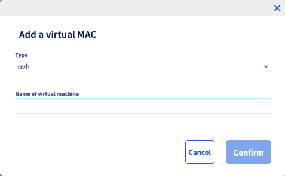
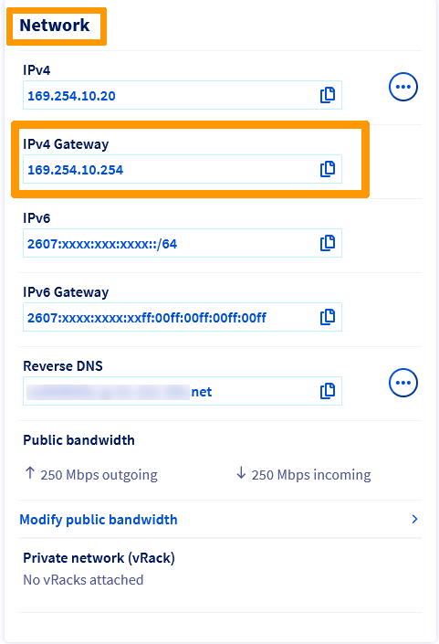
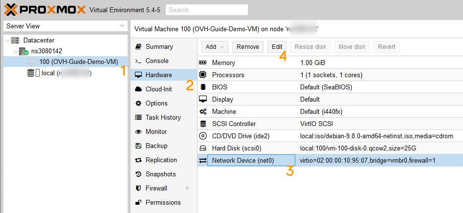
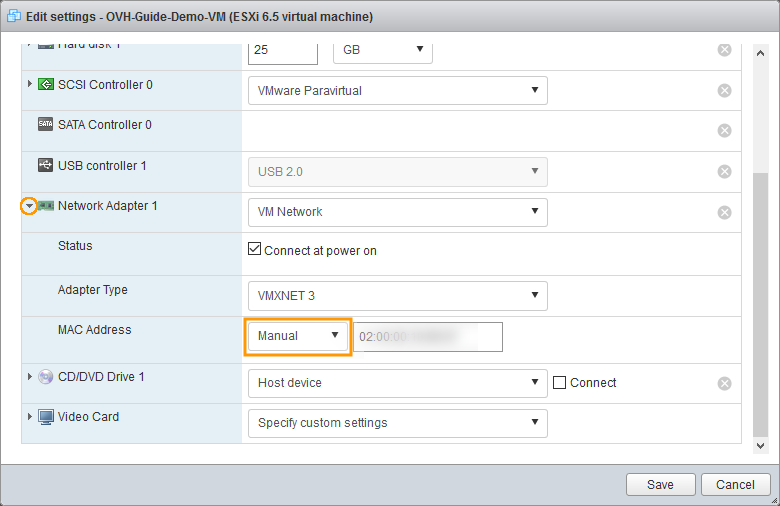

> [!primary]
>
> Since October 6th, 2022 our service "Failover IP" is named [Additional IP](https://www.ovhcloud.com/en/network/additional-ip/). This renaming has no effect on its technical features.
>

## Objective

Bridged networking can be used to configure your virtual machines. Some tweaking is necessary to make the network configuration work on our network.

**This guide will explain how to use network bridging to configure internet access for your virtual machines.**

<iframe width="560" height="315" src="https://www.youtube.com/embed/TZZbPe9hCOk?rel=0" frameborder="0" allow="autoplay; encrypted-media" allowfullscreen></iframe>

## Requirements

- A dedicated server with a hypervisor installed (e.g. [VMware ESXi](http://www.vmware.com/products/esxi-and-esx/overview.html){.external}, Citrix Xen Server, Proxmox, etc.)
- At least one [Additional IP address](https://www.ovhcloud.com/en/bare-metal/ip/) attached to the server
- Access to the [OVHcloud Control Panel](https://ca.ovh.com/auth/?action=gotomanager&from=https://www.ovh.com/world/&ovhSubsidiary=we)

> [!warning]
> This feature might be unavailable or limited on servers of the [**Eco** product line](https://eco.ovhcloud.com/en/about/).
>
> Please visit our [comparison page](https://eco.ovhcloud.com/en/compare/) for more information.
>
> This guide is not applicable to servers of the ranges [Scale](https://www.ovhcloud.com/en/bare-metal/scale/) and [High Grade](https://www.ovhcloud.com/en/bare-metal/high-grade/).
> 
> Please visit the dedicated [configuration page](/pages/bare_metal_cloud/dedicated_servers/proxmox-network-HG-Scale).

## Instructions

The basic steps are always the same, independent of the underlying system:

- creating a virtual MAC address for an Additional IP
- setting the MAC of the VM to that new virtual MAC address
- configuring the **IP address**, **netmask**, **gateway** and **route to the gateway** inside the VM

Code samples in the following instructions have to be replaced with your own values:

- SERVER_IP = The main IP address of your server
- ADDITIONAL_IP = The address of your Additional IP
- GATEWAY_IP = The address of your default gateway

### Step 1: Assign a virtual MAC address

Log in to the [OVHcloud Control Panel](https://ca.ovh.com/auth/?action=gotomanager&from=https://www.ovh.com/world/&ovhSubsidiary=we), go to the `Bare Metal Cloud`{.action} section and click on `Network`{.action}. Next, open the `IP`{.action} menu.

Click the `Additional IP`{.action} tab.

{.thumbnail} 

Next, locate your Additional IP address in the table and click the `...`{.action} button to open the menu. Select `Add a virtual MAC`{.action}.

{.thumbnail}

Choose `ovh`{.action} from the "Type" drop-down menu unless you are using VMware ESXi - in that case choose `vmware`{.action}. Type a name in the “Name of virtual machine” field, and click on `Confirm`{.action}.

{.thumbnail}

After a few seconds, a virtual MAC will appear in the "Virtual MAC" column of your additional IP row. This virtual MAC will be required in the next step.

### Step 2: Determine the gateway address

To configure your virtual machines for internet access, you will need to know the gateway of your host machine (i.e. your dedicated server). The gateway IP address is made up of the first three octets of your server's main IP address, with 254 as the last octet. For example, if your server's main IP address was:

- 169.254.10.20

Your gateway address would therefore be:

- 169.254.10.**254**

You can also retrieve the gateway via the [OVHcloud Control Panel](#viacontrolpanel) or the [OVHcloud API](#viaapi).

#### Via the OVHcloud Control Panel <a name="viacontrolpanel"></a>

Log in to the [OVHcloud Control Panel](https://ca.ovh.com/auth/?action=gotomanager&from=https://www.ovh.com/world/&ovhSubsidiary=we), go to the `Bare Metal Cloud`{.action} section and select your server from `Dedicated servers`{.action}.

The IPv4 gateway assigned to your server will appear in the `Network` section of the `General Information`{.action} tab. Once you have copied it, continue with applying the configuration.

{.thumbnail}

#### Via the OVHcloud API <a name="viaapi"></a>

On the [OVHcloud API page](https://ca.api.ovh.com/console/), click on `Login`{.action} in the top right-hand corner. On the next page, enter your OVHcloud credentials.

Execute the following API call, indicating the internal server name (example: `ns3956771.ip-169-254-10.eu`):

> [!api]
>
> @api {v1} /dedicated/server GET /dedicated/server/{serviceName}/specifications/network
>

###  Step 3: Prepare the host

> [!primary]
>
For all operating systems and distributions, you **must** configure your virtual machine with the virtual MAC address you have created in the OVHcloud Control Panel.
>

#### Proxmox

After creating the VM and while it is still powered off, right-click the VM and click `Edit settings`.

 1\. Select the VM.<br>
 2\. Open the `Hardware` section.<br>
 3\. Select `Network Device`.<br>
 4\. Click the `Edit` button.<br>

{.thumbnail}

Then add the vMAC address created previously.

{.thumbnail}

Now you can start the VM and proceed with the configuration steps, depending on the operating system installed.

#### VMware ESXi

After you've created the virtual machine and while it's powered off, right click the VM and click `Edit settings`.

{.thumbnail}

Fold out `Netwok Adapter 1`, change the value in the `MAC Address` drop-down menu to `Manual` and enter the MAC address created previously.

{.thumbnail}

Now you can start the VM and proceed with the configuration steps, depending on the operating system installed.

### Step 4: Configure the virtual machines

#### Debian

Connect to the shell of your virtual machine. Open the virtual machine's network configuration file located in `/etc/network/interfaces`. 
Edit the file so that it reflects the configuration below (please remember to fill in your own values).

- For older distributions:

```console
auto lo eth0
iface lo inet loopback
iface eth0 inet static
    address ADDITIONAL_IP
    netmask 255.255.255.255
    broadcast ADDITIONAL_IP
    post-up route add GATEWAY_IP dev eth0
    post-up route add default gw GATEWAY_IP
    pre-down route del GATEWAY_IP dev eth0
    pre-down route del default gw GATEWAY_IP
```

- For the latest distributions:

```console
auto lo eth0
iface lo inet loopback
iface eth0 inet static
    address ADDITIONAL_IP
    netmask 255.255.255.255
    broadcast ADDITIONAL_IP
    post-up ip route add GATEWAY_IP dev eth0
    post-up ip route add default via GATEWAY_IP
    pre-down ip route del GATEWAY_IP dev eth0
    pre-down ip route del default via GATEWAY_IP
```

Also replace `eth0` if your system uses Predictible Network Interface Names. You can find the network interface names with the following command:

```bash
ls /sys/class/net
```

Save and close the file, then restart your network or reboot the virtual machine.

#### Red Hat and Red Hat-based operating systems (CentOS 6, Scientific Linux, ClearOS, etc.)

Open a terminal on your virtual machine. Open the virtual machine's network configuration file located in `/etc/network/interfaces`. Edit the file so that it reflects the configuration below (please remember to fill in your own values).

```console
DEVICE=eth0
BOOTPROTO=none
ONBOOT=yes
USERCTL=no
IPV6INIT=no
PEERDNS=yes
TYPE=Ethernet
NETMASK=255.255.255.255
IPADDR=ADDITIONAL_IP
GATEWAY=GATEWAY_IP
ARP=yes
HWADDR=MY:VI:RT:UA:LM:AC
```

Save and close the file.<br>
Next, open the virtual machine's routing file, which is located in `/etc/sysconfig/network-scripts/route-eth0`. Edit the file so that it reflects the configuration below (please remember to fill in your own values).

```console
GATEWAY_IP dev eth0
default via GATEWAY_IP dev eth0
```

Save and close the file, then reboot your virtual machine.

#### CentOS 7

> [!primary]
> 
> For CentOS 7, the name of the network adapter will vary, depending on the installation options. You will need to verify the adapter name and use it to configure your virtual machine. You can find the Network interface names with the command `ls /sys/class/net`.
> 

Open a terminal on your virtual machine. Open the virtual machine's network configuration file located in `/etc/sysconfig/network-scripts/ifcfg-(interface-name)`. Edit the file so that it reflects the configuration below (please remember to fill in your own values).

```console
DEVICE=(interface-name)
BOOTPROTO=none
ONBOOT=yes
USERCTL=no
IPV6INIT=no
PEERDNS=yes
TYPE=Ethernet
NETMASK=255.255.255.255
IPADDR=ADDITIONAL_IP
GATEWAY=GATEWAY_IP
ARP=yes
HWADDR=MY:VI:RT:UA:LM:AC
```

Save and close the file.<br>
Next, open the virtual machine's routing file, which is located in `/etc/sysconfig/network-scripts/route-(interface-name)`. Edit the file so that it reflects the configuration below (please remember to fill in your own values).

```console
GATEWAY_IP - 169.254.10.254 (interface-name)
NETWORK_GW_VM - 255.255.255.0 (interface-name)
default GATEWAY_IP
```

Save and close the file.<br>
Next, open the virtual machine's DNS configuration file, which is located in `/etc/resolv.conf` and add this line:

```console
nameserver 213.186.33.99
```

After saving and closing the file, restart your network or reboot the VM.

#### FreeBSD 12.0

Open a terminal on your virtual machine. Open the virtual machine's network configuration file located in `/etc/rc.conf`. Edit the file so that it reflects the configuration below (please remember to fill in your own values). In this example, the interface name is `em0`. Replace this value if it does not apply.

```console
ifconfig_em0="inet ADDITIONAL_IP netmask 255.255.255.255 broadcast ADDITIONAL_IP"
static_routes="net1 net2"
route_net1="-net GATEWAY_IP/32 -interface em0"
route_net2="default GATEWAY_IP"
```

Save and close the file.<br>
Next, edit or create the file `/etc/resolv.conf` and add this line.

```console
nameserver 213.186.33.99
```

Save and close the file, then reboot your virtual machine.

#### Ubuntu 18.04

First, open a terminal on your virtual machine and open the network configuration file located in `/etc/netplan/` with the following command. For demonstration purposes, our file is called `50-cloud-init.yaml`.

```bash
# nano /etc/netplan/50-cloud-init.yaml
```

Once the file is open for editing, amend it with the following code:

```yaml
network:
    ethernets:
        (interface-name):
            addresses:
                - ADDITIONAL_IP/32
            nameservers:
                addresses:
                    - 213.186.33.99
                search: []
            optional: true
            routes:
                - to: 0.0.0.0/0
                  via: GATEWAY_IP
                  on-link: true
    version: 2
```

Save and close the file, then run the following command:

```bash
# netplan try
Warning: Stopping systemd-networkd.service, but it can still be activated by:
  systemd-networkd.socket
Do you want to keep these settings?

Press ENTER before the timeout to accept the new configuration

Changes will revert in 120 seconds
Configuration accepted.
```

#### Windows Server 2012 / Hyper-V

Before configuring your virtual machine, you need to create a virtual switch.

From the command line of your dedicated server, run `ipconfig /all`{.action} and note the name of the network adapter that contains the server's main IP address.

In the Hyper-V Manager, create a new virtual switch and set the connection type to `External`{.action}.

Select the adapter with the server’s IP, then tick the option `Allow management operating system to share this network adapter`{.action}.

{.thumbnail}

> [!primary]
> 
>This step is only required once for a Hyper-V server. For all VMs, a **virtual switch** is required to connect the VM’s **virtual network adapters** to the server’s **physical adapter**.
> 

Next, select the VM you wish to add the Additional IP to. Use the Hyper-V Manager to change the settings of the VM and shut it down.

Expand the network adapter in the left-hand menu and click on `Advanced Features`{.action}. Change the MAC address to `Static`{.action}, and enter the virtual MAC address for the Additional IP. Once you have entered these settings, press `OK`{.action} to apply the changes.

{.thumbnail}

Next, start the VM and log in as an administrator, then go to the `Control Panel`{.action}'s `Network and Sharing Center`{.action}. Click on `Ethernet`{.action} to open the settings and click on the `Properties`{.action} button to view the `Ethernet Properties`.

Select `Internet Protocol Version 4 (TCP/IPv4)`{.action}, and then click on the `Properties`{.action} button.

{.thumbnail}

In the IPv4 Properties window, select `Use the following IP address`{.action}. Enter the Additional IP into the IP address field, and enter 255.255.255.255 into the subnet mask.

Fill in your server’s gateway IP address in the appropriate field below and enter 213.186.33.99 into the `Preferred DNS Server`{.action} field.

Finally, click `OK`{.action}, and ignore the warning message about the gateway IP and the assigned IP not being in the same subnet.

{.thumbnail}

After rebooting the server, the VM should be connected to the internet using the Additional IP.

### Troubleshooting

If you are unable to establish a connection from your VM to the public network and you suspect a networking problem, please reboot the server in rescue mode and set up the bridging network interface directly on the host.

Enter the following command in the rescue mode terminal, in which you replace MAC_ADDRESS with the vMAC address that you have generated in the Control Panel and ADDITIONAL_IP with your Additional IP address:

```bash
ip link add name test-bridge link eth0 type macvlan
ip link set dev test-bridge address MAC_ADDRESS
ip link set test-bridge up
ip addr add ADDITIONAL_IP/32 dev test-bridge
```

Next, ping your Additional IP address from an external device.

- If it responds, that probably means that there is a configuration error either on the VM or the host that prevents the Additional IP from working in normal mode.

- If the IP address is still not working, please create a ticket in your [OVHcloud Control Panel](https://ca.ovh.com/auth/?action=gotomanager&from=https://www.ovh.com/world/&ovhSubsidiary=we) to relay your test results to our support teams.

## Go further

Join our community of users on <https://community.ovh.com/en/>.
