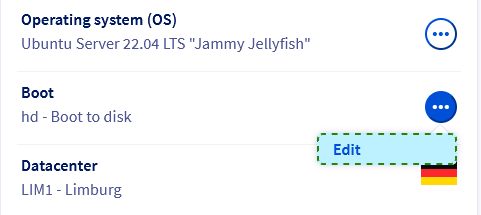
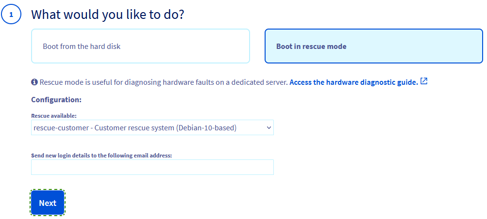

> [!primary]
> Esta traducción ha sido generada de forma automática por nuestro partner SYSTRAN. En algunos casos puede contener términos imprecisos, como en las etiquetas de los botones o los detalles técnicos. En caso de duda, le recomendamos que consulte la versión inglesa o francesa de la guía. Si quiere ayudarnos a mejorar esta traducción, por favor, utilice el botón «Contribuir» de esta página.
> 

## Objetivo

El modo *rescue* o modo de rescate permite arrancar un servidor dedicado sobre un sistema operativo temporal con el objetivo de diagnosticar y resolver problemas.

El modo de rescate se adapta generalmente a las siguientes tareas:

- Restauración de la contraseña root
- Diagnóstico de problemas de red
- Reparación de un sistema operativo defectuoso
- Corrección de una configuración incorrecta de un cortafuegos de software
- Prueba del rendimiento de los discos
- Prueba del procesador y la memoria RAM

Si todavía no dispone de backups recientes, la copia de seguridad de sus datos debe ser la primera etapa del modo de recuperación.

**Esta guía explica cómo activar y utilizar el modo de rescate en un servidor dedicado.**

## Requisitos

- Tener un [servidor dedicado](https://www.ovhcloud.com/es-es/bare-metal/).
- Haber iniciado sesión en el [área de cliente de OVHcloud](https://www.ovh.com/auth/?action=gotomanager&from=https://www.ovh.es/&ovhSubsidiary=es).

## Procedimiento

> [!warning]
> Tenga en cuenta que, si ha establecido una llave SSH por defecto en su espacio para los productos dedicados, no recibirá una contraseña root al reiniciar un servidor en modo de rescate. En este caso, primero debe desactivar la llave SSH por defecto antes de reiniciar el servidor en modo de rescate. Para ello, consulte esta [sección](/pages/cloud/dedicated/creating-ssh-keys-dedicated#disablesshkey) de la guía correspondiente.
>

Solo es posible activar el modo de rescate desde el [área de cliente de OVHcloud](https://www.ovh.com/auth/?action=gotomanager&from=https://www.ovh.es/&ovhSubsidiary=es){.external} en la sección `Bare Metal Cloud`{.action}. En la columna izquierda, haga clic en `Servidores dedicados`{.action} y seleccione el servidor.

Busque "Boot" en la zona **Información general** y haga clic en `...`{.action} y luego en `Editar`{.action}.

{.thumbnail}

En la siguiente página, seleccione **Arrancar en modo rescue**. Si el sistema operativo del servidor es Linux, seleccione `rescue-customer`{.action} en la lista desplegable. Si el servidor está en Windows, seleccione `WinRescue`{.action} (ver la [sección de la guía abajo](#windowsrescue)). Indique otra dirección de correo electrónico si **no** desea que la información de identificación de la conexión se envíe a la dirección principal de su cuenta de cliente de OVHcloud.

> [!warning]
>
> Algunas cuentas de cliente de OVHcloud pueden sufrir un error relativo al idioma de los mensajes de correo de rescate: se envían en francés en lugar del idioma de cuenta elegido. Aunque la causa del error se ha corregido desde el 20 de septiembre de 2022, la dirección de correo electrónico debe actualizarse una vez para resolver el problema. Para ello, introduzca la dirección de correo electrónico de su cuenta de cliente en este paso antes de activar el modo de rescate.
>

Haga clic en `Siguiente`{.action} y `Aceptar`{.action}.

{.thumbnail}

Una vez que haya realizado los cambios, haga clic en `...`{.action} a la derecha de "Estado" en la zona titulada **Estado de los servicios**.
<br>Haga clic en `Reiniciar`{.action} y el servidor se reiniciará en modo de rescate. Esta operación puede tardar unos minutos.
<br>Puede comprobar el progreso en la pestaña `Tareas`{.action}. Recibirá un mensaje de correo electrónico con los identificadores (incluida la contraseña de conexión) del usuario root del modo de rescate.

{.thumbnail}

Una vez que haya finalizado las tareas en modo de rescate, no olvide redefinir el netboot en `Arrancar en el disco duro`{.action} y reiniciar el servidor.

### Linux

#### Uso del modo de rescate (SSH)

> [!primary]
> 
> Si utiliza una llave SSH (activa también en su área de cliente de OVHcloud), no recibirá ninguna contraseña. Una vez que el servidor esté en modo de rescate, podrá conectarse directamente con su llave SSH.
>

Una vez reiniciado el servidor, recibirá por correo electrónico las claves de acceso en modo de rescate. Este mensaje de correo electrónico también está disponible en el [área de cliente de OVHcloud](https://www.ovh.com/auth/?action=gotomanager&from=https://www.ovh.es/&ovhSubsidiary=es). En la esquina superior derecha del área de cliente, haga clic en el nombre asociado a su identificador de cliente y seleccione `Emails de servicio`{.action}.

A continuación, acceda al servidor en línea de comandos o a través de una herramienta [SSH](/pages/bare_metal_cloud/dedicated_servers/ssh_introduction, utilizando la contraseña root generada para el modo de rescate.

por ejemplo,

```bash
ssh root@ns3956771.ip-169-254-10.eu
root@ns3956771.ip-169-254-10.eu's password:
```

> [!warning]
> 
> Es probable que su cliente SSH bloquee la conexión en primer lugar, debido a la incompatibilidad de la huella ECDSA. Esto es normal, ya que el modo de rescate utiliza su propio servidor SSH temporal.
>
> Para evitar este problema, puede comentar la huella de su sistema habitual añadiendo una `#` delante de su línea en el archivo *known_hosts*. Elimine este carácter antes de reiniciar el servidor en modo normal.
>

#### Montaje de sus particiones

Para realizar la mayoría de los cambios en el servidor por SSH en modo de rescate, es necesario montar una partición. para realizar la mayoría de los cambios en este modo es necesario montar previamente una partición en el servidor. De lo contrario, los cambios que realizase en el sistema de archivos en modo de rescate se perderían al reiniciar el servidor en modo normal.

Para montar las particiones, utilice el comando `mount` por SSH. Previamente deberá mostrar la lista de las particiones para conocer el nombre de la partición que quiera montar. A continuación ofrecemos algunos ejemplos de código:

```bash
fdisk -l
```

```console
Disk /dev/hda 40.0 GB, 40020664320 bytes
255 heads, 63 sectors/track, 4865 cylinders
Units = cylinders of 16065 * 512 = 8225280 bytes

Device Boot Start End Blocks Id System
/dev/hda1 * 1 1305 10482381 83 Linux
/dev/hda2 1306 4800 28073587+ 83 Linux
/dev/hda3 4801 4865 522112+ 82 Linux swap / Solaris

Disk /dev/sda 8254 MB, 8254390272 bytes
16 heads, 32 sectors/track, 31488 cylinders
Units = cylinders of 512 * 512 = 262144 bytes

Device Boot Start End Blocks Id System
/dev/sda1 1 31488 8060912 c W95 FAT32 (LBA)
```

Una vez que haya identificado el nombre de la partición que quiere montar, utilice el siguiente comando:

```bash
mount /dev/hda1 /mnt/
```

> [!primary]
>
> La partición se montará. A continuación, puede realizar operaciones en el sistema de archivos.
> 
> Si el servidor dispone de una configuración RAID por software, debe montar el volumen RAID (en general `/dev/mdX`).
>

Para salir del modo de rescate, redefina el modo de arranque en `Arrancar en el disco duro`{.action} en el [área de cliente de OVHcloud](https://www.ovh.com/auth/?action=gotomanager&from=https://www.ovh.es/&ovhSubsidiary=es) y reinicie el servidor en línea de comandos.

#### Montaje de un datastore

Puede montar un datastore VMware de la misma manera que se describe en el paso anterior.

Enumere sus particiones para obtener el nombre de la partición del datastore:

```bash
fdisk -l
```

Monte la partición con el siguiente comando, sustituyendo `sdbX` por el valor identificado en el paso anterior:

```bash
vmfs-fuse /dev/sdbX /mnt
```

Si tiene datastores `VMFS 6`, vaya a la carpeta `sbin` y cree la carpeta de montaje:

```bash
cd /usr/local/sbin/
mkdir /mnt/datastore
```

Enumere sus particiones para obtener el nombre de la partición del datastore:

```bash
fdisk -l
```

Monte la partición con el siguiente comando, sustituyendo `sdbX` por el valor identificado en el paso anterior:

```bash
vmfs6-fuse /dev/sdbX /mnt/datastore/
```

Para salir del modo de rescate, redefina el modo de arranque en `Arrancar en el disco duro`{.action} en el [área de cliente de OVHcloud](https://www.ovh.com/auth/?action=gotomanager&from=https://www.ovh.es/&ovhSubsidiary=es) y reinicie el servidor en línea de comandos.

### Windows <a name="windowsrescue"></a>

#### Uso de herramientas WinRescue

Una vez reiniciado el servidor, recibirá por correo electrónico las claves de acceso en modo de rescate. Este mensaje de correo electrónico también está disponible en el [área de cliente de OVHcloud](https://www.ovh.com/auth/?action=gotomanager&from=https://www.ovh.es/&ovhSubsidiary=es). En la esquina superior derecha del área de cliente, haga clic en el nombre asociado a su identificador de cliente y seleccione `Emails de servicio`{.action}.

Para utilizar el modo de rescate que ofrece Windows, es necesario descargar e instalar una consola VNC o utilizar el módulo `IPMI` en el [área de cliente de OVHcloud](https://www.ovh.com/auth/?action=gotomanager&from=https://www.ovh.es/&ovhSubsidiary=es){.external}.

{.thumbnail}

Las siguientes herramientas ya están instaladas en este modo:

|Herramienta|Descripción|
|---|---|
|Mozilla ULight|Un navegador web.|
|Memory Diagnostics Tool|Una herramienta Windows que permite probar la memoria RAM.|
|Explorer_Q-Dir|Un explorador de archivos.|
|GSmartControl|Una herramienta de verificación de discos duros y discos duros SSD.|
|PhotoRec|Una herramienta de recuperación de archivos potencialmente perdidos en un disco.|
|SilverSHielD|Un servidor SSH2 y SFTP.|
|System Recovery|Una herramienta Windows de restauración y reparación del sistema.|
|TestDisk|Potente aplicación para recuperar datos. Permite recuperar y modificar particiones corruptas, recuperar particiones eliminadas, reparar un sector de arranque o incluso reconstruir un MBR dañado.|
|FileZilla|Cliente FTP de código abierto. Soporta los protocolos SSH y SSL, y dispone de una interfaz clara e intuitiva que permite arrastrar los elementos. Puede utilizarse para transferir sus datos a un servidor FTP, como el espacio de backup FTP incluido con la mayoría de los servidores de OVHcloud.|
|7-Zip|Herramienta de compresión y archivado compatible con los siguientes formatos: ARJ, CAB, CHM, CPIO, CramFS, DEB, DMG, FAT, HFS, ISO, LZH, LZMA, MBR, MSI, NSIS, NTFS, RAR, RPM, SquashFS, UDF, VHD, WIM, XAR y Z. Con 7-Zip también podrá crear sus propios archivos en los siguientes formatos: BZIP2, GZIP, TAR, WIM, XZ, Z y ZIP.|

## Más información

[Cambiar la contraseña de administrador en un servidor dedicado Windows](/pages/bare_metal_cloud/dedicated_servers/changing-admin-password-on-windows)

Interactúe con nuestra comunidad de usuarios en <https://community.ovh.com/en/>.
