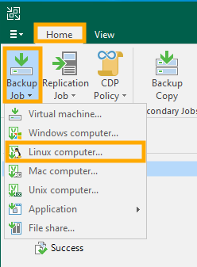
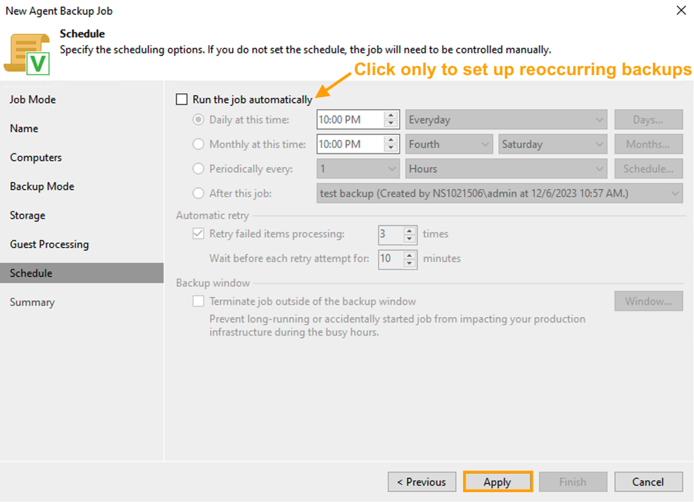
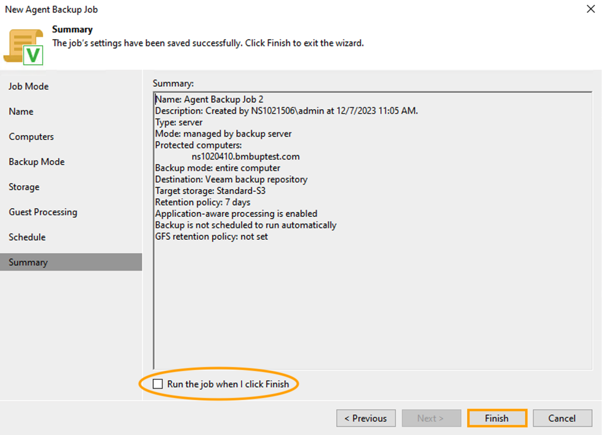

## Objective

Whether it is a hardware failure or accidentally deleting an important file, maintaining frequent backups is extremely important and can save you countless hours of unnecessary work.

**Learn how to back up your Bare Metal Server using Veeam Backup and Replication (Enterprise)**

## Requirements

- An [OVHcloud Bare Metal server](https://www.ovhcloud.com/en-gb/bare-metal/)
- [Veeam Backup & Replication installed and registered](/pages/storage_and_backup/backup_and_disaster_recovery_solutions/veeam/veeam_veeam_backup_replication)

> [!warning]
> This guide presupposes that you have followed the steps detailed in our first guide [Preparing a Bare Metal Server backup with Veeam Enterprise](/pages/bare_metal_cloud/dedicated_servers/veeam-enterprise-server-backup-preparation).

## Instructions

To begin, from the `Home`{.action} tab, click the `Backup Job`{.action} button and select one of the `<OS> computer...` options to backup. For this guide, we are selecting Windows.

{.thumbnail}

In the **Job Mode** section, select the server **Type** and the **Mode** for backup.

Then, click the `Next`{.action} button.

{.thumbnail}

In the **Name** section, give your backup job a **Name** and **Description**.

Then, click the `Next`{.action} button.

{.thumbnail}

In the **Computers** section, click the `Add...`{.action} button. Then select the individual computer.

{.thumbnail}

In the **Add Computer** pop-up, enter the **Host name or IP address** of the server.

Then, click the `Add...`{.action} button.

{.thumbnail}

Enter the **Username** and **Password** and then click `OK`{.action}.

{.thumbnail}

In the **Backup Mode** section, select the backup mode for this job.

Then, click the `Next`{.action} button.

{.thumbnail}

In the **Storage** section, choose the **Backup repository** and settings.

Then, click the `Next`{.action} button.

{.thumbnail}

Click the `Next`{.action} button again to skip the **Guest Processing** section, as no configurations are needed.

In the **Schedule** section, you can click `Run the job automatically`{.action} if you would like to configure the backup job to be reoccurring. 

For this article, we will be executing the backup manually so we will click the `Apply`{.action} button to proceed.

{.thumbnail}

Review the **Summary** section to ensure that everything is correct.

If you want to run the job as soon as you finish setup, select the `Run the job`{.action} when I click Finish checkbox.

{.thumbnail}

Click the `Finish`{.action} button to conclude setting up the backup job. This will open a new window where you can view the details of the backup being performed.

{.thumbnail}

Once the job is complete, you will have created your backup.

For information about restoring a Bare Metal Server, please check out our [Restoring a Bare Metal Server with Veeam Enterprise](/pages/bare_metal_cloud/dedicated_servers/veeam-enterprise-server-restore) guide.

## Go further

Join our community of users on <https://community.ovh.com/en/>.
