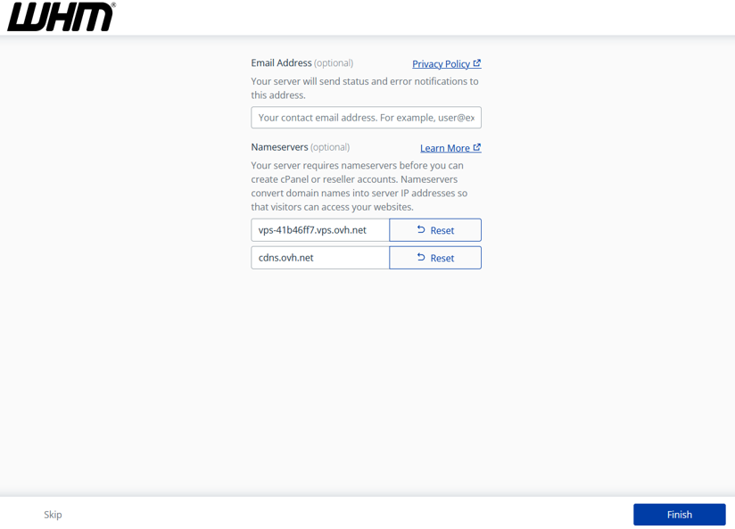

> [!primary]
> Diese Übersetzung wurde durch unseren Partner SYSTRAN automatisch erstellt. In manchen Fällen können ungenaue Formulierungen verwendet worden sein, z.B. bei der Beschriftung von Schaltflächen oder technischen Details. Bitte ziehen Sie im Zweifelsfall die englische oder französische Fassung der Anleitung zu Rate. Möchten Sie mithelfen, diese Übersetzung zu verbessern? Dann nutzen Sie dazu bitte den Button "Beitragen" auf dieser Seite.
>

## Ziel

cPanel ist ein Konfigurationspanel, das die Verwaltung von Webhostings vereinfacht. Es macht komplexe Aufgaben leichter zugänglich, auch für neue Benutzer. Es bietet eine breite Palette von Funktionen, wie zum Beispiel für die Verwaltung: 

- E-Mails
- Domains
- Datenbanken
- Sicherheit
- usw.

Dank einer grafischen Oberfläche, die die Automatisierung von Einstellungen erlaubt, wird das Hosting von Webseiten vereinfacht.

**Erfahren Sie, wie Sie cPanel mit vorinstallierten Anwendungen auf einem VPS einrichten.**

## Voraussetzungen

- Sie verfügen über ein Angebot [VPS neueren Datums](https://www.ovhcloud.com/de/vps/){.external} (Value-Angebote, **Essential**, **Comfort** oder **Elite**).
- Sie haben Zugriff auf Ihr [OVHcloud Kundencenter](https://www.ovh.com/auth/?action=gotomanager&from=https://www.ovh.de/&ovhSubsidiary=de).

## In der praktischen Anwendung

Um Ihren cPanel Server zu installieren, bestellen Sie einen VPS mit cPanel Distribution.

{.thumbnail}

Wenn Ihr VPS bereit ist, erhalten Sie eine E-Mail mit den Zugangsdaten, um sich mit Ihrem cPanel-Server zu verbinden:

```
 |    Ihre Anwendung(en):
 |    Application: cPanel
 |    Sie können sich mit cPanel verbinden über: https://*hostname*:2087/<session_parameters>
```

Wenn Sie schon über einen VPS verfügen und cPanel darauf installieren möchten, wählen Sie die Option "VPS reinstallieren" in Ihrem [OVHcloud Kundencenter](https://www.ovh.com/auth/?action=gotomanager&from=https://www.ovh.de/&ovhSubsidiary=de) über ein [Betriebssystem, das mit cPanel kompatibel ist](https://www.ovhcloud.com/de/vps/os/) reinstallieren.

> [!warning]
>
> Wenn Sie einen VPS reinstallieren, werden alle Daten darauf überschrieben.
>

### Erste Verbindung

Wenn Sie die E-Mail mit dem eindeutigen Link erhalten haben, klicken Sie auf diesen Link, um die Erstkonfiguration durchzuführen. Wenn der Link bereits abgelaufen ist, loggen Sie sich via SSH beim Server ein und führen Sie den Befehl „sudo whmlogin“ aus, um einen neuen Link zu erstellen.

Die mit dem Befehl „sudo whmlogin“ generierte URL erlaubt es Ihnen, sich ohne Login-Daten (Benutzer und Passwort) mit Ihrem WHM Interface zu verbinden. WHM ist eine cPanel-Schicht. Sie können auf cPanel zugreifen, nachdem Sie die folgenden Schritte ausgeführt haben.

#### Schritt 1: Lesen und akzeptieren Sie die cPanel-Nutzungsbedingungen

Lesen und akzeptieren Sie die cPanel-Nutzungsbedingungen.

{.thumbnail}

#### Schritt 2: Eingeben Ihrer E-Mail-Adresse sowie der Nameserver, die der VPS verwenden soll

{.thumbnail}

#### Schritt 3: Root-Passwort festlegen

{.thumbnail}

Anschließend sollten Sie sich mit dem Root-Benutzer in WHM oder über SSH einloggen können.

### Den Dienst absichern

Wir empfehlen weitere Schritte, um WHM und den VPS vor unbefugtem Zugriff zu sichern. Sie können dazu den [Empfehlungen von cPanel](https://docs.cpanel.net/knowledge-base/security/tips-to-make-your-server-more-secure/) folgen.

Weiterhin ist empfehlenswert, die [OVHcloud Firewall](/pages/bare_metal_cloud/dedicated_servers/firewall_network) zu konfigurieren und eine [Backup-Lösung](/pages/bare_metal_cloud/virtual_private_servers/secure_your_vps) für den VPS einzurichten.

## Weiterführende Informationen

Für den Austausch mit unserer User Community gehen Sie auf <https://community.ovh.com/en/>.
