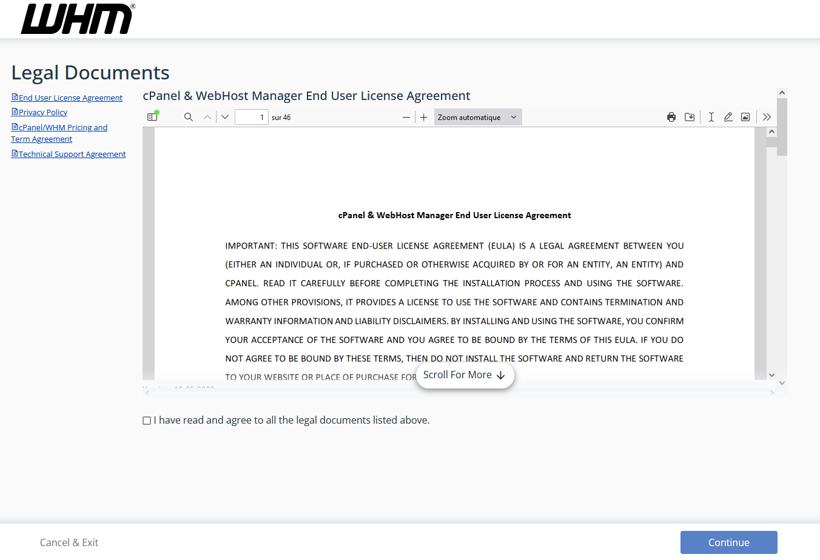

> [!primary]
> Esta traducción ha sido generada de forma automática por nuestro partner SYSTRAN. En algunos casos puede contener términos imprecisos, como en las etiquetas de los botones o los detalles técnicos. En caso de duda, le recomendamos que consulte la versión inglesa o francesa de la guía. Si quiere ayudarnos a mejorar esta traducción, por favor, utilice el botón «Contribuir» de esta página.
> 

## Objectivo

cPanel es un panel de control que facilita la gestión de los alojamientos web. Hace que las tareas complejas sean más accesibles, incluso para los nuevos usuarios. Ofrece una amplia gama de funcionalidades como, por ejemplo, para la gestión: 

- mensajes de correo
- dominios
- bases de datos
- de la seguridad
- etc.

Gracias a una interfaz gráfica que permite automatizar los parámetros, el alojamiento de sitios web se simplifica.

**Descubra cómo desplegar cPanel con las aplicaciones preinstaladas en un VPS.**

## Requisitos

- Tener contratado un servicio [VPS reciente](https://www.ovhcloud.com/es/vps/){.external} (ofertas Value, **Essential**, **Comfort** o **Elite**).
- Acceso al [área de cliente de OVHcloud](https://ca.ovh.com/auth/?action=gotomanager&from=https://www.ovh.com/world/&ovhSubsidiary=ws).

## Procedimiento

Para instalar su servidor cPanel, contrate un VPS con la distribución cPanel.

{.thumbnail}

Cuando su VPS esté listo, recibirá un correo electrónico con los datos de acceso para conectarse a su servidor cPanel:

```
 |    Sus aplicaciones:
 |    Application: cpanel
 |    Puede conectarse a cpanel desde https://<ip>:2087/<session_parameters>
```

Si ya tiene un VPS y desea instalar cPanel, puede reinstalar el VPS desde su [área de cliente de OVHcloud](https://ca.ovh.com/auth/?action=gotomanager&from=https://www.ovh.com/world/&ovhSubsidiary=ws) a través de un [OS compatible con cPanel](https://www.ovhcloud.com/es-es/vps/os/).

> [!warning]
>
> Si reinstala el VPS, toda la información almacenada puede perderse.
>

### Primera conexión

Una vez que haya recibido el mensaje de correo electrónico con el enlace único, haga clic en este enlace para realizar la configuración inicial. Si el enlace ya ha expirado, conéctese al servidor por SSH y ejecute el comando «sudo whmlogin» para generar un nuevo enlace.

La URL generada por el comando sudo whmlogin le permite conectarse sin credenciales (usuario y contraseña) a su interfaz WHM. WHM es una capa de cPanel. Puede acceder a cPanel después de realizar los siguientes pasos.

#### Etapa 1: leer y aceptar las condiciones de uso de cPanel

Lea y acepte las condiciones de uso de cPanel.

{.thumbnail}

#### Paso 2: Proporcione la dirección de correo electrónico y los servidores DNS que desea configurar en su VPS

{.thumbnail}

#### Paso 3: Establecer la contraseña de root

{.thumbnail}

Ahora usted debería poder iniciar sesión en WHM y SSH usando el usuario y la contraseña de root que acaba de configurar.

### Proteja su servicio

Le recomendamos que tome más medias adicionales para proteger su WHM y VPS. Por esto le recomendamos que lea las recomendamos proporcionadas por cPanel aquí:

Además, le recomendamos configurar el [firewall](/pages/bare_metal_cloud/dedicated_servers/firewall_network) y una [solución de backup](/pages/bare_metal_cloud/virtual_private_servers/secure_your_vps) en su VPS.

## Más información

Interactúe con nuestra comunidad de usuarios en <https://community.ovh.com/en/>
