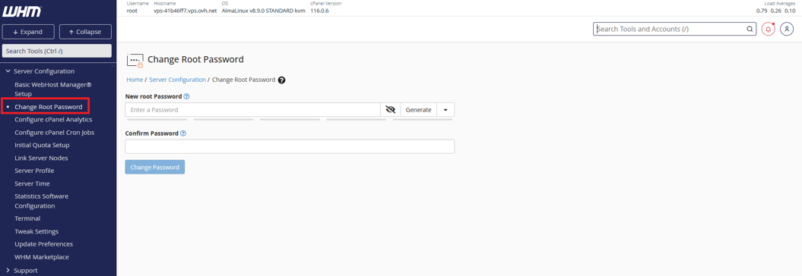
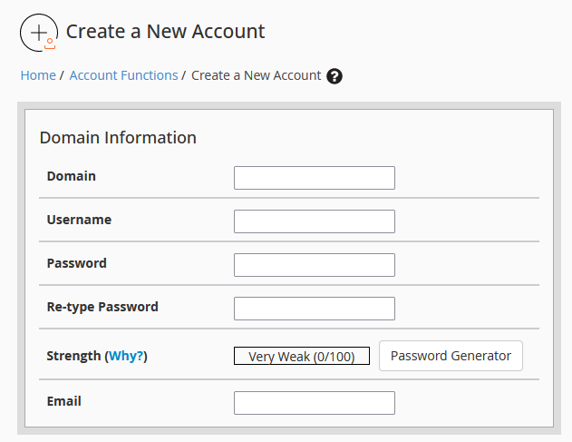

> [!primary]
> Tłumaczenie zostało wygenerowane automatycznie przez system naszego partnera SYSTRAN. W niektórych przypadkach mogą wystąpić nieprecyzyjne sformułowania, na przykład w tłumaczeniu nazw przycisków lub szczegółów technicznych. W przypadku jakichkolwiek wątpliwości zalecamy zapoznanie się z angielską/francuską wersją przewodnika. Jeśli chcesz przyczynić się do ulepszenia tłumaczenia, kliknij przycisk "Zgłóś propozycję modyfikacji" na tej stronie.
> 

## Wprowadzenie

cPanel to panel konfiguracyjny ułatwiający zarządzanie hostingiem WWW. Ułatwia dostęp do złożonych zadań, również nowym użytkownikom. Posiada wiele funkcji, takich jak na przykład zarządzanie: 

- kont email
- domeny
- bazy danych
- bezpieczeństwa
- itp.

Dzięki interfejsowi graficznemu umożliwiającemu automatyzację parametrów, hosting stron WWW stał się prostszy.

**Dowiedz się, jak zainstalować cPanel za pomocą wstępnie zainstalowanych aplikacji na serwerze VPS.**

## Wymagania początkowe

- Wykupienie usługi [VPS](https://www.ovhcloud.com/pl/vps/){.external} (oferty Value, **Essential**, **Comfort** lub **Elite**).
- zalogowanie do [Panelu client OVHcloud](https://www.ovh.com/auth/?action=gotomanager&from=https://www.ovh.pl/&ovhSubsidiary=pl).

## W praktyce

Aby zainstalować serwer cPanel, zamów VPS z dystrybucją cPanel.

{.thumbnail}

Gdy VPS jest gotowy, otrzymasz wiadomość e-mail dającą dostęp do logowania do serwera cPanel:

```
 |    Twoje aplikacje:
 |    aplikacja: cpanel
 |    Możesz zalogować się do cpanel ze strony https://<ip>:2087/<session_parameters>
```

Jeśli posiadasz już serwer VPS i chcesz na nim zainstalować cPanel, możesz wykonać reinstalację serwera VPS z poziomu [Panelu klienta OVHcloud](https://www.ovh.com/auth/?action=gotomanager&from=https://www.ovh.pl/&ovhSubsidiary=pl) przez [OS kompatybilny z cPanelem](https://www.ovhcloud.com/pl/vps/os/).

> [!warning]
>
> Jeśli ponownie zainstalujesz serwer VPS, wszystkie dane przechowywane na serwerze VPS zostaną utracone.
> 

### Pierwsze logowanie

Po otrzymaniu wiadomości e-mail z unikalnym łączem kliknij ten link, aby przeprowadzić wstępną konfigurację. Jeśli łącze już wygasło, połącz się z serwerem za pomocą [SSH](/pages/bare_metal_cloud/dedicated_servers/ssh_introduction) i wprowadź komendę `sudo whmlogin`, aby wygenerować nowe łącze.

Adres URL wygenerowany przy użyciu polecenia `sudo whmlogin` umożliwia zalogowanie się do interfejsu WHM bez danych identyfikacyjnych (nazwa użytkownika i hasło). WHM to warstwa cPanel. Po wykonaniu kolejnych kroków będziesz mógł uzyskać dostęp do cPanel.

#### Etap 1: przeczytaj i zaakceptuj warunki korzystania z cPanel

Przeczytaj i zaakceptuj warunki korzystania z cPanel.

{.thumbnail}

#### Etap 2: uzupełnij wymagane pola

Wskaż serwery poczty elektronicznej i nazwy (nameservers), które chcesz skonfigurować na serwerze VPS.

{.thumbnail}

#### Etap 3: zdefiniuj hasło root

{.thumbnail}

Od tej chwili możesz zalogować się do Twojego serwera przez SSH, używając użytkownika root z hasłem, które właśnie zdefiniowałeś.

### Utwórz konto cPanel w interfejsie WHM

Po zalogowaniu do interfejsu WHM kliknij `Create a New Account`{.action}, aby utworzyć konto cPanel.

{.thumbnail}

Wypełnij formularz, a następnie potwierdź, aby potwierdzić założenie konta cPanel.

{.thumbnail}

Na nowym ekranie, który się wyświetli kliknij przycisk `Go to cPanel`{.action} po prawej stronie ekranu.

{.thumbnail}

Zostaniesz przekierowany do interfejsu cPanel.

{.thumbnail}

Teraz możesz korzystać z cPanel. Więcej informacji na temat cPanel można znaleźć w [oficjalnej dokumentacji](https://docs.cpanel.net/).

> [!primary]
>
> W pasku nawigacyjnym przeglądarki wprowadź następujące adresy URL, aby się zalogować:
>
> - cPanel : https&#58;//&#60;IP_V4&#62;:2083/ (wykorzystaj dane logowania, które zostały niedawno utworzone w interfejsie WHM)
> - WHM : https&#58;//&#60;IP_V4&#62;:2087/ (użyj nazwy użytkownika "root" oraz hasła otrzymanego w e-mailu dotyczącym zakupu usługi lub hasła SSH, które zostało zmienione w interfejsie WHM)
>
> Adres IPv4 znajdziesz w e-mailu, który otrzymałeś po złożeniu zamówienia na VPS z dystrybucją cPanel.
>

### Bezpieczeństwo usługi

Zalecamy podjęcie wszelkich niezbędnych kroków w celu zabezpieczenia WHM i serwera VPS. W tym celu zalecamy zapoznanie się z [zaleceniami cPanel](https://docs.cpanel.net/knowledge-base/security/tips-to-make-your-server-more-secure/).

Zalecamy również zapoznanie się z naszym przewodnikiem dotyczącym [zabezpieczenia serwera VPS](/pages/bare_metal_cloud/virtual_private_servers/secure_your_vps), korzystania z [naszych rozwiązań tworzenia kopii zapasowych](/products/bare-metal-cloud-virtual-private-servers) i konfiguracji [Edge Network Firewall](/pages/bare_metal_cloud/dedicated_servers/firewall_network).

## Sprawdź również

Przyłącz się do społeczności naszych użytkowników na stronie <https://community.ovh.com/en/>.