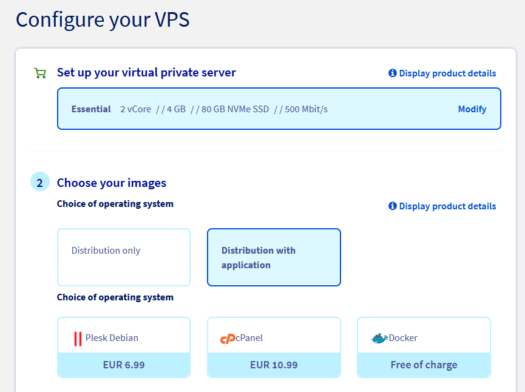
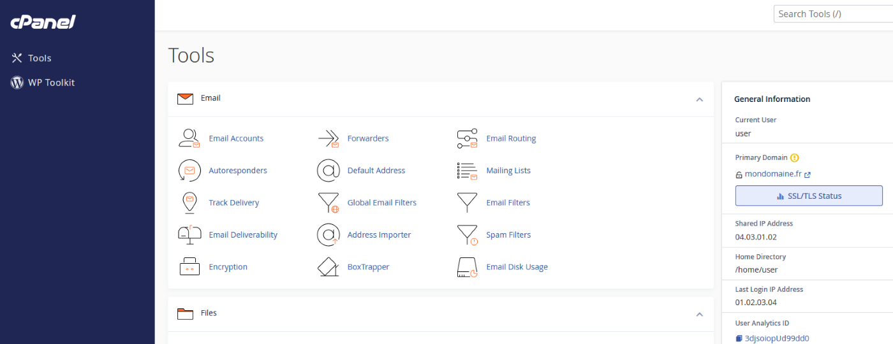

> [!primary]
> Esta tradução foi automaticamente gerada pelo nosso parceiro SYSTRAN. Em certos casos, poderão ocorrer formulações imprecisas, como por exemplo nomes de botões ou detalhes técnicos. Recomendamos que consulte a versão inglesa ou francesa do manual, caso tenha alguma dúvida. Se nos quiser ajudar a melhorar esta tradução, clique em "Contribuir" nesta página.
>

## Objetivo

O cPanel é um painel de configuração que facilita a gestão dos alojamentos web. Torna as tarefas complexas mais acessíveis, incluindo para os novos utilizadores. Oferece uma vasta gama de funcionalidades como, por exemplo, para a gestão: 

- e-mails
- domínios
- Bases de dados
- da segurança
- etc.

Graças a uma interface gráfica que permite a automatização dos parâmetros, o alojamento de websites é simplificado.

**Saiba como implementar o cPanel com aplicações pré-instaladas num VPS.**

## Requisitos

- Ter uma oferta [VPS recente](https://www.ovhcloud.com/pt/vps/){.external} (ofertas Value, **Essential**, **Comfort** ou **Elite**).
- Estar ligado à [Área de Cliente OVHcloud](https://www.ovh.com/auth/?action=gotomanager&from=https://www.ovh.pt/&ovhSubsidiary=pt).

## Instruções

Para instalar o seu servidor cPanel, encomende um VPS com a distribuição cPanel.

{.thumbnail}

Quando o VPS estiver pronto, receberá um e-mail a dar-lhe as informações de acesso ao servidor cPanel:

```
 |    As suas aplicações:
 |    Application: cpanel
 |    Pode conectar-se ao cPanel a partir de https://<ip>:2087/<session_parameters>
```

Se já dispõe de um VPS e deseja instalar o cPanel, pode reinstalar o VPS a partir da sua [Área de Cliente OVHcloud](https://www.ovh.com/auth/?action=gotomanager&from=https://www.ovh.pt/&ovhSubsidiary=pt) através de um [OS compatível com cPanel](https://www.ovhcloud.com/pt/vps/os/).

> [!warning]
>
> Se reinstalar um VPS, todos os dados armazenados no VPS serão eliminados.
> 

### Primeira ligação

Quando tiver recebido a mensagem de correio eletrónico com a hiperligação única, clique nesta hiperligação para concluir a configuração inicial. Se a ligação já expirou, ligue-se ao servidor em SSH e execute o comando `sudo whmlogin` para gerar uma nova ligação.

O URL gerado pelo comando `sudo whmlogin` permite que se ligue sem informações de identificação (utilizador e palavra-passe) à sua interface WHM. WHM é uma camada de cPanel. Pode aceder ao cPanel após ter efetuado os seguintes passos.

#### Etapa 1: ler e aceitar as condições de utilização do cPanel

Leia e aceite os termos de utilização do cPanel.

{.thumbnail}

#### Etapa 2: preencher os campos

Indique os servidores de e-mail e nomes (nameservers) que deseja definir no servidor VPS.

{.thumbnail}

#### Etapa 3: definir a password root

{.thumbnail}

Agora, pode ligar-se ao servidor em SSH utilizando o utilizador root com a palavra-passe que acabou de definir.

### Criar uma conta cPanel a partir da interface WHM

Depois de aceder à interface WHM, clique em `Create a New Account`{.action} para criar uma conta cPanel.

{.thumbnail}

Preencha o formulário e valide para confirmar a criação da sua conta cPanel.

{.thumbnail}

No novo ecrã que se abrir, clique no botão `Go to cPanel`{.action} à direita do ecrã.

{.thumbnail}

Será redirecionado para a sua interface cPanel.

{.thumbnail}

Já pode utilizar o cPanel. Para obter mais informações sobre o cPanel, consulte a [documentação oficial](https://docs.cpanel.net/).

> [!primary]
>
> Na barra de navegação do browser, introduza estes URL para iniciar sessão no:
>
> - cPanel: https://<IP_V4>:2083/ (utilize os identificadores que acabaram de ser criados na interface WHM)
> - WHM: https://<IP_V4>:2087/ (utilize o nome de utilizador "root" e a palavra-passe recebida no e-mail de aquisição do serviço ou a palavra-passe SSH modificada na interface WHM)
>
> Encontre o seu endereço IPv4 no e-mail que recebeu no seguimento da encomenda do seu VPS com a distribuição cPanel.
>

### Segurança do seu serviço

Recomendamos que tome todas as medidas necessárias para proteger o seu WHM e o seu VPS. Para isso, recomendamos que leia [as recomendações da cPanel](https://docs.cpanel.net/knowledge-base/security/tips-to-make-your-server-more-secure/).

Além disso, recomendamos que consulte o nosso manual para [proteger um VPS](/pages/bare_metal_cloud/virtual_private_servers/secure_your_vps), que utilize [as nossas soluções de backup](/products/bare-metal-cloud-virtual-private-servers) e que configure o [Edge Network Firewall](/pages/bare_metal_cloud/dedicated_servers/firewall_network).

## Quer saber mais?

Fale com a nossa comunidade de utilizadores em <https://community.ovh.com/en/>.
