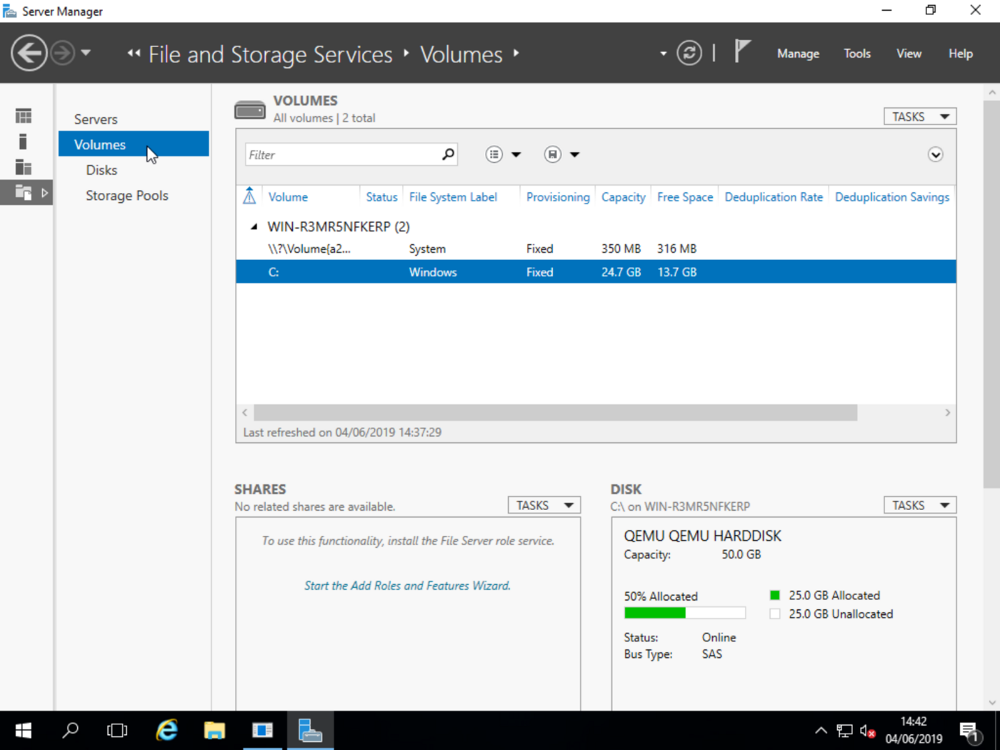
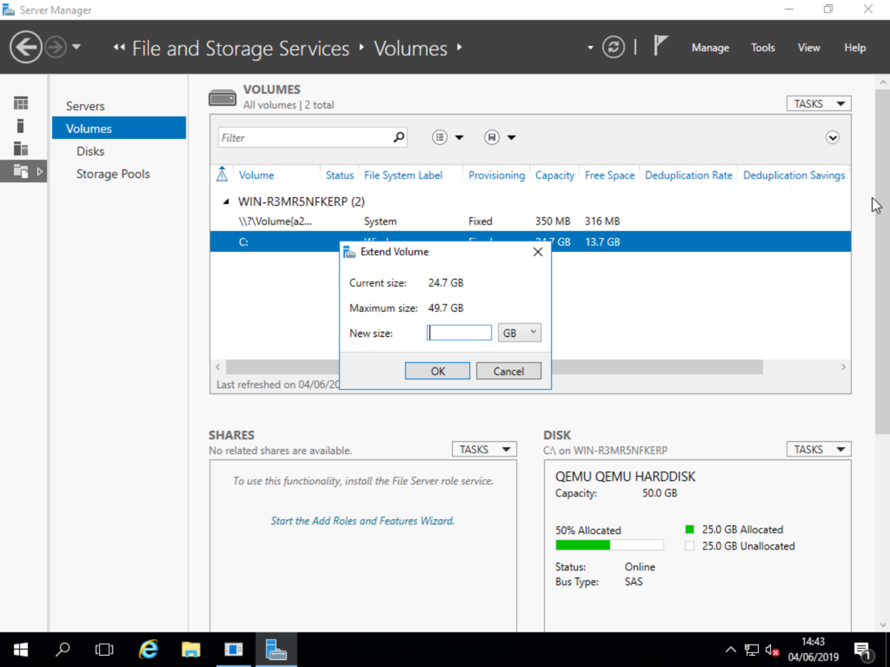

## Objectif

Après avoir augmenté la capacité de stockage de votre VPS, vous devrez repartitionner l'espace disque pour profiter de la taille réelle. Les étapes suivantes décrivent comment procéder.

> [!warning]
>
> Le repartitionnement peut endommager définitivement vos données. OVHcloud ne pourra être tenu responsable de leur détérioration ou de leur perte. Avant de faire quoi que ce soit, pensez donc à bien sauvegarder vos informations. 
>

**Découvrez comment augmenter votre espace de stockage après un upgrade de disque.**

## Prérequis

- Avoir un accès administrateur au VPS ([Windows](#windows)).
- Avoir redémarré le serveur en [mode rescue](/pages/bare_metal_cloud/virtual_private_servers/rescue) (Linux uniquement).

## En pratique

Après une mise à niveau de la mémoire (RAM) ou du processeur (vCores), ces  deux ressources sont automatiquement ajustées sur votre VPS, contrairement à l'espace disque lors de l'upgrade de stockage de votre VPS.

### Linux

#### Sauvegarder vos données

La tentative d’étendre une partition peut entraîner une perte de données. Il est donc **vivement recommandé** de faire une sauvegarde des données de votre VPS.

#### Activer le mode rescue et vérifier les partitions

Si le VPS n'est pas encore en mode rescue, activez-le grâce à [notre guide](/pages/bare_metal_cloud/virtual_private_servers/rescue).

Vous pourrez ensuite vérifier la configuration des disques :

```bash
lsblk
```

La partition correspondant au mode rescue (`sda1` dans cet exemple) est montée dans le répertoire `/`. Quant à lui, le disque du VPS est nommé `sdb` et ne doit avoir aucun point de montage.

Par exemple :

```console
NAME MAJ:MIN RM SIZE RO TYPE MOUNTPOINT
sda 254:0 0 10G 0 disk
└─sda1 254:1 0 10G 0 part /
sdb 254:16 0 25G 0 disk
└─sdb1 254:17 0 25G 0 part
```

Si votre résultat ressemble à l'exemple ci-dessus et que la colonne `MOUNTPOINT` est vide dans la ligne correspondante, vous pouvez passer à [l'étape suivante](#checkfs).

Cependant, si votre résultat montre qu'il y a un point de montage pour la partition VPS, elle doit d'abord être démontée.

Par exemple :

```console
sdb 254:16 0 25G 0 disk
└─sdb1 254:17 0 25G 0 part /mnt/sdb1
```

Dans l'exemple de sortie ci-dessus, la partition `sdb1` est montée à `/mnt/`. Pour redimensionner la partition, celle-ci ne doit pas être montée.

Pour démonter votre partition, utilisez la commande suivante :

```bash
umount /dev/partition_name
```

Dans cet exemple de configuration, la commande serait :

```bash
umount /dev/sdb1
```

#### Vérifier le système de fichiers <a name="checkfs"></a>

Avant de continuer, il est recommandé de vérifier le système de fichiers (`filesystem check`) pour voir s'il y a des erreurs dans la partition. La commande est la suivante :

```sh
e2fsck -yf /dev/sdb1
```

```console
e2fsck 1.42.9 (4-Feb-2014)
Pass 1: Checking inodes, blocks, and sizes
Pass 2: Checking directory structure
Pass 3: Checking directory connectivity
Pass 4: Checking reference counts
Pass 5: Checking group summary information
/dev/sdb1: 37870/1310720 files (0.2% non-contiguous), 313949/5242462 blocks
```

Si vous constatez une erreur, prenez-en connaissance et agissez de la manière la plus adéquate selon votre cas. Vous trouverez ci-dessous quelques-unes des erreurs les plus courantes :

- `bad magic number in superblock` : ne continuez pas. Une procédure pour régler cette difficulté est expliquée dans la partie [« Comment réparer les erreurs **bad magic number in superblock** »](/pages/bare_metal_cloud/virtual_private_servers/upsize_vps_partition#comment-reparer-les-erreurs-bad-magic-number-in-superblock) de cette documentation.

- `/dev/vdb1 has unsupported feature(s): metadata_csum` suivi de `e2fsck: Get a newer version of e2fsck!` : mettez à jour e2fsck. Si la dernière version n’est pas disponible via `apt` (ou autre gestionnaire de paquets), vous devrez la compiler depuis les sources.

#### Ouvrir l’application fdisk

Si la vérification du système de fichiers se finalise correctement, ouvrez l’application `fdisk`. Dans les paramètres, vous devez entrer le nom du disque et non celui de la partition. Par exemple, si votre partition est `sdb1` au lieu de `vdb1`, le nom du disque sera « /dev/sdb ».

```sh
fdisk -u /dev/sdb
```

> [!primary]
>
> Cette application est munie de plusieurs sous-commandes que vous pouvez lister avec la commande `m`.
>

#### Supprimer l’ancienne partition

Avant de supprimer l'ancienne partition, il est recommandé de noter le numéro correspondant au premier secteur de la partition. Vous pouvez obtenir cette information avec la commande `p`{.action}. Elle est indiquée sous le champ `Start`. Conservez cette donnée pour plus tard.

```console
Command (m for help): p
 
Disk /dev/sdb: 21.5 GB, 21474836480 bytes
54 heads, 49 sectors/track, 15851 cylinders, total 41943040 sectors
Units = sectors of 1 * 512 = 512 bytes
Sector size (logical/physical): 512 bytes / 512 bytes
I/O size (minimum/optimal): 512 bytes / 512 bytes
Disk identifier: 0x000132ff
 
Device Boot Start End Blocks Id System
/dev/sdb1 * *2048* 41941745 20969849 83 Linux
```

> [!warning]
>
> Il s’agit du point de non-retour si vous n’avez pas réalisé de sauvegarde de vos données.
>

Supprimez alors la partition avec la commande `d`{.action}.

```console
Command (m for help): d
Selected partition 1
```

L’unique partition sera automatiquement effacée.

#### Créer une nouvelle partition

Vous devez maintenant créer une nouvelle partition avec la commande `n`{.action}. Nous vous recommandons d'utiliser les valeurs par défaut.

```console
Command (m for help): n
Partition type:
p primary (0 primary, 0 extended, 4 free)
e extended
Select (default p): p
Partition number (1-4, default 1): 1
First sector (2048-41943039, default 2048): 2048
Last sector, +sectors or +size{K,M,G} (2048-41943039, default 41943039): 41943039
```

Dans la ligne `First sector`, assurez-vous que la valeur par défaut est la même que celle que vous avez notée précédemment. Si elle diffère, utilisez la valeur que vous avez notée.

### Rendre la partition amorçable (<i>bootable</i>)

Vous devez maintenant vous assurer que la partition est amorçable (<i>bootable</i>). Pour ce faire, utilisez la commande `a`{.action} :

```console
Command (m for help): a
 
Partition number (1-4): 1
```

Enregistrez vos changements et quittez l’application avec la commande `w`{.action} :

```console
Command (m for help): w
 
The partition table has been altered!
 
Calling ioctl() to re-read partition table.
Syncing disks.
```

#### Étendre le système de fichiers sur la partition

La partition a été étendue, mais son système de fichiers (<i>filesystem</i>) occupe toujours le même espace qu’auparavant. Afin de l’étendre, veuillez entrer la commande suivante :

```sh
resize2fs /dev/sdb1
```

```console
resize2fs 1.42.9 (4-Feb-2014)
Resizing the filesystem on /dev/sdb1 to 5242624 (4k) blocks.
The filesystem on /dev/sdb1 is now 5242624 blocks long.
```

#### Vérifier les résultats

Afin de vérifier si l’opération a fonctionné, vous pouvez monter la partition nouvellement créée et regarder sa taille.

```sh
mount /dev/sdb1 /mnt
```
```sh
df -h
```

```console
Filesystem Size Used Avail Use% Mounted on
/dev/sda1 991M 793M 132M 86% /
none 4.0K 0 4.0K 0% /sys/fs/cgroup
udev 1.9G 12K 1.9G 1% /dev
tmpfs 386M 360K 386M 1% /run
none 5.0M 0 5.0M 0% /run/lock
none 1.9G 0 1.9G 0% /run/shm
none 100M 0 100M 0% /run/user
/dev/sdb1 50G 842M 48G 2% /mnt
```

La nouvelle taille de la partition est indiquée en dessous de `size`.

#### Comment réparer les erreurs <i>bad magic number in superblock </i>?

Si la commande `e2fsck`{.action} renvoie le message d'erreur `bad magic number in superblock`, vous devez vérifier et réparer le système de fichiers en prenant un superblock de sauvegarde. Afin de voir les superblocks de sauvegarde disponibles, entrez la commande suivante :

```sh
dumpe2fs /dev/sdb1 | grep superblock
```

```console
Primary superblock at 0, Group descriptors at 1-6
Backup superblock at 32768, Group descriptors at 32769-32774
Backup superblock at 98304, Group descriptors at 98305-98310
Backup superblock at 163840, Group descriptors at 163841-163846
Backup superblock at 229376, Group descriptors at 229377-229382
Backup superblock at 294912, Group descriptors at 294913-294918
Backup superblock at 819200, Group descriptors at 819201-819206
Backup superblock at 884736, Group descriptors at 884737-884742
Backup superblock at 1605632, Group descriptors at 1605633-1605638
Backup superblock at 2654208, Group descriptors at 2654209-2654214
Backup superblock at 4096000, Group descriptors at 4096001-4096006
Backup superblock at 7962624, Group descriptors at 7962625-7962630
Backup superblock at 11239424, Group descriptors at 11239425-11239430
Backup superblock at 20480000, Group descriptors at 20480001-20480006
Backup superblock at 23887872, Group descriptors at 23887873-23887878
```

Utilisez enfin le premier superblock de sauvegarde, afin de vérifier et réparer le système de fichiers :

```sh
fsck -b 32768 /dev/sdb1
```

### Windows <a name="windows"></a>

#### Accéder à File and Storage Services

Vous pouvez le trouver dans le « Server Manager » :

{.thumbnail}

#### Redimensionner le volume

Faites un clic droit sur C: et sélectionnez `Extend Volume...`{.action} 

Vous serez alors invité à choisir votre nouvelle taille de volume :

{.thumbnail}

Entrez la taille souhaitée et cliquez sur `OK`{.action}. Votre volume sera alors étendu.

## Aller plus loin

Échangez avec notre communauté d'utilisateurs sur <https://community.ovh.com>.
