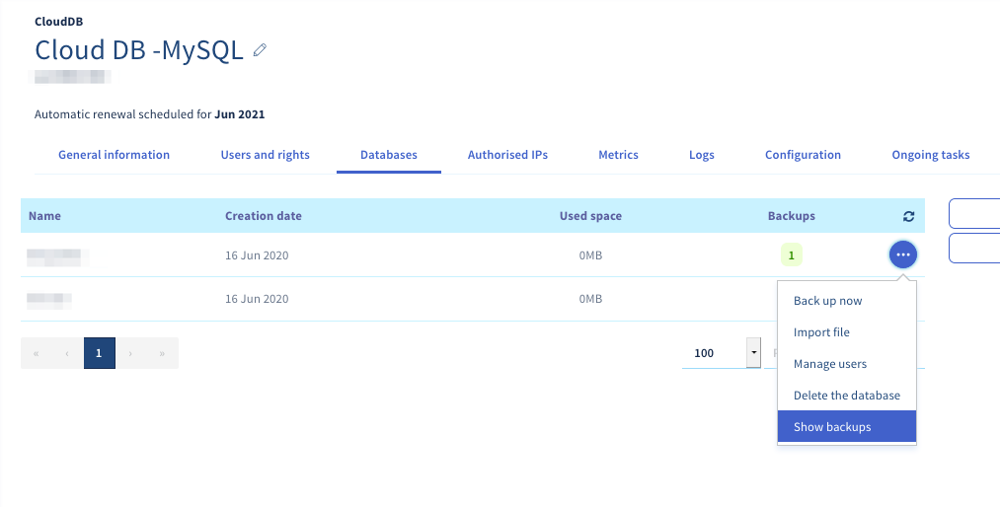

**Letzte Aktualisierung am 03.02.2022**

## Ziel

Ihre Datenbank enthält in der Regel wichtige Datensätze für den Betrieb Ihrer Webseite. Es ist daher von entscheidender Bedeutung, sie sichern oder exportieren zu können.

**Diese Anleitung erklärt, wie Sie Ihre Datenbank auf Ihrem Datenbankserver sichern und exportieren.**

## Voraussetzungen

- Sie verfügen über ein [Cloud Databases](https://www.ovh.de/cloud-databases/).
- Sie haben Zugriff auf Ihr [OVHcloud Kundencenter](https://www.ovh.com/auth/?action=gotomanager&from=https://www.ovh.de/&ovhSubsidiary=de).

## In der praktischen Anwendung

> [!primary]
>
> Beachten Sie, dass die Dienste [Cloud Databases](https://www.ovh.de/cloud-databases/) keinen Zugriff auf den Host gewähren, sondern auf die darauf gehosteten Datenbanken. Es gibt keinen "root"-Zugang. Generische SQL-Befehle funktionieren normal, und Programme wie HeidiSQL, SQuirreL oder Adminer sind vollständig kompatibel.
> 

### Datenbank über das Kundencenter sichern und exportieren

Loggen Sie sich in Ihr [OVHcloud Kundencenter](https://www.ovh.com/auth/?action=gotomanager&from=https://www.ovh.de/&ovhSubsidiary=de) ein und klicken Sie im Bereich `Web Cloud`{.action} auf `Datenbanken`{.action}. Wählen Sie den Datenbanknamen aus und wechseln Sie zum Tab `Datenbanken`{.action}.

In der Spalte **Sicherungen** indiziert die Zahl die für Ihre Datenbank verfügbaren Sicherungen.

> [!primary]
>
> - Backups werden automatisch einmal täglich für alle Datenbanken durchgeführt.
> - Automatische und manuelle Backups werden 30 Tage lang aufbewahrt.
> Nach Ablauf dieser Frist werden sie automatisch gelöscht.

#### 1\. Manuelles Backup durchführen 

Klicken Sie auf `...`{.action} rechts neben der Datenbank und dann auf `Jetzt sichern`{.action}.

{.thumbnail}

#### 2\. Backup exportieren

Klicken Sie auf `...`{.action}. rechts neben der Datenbank und dann auf `Die Sicherungen anzeigen`{.action}.

{.thumbnail}

Die Liste der verfügbaren Backups erscheint. Klicken Sie auf `...`{.action} rechts neben dem ausgewählten Backup und dann auf `Sicherung herunterladen`{.action}, um die Datei anzufordern.

### Eine Datenbank sichern und exportieren

#### 1\. Export von MySQL oder MariaDB Datenbanken

In manchen Fällen kann es sein, dass der auf Ihrem Datenbankserver verfügbare RAM nicht ausreicht, um den gewünschten Export durchzuführen. Ist das der Fall, empfehlen wir Ihnen, das [Tool von OVHcloud im Kundencenter zu verwenden](./#datenbank-uber-das-kundencenter-sichern-und-exportieren).

##### 1\.1 MySQL oder MariaDB Datenbank über OVHcloud phpMyAdmin exportieren 

Um Ihre Datenbank direkt über phpMyAdmin zu exportieren, müssen Sie sich zuerst mit ihr verbinden. Folgen Sie hierzu den Schritten im Abschnitt ["Mit einer MySQL oder MariaDB Datenbank verbinden"](../datenbank-verbindung-auf-bdd/#mit-einer-mysql-oder-mariadb-datenbank-verbinden).

Wenn Sie in phpMyAdmin eingeloggt sind, klicken Sie auf den Namen der Datenbank, die Sie exportieren möchten, und anschließend auf den Tab `Exportieren`{.action}.

Sie haben zwei mögliche Exportmethoden. Wenn Sie keine besonderen Bedürfnisse haben, empfehlen wir Ihnen die Verwendung des Schnellmodus im **SQL**-Format.

{.thumbnail}

##### 1\.2 MySQL oder MariaDB Datenbank über die Kommandozeile exportieren


```bash
mysqldump --host=server --user=benutzername --port=port --password=passwort datenbankname > datenbankname.sql
```

##### 1\.3 MySQL oder MariaDB Datenbank über ein PHP Skript exportieren


```php
1. <?php echo "Ihre Datenbank wird gesichert......."
2. system("mysqldump --host=server --user=benutzername --port=port --password=passwort datenbankname > datenbankname.sql");
3. echo: "Sie können die Datenbank jetzt per FTP abrufen."
4
```

> [!warning]
>
> - Um zu vermeiden, dass jemand auf diese Datei mit sensiblen Daten zugreift, können Sie sie [entsprechend absichern](https://docs.ovh.com/gb/en/hosting/how_to_password_protect_a_directory_on_your_website/).
> - Diese Aktion ist nur von einem [OVHcloud Webhosting](https://www.ovhcloud.com/de/web-hosting/) aus möglich.
>

#### 2\. Export und Import von PostgreSQL-Datenbanken außerhalb des Kundencenters

In manchen Fällen kann es sein, dass der auf Ihrem Datenbankserver verfügbare RAM nicht ausreicht, um den gewünschten Export durchzuführen. Ist das der Fall, empfehlen wir Ihnen, das [Tool von OVHcloud im Kundencenter zu verwenden](./#datenbank-uber-das-kundencenter-sichern-und-exportieren).
 
##### 2\.1 PostgreSQL Datenbank über die Kommandozeile exportieren


```bash
pg_dump --host=server --port=port --user=benutzername --password=passwort datenbankname > datenbankname.sql
```

##### 2\.2 PostgreSQL Datenbank über ein PHP Skript exportieren

```php
1. <?php echo "Ihre Datenbank wird gesichert......."
2. system("PGPASSWORD=passwort pg_dump --host=server --port=port --user=benutzername --password=passwort datenbankname > datenbankname.sql");
3. echo: "Sie können die Datenbank jetzt per FTP abrufen."
4
```

> [!warning]
>
> - Um zu vermeiden, dass jemand auf diese Datei mit sensiblen Daten zugreift, können Sie sie [entsprechend absichern](https://docs.ovh.com/gb/en/hosting/how_to_password_protect_a_directory_on_your_website/).
> - Diese Aktion ist nur von einem [OVHcloud Webhosting](https://www.ovhcloud.com/de/web-hosting/) aus möglich.
>

## Weiterführende Informationen

[Datenbank auf Ihrem Datenbankserver wiederherstellen und importieren](../datenbank-importieren)

Für den Austausch mit unserer User Community gehen Sie auf <https://community.ovh.com/en/>.
