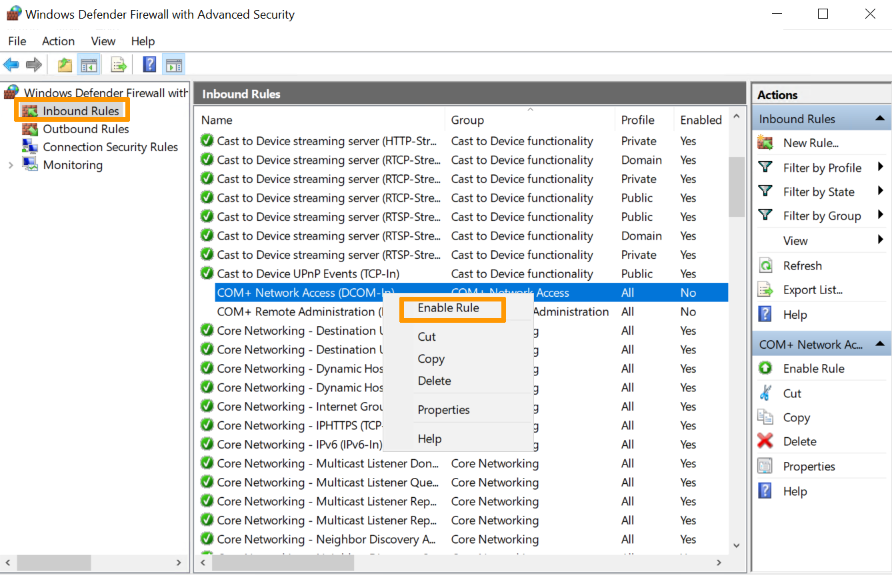
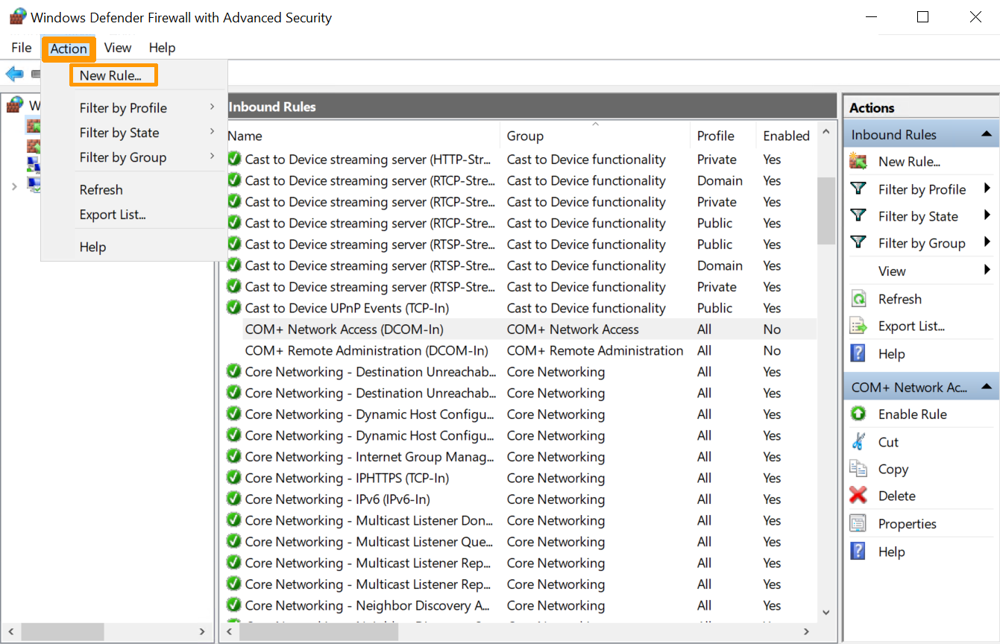
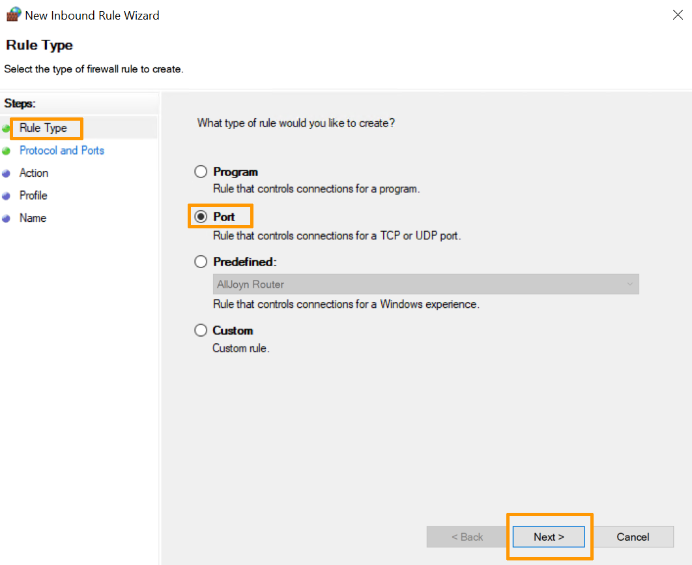
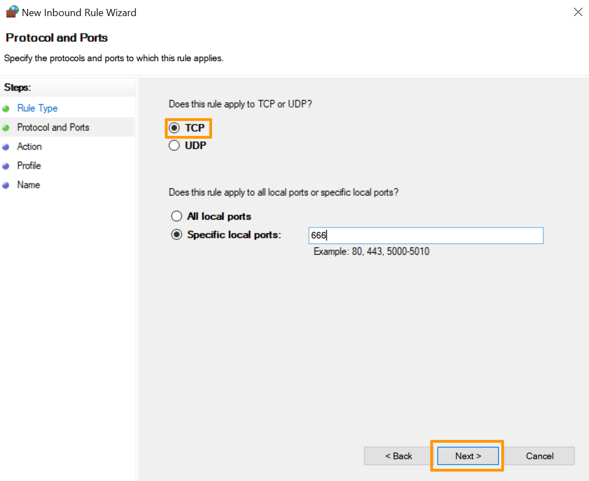
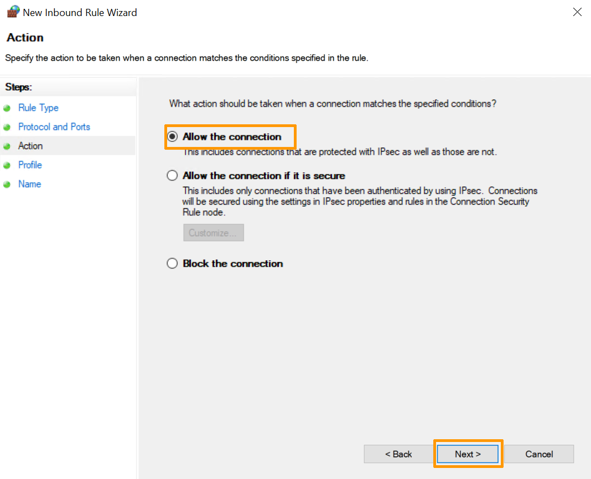
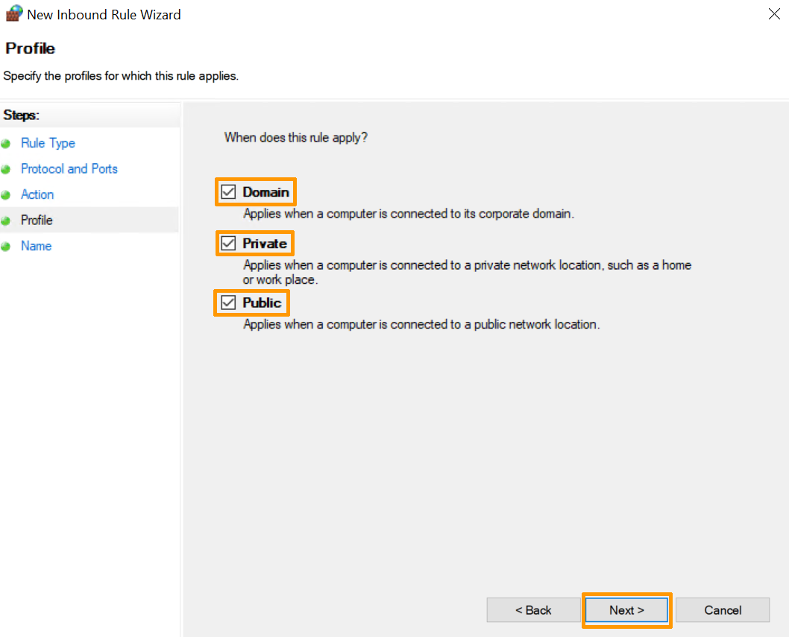
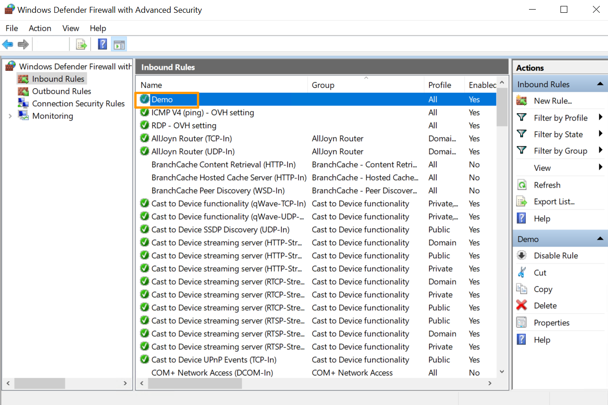

> [!primary]
> Diese Übersetzung wurde durch unseren Partner SYSTRAN automatisch erstellt. In manchen Fällen können ungenaue Formulierungen verwendet worden sein, z.B. bei der Beschriftung von Schaltflächen oder technischen Details. Bitte ziehen Sie beim geringsten Zweifel die englische oder französische Fassung der Anleitung zu Rate. Möchten Sie mithelfen, diese Übersetzung zu verbessern? Dann nutzen Sie dazu bitte den Button “Mitmachen“ auf dieser Seite.
>

**Stand 31.01.2022**

## Ziel

Um Ihr System optimal zu schützen verfügt Ihr Server mit Windows Server über eine eigene integrierte Firewall. Die Konfiguration erlaubt es Ihnen, die Sicherheitsniveaus zu erhöhen und so die Verfügbarkeit und Integrität aller auf dem Server gehosteten Elemente wie Rollen, Dienste und geteilte Ordner zu garantieren.

**In dieser Anleitung erfahren Sie, wie Sie die Firewall-Regeln unter Windows anwenden.**

> [!warning]
>
> OVHcloud stellt Ihnen Dienste zur Verfügung, für die Sie die alleinige Verantwortung tragen. Da wir keinen Zugriff auf diese Maschinen haben, können wir hierfür keinerlei Administrator-Aufgaben übernehmen oder sonstige Hilfeleistung anbieten. Es liegt daher in Ihrer Verantwortung, das Softwaremanagement und die tägliche Sicherheit zu gewährleisten.
>
> Wir stellen Ihnen diese Anleitung zur Verfügung, um Ihnen bei der Bewältigung alltäglicher Verwaltungsaufgaben zu helfen. Dennoch empfehlen wir Ihnen, einen spezialisierten Dienstleister zu kontaktieren, wenn Sie Probleme oder Zweifel hinsichtlich der Administration, Nutzung oder Absicherung eines Servers haben. Genauere Informationen finden Sie im Teil „Weiterführende Informationen" dieser Anleitung.
>

## Voraussetzungen

- Sie verfügen über einen [Dedizierten Server](https://www.ovhcloud.com/de/bare-metal/) unter Windows in Ihrem OVHcloud Account
- Administrator-Zugang zu Ihrem Server über einen entfernten Desktop unter Windows. 

## In der praktischen Anwendung

### Schritt 1: Zugang zur Windows Firewall

Um auf die Windows Firewall zuzugreifen, befolgen Sie folgenden Befehl:

- klicken Sie auf `Starten`{.action};
- klicken Sie auf `Suchen`{.action};
- suchen Sie "Windows Firewall" über die Suchleiste;
- klicken Sie auf `Windows Firewall`{.action}.

Klicken Sie anschließend auf die Zeile `Fortgeschrittene Konfiguration`{.action}.

{.thumbnail}

### Schritt 2: eine Regel für eingehenden Traffic aktivieren

Im angezeigten Fenster finden Sie Einstellungen wie:

- Eingangs- und Ausgangsregeln
- Regeln für die Verbindungssicherheit
- Optionen zur Überwachung der Firewall des Servers

Bei der `Auswahl der eingehenden`{.action} Traffic-Regeln werden alle vorkonfigurierten Windows Server Regeln angezeigt, die mit den Netzwerkverbindungen und eingehenden Paketen verbunden sind. Einige dieser Regeln sind nicht standardmäßig aktiviert. Wenn Sie diese aktivieren möchten, klicken Sie mit der rechten Maustaste auf die Regel und wählen Sie die Option `Die Regel aktivieren`{.action}.

{.thumbnail}

### Schritt 3: eine neue Regel erstellen 

Um eine neue Regel zu erstellen, gehen Sie in das Menü `Aktion`{.action} und wählen Sie `Neue Regel`{.action} aus.
Klicken Sie auf die Option `Neue`{.action} Regel im rechten Feld.

{.thumbnail}

### Schritt 4: den Typ der zu aktivierenden Regel festlegen

Der Assistent wird angezeigt, um den Typ der zu erstellenden Regel zu definieren. Wählen Sie das Feld `Port`{.action} aus.

{.thumbnail}

### Schritt 5: Art des zu aktivierenden Ports festlegen

Geben Sie im nächsten Schritt den Typ des zu aktivierenden Ports an:

{.thumbnail}

> [!primary]
>
>- TCP (Übertragungsprotokoll)
>Es ist ein verbindungsorientiertes Protokoll, das heißt, mit TCP können Verbindungen zwischen diesen hergestellt werden, um Streams zu versenden. Dieses Protokoll gewährleistet, dass die Daten dem Empfänger fehlerfrei und in der gleichen Reihenfolge, in der sie versendet wurden, geliefert werden.
>
>- UDP (User Datagram Protocol - User Datagram Protokoll)
>Es ist ein nicht verbindungsorientiertes Protokoll. Die Entwicklung basiert auf dem Austausch von Datagrammen und erleichtert den Versand von Datagrammen über das Netzwerk. Es ist notwendig, dass Sie zuvor eine Verbindung zum Ziel hergestellt haben.
>
>Sie können auch das Feld `Alle lokalen Ports auswählen`{.action}, um alle TCP oder UDP Ports auf einem unsicheren Server zu aktivieren. Sie können auch das Kästchen `Lokale Ports ankreuzen`{.action}, um zu bestimmen, welcher Port zugelassen werden soll. 
>

### Schritt 6: Verbindung erlauben oder blockieren

Für die Festlegung der Aktion, die diese Regel auslösen wird, stehen folgende Optionen zur Verfügung: Wählen Sie die für Sie passende aus.

- **Verbindung erlauben**. Diese Option ermöglicht die vollständige Kommunikation über diesen Port.
- **Verbindung erlauben, wenn sie gesichert ist**. Diese Option erlaubt die Übertragung der Daten nur, wenn die Verbindung per IPsec authentifiziert wird.
- **Verbindung blockieren**. Diese Option verhindert, dass Daten über diesen Port weitergeleitet werden.

Wählen Sie die Option `Verbindung erlauben`{.action} und klicken Sie auf `Weiter`{.action}. 

{.thumbnail}

### Schritt 7: Profil und Name der anzuwendenden Firewall festlegen

Wählen Sie dann aus, für welche Profile die Regel gelten soll, und zwar aus öffentlichen, Domain- oder privaten Profilen.
Sie können sie alle aktivieren, wenn Sie möchten.

{.thumbnail}

Weisen Sie der neuen Regel (optional) einen Namen und eine Beschreibung zu, um deren Verwendung zu erleichtern:

{.thumbnail}

Klicken Sie auf die Schaltfläche `Beenden`{.action}, um den Vorgang abzuschließen und die neue Regel zu erstellen.

{.thumbnail}

Danach können Sie die neue Regel auf Sicherheitsniveau ändern.

## Weiterführende Informationen

Für den Austausch mit unserer User Community gehen Sie auf <https://community.ovh.com/en/>.
