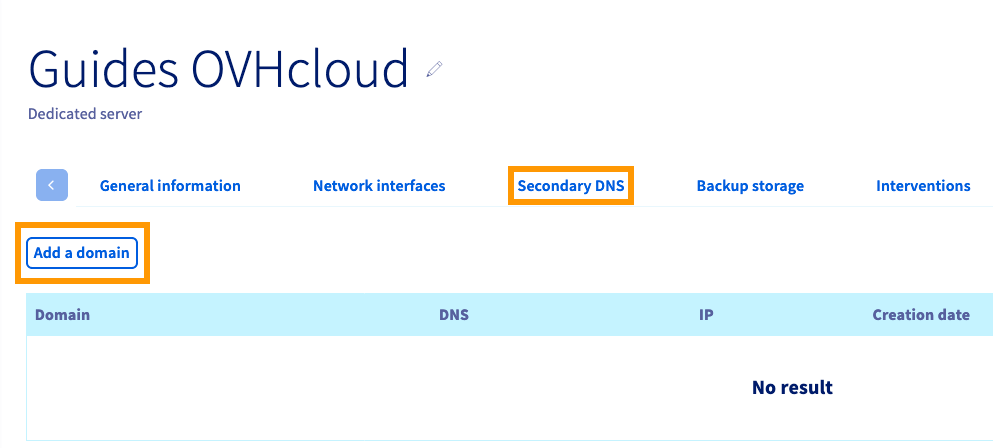
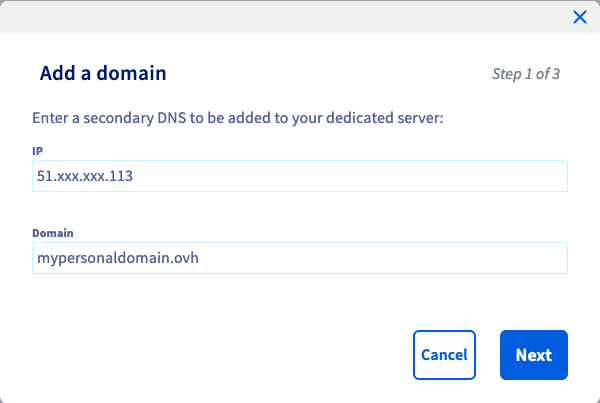
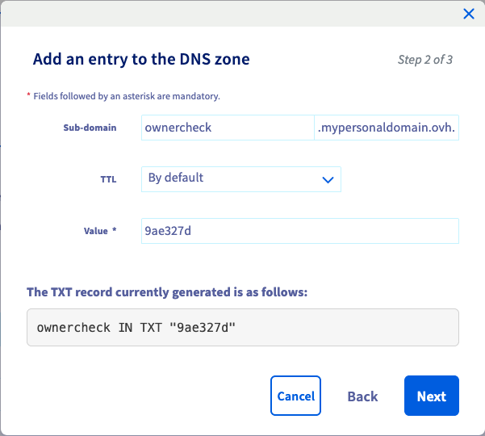

> [!primary]
> Esta tradução foi automaticamente gerada pelo nosso parceiro SYSTRAN. Em certos casos, poderão ocorrer formulações imprecisas, como por exemplo nomes de botões ou detalhes técnicos. Recomendamos que consulte a versão inglesa ou francesa do manual, caso tenha alguma dúvida. Se nos quiser ajudar a melhorar esta tradução, clique em "Contribuir" nesta página.
>

**Última atualização: 12/01/2021**

## Objetivo

Se configurar o seu servidor dedicado como servidor DNS, pode utilizar o DNS secundário para alojar uma zona secundária. Assim, o DNS do seu domínio ficará disponível mesmo que o servidor DNS principal não responda.

**Este guia explica como adicionar o seu domínio à Área de Cliente OVHcloud para utilizar um servidor DNS secundário.**

## Requisitos

- Dispor de um [servidor dedicado](https://www.ovhcloud.com/pt/bare-metal/){.external}.
- Dispor de um [nome de domínio](https://www.ovh.pt/dominios/){.external} para o qual tem a gestão administrativa ou técnica.
- Ter acesso à Área de [Cliente OVHcloud](https://www.ovh.com/auth/?action=gotomanager&from=https://www.ovh.pt/&ovhSubsidiary=pt){.external}.

> [!warning]
>
> A responsabilidade sobre a configuração e a gestão dos serviços que a OVHcloud disponibiliza recai sobre o utilizador. Assim, deverá certificar-se de que estes funcionam corretamente.
> 
> Este guia fornece as instruções necessárias para realizar as operações mais habituais. No entanto, se encontrar dificuldades ou dúvidas relativamente à administração, utilização ou implementação dos serviços num servidor, recomendamos que recorra a um prestador de serviços especializado.
> 

## Instruções

### Adicionar um domínio 

Ligue-se à sua [Área de Cliente OVHcloud](https://www.ovh.com/auth/?action=gotomanager&from=https://www.ovh.pt/&ovhSubsidiary=pt), aceda à secção `Bare Metal Cloud`{.action} e selecione o seu servidor na barra lateral esquerda abaixo dos `Servidores Dedicados`{.action}.

A seguir, clique no separador `DNS secundário`{.action} e no botão `Adicionar domínio`{.action}.

{.thumbnail}

Introduza o seu endereço IP e o domínio a adicionar, e clique em `Seguinte`{.action}.

{.thumbnail}

Depois de clicar em `Seguinte`{.action} nesta etapa, a verificação do domínio será ativada. Se ainda não adicionou um registo TXT à sua zona DNS, siga as instruções [descritas abaixo](#verificationdomaine). Caso contrário, clique em `Seguinte`{.action}.

{.thumbnail}

Depois de clicar em `Adicionar`{.action} na última janela, o domínio será adicionado ao servidor DNS secundário OVHcloud.

Os domínios adicionados serão listados neste separador e podem ser eliminados ao clicar no botão `..`{.action}. O nome do servidor DNS secundário aparece ao lado do domínio.

{.thumbnail}

> [!primary]
>
> As outras ações necessárias para configurar o seu próprio DNS para o seu domínio são geralmente as seguintes:
>
> - configuração de um serviço DNS (como *BIND*)
> - configuração dos registos GLUE
> - autorização das transferências de zona
>
> Recorra à documentação externa adequada caso necessite de informações adicionais para completar estas tarefas administrativas.

### Verificação da autorização para o domínio 

É necessário confirmar a sua autorização para gerir o domínio em questão antes de poder adicioná-lo ao DNS secundário da OVHcloud. Isto é feito através de uma pesquisa DNS automatizada no subdomínio *ownercheck.oseutrenomdedominio*. Para este efeito, é gerada uma cadeia única de caracteres que é apresentada na Área de Cliente OVHcloud.

- Se o domínio for gerido por um agente de registo externo ou utilizar servidores DNS externos nesta fase, aceda à Área de Cliente do seu fornecedor DNS e adicione um registo TXT com o subdomínio "ownercheck" e o valor fornecido na etapa 2 da [Adicionar domínio"](#ajoutdomaine).

- Se o domínio é gerido pela OVHcloud como servidor de registo e utiliza servidores DNS da OVHcloud, feche a janela ao clicar em `Anular`{.action}. De seguida, pode seguir as instruções [deste manual](../../domains/alojamento_partilhado_como_editar_a_minha_zona_dns/) para adicionar o registo TXT à [Área de Cliente OVHcloud](https://www.ovh.com/auth/?action=gotomanager&from=https://www.ovh.pt/&ovhSubsidiary=pt).

{.thumbnail}

Depois de adicionar corretamente o registo TXT à zona DNS do domínio, repita os [passos acima](#ajoutdomaine) e conclua o procedimento.

## Quer saber mais?

[Editar uma zona DNS da OVHcloud](../../domains/alojamento_partilhado_como_editar_a_minha_zona_dns/){.external}

Junte-se à nossa comunidade de utilizadores em <https://community.ovh.com/en/>.