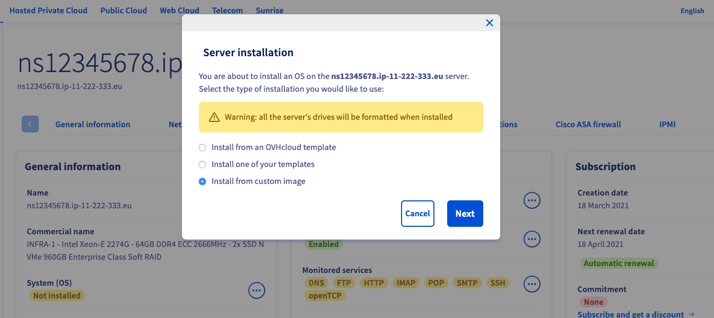

**Última atualização: 28/03/2022**

## Objetivo

Graças à tecnologia Bring Your Own Image, é-lhe agora possível implementar imagens *cloudready* diretamente nos seus servidores dedicados. Assim, pode utilizar o produto bare metal como recurso para as suas implementações.

**O que significa *cloudready*?**
 Numa frase, ser agnóstico da infraestrutura na qual a imagem começa.
Para além dos requisitos e limitações citados abaixo, é necessário assegurar que a imagem (recuperada, gerada) responde à boa definição das expetativas técnicas de uma imagem cloudready. A imagem deve ser capaz de bootar corretamente qualquer que seja a tipologia de servidor em que começa, deve também embarcar o serviço Cloud Init no caso de utilização de um Config Drive. Por último, as configurações do sistema devem permitir que o SO se inicie plenamente, em especial as relativas à rede.

**Saiba como configurar BringYourOwnImage a partir da APIv6 OVHcloud**

## Requisitos

- Dispor de um [servidor dedicado da OVHcloud](https://www.ovhcloud.com/pt/bare-metal/).
- Ter acesso à [Área de Cliente OVHcloud](https://www.ovh.com/auth/?action=gotomanager&from=https://www.ovh.pt/&ovhSubsidiary=pt) para a secção ["Implementação através da Área de Cliente"](#viacontrolpanel) deste manual.
- Ter acesso às [API OVHcloud](https://api.ovh.com/){.external} para a parte ["Implementação através da API"](#viaapi) deste manual.
- Ter gerado os [credenciais para utilizar a APIv6](https://docs.ovh.com/pt/api/first-steps-with-ovh-api/) para a parte ["Implementação através da API"](#viaapi) deste manual.
- A dimensão da sua imagem deve ser inferior ao(s) disco(s) instalado(s) no servidor.

> [!warning]
>
> Uma nova instalação por BringYourOwnImage apagará a integralidade dos dados presentes no servidor.
>

## Instruções

**Limitações técnicas**

Atualmente, ainda existem algumas limitações técnicas relacionadas com a utilização de produtos físicos, como os servidores dedicados.
Tenha em conta os imperativos listados abaixo aquando da sua preparação de implementação. Esta lista não é exaustiva.

- O tipo de boot: **uefi** ou **legacy**
- O tipo de partição: **MBR** ou **GPT**
- O formato de imagem: **qcow2** ou **raw**

Se o seu servidor dispõe de um boot **uefi**, certifique-se de que adiciona uma partição **EFI** ao template da sua imagem.

**Métodos de implantação**

- [Implementação através da Área de Cliente](#viacontrolpanel)\: permitir-lhe-á implementar rápida e facilmente a sua imagem diretamente a partir da sua Área de Cliente OVHcloud.
- [Implementação através da API](#viaapi)\: pode utilizar as API OVHcloud para as integrar nos seus próprios scripts para automatizar a implementação.

### Implementar a sua imagem a partir da Área de Cliente OVHcloud 

Na sua [Área de Cliente OVHcloud](https://www.ovh.com/auth/?action=gotomanager&from=https://www.ovh.com/fr/&ovhSubsidiary=fr), na secção `Bare Metal Cloud`{.action}, e depois `Servidores Dedicados`{.action}, selecione o seu servidor.

Na secção `Informações gerais`, clique no botão `...`{.action} em frente `Informações gerais`. Finalmente, clique em `Instalar`{.action}.

{.thumbnail}

Na nova janela, selecione `Instalar a partir de uma imagem personalizada`{.action} e, a seguir, clique em `Instalar`{.action}.

{.thumbnail}

Será reencaminhado para a página de configuração. Certifique-se de que o URL da sua imagem está no formato apropriado. Preencha os campos restantes nesta página. Quando confirmar que as informações estão corretas, clique em `Instalar o sistema`{.action}.

Encontre os detalhes das opções na secção ["Tabelas de opções"](#options) deste manual. 

No que diz respeito à ativação do `ConfigDrive`, consulte a documentação [nesta página](https://cloudinit.readthedocs.io/en/latest/topics/datasources/configdrive.html).

{.thumbnail}

### Implementar a sua imagem a partir das API 

Aceda a [https://api.ovh.com/](https://api.ovh.com/){.external} e aceda à secção `/dedicated/server`{.action}. O campo `Filter` permite-lhe pesquisar "BringYourOwnImage".

Dispõe de três chamadas API associadas à funcionalidade BringYourOwnImage.

{.thumbnail}

Para criar e implementar a sua imagem, utilize a seguinte chamada e complete os campos necessários:

> [!api]
>
> @api {POST} /dedicated/server/{serviceName}/bringYourOwnImage
>

| Campo | Descrição |
|-|-|
| serviceName | O nome do seu servidor. |
| URL | O URL onde pode recuperar a sua imagem. |
| checkSum | O checksum da sua imagem. |
| checkSumType | O checksum da imagem a implementar (md5, sha1, sha256, sha512). |
| description | O nome da sua imagem. |
| diskGroupId | O ID do disco que deve ser utilizado. |
| hostname | O hostname do seu servidor. |
| httpHeader | Apenas se necessário para descarregar a imagem. |
| sshKey | A sua chave SSH pública. |
| type | O tipo/formato da sua imagem (qcow2, raw, ova). |
| userData | O seu script de pós-instalação. |
| userMetadados | Metadados utilizados por Nova no momento do boot. |

{.thumbnail}

Depois de preencher os campos, lance a implementação clicando em `Execute`{.action}.

### Verificar a implementação

Pode seguir a implementação da sua imagem através da chamada API abaixo ou através do KVM / [IPMI](../usar-ipmi-servidores-dedicados/).

> [!api]
>
> @api {GET} /dedicated/server/{serviceName}/bringYourOwnImage
>

Neste exemplo, a implementação está em curso de arranque.

{.thumbnail}

A implementação pode durar cerca de dez minutos. Terminada a operação, o estado da sua implementação passará para "done" e o seu servidor será reiniciado no disco.

### Eliminar a implementação

Pode optar por eliminar a sua implementação graças à seguinte chamada:

> [!api]
>
> @api {DELETE} /dedicated/server/{serviceName}/bringYourOwnImage
>

Isto eliminará o estado da implementação e colocará o seu servidor em modo rescue.

## Quer saber mais?

Fale com a nossa comunidade de utilizadores em <https://community.ovh.com/en/>.
