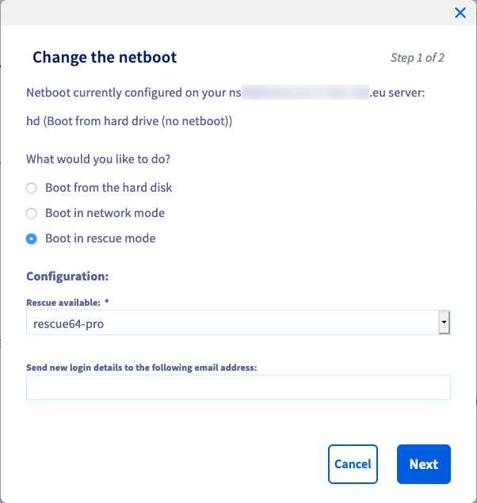
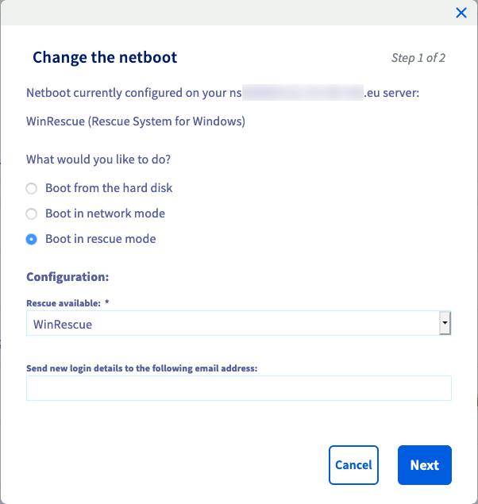
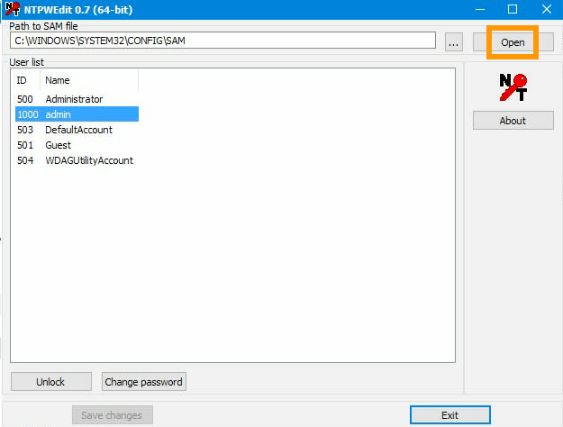

**Letzte Aktualisierung am 07.01.2021**

## Ziel

Bei der Installation oder Neuinstallation eines Windows-Betriebssystems wird Ihnen ein Passwort für den Root-Zugriff zugeteilt. Wir empfehlen dringend, dass Sie dieses ursprüngliche Passwort ändern, wie in unserer Anleitung zum [Absichern eines Servers](../dedizierten-server-sichern/) beschrieben. Wenn Sie Ihr Administrator-Passwort verloren haben, müssen Sie es im Rescue-Modus zurücksetzen.

**Diese Anleitung führt Sie durch die notwendigen Schritte zur Änderung des Admin-Passworts Ihres Servers mittels der für ein Windows-Betriebssystem verfügbaren Rescue-Modus-Optionen.**

## Voraussetzungen

- Sie verfügen über einen [Dedicated Server](https://www.ovhcloud.com/de/bare-metal/){.external}, auf dem Windows installiert ist in Ihrem Kunden-Account.
- Sie haben Zugriff auf Ihr [OVHcloud Kundencenter](https://www.ovh.com/auth/?action=gotomanager&from=https://www.ovh.de/&ovhSubsidiary=de).


## In der praktischen Anwendung

Die folgenden Schritte beschreiben den Vorgang zur Änderung des lokalen Admin-Passworts im OVHcloud Rescue-Modus (basierend auf Linux), der jederzeit verfügbar ist. Wenn Sie Windows PE (WinRescue) verwenden möchten, springen Sie zum Ende [dieser Anleitung](#winrescue). 

### Schritt 1: Server im Rescue-Modus neu starten <a name="bootinrescue"></a>

Das System muss im Rescue-Modus gestartet werden, bevor das Administrator-Passwort geändert werden kann. Loggen Sie sich im [OVHcloud Kundencenter](https://www.ovh.com/auth/?action=gotomanager&from=https://www.ovh.de/&ovhSubsidiary=de) ein, gehen Sie in den Bereich `Bare Metal Cloud`{.action} und wählen Sie Ihren Server in der linken Navigationsleiste unter `Dedicated Server`{.action} aus.

Der Netboot-Modus muss auf "rescue64-pro (Customer rescue system (Linux))" umgestellt werden. Suchen Sie nach "Boot" im Bereich **Allgemeine Informationen** und klicken Sie auf `...`{.action}, dann auf `Bearbeiten`{.action}.
<br>Setzen Sie im angezeigten Fenster einen Haken bei **Im Rescue-Modus booten** und wählen Sie "rescue64-pro" im Menü aus. Geben Sie im letzten Feld eine E-Mail-Adresse an, wenn die Login-Daten an eine andere Adresse als die Hauptadresse Ihres OVHcloud-Accounts gesendet werden sollen.

Klicken Sie auf `Weiter`{.action} und dann auf `Bestätigen`{.action}.

{.thumbnail}

Wenn die Änderung abgeschlossen ist, klicken Sie auf `...`{.action}. rechts von "Status" unter **Dienstleistungsstatus**.
<br>Klicken Sie auf `Neu starten`{.action} starten und der Server wird in den Rescue-Modus versetzt.<br>
Die Durchführung dieser Operation kann einige Minuten dauern. Sie können den Fortschritt im Tab `Tasks`{.action} überprüfen. Es wird Ihnen eine E-Mail mit zusätzlichen Informationen sowie den Zugangsdaten des Root-Benutzers für den Rescue-Modus zugesandt.

{.thumbnail}

Weitere Informationen zum Rescue-Modus finden Sie in [dieser Anleitung](../ovh-rescue/).

### Schritt 2: Systempartition mounten

Verbinden Sie sich via SSH mit Ihrem Server. (Wenn nötig, lesen Sie die Anleitung [zu SSH](../ssh-einfuehrung/).) Bei Windows-Servern finden Sie Partitionen vom Typ "Microsoft LDM Data" vor:

```
# fdisk -l
Disk /dev/sda: 1.8 TiB, 2000398934016 bytes, 3907029168 sectors
Units: sectors of 1 * 512 = 512 bytes
Sector size (logical/physical): 512 bytes / 512 bytes
I/O size (minimum/optimal): 512 bytes / 512 bytes
Disklabel type: gpt
Disk identifier: 54A5B25A-75B9-4355-9185-8CD958DCF32A
 
Device          Start        End    Sectors  Size Type
/dev/sda1        2048     718847     716800  350M EFI System
/dev/sda2      718848     720895       2048    1M Microsoft LDM metadata
/dev/sda3      720896     980991     260096  127M Microsoft reserved
/dev/sda4      980992 3907028991 3906048000  1.8T Microsoft LDM data
/dev/sda5  3907028992 3907029134        143 71.5K Microsoft LDM data
```

In diesem Beispiel lässt sich "sda4" anhand der Größe als Systempartition identifizieren. Normalerweise wird zusätzlich eine gespiegelte Ausgabe unter obigem Befehl angezeigt; hier wäre die Bezeichung "/dev/sdb**X**". In den meisten Fällen verfügt der Server nämlich über mehrere Festplatten mit identischem Partitionsschema. Für den Vorgang zur Zurücksetzung des Passworts ist nur ersteres von Belang. 

Wählen Sie nun die entsprechende Partition zum Mounten aus:

```
# mount /dev/sda4 /mnt
```

Überprüfen Sie den Mountpoint:


```
# lsblk
NAME   MAJ:MIN RM  SIZE RO TYPE MOUNTPOINT
sdb      8:16   0  1.8T  0 disk
├─sdb4   8:20   0  1.8T  0 part
├─sdb2   8:18   0    1M  0 part
├─sdb5   8:21   0 71.5K  0 part
├─sdb3   8:19   0  127M  0 part
└─sdb1   8:17   0  350M  0 part
sda      8:0    0  1.8T  0 disk
├─sda4   8:4    0  1.8T  0 part /mnt
├─sda2   8:2    0    1M  0 part
├─sda5   8:5    0 71.5K  0 part
├─sda3   8:3    0  127M  0 part
└─sda1   8:1    0  350M  0 part
```

Im Beispiel oben war die Operation erfolgreich. Wenn das Mounten fehlgeschlagen ist, erhalten Sie wahrscheinlich eine Fehlermeldung wie diese: 

```
The disk contains an unclean file system (0, 0).
Metadata kept in Windows cache, refused to mount.
Failed to mount '/dev/sda4': Operation not permitted
The NTFS partition is in an unsafe state. Please resume and shutdown
Windows fully (no hibernation or fast restarting), or mount the volume
read-only with the 'ro' mount option.
```

Verwenden Sie in diesem Fall den folgenden Befehl und versuchen Sie dann, die Partition erneut zu mounten.

```
# ntfsfix /dev/sda4
# mount /dev/sda4 /mnt
```

### Schritt 3: Aktuelles Passwort löschen

In diesem Schritt wird die *SAM*-Datei mit einem Tool (chntpw) editiert, um das Passworts des Admin-Benutzers zu entfernen. Wechseln Sie zum Windows-Systempfad und lassen Sie die Liste der Windows-Benutzer ausgeben:

```
# cd /mnt/Windows/System32/config
/mnt/Windows/System32/config# chntpw -l SAM

chntpw version 1.00 140201, (c) Petter N Hagen
Hive <SAM> name (from header): <\SystemRoot\System32\Config\SAM>
ROOT KEY at offset: 0x001020 * Subkey indexing type is: 686c <lh>
File size 65536 [10000] bytes, containing 8 pages (+ 1 headerpage)
Used for data: 359/39024 blocks/bytes, unused: 33/18064 blocks/bytes.

| RID -|---------- Username ------------| Admin? |- Lock? --|
| 03e8 | admin                          | ADMIN  | dis/lock |
| 01f4 | Administrator                  | ADMIN  | dis/lock |
| 01f7 | DefaultAccount                 |        | dis/lock |
| 01f5 | Guest                          |        | dis/lock |
| 01f8 | WDAGUtilityAccount             |        | dis/lock |
```

Löschen Sie das Passwort des Administrator-Benutzers mit folgendem Befehl. (Wählen Sie "Administrator" aus, wenn "admin" nicht existiert.)

```
# chntpw -u admin SAM
chntpw version 1.00 140201, (c) Petter N Hagen
Hive <SAM> name (from header): <\SystemRoot\System32\Config\SAM>
ROOT KEY at offset: 0x001020 * Subkey indexing type is: 686c <lh>
File size 65536 [10000] bytes, containing 8 pages (+ 1 headerpage)
Used for data: 361/39344 blocks/bytes, unused: 35/13648 blocks/bytes.
 
================= USER EDIT ====================
 
RID     : 1000 [03e8]a
Username: admin
fullname:
comment :
homedir :
 
00000221 = Users (which has 3 members)
00000220 = Administrators (which has 2 members)
 
Account bits: 0x0010 =
[ ] Disabled        | [ ] Homedir req.    | [ ] Passwd not req. |
[ ] Temp. duplicate | [X] Normal account  | [ ] NMS account     |
[ ] Domain trust ac | [ ] Wks trust act.  | [ ] Srv trust act   |
[ ] Pwd don't expir | [ ] Auto lockout    | [ ] (unknown 0x08)  |
[ ] (unknown 0x10)  | [ ] (unknown 0x20)  | [ ] (unknown 0x40)  |
 
Failed login count: 0, while max tries is: 0
Total  login count: 5
 
- - - - User Edit Menu:
 1 - Clear (blank) user password
(2 - Unlock and enable user account) [seems unlocked already]
 3 - Promote user (make user an administrator)
 4 - Add user to a group
 5 - Remove user from a group
 q - Quit editing user, back to user select
Select: [q] >
```

Tippen Sie "1" ein und drücken Sie auf Enter ("↩"). (Verwenden Sie zuerst Option 2, falls ein "X" neben "Disabled" erscheint.)

```
Select: [q] > 1
Password cleared!
================= USER EDIT ====================
 
RID     : 1000 [03e8]
Username: admin
fullname:
comment :
homedir :
 
00000221 = Users (which has 3 members)
00000220 = Administrators (which has 2 members)
 
Account bits: 0x0010 =
[ ] Disabled        | [ ] Homedir req.    | [ ] Passwd not req. |
[ ] Temp. duplicate | [X] Normal account  | [ ] NMS account     |
[ ] Domain trust ac | [ ] Wks trust act.  | [ ] Srv trust act   |
[ ] Pwd don't expir | [ ] Auto lockout    | [ ] (unknown 0x08)  |
[ ] (unknown 0x10)  | [ ] (unknown 0x20)  | [ ] (unknown 0x40)  |
 
Failed login count: 0, while max tries is: 0
Total  login count: 5
** No NT MD4 hash found. This user probably has a BLANK password!
** No LANMAN hash found either. Try login with no password!
 
- - - - User Edit Menu:
 1 - Clear (blank) user password
(2 - Unlock and enable user account) [seems unlocked already]
 3 - Promote user (make user an administrator)
 4 - Add user to a group
 5 - Remove user from a group
 q - Quit editing user, back to user select
Select: [q] >
```

Tippen Sie "q" ein und drücken Sie auf Enter, um das Tool zu verlassen. Geben Sie "y" ein, wenn Sie dazu aufgefordert werden, und drücken Sie nochmals auf Enter.

```
Select: [q] > q
 
Hives that have changed:
 #  Name
 0  <SAM>
Write hive files? (y/n) [n] : y
 0  <SAM> - OK
```

### Schritt 4: Server neu starten 

Beginnen Sie damit, den Netboot-Modus im [OVHcloud Kundencenter](https://www.ovh.com/auth/?action=gotomanager&from=https://www.ovh.de/&ovhSubsidiary=de) wieder auf **Von Festplatte booten** umzustellen (siehe [Schritt 1](#bootinrescue)). 

Über die Kommandozeile trennen Sie die Partition wieder ab und starten den Server neu mit den folgenden Befehlen:

```
# cd
# umount /mnt
# reboot

Broadcast message from root@rescue.ovh.net on pts/0 (Wed 2020-05-27 11:28:53 CEST):

System is going down for reboot NOW!
```

### Schritt 5: Ein neues Passwort festlegen (IPMI) <a name="passwordreset"></a>

Gehen Sie im [OVHcloud Kundencenter](https://www.ovh.com/auth/?action=gotomanager&from=https://www.ovh.de/&ovhSubsidiary=de) auf den Tab `IPMI`{.action}, um eine KVM-Session zu öffnen.

{.thumbnail}

#### Schritt 5.1: für eine neuere Windows-Version

Das Login-Interface sollte eine Nachricht anzeigen, die den Ablauf des Passworts anzeigt.

{.thumbnail}

Das neue Passwort des Admin-Benutzers muss nun zweimal eingegeben werden. Das Bestätigungsfeld ist jedoch noch nicht sichtbar, was bedeutet, dass Sie das erste Feld leer lassen, Ihr neues Passwort in das zweite Feld eingeben und dann die Tabulatortaste ("↹") der (virtuellen) Tastatur verwenden müssen, um zum dritten Feld ("Passwort bestätigen") zu wechseln.
<br>Geben Sie das Passwort erneut ein und klicken Sie auf den Pfeil, um es zu speichern.

{.thumbnail}

Klicken Sie nun auf `OK`{.action} und Sie werden eingeloggt.

{.thumbnail}

#### Schritt 5.2: für eine ältere Windows-Version

Ein Kommandozeilenfenster (cmd) sollte sich öffnen, wenn die KVM-Sitzung abgeschlossen ist.

Legen Sie das Passwort des aktuellen Benutzers ("Administrator") fest:

```
net user Administrator *
```

{.thumbnail}

> [!primary]
>
Es wird empfohlen, bei der Eingabe von Passwörtern in dieses Interface die virtuelle Tastatur zu verwenden.
>


### Zurücksetzen des Admin-Passworts mit WinRescue <a name="winrescue"></a>

#### Schritt 1: Server im Rescue-Modus neu starten <a name="bootinwinrescue"></a>

Das System muss im Rescue-Modus gestartet werden, bevor das Administrator-Passwort geändert werden kann. Loggen Sie sich im [OVHcloud Kundencenter](https://www.ovh.com/auth/?action=gotomanager&from=https://www.ovh.de/&ovhSubsidiary=de) ein, gehen Sie in den Bereich `Bare Metal Cloud`{.action} und wählen Sie Ihren Server in der linken Navigationsleiste unter `Dedicated Server`{.action} aus.

Der Netboot-Modus muss auf "WinRescue (Rescue System for Windows)" umgestellt werden. Suchen Sie nach "Boot" im Bereich **Allgemeine Informationen** und klicken Sie auf `...`{.action}, dann auf `Bearbeiten`{.action}.
<br>Setzen Sie im angezeigten Fenster einen Haken bei **Im Rescue-Modus booten** und wählen Sie "WinRescue" im Menü aus. Geben Sie im letzten Feld eine E-Mail-Adresse an, wenn die Login-Daten an eine andere Adresse als die Hauptadresse Ihres OVHcloud-Accounts gesendet werden sollen. 

Klicken Sie auf `Weiter`{.action} und dann auf `Bestätigen`{.action}.

{.thumbnail}

Wenn die Änderung abgeschlossen ist, klicken Sie auf `...`{.action}. rechts von "Status" unter **Dienstleistungsstatus**.
<br>Klicken Sie auf `Neu starten`{.action} starten und der Server wird in den Rescue-Modus versetzt.<br>
Die Durchführung dieser Operation kann einige Minuten dauern. Sie können den Fortschritt im Tab `Tasks`{.action} überprüfen. Es wird Ihnen eine E-Mail mit zusätzlichen Informationen sowie den Zugangsdaten des Root-Benutzers für den Rescue-Modus zugesandt.

{.thumbnail}

Weitere Informationen zum Rescue-Modus finden Sie in [dieser Anleitung](../ovh-rescue/).

#### Schritt 2: Derzeitiges Passwort löschen

Gehen Sie im [OVHcloud Kundencenter](https://www.ovh.com/auth/?action=gotomanager&from=https://www.ovh.de/&ovhSubsidiary=de) auf den Tab `IPMI`{.action}, um eine KVM-Session zu öffnen.

{.thumbnail}

Um Passwörter zurückzusetzen, ist das Tool NTPWEdit erforderlich. Wenn Sie über KVM eingeloggt sind, öffnen Sie den Browser und laden Sie die Anwendung von der [offiziellen Website](http://www.cdslow.org.ru/en/ntpwedit/) herunter. 

Öffnen Sie den Ordner, in dem sich die heruntergeladene ZIP-Datei befindet, und extrahieren Sie den Inhalt. Öffnen Sie anschließend die ausführbare Datei *ntwedit64*, um die Anwendung zu starten.

{.thumbnail}

In diesem Interface können Sie die *SAM*-Datei bearbeiten, um das Passwort des Admin-Benutzers zu löschen. Deren Standardpfad im *WINDOWS*-Systemverzeichnis ist vorausgefüllt. Öffnen Sie die Datei, um die Liste der Benutzer anzuzeigen, indem Sie auf `Open`{.action} klicken.

Der relevante Benutzer ist entweder "admin" oder "Administrator", entsprechend der Windows-Version. Sind beide vorhanden, wählen Sie "admin" aus. Klicken Sie anschließend auf `Change password`{.action}.

{.thumbnail}

Lassen Sie im nächsten Dialog die Felder leer und klicken Sie auf `OK`{.action}. Klicken Sie zum Abschluss auf `Save changes`{.action} und dann auf `Exit`{.action}.

Der Server muss dann neu gestartet werden.

#### Schritt 3: Server neu starten 

Beginnen Sie damit, den Netboot-Modus im [OVHcloud Kundencenter](https://www.ovh.com/auth/?action=gotomanager&from=https://www.ovh.de/&ovhSubsidiary=de) wieder auf **Von Festplatte booten** umzustellen (siehe [Schritt 1](#bootinwinrescue)).

Wechseln Sie wieder zum Fenster der KVM-Sitzung und wählen Sie die Herunterfahren-Option `Neu starten`{.action} über den Windows-Button unten links aus.

Fahren Sie anschließend fort mit [Schritt 5: Ein neues Passwort festlegen (IPMI)](#passwordreset) dieser Anleitung.

## Weiterführende Informationen

[Rescue-Modus aktivieren und verwenden](../ovh-rescue/)

[Verwendung der IPMI-Konsole für Dedicated Server](../verwendung-ipmi-dedicated-server/)

Für den Austausch mit unserer Community gehen Sie auf <https://community.ovh.com/en/>.