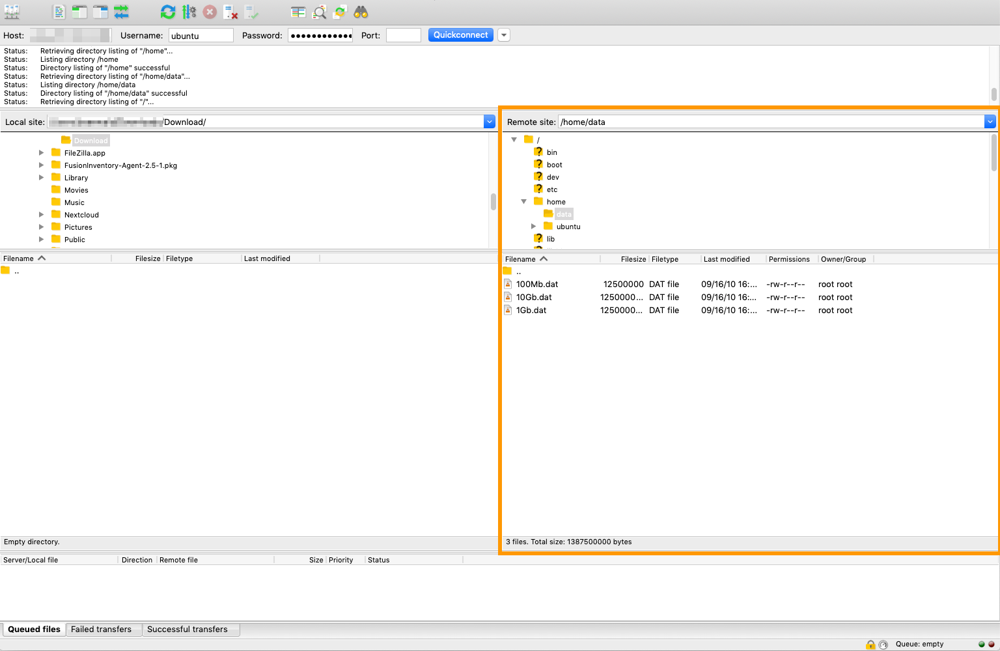

> [!primary]
> Tłumaczenie zostało wygenerowane automatycznie przez system naszego partnera SYSTRAN. W niektórych przypadkach mogą wystąpić nieprecyzyjne sformułowania, na przykład w tłumaczeniu nazw przycisków lub szczegółów technicznych. W przypadku jakichkolwiek wątpliwości zalecamy zapoznanie się z angielską/francuską wersją przewodnika. Jeśli chcesz przyczynić się do ulepszenia tłumaczenia, kliknij przycisk „Zaproponuj zmianę” na tej stronie.
>

**Ostatnia aktualizacja z dnia 18-05-2021**

## Wprowadzenie

W procesie migracji może być konieczne pobranie danych z serwera dedykowanego, a następnie przesłanie ich na inną maszynę. Protokół Secure File Transfer Protocol (SFTP) umożliwia szybki i łatwy transfer plików przez bezpieczne połączenie SSH.

**Tutorial ten wyjaśnia, jak przesyłać lub pobierać dane z serwera dedykowanego za pomocą SFTP.**

> [!warning]
>Tutorial przedstawia zastosowanie jednego lub kilku rozwiązań OVHcloud w powiązaniu z zewnętrznymi narzędziami i opisuje operacje, jakie należy wykonać w konkretnym przypadku. Wybierz odpowiednie dla Ciebie rozwiązanie. Jeśli napotkasz trudności podczas przeprowadzania tych operacji, skontaktuj się z wyspecjalizowanym dostawcą usług administracyjnych i/lub zadaj pytanie na forum społeczności OVHcloud <https://community.ovh.com/en/>. Niestety OVH nie jest w stanie udzielić Ci wsparcia w tym zakresie.
>

## Wymagania początkowe

- Serwer [dedykowany](https://www.ovhcloud.com/pl/bare-metal/){.external}, na którym zainstalowana jest dystrybucja GNU/Linux.
- Klient FTP, który obsługuje połączenia SFTP (ten przewodnik dokumentuje korzystanie z [FileZilla](https://filezilla-project.org/){.external}).
- Dostęp administracyjny przez SSH do Twojego serwera.

## W praktyce

### Użyj programu FileZilla do pobierania i upuszczania danych

Protokół SFTP może być używany do przesyłania plików za pomocą bezpiecznego połączenia (SSH). W przypadku tego scenariusza istnieją dwie możliwości: lub masz normalny dostęp do serwera, lub możesz łączyć się z nim w [trybie rescue](../ovh-rescue/).

Domyślnie serwer z systemem operacyjnym GNU/Linux będzie miał dostęp SSH przez port 22. Być może zmodyfikowałeś już ten port (na przykład postępując zgodnie z [naszym przewodnikiem dotyczącym bezpieczeństwa serwera dedykowanego](../porady-zabezpieczanie-serwera-dedykowanego/)).

#### Jeśli masz dostęp do serwera

W graficznym interfejsie FileZilla wprowadź adres IP Twojego serwera w polu `Host`, a także nazwę użytkownika i hasło w odpowiednich polach. Jeśli chodzi o pole `Port`, wprowadź "22" lub port, który słucha Twoja usługa SSH, jeśli ją zmodyfikowałeś.

Po nawiązaniu połączenia pojawi się drzewo plików w odległej części `Strony`.

{.thumbnail}

W poniższym przykładzie dane do pobrania znajdują się w katalogu "/home/data". Możesz przeciągnąć i upuścić pliki do pobrania z prawej strony (zdalna `strona`) do lewego okienka (`strona lokalna`), aby je zapisać na lokalnym urządzeniu.

Aby umieszczać pliki na serwerze, przeciągnij i upuść pliki z lokalnego folderu do zdalnego docelowego folderu znajdującego się w prawym okienku.

Postępy transferu danych wyświetlają się wówczas na dole interfejsu FileZilla.

{.thumbnail}

#### Jeśli Twój serwer znajduje się w trybie Rescue

W trybie rescue najpierw zamontuj partycję. W tym celu postępuj zgodnie z instrukcjami zawartymi w [tym przewodniku](../ovh-rescue/).

Po zamontowaniu partycji kliknij klienta FileZilla w sposób opisany powyżej, korzystając z portu 22 do połączenia z serwerem.

> [!primary]
>
> Dane do logowania, których używasz są wysyłane e-mailem po włączeniu trybu Rescue na Twoim serwerze.
>

Jeśli poprawnie utworzyłeś punkt montowania, dane znajdują się w katalogu "/mnt" ("/mnt/home/data" w tym przykładzie).

{.thumbnail}

## Sprawdź również

[Tryb Rescue](../ovh-rescue/)

[Zabezpieczanie serwera dedykowanego](../porady-zabezpieczanie-serwera-dedykowanego/)

Dołącz do społeczności naszych użytkowników na <https://community.ovh.com/en/>.
