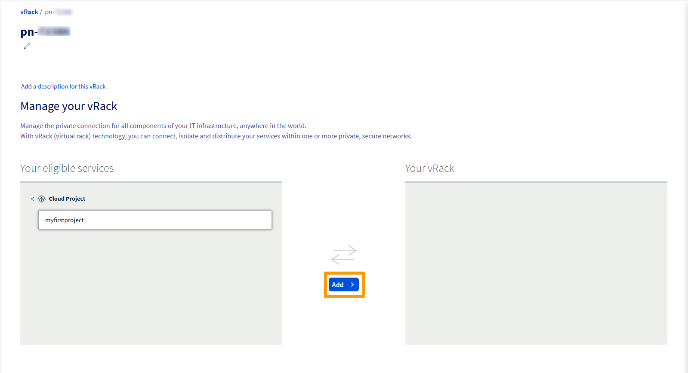

> [!primary]
> Esta traducción ha sido generada de forma automática por nuestro partner SYSTRAN. En algunos casos puede contener términos imprecisos, como en las etiquetas de los botones o los detalles técnicos. En caso de duda, le recomendamos que consulte la versión inglesa o francesa de la guía. Si quiere ayudarnos a mejorar esta traducción, por favor, utilice el botón «Contribuir» de esta página.
>

**Última actualización: 22/11/2021**

## Objetivo

El [vRack](https://www.ovh.com/world/es/soluciones/vrack/){.external} de OVHcloud es una red privada que permite configurar el direccionamiento entre dos o más [servidores dedicados](https://www.ovhcloud.com/es/bare-metal/) de OVHcloud. También permite añadir [instancias de Public Cloud](https://www.ovhcloud.com/es/public-cloud/) para crear una infraestructura de recursos físicos y virtuales.

**Esta guía explica cómo configurar la red privada entre una instancia de Public Cloud y un servidor dedicado.**

## Requisitos

* Haber creado una [instancia de Public Cloud de OVHcloud.](https://docs.ovh.com/es/public-cloud/public-cloud-primeros-pasos/)
* Haber activado un servicio [vRack.](https://www.ovh.com/world/es/soluciones/vrack/){.external}
* Tener un [servidor dedicado](https://www.ovhcloud.com/es/bare-metal/) compatible con el vRack.
* Estar conectado al [área de cliente de OVHcloud.](https://ca.ovh.com/auth/?action=gotomanager&from=https://www.ovh.com/world/&ovhSubsidiary=ws)
* Un rango de direcciones IP privadas que elija.

## Procedimiento

### Añadir un proyecto de Public Cloud al vRack

Una vez que haya configurado su [proyecto de Public Cloud](https://docs.ovh.com/es/public-cloud/crear_tu_primer_proyecto_de_public_cloud/), deberá añadirlo al vRack. Puede hacerse de dos maneras:

1. Al contratar un servicio vRack si no tiene uno, este producto es gratuito.

Acceda al menú `Bare Metal Cloud`{.action} y haga clic en el botón `Contratar`{.action}. En este menú, haga clic en la opción `vRack`{.action}.

{.thumbnail}

Será redirigido a otra página para validar el pedido. La operación tardará unos minutos.

Una vez que haya cargado el servicio vRack en su cuenta, ya puede añadir su proyecto.

En el menú `Bare Metal Cloud`{.action}, haga clic en `Network`{.action} y seleccione el `vRack`{.action}. Seleccione el vRack en la lista.

{.thumbnail}

Seleccione el proyecto que quiera añadir al vRack y haga clic en el botón `Añadir`{.action}.

{.thumbnail}

<ol start="2">
  <li><a href="https://docs.ovh.com/us/es/public-cloud/public-cloud-vrack/#etapa-1-activar-y-gestionar-un-vrack">Creando o añadiendo un servicio vRack existente</a> en la sección Public Cloud.</li>
</ol>

### Integrar una instancia en el vRack

Puede darse dos situaciones:

- La instancia aún no existe.
- La instancia ya existe y debe añadirla al vRack.

#### Caso de una nueva instancia

Si necesita ayuda, consulte la guía [Crear una instancia de Public Cloud](https://docs.ovh.com/us/es/public-cloud/public-cloud-primeros-pasos/#3-crear-una-instancia){.external}. Al crear una instancia, podrá especificar, en el paso 4, una red privada en la que integrar su instancia. Seleccione el vRack anteriormente creado en el menú desplegable que aparece.

#### Caso de una instancia ya existente

Es posible asociar una instancia existente a una red privada. Para más información, puede consultar [esta sección](https://docs.ovh.com/us/es/public-cloud/public-cloud-vrack/#caso-de-una-instancia-ya-existente_2) de la guía correspondiente.

### Crear un VLAN ID

Para que los dos servicios puedan comunicarse entre sí, deben estar z etiquetados » con el mismo **VLAN ID**. 

#### Uso de la VLAN ID por defecto

En los servidores dedicados, por defecto está en la VLAN **0**. Si quiere utilizar este ID, deberá « etiquetar » la red privada asociada a su instancia con la VLAN **0**. Para ello, no marque la casilla `Indicar un ID de VLAN` al añadir una red privada a la instancia.

Para más información, consulte [esta sección](https://docs.ovh.com/us/es/public-cloud/public-cloud-vrack/#etapa-2-crear-una-vlan-en-el-vrack_1) de la guía correspondiente.

> [!primary]
> En Public Cloud, puede definir un VLAN ID único por red privada.
>
> No puede establecer el mismo VLAN ID en dos redes privadas diferentes.

#### Uso de un VLAN ID diferente

Si decide utilizar un VLAN ID diferente:

- La red privada asociada a la instancia de Public Cloud debe estar « etiquetada » con este ID.
- En el archivo de configuración de red del servidor dedicado, la interfaz de red privada debe estar « etiquetada » con este ID.

> [!primary]
> 
> A diferencia de los servidores dedicados, no es necesario « etiquetar » la VLAN directamente en una instancia de Public Cloud.
>

Por ejemplo: si ha definido la red privada asociada a su instancia con VLAN 2, la interfaz de red privada de su servidor dedicado debe estar « etiquetada » con VLAN 2. Para más información, consulte la siguiente guía: [Crear varias VLAN en el vRack](https://docs.ovh.com/us/es/dedicated/crear-vlan-vrack/).

### Configurar las interfaces de red

A continuación, configure las interfaces de red en la nueva instancia de Public Cloud y en el servidor dedicado con esta guía: [Configurar varios servidores dedicados en el vRack](../configurar-vrack-en-servidor-dedicado/){.external}.

## Más información

Interactúe con nuestra comunidad de usuarios en <https://community.ovh.com/en/>.
