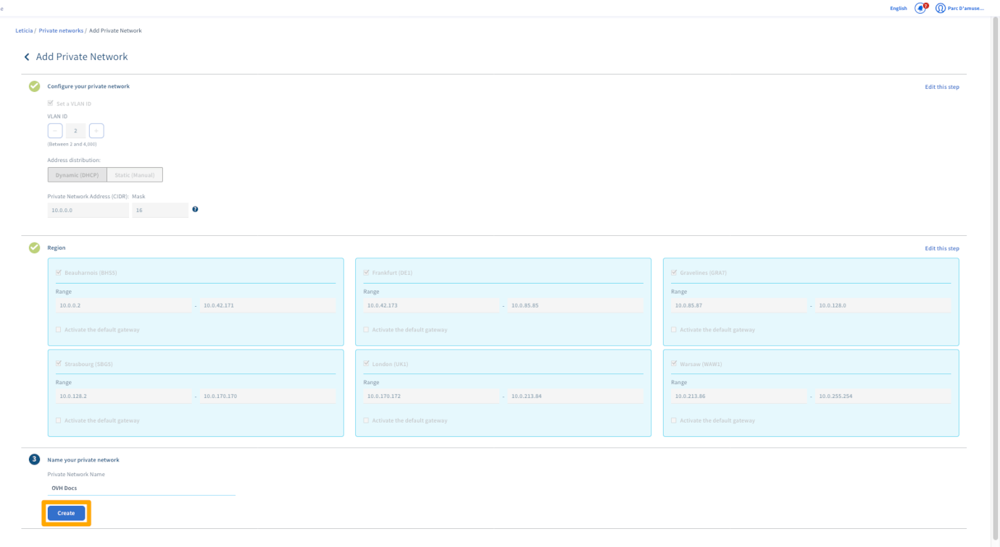

**Última actualización: 25/10/2018**

## Objetivo

El [vRack](https://www.ovh.com/world/es/soluciones/vrack/){.external} es una red privada que permite configurar el direccionamiento entre dos o más [servidores dedicados](https://www.ovh.com/world/es/servidores_dedicados/){.external} de OVHcloud. También permite añadir [instancias de Public Cloud](https://www.ovhcloud.com/es/public-cloud/){.external} para crear una infraestructura de recursos físicos y virtuales.

**Esta guía explica cómo configurar la red privada entre una instancia de Public Cloud y un servidor dedicado.**

## Requisitos

- Tener activado un servicio [vRack](https://www.ovh.com/world/es//soluciones/vrack/){.external}.
- Tener un [servidor dedicado](https://www.ovh.com/world/es/servidores_dedicados/){.external} compatible con el vRack.
- Estar conectado al [área de cliente de OVHcloud](https://ca.ovh.com/auth/?action=gotomanager&from=https://www.ovh.com/world/&ovhSubsidiary=ws){.external}.
- Tener acceso al rango elegido de direcciones IP privadas.

## Procedimiento

### Crear un proyecto de Public Cloud

Inicie sesión en su [panel de control de OVHcloud](https://ca.ovh.com/auth/?action=gotomanager&from=https://www.ovh.com/world/&ovhSubsidiary=ws){.external}.

Haga click en `Servidores`{.action} y a continuación en `contratar`{.action}.

{.thumbnail}

Debajo del menú **contratar**, haga click en `Proyecto Cloud`{.action} .

{.thumbnail}

Establezca el nombre de su proyecto, lea y acepte lo contratos, y a haga click en `Continuar`{.action} .

{.thumbnail}

Seleccione el método de pago y haga click en `Crear mi proyecto`{.action}.

{.thumbnail}

Una vez que su proyecto este configurado, usted necesitara añadir el vrack. Para ello, haga click en `Servidores`{.action} y después en `vRack`{.action}

{.thumbnail}

Seleccione su vRack existente, seleccione su Proyecto Cloud, y haga click en `Añadir`{.action}.

{.thumbnail}

A continuación, debe habilitar la redes privadas. Haga click en el botón `Permitir red privada`{.action} dentro de la pagina del proyecto.

{.thumbnail}

Aquí puede crear la configuración de su red y nombrarla. Una vez que este configurada según sus preferencia haga click en `Crear`{.action}.

{.thumbnail}

### Crear una instancia de Public Cloud

En la pagina de su proyecto, haga click en el botón `Crear una instancia`{.action}.

{.thumbnail}

Seleccione el modelo, la región y la imagen. Luego elija su Red privada.

{.thumbnail}

Finalmente, seleccione el periodo de facturación y haga click en `Crear una instancia`{.action}. Para obtener información detallada sobre la diversas opciones, por favor consulte la siguiente guía: [Crear una instancia desde el área de cliente de OVHcloud](../../public-cloud/crear_una_instancia_desde_el_area_de_cliente_de_ovh/).

### Configurar las interfaces de red

Para configurar las interfaces de red entre la instancia de Public Cloud que acaba de crear y el servidor dedicado, consulte la guía [Configurar varios servidores dedicados en el vRack](../configurar-vrack-en-servidor-dedicado/).

## Más información

Interactúe con nuestra comunidad de usuarios en <https://community.ovh.com/en/>.
