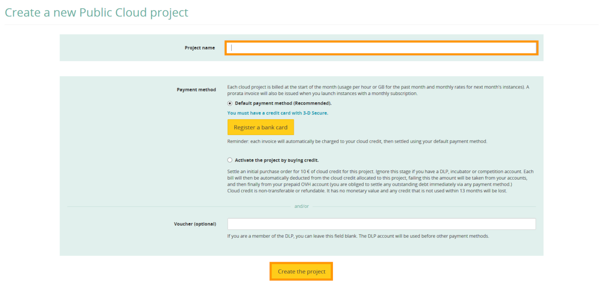

**Ultimo aggiornamento: 09/11/2021**

> [!primary] 
> Questa traduzione è stata generata automaticamente dal nostro partner SYSTRAN. I contenuti potrebbero presentare imprecisioni, ad esempio la nomenclatura dei pulsanti o alcuni dettagli tecnici. In caso di dubbi consigliamo di fare riferimento alla versione inglese o francese della guida. Per aiutarci a migliorare questa traduzione, utilizza il pulsante "Modifica" di questa pagina.
>

## Obiettivo

La [vRack](https://www.ovh.it/soluzioni/vrack/){.external} è una rete privata che permette di configurare l’indirizzamento tra due o più [server dedicati](https://www.ovh.it/server_dedicati/){.external} OVH. Inoltre, consente di aggiungere [istanze Public Cloud](https://www.ovh.it/public-cloud/istanze/){.external} a una rete privata al fine di creare un’infrastruttura di risorse fisiche e virtuali.

**Questa guida ti mostra come configurare una rete privata tra un’istanza Public Cloud e un server dedicato.**

## Prerequisiti

- Possedre un servizio [vRack](https://www.ovh.it/soluzioni/vrack/) attivato nel tuo account
- Aver creun'istanza [Public Cloud](https://docs.ovh.com/it/public-cloud/primi-passi-public-cloud/) nel tuo account OVHcloud
- Possedere un [server dedicato](https://www.ovhcloud.com/it/bare-metal/) compatibile con la vRack
- Avere accesso allo [Spazio Cliente OVHcloud](https://www.ovh.com/auth/?action=gotomanager&from=https://www.ovh.it/&ovhSubsidiary=it)
- Aver selezionato una gamma di indirizzi IP privati

## Procedura

### Aggiungere un progetto Public Cloud a vRack

Una volta connesso al tuo [Spazio Cliente OVH](https://www.ovh.com/auth/?action=gotomanager&from=https://www.ovh.it/&ovhSubsidiary=it){.external}, clicca sul menu `Cloud`{.action} e poi sul pulsante `Ordina`{.action}.

{.thumbnail}

Seleziona `Progetto Cloud`{.action}.

{.thumbnail}

Assegna un nome al progetto, scegli un metodo di pagamento e poi clicca su `Crea il tuo progetto`{.action}.

{.thumbnail}

Dopo aver configurato il progetto, clicca sul pulsante `Attiva le reti private`{.action}. 

{.thumbnail}

Di seguito, clicca sull’opzione `Esistente`{.action} e poi seleziona la tua vRack nel menu a tendina.

{.thumbnail}

### Crea un’istanza Public Cloud

Accedi alla pagina del progetto e, nella sezione `Infrastruttura`{.action}, clicca su `Azioni`{.action}.

{.thumbnail}

Nel menu a tendina clicca sull’opzione `Aggiungi un server`{.action}.

{.thumbnail}

Clicca poi sul pulsante `Opzioni avanzate`{.action}.

{.thumbnail}

Di seguito, clicca sul menu a tendina nella sezione **Associa una vRack** e seleziona la tua vRack. Quindi clicca su `Continua`{.action} (situato nella parte superiore della finestra di dialogo) e torna alla schermata precedente.

{.thumbnail}

Infine, seleziona le opzioni di installazione e clicca su pulsante `Avvia adesso`{.action}.

{.thumbnail}

### Configura le interfacce di rete

Per configurare le interfacce di rete tra l’istanza Public Cloud appena creata e il tuo server dedicato, consulta la nostra guida: [Configurare due o più server dedicati nella vRack](https://docs.ovh.com/it/dedicated/configurare-server-dedicati-vrack/){.external}.

## Per saperne di più

Contatta la nostra Community di utenti all’indirizzo <https://www.ovh.it/community/>.