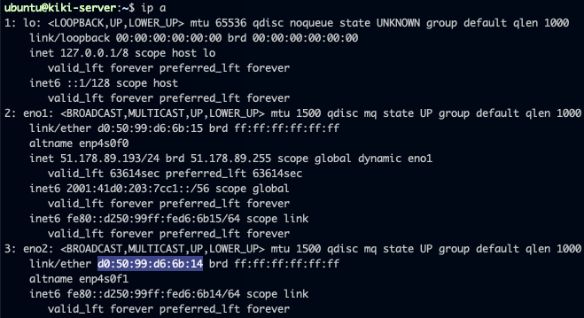

> [!primary]
> Diese Übersetzung wurde durch unseren Partner SYSTRAN automatisch erstellt. In manchen Fällen können ungenaue Formulierungen verwendet worden sein, z.B. bei der Beschriftung von Schaltflächen oder technischen Details. Bitte ziehen Sie beim geringsten Zweifel die englische oder französische Fassung der Anleitung zu Rate. Möchten Sie mithelfen, diese Übersetzung zu verbessern? Dann nutzen Sie dazu bitte den Button «Mitmachen» auf dieser Seite.
>

**Letzte Aktualisierung am 24.02.2022**

## Ziel

Bei der [Standardkonfiguration des vRack](https://docs.ovh.com/de/dedicated/mehrere-dedizierte-server-im-vrack-konfigurieren/) können Sie nur ein VLAN erstellen. Das bedeutet, Sie können jede IP-Adresse nur einmal verwenden. Seit Version 2.0 der vRack Konfiguration ist es jedoch möglich, bis zu 4000 lokale virtuelle Netzwerke in nur einem vRack einzurichten. Das bedeutet, Sie können jede IP-Adresse bis zu 4000 mal verwenden.

**Diese Anleitung erklärt, wie Sie mehrere VLANs im vRack erstellen.**


## Voraussetzungen

- Sie verfügen über einen oder mehrere mit dem vRack kompatible [Dedicated Server](https://www.ovh.de/dedicated_server/).
- Sie haben ein [vRack](https://docs.ovh.com/de/dedicated/mehrere-dedizierte-server-im-vrack-konfigurieren/) in Ihrem Kunden-Account eingerichtet.
- Sie haben einen privaten IP-Adressbereich für das vRack festgelegt.
- Sie sind via SSH als Root-Benutzer eingeloggt (Linux).
- Sie sind mit dem Administrator-Account eingeloggt (Windows).
- Sie haben die [Konfiguration des vRack](https://docs.ovh.com/de/dedicated/mehrere-dedizierte-server-im-vrack-konfigurieren/) abgeschlossen.


## Beschreibung

### Linux

> [!primary]
>
> In diesem Beispiel verwenden wir **eno2** für Ubuntu und **eth1** für Debian als Netzwerkinterface; **10** als VLAN-Tag und **192.168.0.0/16** als IP-Adressbereich. 
>
> Die Befehle müssen an die jeweils verwendete Distribution angepasst werden. Bei Fragen dazu folgen Sie der offiziellen Dokumentation Ihrer Distribution.
>

#### Ubuntu 20 & 21

Dieses Beispiel basiert auf Ubuntu 21.10 (Impish Indri).

Installieren Sie zuerst das Paket “VLAN” auf Ihrem Server. Verwenden Sie hierzu folgenden Befehl:

```bash
sudo apt-get install vlan
```

Laden Sie das 8021q Kernel-Modul:

```bash
sudo su -c 'echo "8021q" >> /etc/modules'
```

Erstellen oder bearbeiten Sie diese Konfigurationsdatei, um zu verhindern, dass Änderungen an der Netzwerkkonfiguration automatisch vorgenommen werden:

```bash
sudo nano /etc/cloud/cloud.cfg.d/99-disable-network-config.cfg
```

Fügen Sie folgende Zeile hinzu:

```bash
network: {config: disabled}
```

Rufen Sie den Namen und die MAC-Adresse der Netzwerkschnittstelle ab:

```bash
ip a
```

Das zu konfigurierende Interface ist hier `eno2` mit der MAC Adresse `d0:50:99:d6:6b:14`.



Fügen Sie die Netzwerkkonfiguration für diese Netzwerkschnittstelle und die VLAN-Deklaration in der folgenden Datei hinzu:

```bash
sudo nano /etc/netplan/50-cloud-init.yaml
```

```yaml
network:
    version: 2
    ethernets:
        eno2:
            match:
                macaddress: d0:50:99:d6:6b:14
        eno1:
            ...
            ...
    vlans:
        vlan10:
            id: 10                      # VLAN ID    
            link: eno2                  # Interface name
            addresses:
            - 192.168.0.14/16
```

Speichern und schließen Sie die Datei und führen Sie dann die folgenden Befehle aus:

```bash
sudo netplan try
sudo netplan apply
```

Verwenden Sie folgenden Befehl, um die Konfiguration zu bestätigen:

```bash
ip a
```


#### Debian

Installieren Sie zuerst das Paket “VLAN” auf Ihrem Server. Verwenden Sie hierzu folgenden Befehl:

```bash
sudo apt-get install vlan
```

Erstellen Sie anschließend ein VLAN-Tag. Das ist die Kennung, mit der Sie verschiedene VLANs voneinander unterscheiden können:

```bash
vconfig add eth1 10

Added vlan with VID == 10 to IF -:eth1:-
```

Geben Sie danach im vRack den IP-Adressbereich an und taggen Sie ihn mit Ihrer Kennung. Verwenden Sie hierzu folgenden Befehl:

```bash
ip addr add 192.168.0.0/16 dev eth1.10
```

Es kann vorkommen, dass das Interface getrennt wird:

```bash
# ip  addr show dev eth1
7: eno2: <BROADCAST,MULTICAST,UP,LOWER_UP> mtu 1500 qdisc mq state DOWN group default qlen 1000
[...]
```

Verwenden Sie folgenden Befehl, um es wieder zu verbinden:

```bash
ip link set dev eth1 up
```

Um den Vorgang abzuschließen, bearbeiten Sie die Konfiguration des Netzwerkinterfaces, damit diese das VLAN-Tag erkennt. Öffnen Sie hierzu die Konfigurationsdatei des Netzwerkinterfaces und bearbeiten Sie sie wie folgt:

```bash
nano /etc/network/interfaces

auto eth1.10
iface eth1.10 inet static
address 192.168.0.50
netmask 255.255.0.0
broadcast 192.168.255.255
```

### Unter Windows

Verbinden Sie sich über Remote-Desktop mit Ihrem Server und öffnen Sie die Anwendung “Server Manager”. Wählen Sie dann `Local Server`{.action} aus und klicken Sie neben “**NIC Teaming**” auf den Link `Disabled`{.action}:

{.thumbnail}

Erstellen Sie anschließend ein neues Team, indem Sie ein Netzwerkinterface auswählen und im Feld “**Team name**” einen Teamnamen eingeben. Wenn Sie damit fertig sind, bestätigen Sie mit `OK`{.action}.

{.thumbnail}

Geben Sie nun das VLAN-Tag an. Klicken Sie im “**NIC Teaming**”-Fenster im Panel “**Adapters and Interfaces**” mit der rechten Maustaste auf das Interface, das Sie gerade zum neuen Team hinzugefügt haben, und klicken Sie dann auf `Properties`{.action}. Klicken Sie jetzt auf `Specific VLAN`{.action} und geben Sie den Tag ein:

{.thumbnail}

Konfigurieren Sie nun die IP-Adresse des VLANs. Öffnen Sie hierzu über das Startmenü die `Systemsteuerung`{.action}.

{.thumbnail}

Klicken Sie auf `Network and Internet`{.action}:

{.thumbnail}

Klicken Sie dann auf `Network and Sharing Center`{.action}:

{.thumbnail}

Klicken Sie anschließend auf `Change adapter settings`{.action}:

{.thumbnail}

Klicken Sie nun mit der rechten Maustaste auf das VLAN-Interface und klicken Sie dann auf `Properties`{.action}.

{.thumbnail}

Doppelklicken Sie auf `Internet Protocol Version 4 (TCP/IP/IPv4)`{.action}.

{.thumbnail}

Klicken Sie auf `Use the following IP address`{.action}. Geben Sie in das Feld “**IP-Adresse**” eine IP-Adresse aus Ihrem internen IP-Bereich ein. Geben Sie in das Feld “**Subnetzmaske**” die Subnetzmaske “255.255.0.0” ein.

{.thumbnail}

Klicken Sie abschließend auf den Button `OK`{.action}, um die Änderungen zu speichern, und starten Sie den Server neu.

## Weiterführende Informationen

[Mehrere dedizierte Server im vRack konfigurieren](https://docs.ovh.com/de/dedicated/mehrere-dedizierte-server-im-vrack-konfigurieren/){.external}

Für den Austausch mit unserer User Community gehen Sie auf <https://community.ovh.com/en/>.
