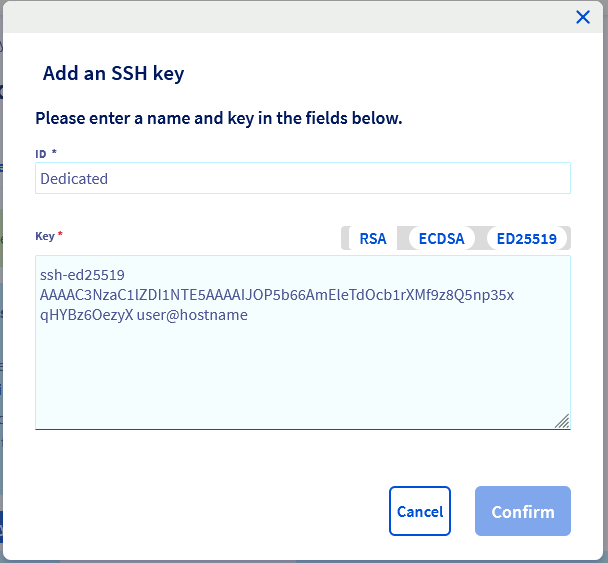

**Ostatnia aktualizacja: 15-04-2020**

## Wprowadzenie

Protokół SSH umożliwia korzystanie z bezpiecznego kanału w niezabezpieczonej sieci w architekturze klient-serwer, łączącego klienta SSH z serwerem SSH. Utworzony zestaw kluczy SSH zawiera klucz publiczny i klucz prywatny. Klucz publiczny możesz umieścić na dowolnym serwerze, a następnie uzyskać do niego dostęp przez połączenie przy użyciu klienta, który przechowuje Twój klucz prywatny. Jeśli zestawy kluczy będą zgodne, zalogujesz się bez konieczności podawania hasła.

**Dowiedz się, jak utworzyć klucze SSH i następnie używać ich w celu uzyskania bezpiecznego dostępu do serwera.**

> [!primary]
>
Klucze SSH nie służą do uwierzytelniania na serwerach z systemem operacyjnym Windows. W przypadku serwerów z systemem Windows należy korzystać z nazwy użytkownika i hasła.
>

## Wymagania początkowe

- dostęp do [Panelu klienta OVHcloud](https://www.ovh.com/auth/?action=gotomanager&from=https://www.ovh.pl/&ovhSubsidiary=pl)
- [serwer dedykowany](https://www.ovhcloud.com/pl/bare-metal/) w ramach konta OVHcloud
- dostęp administracyjny (uprawnienia użytkownika root) za pośrednictwem protokołu SSH

## W praktyce

### Tworzenie klucza SSH w systemie Linux i Mac

Na komputerze z systemem Mac lub Linux otwórz aplikację terminala (wiersz polecenia).

Sprawdź, czy w katalogu domowym $HOME masz folder „.ssh”. Jeśli taki folder nie istnieje, utwórz go:

```sh
# mkdir ~/.ssh
```

Utwórz 4096-bitowy klucz RSA przy użyciu następującego polecenia:

```sh
# ssh-keygen -b 4096
```
Aby określić inną metodę szyfrowania, użyj tego polecenia z opcją „-t”, na przykład:

```sh
# ssh-keygen -t ed25519 -a 256
```

Zostanie wyświetlony monit o zapisanie nowo utworzonego klucza:

```sh
Generating public/private rsa key pair.
Enter file in which to save the key (/home/user/.ssh/id_rsa):
```

Po potwierdzeniu możesz podać hasło, które będzie stanowić zabezpieczenie klucza SSH. Jest to zalecane w celu zwiększenia bezpieczeństwa.

Klucze powinny zostać zapisane w katalogu „.ssh”.

```ssh
Your identification has been saved in /home/user/.ssh/id_rsa.
Your public key has been saved in /home/user/.ssh/id_rsa.pub.
The key fingerprint is:
SHA256:MRk+Y0zCOoOkferhkTvMpcMsYspj212lK7sEauNap user@hostname
The key's randomart image is:
+---[RSA 4096]----+
|     .. o        |
|    . .= o       |
|   o o  X        |
|. . . .          |
|. .=.o .S.       |
| =o.o.  .   .    |
|o +   .  . o ..  |
|.. .  .   oEoo . |
|o.        .o+oo  |
+----[SHA256]-----+
```

> [!warning]
>
> Klucz prywatny zawsze należy przechowywać w bezpiecznym miejscu, a dostęp do niego powinny mieć tylko uprawnione osoby.
> 

Aby odczytać i wyeksportować klucz publiczny, użyj polecenia „cat” względem pliku klucza i skopiuj dane wyjściowe:

```ssh
# cat ~/.ssh/id_rsa.pub
ssh-rsa AAAAB3NzaC1yc2EAAAADAQABAAABAQC8teh2NJ42qYZV98gTNhumO1b6rMYIkAfRVazl
k6dSS3xf2MXJ4YHsDacdjtJ+evXCFBy/IWgdkFtcvsGAMZ2N1RdvhDyQYcy6NDaJCBYw1K6Gv5fJ
SHCiFXvMF0MRRUSMneYlidxUJg9eDvdygny4xOdC6c1JrPrSgOc2nQuKeMpOoOWLINIswg1IIFVk
kFMPrFivP8Z6tidzVpAtbr1sXmJGZazYWrU3FoK2a1sF1zEWrmlMOzX81zEWrmlMOzX8CpZW8Rae
i4ANmLy7NULWK36yU0Rp9bFJ4o0/4PTkZiDCsK0QyHhAJXdLN7ZHpfJtHIPCnexmwIMLfIhCWhO5
 user@hostname
```

### Tworzenie klucza SSH przy użyciu programu PuTTY (tylko system Windows)

[PuTTY](https://www.chiark.greenend.org.uk/~sgtatham/putty/) to popularny klient SSH do systemu Windows. Umożliwia zdalne połączenie z serwerem systemu Linux. Jego oprogramowanie pomocnicze, [PuTTYgen](https://the.earth.li/~sgtatham/putty/latest/w64/puttygen.exe), służy do tworzenia kluczy SSH.

Najpierw pobierz oprogramowanie [PuTTYgen](https://the.earth.li/~sgtatham/putty/latest/w64/puttygen.exe), które umożliwi wygenerowanie klucza.

Następnie uruchom oprogramowanie i wybierz typ klucza. W tym przykładzie wybrano 4096-bitowy klucz RSA. Kliknij przycisk `Generate`{.action} (Generuj), aby rozpocząć proces tworzenia.

{.thumbnail}

Losowo przesuwaj kursor myszy w obszarze pod paskiem postępu, jak pokazano poniżej.

{.thumbnail}

Poruszaj myszą aż do wypełnienia paska postępu. Po wypełnieniu paska postępu klucz jest utworzony i gotowy do użycia.

{.thumbnail}


### Dodawanie kluczy SSH do serwera

Przejdź do katalogu domowego $HOME i utwórz folder „.ssh” (jeśli jeszcze nie istnieje):

```ssh
$ mkdir ~/.ssh
```

Aby zapisać klucz dla bieżącego użytkownika, otwórz plik o nazwie „authorized_keys” w preferowanym edytorze tekstu:

```ssh
$ nano ~/.ssh/authorized_keys
```

Skopiuj **klucz publiczny** i wklej go do tego nowego pliku. Zapisz plik i zamknij edytor. Uruchom ponownie serwer lub tylko zrestartuj demon OpenSSH (odpowiednie polecenie może się różnić w zależności od Twojego systemu operacyjnego).

```ssh
$ systemctl restart sshd
```

Aby sprawdzić, czy klucz jest prawidłowo skonfigurowany, spróbuj połączyć się z serwerem za pośrednictwem protokołu SSH przy użyciu następującego polecenia. Zastąp „IP_ADDRESSorHOSTNAME” adresem IP lub nazwą hosta serwera, do którego próbujesz uzyskać dostęp:

```ssh
$ ssh user@IP_ADDRESSorHOSTNAME
```

#### Dodawanie kolejnych kluczy do serwera

W celu dodania kluczy SSH dla dodatkowych użytkowników po prostu powtórz poprzednie kroki, ale użyj właściwego katalogu $HOME, aby utworzyć unikatowy klucz danego użytkownika.

#### Usuwanie autoryzowanych kluczy z serwera

Usuń z pliku „authorized_keys” klucz odpowiadający użytkownikowi, którego dostęp chcesz odwołać. Po usunięciu klucza zapisz plik i zamknij edytor tekstu.

### Importowanie klucza SSH do Panelu klienta OVHcloud

Panel klienta OVHcloud umożliwia przechowywanie kluczy publicznych utworzonych przy użyciu jednego z obsługiwanych typów szyfrowania (obecnie RSA, ECDSA, ED25519). 

Otwórz nawigację na pasku bocznym, klikając Twoją nazwę w prawym górnym rogu, i użyj skrótu `Produkty i usługi`{.action}.

{.thumbnail}

W obszarze „Moje usługi” przełącz się na kartę `Klucze SSH`{.action} i kliknij pozycję `Dodaj klucz SSH`{.action}.

{.thumbnail}

Z menu rozwijanego wybierz pozycję „Dedykowane”.

W wyświetlonym nowym oknie wpisz ID (wybraną nazwę) klucza. Wklej ciąg klucza (skopiowany z Twojego pliku „.pub”) w polu „Klucz”.

{.thumbnail}

Jeśli zostały skopiowane całe dane wyjściowe, identyfikator powinien już znajdować się za kluczem. Uwaga: aby zapisać klucz, za wklejonym kluczem zawsze trzeba określić identyfikator. Jest to wymagane w Panelu klienta OVHcloud. (Zobacz przykład powyżej). Kliknij przycisk `Potwierdź`{.action}, aby zapisać swój klucz publiczny.

> [!primary]
>
> Kluczy zapisanych w sekcji „Dedykowane” można używać również do usług prywatnego serwera wirtualnego (VPS). Informacje o kluczach SSH na potrzeby usług Public Cloud zawiera [ten przewodnik](../../public-cloud/public-cloud-pierwsze-kroki).
>


## Sprawdź również

Dołącz do naszej społeczności użytkowników: <https://community.ovh.com/en/>.