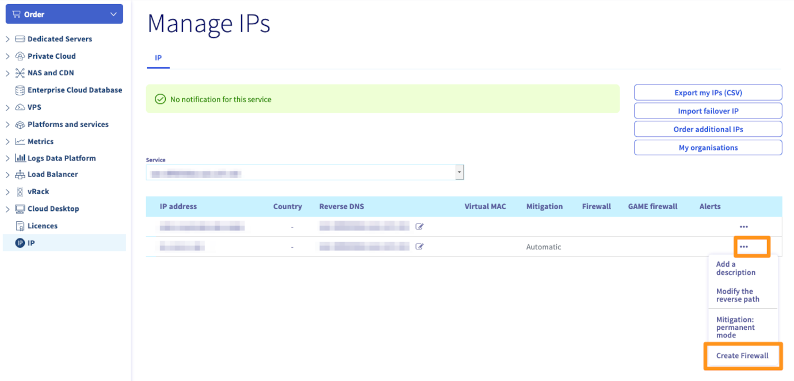

**Laatste update 13-09-2018**

## Introductie

Om de wereldwijde infrastructuur en servers van zijn klanten te beschermen, biedt OVH een configureerbare firewall die kan worden geïntegreerd met de **anti-DDoS** (VAC) -oplossing: Deze optie beperkt de gevoeligheid van diensten voor aanvallen vanaf het openbare netwerk.

**Deze handleiding legt uit hoe de Network Firewall kan worden geconfigureerd.**

> [!primary]
>
> Meer informatie over onze anti-DDoS: <https://www.ovh.nl/anti-ddos/>
> 

{.thumbnail}

## Vereisten

- U moet geabonneerd zijn op een OVH dienst met de optie Network Firewall: ([Dedicated server](https://www.ovh.nl/dedicated_servers/){.external}, [VPS](https://www.ovh.nl/vps/){.external}, [Public Cloud instance](https://www.ovh.nl/public-cloud/instances/){.external}, [Private Cloud](https://www.ovh.nl/private-cloud/){.external}, [Failover-IP](https://www.ovh.com/nl/dedicated_servers/ip_failover.xml){.external}, etc.).
- U moet ingelogd zijn op uw [OVH Control Panel](https://www.ovh.com/auth/?action=gotomanager&from=https://www.ovh.nl/&ovhSubsidiary=nl){.external}

## Instructie

### Activeer Firewall Network

> [!primary]
>
> De Network Firewall beschermt de IP's die aan een server zijn gekoppeld. Elk IP-adres moet daarom afzonderlijk worden geconfigureerd, er kan geen algemene serverconfiguratie worden gemaakt.
> 

Log u in op bij het [OVH Control Panel](https://www.ovh.com/auth/?action=gotomanager&from=https://www.ovh.nl/&ovhSubsidiary=nl){.external}, ga naar het `IP`{.action}-gedeelte en klik op `...`{.action} om de firewall op een IPv4 te activeren.

{.thumbnail}

Er zal een bevestiging van u gevraagd worden. 

{.thumbnail}

Klik vervolgens op `Firewall inschakelen`{.action} (1) en klik op `Firewall configureren`{.action} (2) om de configuratie te starten.

{.thumbnail}

U kunt maximaal **20 regels per IP-adres** instellen.

> [!warning]
>
> De firewall wordt automatisch geactiveerd voor elke DDoS-aanval en kan niet worden uitgeschakeld voor het einde van een aanval. Om deze reden is het belangrijk om de firewallregels up-to-date te houden.
> Standaard hebt u geen geconfigureerde regels, dus alle verbindingen kunnen worden gemaakt.
> Als u die hebt, raden we aan ze regelmatig te controleren, zelfs als de firewall is uitgeschakeld.
> 

> [!primary]
>
> - UDP-fragmentatie is standaard uitgeschakeld (DROP). Als u een VPN gebruikt, vergeet dan niet - na activering van de Network Firewall - om uw maximale transmissie-eenheid (MTU) correct te configureren. Op OpenVPN kunt u bijvoorbeeld de `MTU-test`{.action} aanvinken.
> - Network Firewall heeft geen invloed op het OVH netwerk. De gedefinieerde regels hebben daarom geen effect op de verbindingen in het interne netwerk.
>

### Configureer Firewall Network

Voeg een regel toe door te klikken op `Regel toevoegen`{.action}.

{.thumbnail}

Voor elke regel moet u het volgende specificeren:

* Prioriteit (op een schaal van 0 tot 19, waarbij 0 de eerste regel is om te gebruiken, etc.)
* Actie (`Toestaan`{.action} of `Weigeren`{.action})
* Protocol
* IP-adres (optioneel)
* Bronpoort (alleen TCP)
* Bestemmingspoort (alleen TCP)
* TCP-opties (alleen TCP)

{.thumbnail} 

> [!primary]
>
> - Prioriteit 0: Het is aanbevolen om het TCP-protocol toe te staan op alle IP's met de `established`{.action}-optie. Hiermee kunt u controleren of het pakket deel uitmaakt van een (reeds eerder gestarte) open sessie. Als u deze optie niet toestaat, ontvangt de server geen TCP-feedback voor SYN/ACK-aanvragen.
> - Prioriteit 19: het volledige IPv4-protocol wordt geweigerd als vóór nummer 19 (de laatste mogelijk) geen regel is gedefinieerd.
> 

### Configuratievoorbeeld

Om alleen de SSH-poorten (22), HTTP (80), HTTPS (443), UDP (op poort 10000) te openen en via ICMP toe te staan, moet u de volgende regels definiëren:

{.thumbnail}

De regels worden chronologisch gerangschikt van 0 (eerste toegepaste regel) tot 19 (laatst toegepaste regel). De chronologische controle van de regelketen wordt afgebroken zodra een regel van toepassing is op het ontvangen pakket.

Een pakket voor poort 80/TCP wordt bijvoorbeeld opgevangen door regel nummer 2, dus de volgende regels worden niet getest. Een pakket bestemd voor poort 25/TCP wordt alleen onderschept door de laatste regel (nummer 19). Regel 19 blokkeert dan het pakket, omdat OVH geen communicatie toestaat op poort 25 in de vorige regels.

> [!warning]
>
> Als u anti-DDOS inschakelt, worden de regels van uw Network Firewall automatisch geactiveerd, zelfs als u deze regels elders hebt uitgeschakeld. Als u het wilt uitschakelen, vergeet dan niet om uw regels te verwijderen.
> 

## Verder

Ga in gesprek met onze communitygebruikers via <https://community.ovh.com/en/>.