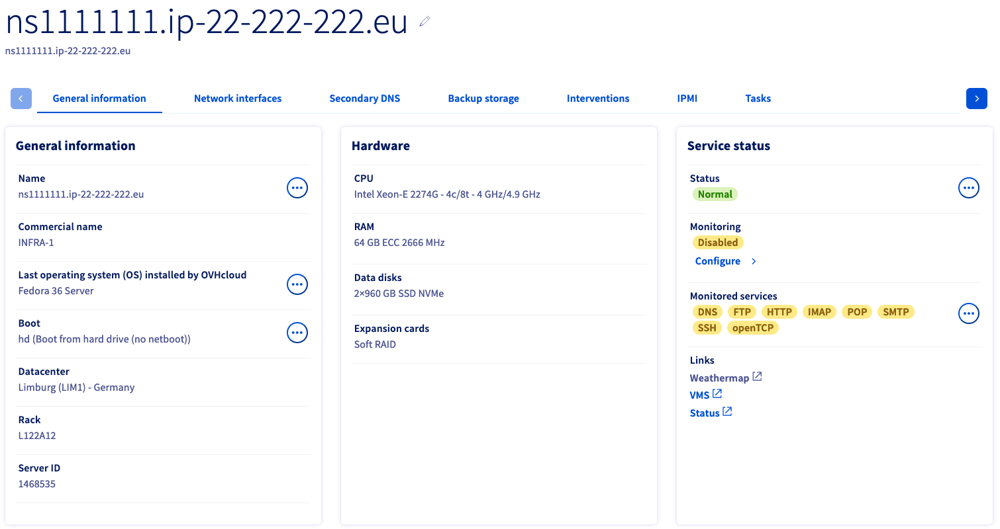

> [!primary]
> Tłumaczenie zostało wygenerowane automatycznie przez system naszego partnera SYSTRAN. W niektórych przypadkach mogą wystąpić nieprecyzyjne sformułowania, na przykład w tłumaczeniu nazw przycisków lub szczegółów technicznych. W przypadku jakichkolwiek wątpliwości zalecamy zapoznanie się z angielską/francuską wersją przewodnika. Jeśli chcesz przyczynić się do ulepszenia tłumaczenia, kliknij przycisk "Zgłóś propozycję modyfikacji" na tej stronie.
>

**Ostatnia aktualizacja z dnia 13-12-2022**

## Wprowadzenie

OVHcloud ogłasza, że wszystkie serwery dedykowane Kimsufi, So you Start i Rise są połączone w grupę produktów Eco i że dzięki temu możemy zaproponować lepszy przegląd naszych konfiguracji. W wyniku tych zmian w Panelu klienta możesz zarządzać wszystkimi Twoimi usługami, niezależnie od ich gamy. Jeśli wybrałeś serwer z linii produktów Eco, zapoznaliśmy się z tym przewodnikiem i przedstawiliśmy Ci jego opcje w Panelu klienta OVHcloud.

**Niniejszy przewodnik pomoże Ci zapoznać się z Panelem klienta OVHcloud.**

> [!warning]
> Pamiętaj, że mimo zmiany interfejsu klienta niektóre opcje mogą nie być dostępne dla serwerów Kimsufi i So you Start.
>

## W praktyce

### Dashboard

{.thumbnail}

Jeśli zakupiłeś serwer z linii produktu Eco, dashboard zostanie teraz dostępny w Panelu klienta OVHcloud. Na dashboardzie OVHcloud znajdziesz podsumowanie wszystkich Twoich usług. Interfejs ten zawiera kilka sekcji umożliwiających szybki dostęp do usługi. 
W kolumnie po prawej stronie masz dostęp do Twoich danych osobowych, identyfikatora klienta oraz poziomu wsparcia (w stosownych przypadkach). 
Oferuje on również zestaw skrótów i przydatnych linków.

### Dostęp do serwera

{.thumbnail}

W interfejsach Kimsufi i So you Start dashboard umożliwia sprawdzenie serwera/listy serwerów. 
W Panelu klienta OVHcloud kliknij najpierw menu `Bare Metal Cloud`{.action}, a następnie `Serwery dedykowane`{.action}, aby wyświetlić Twoje serwery. 
Jeśli posiadasz kilka serwerów, przycisk `Wszystkie moje serwery`{.action} pozwala na ich wyświetlenie w prosty sposób.

### Interfejs Serwera

W menu `Serwery dedykowane`{.action} kliknij wybrany serwer, aby uzyskać dostęp do jego interfejsu.

{.thumbnail}

{.thumbnail}

**Informacje ogólne**: w tej sekcji znajdziesz wszystkie informacje dotyczące Twojego serwera.

- Nazwisko: kliknij `...`{.action} obok tej opcji, aby zmienić nazwę serwera.
- Boot: kliknij `...`{.action} obok tej opcji, aby zmienić netboot serwera w *trybie diagnostycznym (Rescue)*, *trybie normalnym* (na dysku twardego) lub *trybie sieci (Netboot)*.
- Ostatni system operacyjny (OS) zainstalowany przez OVHcloud: kliknij `...`{.action} obok tej opcji, aby zainstalować/zainstalować serwer.

**Stan usług**

- Status: kliknij `...`{.action} obok tej opcji, aby uruchomić lub usunąć serwer.
- Monitoring: kliknij na `Skonfiguruj`{.action} aby zmienić [ustawienia monitorowania serwera](https://docs.ovh.com/pl/dedicated/pierwsze-kroki-z-serwerem-dedykowanym#monitoring-server).

**Sieć**

- IPV4: kliknij `...`{.action} obok tej opcji, aby zarządzać adresem IP.
- Rewers: kliknij `...`{.action} obok tej sekcji, aby wprowadzić/zmienić rewers DNS.

**DNS secondary**: skonfiguruj tutaj DNS secondary. Więcej informacji znajdziesz w [tym przewodniku](https://docs.ovh.com/pl/dedicated/dodawanie-domeny-secondary-dns/).

**Backup Storage** (dostępny tylko na serwerach OVHcloud i serwerach So you Start, w tym na serwerach linii Eco): zamów i skonfiguruj backup storage tutaj. Więcej informacji znajdziesz w [tym przewodniku](https://docs.ovh.com/pl/dedicated/usluga-backup-storage/).

**Interwencje**: znajdziesz tutaj bieżące i przeszłe interwencje na Twoim serwerze.

**IPMI** (dostępny tylko na serwerach OVHcloud i na niektórych serwerach So you Start, w tym na serwerach linii Eco): przejdź tutaj do narzędzia IPMI lub KVM IP Twojego serwera. Więcej informacji na temat korzystania z tego narzędzia znajdziesz w [tym przewodniku](https://docs.ovh.com/pl/dedicated/uzywanie-ipmi-serwery-dedykowane/).

**Zadania**: sprawdź w tym miejscu ostatnie zadania wykonywane na serwerze.

Aby uzyskać więcej informacji na temat zarządzania serwerem dedykowanym w Panelu klienta, zapoznaj się z [tym przewodnikiem](https://docs.ovh.com/pl/dedicated/pierwsze-kroki-z-serwerem-dedykowanym/).

### Sekcja IP

Aby uzyskać dostęp do sekcji **IP** w Panelu klienta OVHcloud, kliknij menu `Bare Metal Cloud`{.action}, a następnie `IP`{.action}.

{.thumbnail}

### Zakładka Licencje (niedostępna na serwerze Kimsufi)

Aby uzyskać dostęp do zakładki **Licencje** w Panelu klienta OVHcloud, kliknij menu `Bare Metal Cloud`{.action}, a następnie `Licencje`{.action}:

{.thumbnail}

### Pomoc, fakturowanie i zarządzanie kontem

W Panelu klienta Kimsufi lub So you Start opcje te są dostępne w prawym górnym rogu pod indywidualne zakładki. 
W Panelu klienta OVHcloud te opcje są pogrupowane we wspólnej przestrzeni. Kliknij Twoją nazwę w prawym górnym rogu i kliknij Twoje inicjały, aby przejść do sekcji `Zarządzanie kontem`.

{.thumbnail}

- **Informacje ogólne**: w tej sekcji możesz wyświetlić informacje dotyczące Twojego konta, Twoją ostatnią fakturę i uzyskać dostęp do różnych skrótów.
- **Bezpieczeństwo**: w tej sekcji możesz zarządzać ustawieniami zabezpieczeń konta. Więcej informacji znajdziesz w [tym przewodniku](https://docs.ovh.com/pl/customer/identyfikator_klienta/).
- **Otrzymane e-maile**: w tej sekcji znajdziesz wszystkie e-maile wysłane przez OVHcloud, poza zapytaniami do naszej pomocy.
- **Mój poziom wsparcia** (dotyczy wyłącznie usług OVHcloud): w tym punkcie znajdziesz więcej informacji na temat poziomu wsparcia oferowanego przez OVHcloud.
- **Zarządzanie użytkownikami**: w tej sekcji możesz zarządzać użytkownikami. Więcej informacji znajdziesz w [tym przewodniku](https://docs.ovh.com/pl/customer/zarzadzanie_uzytkownikami/).
- **Faktury**: w tej sekcji możesz sprawdzać faktury, monitorować płatności dokonywane przy użyciu domyślnego sposobu płatności i sprawdzać stan konta. Więcej informacji na temat [tego przewodnika](https://docs.ovh.com/pl/billing/zarzadzanie-fakturami-ovhcloud/).
- **Moje usługi**: w tej sekcji możesz wyświetlić wszystkie Twoje usługi, regulaminy i klucze SSH.
- **Sposoby płatności**: w tej sekcji masz dostęp do Twojego aktualnego sposobu płatności, konta przedpłaconego oraz voucherów OVHcloud. Znajdziesz tu również opcję dodawania/usuwania metody płatności. Więcej informacji na temat zarządzania sposobami płatności znajdziesz w [tym przewodniku](https://docs.ovh.com/pl/billing/zarzadzanie-sposobami-platnosci/).
- **Moje zamówienia**: sprawdź zamówienia na tej stronie. Więcej informacji na temat [tego przewodnika](https://docs.ovh.com/pl/billing/zarzadzanie-zamowieniami-ovh/).
- **Moje kontakty**: w tej sekcji możesz wyświetlać i zarządzać kontaktami przypisanymi do Twoich usług. W zakładce **Moje zlecenia** znajdziesz zlecenia zmiany danych wysłane z Twojego konta klienta oraz otrzymane zlecenia dotyczące zarządzania usługami. Aby uzyskać więcej informacji na temat zarządzania kontaktami z usługami, zapoznaj się z [tym przewodnikiem](https://docs.ovh.com/pl/customer/zarzadzanie_kontaktami/).
- **Moje zgłoszenia**: w tej sekcji możesz wyświetlić wszystkie zgłoszenia.

## Sprawdź również

Oto kilka dodatkowych przewodników, które pomogą Ci w pierwszych krokach:

[Logowanie do Panelu klienta OVHcloud](https://docs.ovh.com/pl/customer/logowanie-panelu-klienta-ovhcloud/). 
[Tworzenie i zarządzanie hasłem do konta](https://docs.ovh.com/pl/customer/zarzadzanie-haslem/). 
[Zabezpieczenie konta OVHcloud i zarządzanie danymi osobowymi](https://docs.ovh.com/pl/customer/identyfikator_klienta/). 
[Zarządzanie kontaktami swoich usług](https://docs.ovh.com/pl/customer/zarzadzanie_kontaktami/). 
[Tworzenie kluczy SSH](https://docs.ovh.com/pl/dedicated/tworzenie-klucze-ssh-dedykowane/). 
[Jakie są adresy IP monitoringu OVHcloud?](https://docs.ovh.com/pl/dedicated/monitoring-ip-ovh/).

Dołącz do społeczności naszych użytkowników na stronie <https://community.ovh.com/en/>.
