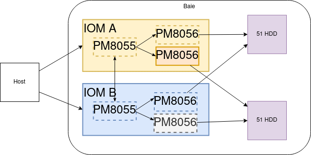
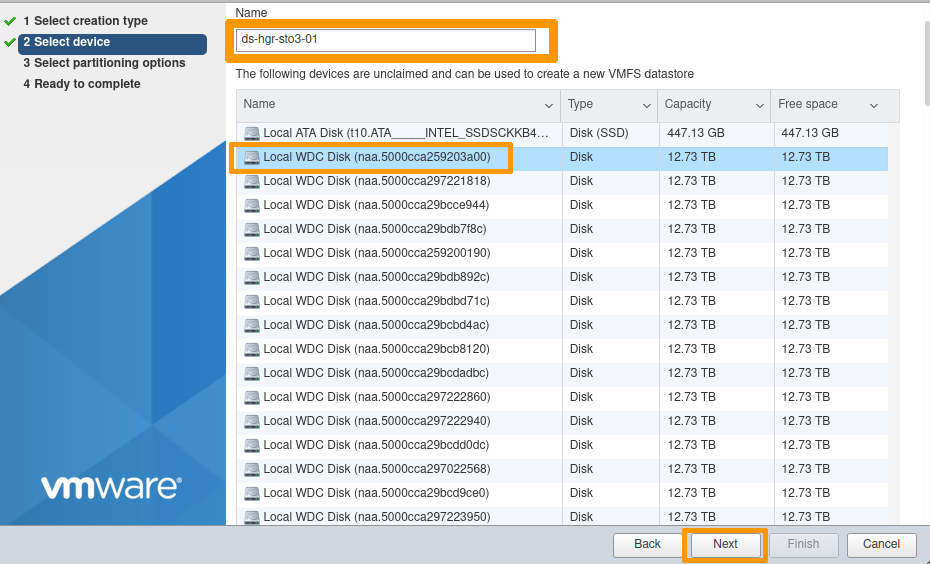
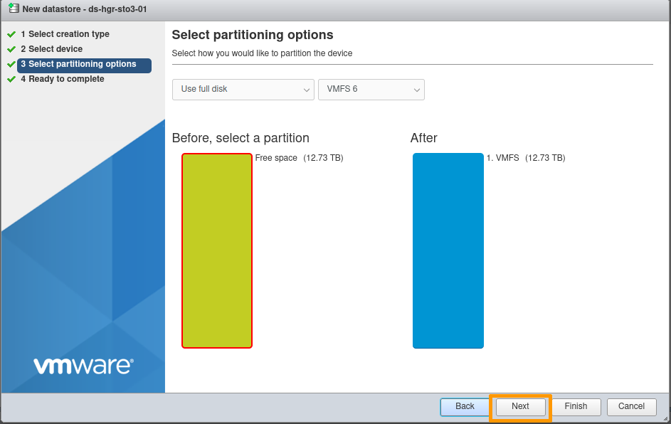
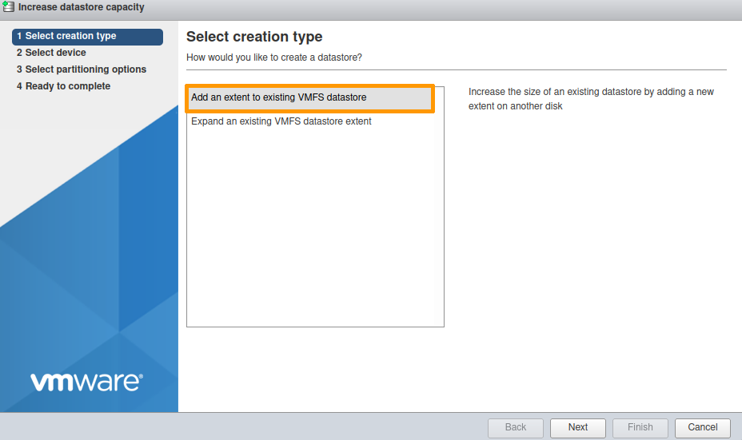
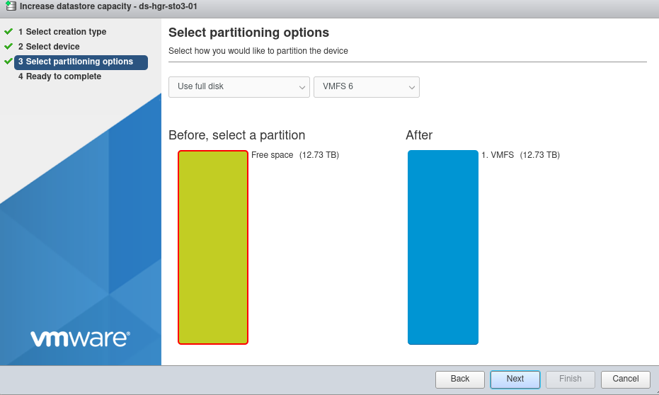

**Dernière mise à jour le 23/08/2022**

## Objectif

Votre serveur HGR-STOR-3 présente les mêmes disques sous différents périphérique logiques (*devices*) du système d'exploitation. 

En fonction des systèmes, sans post-configuration spécifique, cette architecture peut être source de confusion (où sont mes données ?) ou même de collisions (accès involontaire au même disque physique pour des usages différents), ce qui pourrait causer la perte de vos données.

En fonction de votre système, une post-configuration peut être nécessaire afin de mettre en place les fonctionnalités _multipath_.

Le Multipath permet d’agréger les différentes possibilités d'accès au même disque (path) en tant que device logique unique.

Cette documentation détaille :

- les templates OVHcloud compatibles (testés par nos équipes);
- le mode opératoire de post-configuration par OS.

> [!primary]
>
> - Ce guide documente une configuration disposant de 102 disques mais les informations sont également valables pour les autres configurations.
> - Vous ne trouverez que les versions les plus récentes des systèmes.
> - Toutes les versions Debian testées ne détectent que 2 chemins et non 4, ce qui amènerait des collisions au niveau LVM notamment. 

## Prérequis

- Disposer d'un serveur de type HGR-STOR-3

## En pratique

Le serveur, en plus de ses disques internes, expose jusqu'à 102 Disques de 14 To de type SAS.

{.thumbnail}

Les disques de stockages disposent de :

- 2 accès internes;
- 2 accès via contrôleur SAS.

Il y a donc en tout 4 manières d'accéder à un disque:

- Contrôleur SAS 1 - Chemin 1-> Disque
- Contrôleur SAS 1 - Chemin 2-> Disque
- Contrôleur SAS 2 - Chemin 1-> Disque
- Contrôleur SAS 2 - Chemin 2-> Disque

Voici une vue logique :

{.thumbnail}

### Liste des templates OVHcloud

| Template | Procédure | Remarques |
|----------|-----------|-----------|
|ESXi 7| [Procédure pour ESXI-7](#esxi7) ||
|AlmaLinux 8|[Procédure pour AlmaLinux 8, Rocky Linux 8, Fedora 34 Server](#redhatlike)||
|Rocky Linux 8|[Procédure pour AlmaLinux 8, Rocky Linux 8, Fedora 34 Server](#redhatlike) ||
|Fedora 34 Server|[Procédure pour AlmaLinux 8, Rocky Linux 8, Fedora 34 Server](#redhatlike) ||
|Proxmox VE 7|[Procédure pour Proxmox VE 7](#proxmoxve7)||
|Ubuntu Server 22.04 LTS|[Procédure pour Ubuntu Server 22.04 LTS](#ubuntu22)||
|Debian toutes versions| __Non supportée__ | Ne détecte que la moitié des chemins |
|Windows Server 2019|[Procédure pour Windows](#windows)||

#### Avertissement concernant LVM sur Linux

> [!warning]
> Ne créez vos PV **que** sur les devices en multipath de type `/dev/mapper/mpathXX`.

Exemple :

- Création des PVs :

```bash
[root@nsxxxxxx ~]# pvcreate /dev/mapper/mpathb /dev/mapper/mpathc
Physical volume "/dev/mapper/mpathb" successfully created.
Physical volume "/dev/mapper/mpathc" successfully created.
```

- Création d'un VG :

```bash
[root@nsxxxxxx ~]# vgcreate vg_test01 /dev/mapper/mpathb /dev/mapper/mpathc
  Volume group "vg_test01" successfully created
[root@nsxxxxxx ~]# vgs
  VG        #PV #LV #SN Attr   VSize   VFree 
  vg_test01   2   0   0 wz--n- <25.47t <25.47t
```

- Création d'un LV :

```bash
[root@nsxxxxxx ~]# lvcreate --name lv_test01 --size 1To vg_test01
  Logical volume "lv_test01" created.
[root@nsxxxxxx ~]# lvs
  LV        VG        Attr       LSize Pool Origin Data%  Meta%  Move Log Cpy%Sync Convert
  lv_test01 vg_test01 -wi-a----- 1.00t
```

#### Avertissement concernant ZFS sur Linux

> [!warning]
> Ne créez vos zfspool **que** sur les devices en multipath de type `/dev/mapper/mpathXX`.

Exemple :

```bash
[root@nsxxxxxx ~]# zpool create -f zfspool /dev/mapper/mpathe /dev/mapper/mpathf /dev/mapper/mpathg
[root@nsxxxxxx ~]# zpool status
  pool: zfspool
 state: ONLINE
config:
 
    NAME        STATE     READ WRITE CKSUM
    zfspool     ONLINE       0     0     0
      mpathe    ONLINE       0     0     0
      mpathf    ONLINE       0     0     0
      mpathg    ONLINE       0     0     0
 
errors: No known data errors
[root@nsxxxxxx ~]# df -h
Filesystem                       Size  Used Avail Use% Mounted on
devtmpfs                         189G     0  189G   0% /dev
tmpfs                            189G     0  189G   0% /dev/shm
tmpfs                            189G   21M  189G   1% /run
tmpfs                            189G     0  189G   0% /sys/fs/cgroup
/dev/md3                         445G  2.0G  443G   1% /
/dev/md2                        1017M  350M  668M  35% /boot
/dev/sdb1                        511M  5.8M  505M   2% /boot/efi
tmpfs                             38G     0   38G   0% /run/user/1000
zfspool                           39T  128K   39T   1% /zfspool
```

### ESXi-7  <a name="esxi7"></a>

ESXi n'a pas besoin d'installation de composants supplémentaires, le multipath est automatiquement géré.

Si nécessaire, vous pouvez procéder aux vérifications décrites ci-dessous.

#### Vérifications

Connectez-vous via SSH en shell sur votre ESXi.

##### **Liste des adaptateurs**

Vérifiez que ESXi a bien détecté les deux contrôleurs SAS de types similaires à ce qui suit :

```bash
[root@nsxxxxxx:~] esxcli storage san sas list
   Device Name: vmhba2
   SAS Address: 50:06:05:b0:10:62:88:e0
   Physical ID: 0
   Minimum Link Rate: 3000 Mbps
   Maximum Link Rate: 12000 Mbps
   Negotiated Link Rate: 12000 Mbps
   Model Description: HBA 9400-16e - 1000:ac:1000:3020
   Hardware Version: 0x01
   OptionROM Version:
   Firmware Version: 20.00.00.00 - Firmware Package Version: 20.00.00.00
   Driver Name: lsi_msgpt35
   Driver Version: 19.00.02.00
 
   Device Name: vmhba3
   SAS Address: 50:06:05:b0:10:62:83:b0
   Physical ID: 0
   Minimum Link Rate: 3000 Mbps
   Maximum Link Rate: 12000 Mbps
   Negotiated Link Rate: 12000 Mbps
   Model Description: HBA 9400-16e - 1000:ac:1000:3020
   Hardware Version: 0x01
   OptionROM Version:
   Firmware Version: 20.00.00.00 - Firmware Package Version: 20.00.00.00
   Driver Name: lsi_msgpt35
   Driver Version: 19.00.02.00
```

##### **Liste des disques**

```bash
root@nsxxxxxx:~] esxcli storage core device list | grep 'Display Name: Local WDC Disk'
   Display Name: Local WDC Disk (naa.5000cca259203a00)
   Display Name: Local WDC Disk (naa.5000cca297221818)
   Display Name: Local WDC Disk (naa.5000cca29bcce944)
   Display Name: Local WDC Disk (naa.5000cca29bdb892c)
   Display Name: Local WDC Disk (naa.5000cca29bdb7f8c)
   Display Name: Local WDC Disk (naa.5000cca259200190)
   Display Name: Local WDC Disk (naa.5000cca29bce8054)
   Display Name: Local WDC Disk (naa.5000cca297220004)
   Display Name: Local WDC Disk (naa.5000cca29bdb3440)
   Display Name: Local WDC Disk (naa.5000cca29bdbb458)
...
   Display Name: Local WDC Disk (naa.5000cca29bdb1114)
   Display Name: Local WDC Disk (naa.5000cca29bcddf94)
   Display Name: Local WDC Disk (naa.5000cca29bce7dd4)
   Display Name: Local WDC Disk (naa.5000cca259201b40)
   Display Name: Local WDC Disk (naa.5000cca264811f88)
   Display Name: Local WDC Disk (naa.5000cca29bccc5ec)
```

Vous devez voir 102 ou 50 disques.

```bash
[root@nsxxxxxx:~] esxcli storage core device list | grep 'Display Name: Local WDC Disk' | wc -l
102
```

##### **Détails du multipath**

Afin de ne pas surcharger inutilement cette documentation, nous n'affichons qu'un des éléments retournés.

```bash
root@nsxxxxxx:~] esxcli storage hpp path list
...
 
naa.5000cca259203a00
   Device Display Name: Local WDC Disk (naa.5000cca259203a00)
   Path Selection Scheme: FIXED
   Path Selection Scheme Config: {preferred=none;}
   Current Path: vmhba3:C0:T72:L0
   Working Path Set: vmhba3:C0:T72:L0, vmhba3:C0:T175:L0, vmhba2:C0:T72:L0, vmhba2:C0:T175:L0
   Is SSD: false
   Is Local: true
   Paths: vmhba3:C0:T72:L0, vmhba3:C0:T175:L0, vmhba2:C0:T72:L0, vmhba2:C0:T175:L0
   Use ANO: false
 
...
```
On note que pour chaque device, il existe bien 4 chemins d'accès (ligne _Paths_).

- Disque vu par le système : `Local WDC Disk (naa.5000cca259203a00)`
- Deux contrôleurs : `vmhba2` et _`vmhba3`
- Deux disques terminaux: `T72` et `T175`

##### **Vue via l'interface WEB**

Sélectionnez `Storage`{.action} puis l'onglet `Devices`{.action}.

Filtrez les résultats avec le mot-clé `WDC`.

{.thumbnail}

Descendez en bas de la liste, vous devez avoir un décompte de 102 disques (ou 50, en fonction de la configuration utilisée).

{.thumbnail}

#### Ajout d'un Datastore

Sélectionnez `Storage`{.action} puis l'onglet `Datastores`{.action}.

{.thumbnail}

Cliquez sur l’icône `New datastore`{.action}.

{.thumbnail}

Nommez votre Datastore à votre convenance (`ds-hgr-sto3-01` dans l'exemple ci-dessous).

Sélectionnez l'un des disques présentés.

> [!primary]
> Les disques présentés par le HGR-STOR-3 sont nommés `Local WDC Disk (naa.xxxxxxxxxxxx)`.

{.thumbnail}

**Options de partitionnement :**

Par défaut, tout le disque est attribué (pas de partitionnement).

{.thumbnail}

**Validation finale :**

A ce stade, vous pouvez modifier vos choix ou annuler la création du Datastore si besoin.<br>
Dans le cas contraire, cliquez sur `Finish`{.action}.

{.thumbnail}

Un message d'information vous rappele que le disque sélectionné sera entièrement effacé.

{.thumbnail}

Votre Datastore est alors disponible.

{.thumbnail}

#### Extension d'un Datastore

Sélectionnez le datastore à étendre.

Cliquez sur l’icône `Increase capacity`{.action}.

{.thumbnail}

Sélectionnez `Add an extent to existing VMFS datastore`{.action}.

{.thumbnail}

Sélectionner l'un des *devices* présentés.

{.thumbnail}

Par défaut, l'ensemble du disque sera utilisé.

{.thumbnail}

Un message d'information vous rappele que le disque sélectionné sera entièrement effacé.

{.thumbnail}

Votre Datastore est alors étendu.

L'exemple ci-dessous documente une augmentation de 12.73 TB à 25.47 TB.

{.thumbnail}

### AlmaLinux 8, Rocky Linux 8, Fedora 34 Server  <a name="redhatlike"></a>

#### Post-configuration

Les paquets nécessaires sont déjà installés.

Exemple pour AlmaLinux :

```bash
[root@nsxxxxxx ~]# yum install device-mapper-multipath sg3_utils
AlmaLinux 8 - BaseOS                                                                                                                                            8.4 kB/s | 4.3 kB     00:00   
AlmaLinux 8 - AppStream                                                                                                                                          11 kB/s | 4.7 kB     00:00   
AlmaLinux 8 - AppStream                                                                                                                                          19 MB/s | 9.8 MB     00:00   
AlmaLinux 8 - Extras                                                                                                                                             10 kB/s | 3.9 kB     00:00   
Package device-mapper-multipath-0.8.4-17.el8.x86_64 is already installed.
Package sg3_utils-1.44-5.el8.x86_64 is already installed.
Dependencies resolved.
Nothing to do.
Complete!
```

En revanche, la configuration multipath reste à faire, le fichier `/etc/multipath.conf` n'étant pas présent.

```bash
[root@nsxxxxxx ~]# systemctl start multipathd
[root@nsxxxxxx ~]# systemctl status multipathd
● multipathd.service - Device-Mapper Multipath Device Controller
   Loaded: loaded (/usr/lib/systemd/system/multipathd.service; enabled; vendor preset: enabled)
   Active: inactive (dead)
Condition: start condition failed at Thu 2022-04-14 09:38:41 UTC; 3s ago
           └─ ConditionPathExists=/etc/multipath.conf was not met
[root@nsxxxxxx ~]# multipath -ll
Apr 14 09:38:09 | /etc/multipath.conf does not exist, blacklisting all devices.
Apr 14 09:38:09 | You can run "/sbin/mpathconf --enable" to create
Apr 14 09:38:09 | /etc/multipath.conf. See man mpathconf(8) for more details
Apr 14 09:38:09 | DM multipath kernel driver not loaded
```

#### Configuration du service multipath

Activez le service :

```bash
[root@nsxxxxxx ~]# mpathconf --enable --with_multipathd y
```
Activez les options `user_friendly_names` ainsi que `find_multipaths`.

```bash
[root@nsxxxxxx ~]# mpathconf --enable  --user_friendly_names  y  --find_multipaths  y
```

Redémarrez le service `multipathd` :

```bash
[root@nsxxxxxx ~]# systemctl restart multipathd
```

Vérifiez le bon statut du service `multipathd` :

```bash

[root@nsxxxxxx ~]$ systemctl status multipathd
● multipathd.service - Device-Mapper Multipath Device Controller
   Loaded: loaded (/usr/lib/systemd/system/multipathd.service; enabled; vendor preset: enabled)
   Active: active (running) since Thu 2022-04-14 12:24:55 UTC; 45min ago
  Process: 15531 ExecStartPre=/sbin/multipath -A (code=exited, status=0/SUCCESS)
  Process: 15524 ExecStartPre=/sbin/modprobe -a scsi_dh_alua scsi_dh_emc scsi_dh_rdac dm-multipath (code=exited, status=0/SUCCESS)
 Main PID: 15533 (multipathd)
   Status: "up"
    Tasks: 7
   Memory: 74.7M
   CGroup: /system.slice/multipathd.service
           └─15533 /sbin/multipathd -d -s
```

Listez les devices multipath :

```bash
[root@nsxxxxxx ~]# multipath -l
mpathcu (35000cca29bcbba74) dm-100 WDC,WUH721414AL5201
size=13T features='0' hwhandler='0' wp=rw
|-+- policy='service-time 0' prio=0 status=active
| `- 4:0:58:0   sdbh    67:176  active undef running
|-+- policy='service-time 0' prio=0 status=enabled
| `- 4:0:161:0  sdff    130:16  active undef running
|-+- policy='service-time 0' prio=0 status=enabled
| `- 15:0:58:0  sdjd    8:368   active undef running
`-+- policy='service-time 0' prio=0 status=enabled
  `- 15:0:161:0 sdnb    70:464  active undef running
mpathbp (35000cca297222ed8) dm-68 WDC,WUH721414AL5201
size=13T features='0' hwhandler='0' wp=rw
|-+- policy='service-time 0' prio=0 status=active
| `- 4:0:75:0   sdby    68:192  active undef running
|-+- policy='service-time 0' prio=0 status=enabled
| `- 4:0:178:0  sdfw    131:32  active undef running
|-+- policy='service-time 0' prio=0 status=enabled
| `- 15:0:75:0  sdju    65:384  active undef running
`-+- policy='service-time 0' prio=0 status=enabled
  `- 15:0:178:0 sdns    71:480  active undef running
... snip ...
 
mpathax (35000cca29721389c) dm-49 WDC,WUH721414AL5201
size=13T features='0' hwhandler='0' wp=rw
|-+- policy='service-time 0' prio=0 status=active
| `- 4:0:9:0    sdk     8:160   active undef running
|-+- policy='service-time 0' prio=0 status=enabled
| `- 4:0:112:0  sddi    71:0    active undef running
|-+- policy='service-time 0' prio=0 status=enabled
| `- 15:0:9:0   sdhg    133:96  active undef running
`-+- policy='service-time 0' prio=0 status=enabled
  `- 15:0:112:0 sdle    67:448  active undef running
```

On constate que nous avons bien 4 chemins pour chaque device mpathXX listé.

### Ubuntu Server 22.04 LTS <a name="ubuntu22"></a>

#### Post-configuration

Il n'y a pas de paquets additionnels à installer.

La configuration se fait automatiquement.

```bash
ubuntu@nsxxxxxx:~$ sudo systemctl status multipathd
● multipathd.service - Device-Mapper Multipath Device Controller
     Loaded: loaded (/lib/systemd/system/multipathd.service; enabled; vendor preset: enabled)
     Active: active (running) since Thu 2022-04-14 14:01:13 UTC; 16min ago
TriggeredBy: ● multipathd.socket
    Process: 8010 ExecStartPre=/sbin/modprobe -a scsi_dh_alua scsi_dh_emc scsi_dh_rdac dm-multipath (code=exited, status=0/SUCCESS)
   Main PID: 8020 (multipathd)
     Status: "up"
      Tasks: 7
     Memory: 152.4M
        CPU: 11.100s
     CGroup: /system.slice/multipathd.service
             └─8020 /sbin/multipathd -d -s
 
Apr 14 14:01:12 packer-output-aa7a287c-0b44-48b2-8087-614118424744 multipathd[8020]: mpathcp: addmap [0 27344764928 multipath 0 0 4 1 service-time 0 1 1 70:64 1 service-time 0 1 1 132:160 1 >
...
qApr 14 14:01:13 packer-output-aa7a287c-0b44-48b2-8087-614118424744 systemd[1]: Started Device-Mapper Multipath Device Controller.
```

### Proxmox VE 7 <a name="proxmoxve7"></a>

#### Post-configuration

Installez le paquet `multipath-tools` :

```bash
root@nsxxxxxxx:~# apt-get install multipath-tools
Reading package lists... Done
Building dependency tree... Done
Reading state information... Done
The following additional packages will be installed:
kpartx libsgutils2-2 sg3-utils sg3-utils-udev
Suggested packages:
multipath-tools-boot
...snip...
Running hook script 'zz-proxmox-boot'..
Re-executing '/etc/kernel/postinst.d/zz-proxmox-boot' in new private mount namespace..
No /etc/kernel/proxmox-boot-uuids found, skipping ESP sync.
```

Générez la configuration initiale :

```bash
root@nsxxxxxxx:~# multipath -T > /etc/multipath.conf
```

Éditez le fichier `/etc/multipath.conf`

- Modifiez l'option `find_multipaths` à `on`.

{.thumbnail}

- Modifiez l'option `use_friendly_names` à `yes`.
  
{.thumbnail}

Sauvegardez le fichier `/etc/multipath.conf` puis redémarrez le service `multipathd`.

```bash
root@nsxxxxxxx:~# systemctl restart multipathd
```

Vérifiez le statut du service `multipathd` :

```bash
root@nsxxxxxxx:~# systemctl status multipathd
● multipathd.service - Device-Mapper Multipath Device Controller
Loaded: loaded (/lib/systemd/system/multipathd.service; enabled; vendor preset: enabled)
Active: active (running) since Tue 2022-04-19 08:44:47 UTC; 5min ago
TriggeredBy: ● multipathd.socket
Process: 23679 ExecStartPre=/sbin/modprobe -a scsi_dh_alua scsi_dh_emc scsi_dh_rdac dm-multipath (code=exited, status=0/SUC>
Main PID: 23680 (multipathd)
Status: "up"
Tasks: 7
Memory: 112.1M
CPU: 3.958s
CGroup: /system.slice/multipathd.service
└─23680 /sbin/multipathd -d -s
```

#### Ajout d'un node storage de type LVM sur Proxmox

Il est nécessaire de créer les Volumes Groupe (VG) manuellement afin que Proxmox puisse les utiliser.

Exemple : création d'un VG sur 3 PV multipath.

```bash
root@nsxxxxxxx:~# pvcreate /dev/mapper/mpathb
Physical volume "/dev/mapper/mpathb" successfully created.
root@nsxxxxxxx:~# pvcreate /dev/mapper/mpathc
Physical volume "/dev/mapper/mpathc" successfully created.
root@nsxxxxxxx:~# pvcreate /dev/mapper/mpathd
Physical volume "/dev/mapper/mpathd" successfully created.
root@nsxxxxxxx:~# vgcreate vg_hgrstore01 /dev/mapper/mpathb /dev/mapper/mpathc /dev/mapper/mpathd
  Volume group "vg_hgrstore01" successfully created
 
root@nsxxxxxxx:~# vgs
  WARNING: PV /dev/md5 in VG vg is using an old PV header, modify the VG to update.
  VG            #PV #LV #SN Attr   VSize   VFree
  vg              1   1   0 wz--n- 424.50g     0
  vg_hgrstore01   3   0   0 wz--n-  38.20t 38.20t
```

**Ajout du storage node :**

Dans l'interface Proxmox, sélectionnez votre node puis LVM.

Cliquez sur le bouton `Reload`{.action}.

{.thumbnail}

Le nouveau VG est maintenant listé.

{.thumbnail}

- Sélectionnez `Datacenter`{.action} -> `Storage`{.action};
- puis cliquez sur le bouton `Add`{.action} -> `LVM`{.action};
- renseignez l'ID avec le nom de votre stockage ainsi que le VG cible que vous venez de créer.

Une fois votre configuration définie, cliquez sur le bouton `Add`{.action}.

{.thumbnail}

Le stockage est maintenant disponible.

{.thumbnail}

Vous pouvez l'utiliser pour le déploiement de VMs ou autres.

{.thumbnail}

#### Ajout d'un node storage de type ZFS sur Proxmox

Il est nécessaire de créer les pools ZFS manuellement afin que Proxmox puisse les utiliser.

Exemple: création d'un pool sur 2 disques multipath.

```bash
root@nsxxxxxxx:~# zpool status
pool: zfspool01
state: ONLINE
config:
 
NAME STATE READ WRITE CKSUM
zfspool01 ONLINE 0 0 0
mpathe ONLINE 0 0 0
mpathf ONLINE 0 0 0
 
errors: No known data errors
root@nsxxxxxxx:~# zfs create zfspool01/fs01
root@nsxxxxxxx:~# zfs create zfspool01/fs02
```

Dans l'interface Proxmox:

- sélectionnez `Datacenter`{.action} -> `Storage`{.action};
- puis cliquez sur le bouton `Add`{.action} -> `ZFS`{.action}.

{.thumbnail}

Renseignez l'ID avec le nom de votre stockage et sélectionnez l'un des ZFS Pools cibles que vous venez de créer.

{.thumbnail}

Votre stockage Proxmox est maintenant utilisable.

{.thumbnail}


### Windows Server 2019 <a name="windows"></a>

#### Post-configuration

##### **Etape 1 - Installation de la fonctionnalité `MPIO`**

- **Via Powershell**

```Powershell
Install-WindowsFeature -Name Multipath-IO
```

- **Via Server Manager**

{.thumbnail}

Quelle que soit la méthode utilisée, redémarrez le serveur pour finaliser l'installation du composant.

##### **Etape 2 - Ajout du stockage dans MPIO**

- **Via Powershell**

Récupérez les informations du stockage `VendorId` et `HardwareId` :

```Powershell
PS C:\Windows\system32> Get-MPIOAvailableHW
 
VendorId ProductId        IsMultipathed   IsSPC3Supported BusType
-------- ---------        -------------   --------------- -------
WDC      WUH721414AL5201  False           False           SAS
```

Ajoutez le périphérique en utilisant les informations `VendorId` et `HardwareId` précédemment récupérées :

```Powershell
PS C:\Windows\system32> New-MSDSMSupportedHw -VendorId WDC -ProductId WUH721414AL5201
 
VendorId ProductId
-------- ---------
WDC      WUH721414AL5201
```

Vérifiez que le périphérique est maintenant bien pris en compte:

```Powershell
PS C:\Windows\system32> Get-MSDSMSupportedHw
 
VendorId ProductId
-------- ---------
Vendor 8 Product       16
WDC      WUH721414AL5201
```

> [!primary]
> Le stockage par défaut `Vendor 8 Product 16` n'est pas utilisé. Vous pouvez le laisser ou le retirer (dans ce dernier cas, utilisez la commande `Remove-MSDSMSupportedHw`).
>

- **Via Server Manager**

Lancez le panneau de contrôle MPIO. Pour cela, accédez au menu `Démarrer`{.action} et recherchez `MPIO`.

Dans l'onglet `Discover Multi-Paths`{.action}, sélectionnez le périphérique listé dans la fenètre `Others` puis ajoutez-le en cliquant sur le bouton `Add`{.action}:

{.thumbnail}

Quelle que soit la méthode utilisée, redémarrez le serveur pour appliquer le changement de configuration.

##### **Etape 3 - Configuration de la stratégie d'équilibrage (Policy) par défaut pour MPIO**

- **Via Powershell**

Il s'agit de la méthode recommandée car l'utilisation de Server Manager vous obligera à définir la stratégie pour chaque disque.

```Powershell
PS C:\Windows\system32> Set-MSDSMGlobalDefaultLoadBalancePolicy -Policy RR
 
PS C:\Windows\system32> Get-MSDSMGlobalDefaultLoadBalancePolicy
RR
```

Les stratégies (Policy) possibles sont :

| Policy | Description |
|--------|----------------|
|None|Stratégie d'équilibrage de charge globale par défaut.|
|FDO|Fail Over Only: Stratégie qui n'effectue pas d'équilibrage de charge. Cette stratégie utilise un seul chemin actif, les autres chemins sont des chemins d'accès de secours.|
|RR|Round Robin: Stratégie d'équilibrage de charge qui permet d'utiliser tous les chemins disponibles pour MPIO de manière équilibrée.|
|LQD|Least Queue Depth: Stratégie d'équilibrage de charge qui envoie les E/S vers le chemin ayant le moins de demandes d'E/S actuellement en attente.|
|LB|Least Blocks: Stratégie d'équilibrage de charge qui envoie les E/S vers le chemin ayant le moins de blocs de données en cours de traitement.|

- **Via Server Manager**

Cette méthode n'est pas recommandée car elle nécessite de définir la stratégie pour chaque disque.

Vu que `MPIO` est déja installé, l'onglet MPIO est accessible dans les propriétés disque.

{.thumbnail}

Ces trois étapes achevées, vous pouvez lister les disques :

```powershell
PS C:\Windows\system32> get-disk| Sort-Object -Property number |Where-Object -Property FriendlyName -Match WDC

Number Friendly Name            Serial Number            HealthStatus         OperationalStatus      Total Size   Partition 
                                                                                                                  Style
------ -------------            -------------            ------------         -----------------      ----------   ----------
6      WDC WUH721414AL5201      QGKN3K0T                 Healthy              Offline                  12.73 TB   RAW
7      WDC WUH721414AL5201      QGKN5Y0T                 Healthy              Offline                  12.73 TB   RAW
8      WDC WUH721414AL5201      QGKN9HTT                 Healthy              Offline                  12.73 TB   RAW
9      WDC WUH721414AL5201      9KGKM0EL                 Healthy              Offline                  12.73 TB   RAW
10     WDC WUH721414AL5201      QGKMHM8T                 Healthy              Offline                  12.73 TB   RAW
11     WDC WUH721414AL5201      QGKN3GYT                 Healthy              Offline                  12.73 TB   RAW
12     WDC WUH721414AL5201      QGKM1ART                 Healthy              Offline                  12.73 TB   RAW
13     WDC WUH721414AL5201      QGKN9BZT                 Healthy              Offline                  12.73 TB   RAW
14     WDC WUH721414AL5201    
...  
102    WDC WUH721414AL5201      X0GLPWBC                 Healthy              Offline                  12.73 TB   RAW
103    WDC WUH721414AL5201      QGKWST0T                 Healthy              Offline                  12.73 TB   RAW
104    WDC WUH721414AL5201      9RJ2T4RC                 Healthy              Offline                  12.73 TB   RAW
105    WDC WUH721414AL5201      QGKM32VT                 Healthy              Offline                  12.73 TB   RAW
106    WDC WUH721414AL5201      QGKM304T                 Healthy              Offline                  12.73 TB   RAW
107    WDC WUH721414AL5201      QGKM9E0T                 Healthy              Offline                  12.73 TB   RAW
```  

## Aller plus loin

Échangez avec notre communauté d'utilisateurs sur <https://community.ovh.com>
