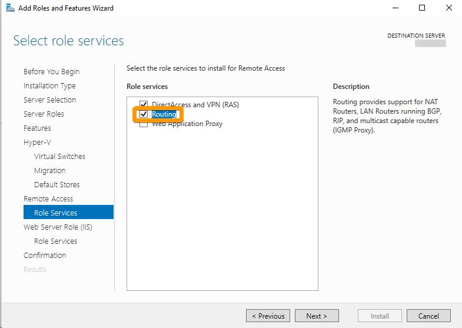
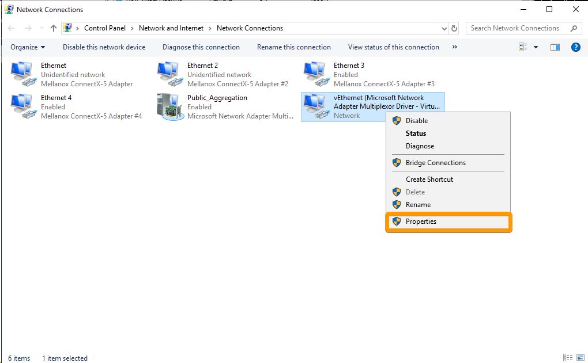
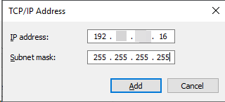

> [!primary]
> Diese Übersetzung wurde durch unseren Partner SYSTRAN automatisch erstellt. In manchen Fällen können ungenaue Formulierungen verwendet worden sein, z.B. bei der Beschriftung von Schaltflächen oder technischen Details. Bitte ziehen Sie beim geringsten Zweifel die englische oder französische Fassung der Anleitung zu Rate. Möchten Sie mithelfen, diese Übersetzung zu verbessern? Dann nutzen Sie dazu bitte den Button «Mitmachen» auf dieser Seite.
>

**Letzte Aktualisierung am 15.11.2021**

## Ziel

Bei den High Grade & SCALE Reihen ist der Betrieb von Failover-IPs im *Bridged*-Modus (über virtuelle MAC-Adressen) nicht möglich. Konfigurieren Sie deshalb die Failover-IPs im Router-Modus oder über das vRack.

**Hier erfahren Sie, wie Sie das Netzwerk mit Hyper-V unter Windows Server konfigurieren.**

## Voraussetzungen

* Sie verfügen über einen [dedizierten OVHcloud Server](https://www.ovhcloud.com/de/bare-metal/)
* Sie verfügen über eine [Failover-IP](https://www.ovhcloud.com/de/bare-metal/ip/)
* Sie sind in Ihrem [OVHcloud Kundencenter](https://www.ovh.com/auth/?action=gotomanager&from=https://www.ovh.de/&ovhSubsidiary=de) angemeldet.

> [!warning]
>
> Im OVHcloud Kundencenter dürfen keine virtuellen MACs für Failover-IPs angelegt werden.
>

## In der praktischen Anwendung

> [!primary]
>
> In diesen Serverreihen gibt es 4 Netzwerkkarten. Die ersten beiden für das Publikum, die zweiten für das Privatleben. Um die gesamte Bandbreite zu nutzen, müssen Aggregate erstellt werden.
>

### Failover-IP im gerouteten Modus für öffentliche Netzwerkinterfaces

#### Erläuterungen

Sie müssen:

- NIC Teaming konfigurieren;
- die Hyper-V- und RRAS-Rollen installieren;
- RRAS als Router konfigurieren.

#### Identifikation der Interfaces und NIC-Teaming-Konfiguration

Öffnen Sie Windows Powershell und führen Sie den Befehl `Get-NetAdapter` aus :

```powershell
PS C:\Windows\system32> Get-NetAdapter

Name                      InterfaceDescription                    ifIndex Status       MacAddress             LinkSpeed
----                      --------------------                    ------- ------       ----------             ---------
Ethernet                  Mellanox ConnectX-5 Adapter                   9 Up           04-3F-72-D5-C3-38        25 Gbps
Ethernet 4                Mellanox ConnectX-5 Adapter #4                7 Up           0C-42-A1-DD-37-B3        25 Gbps
Ethernet 2                Mellanox ConnectX-5 Adapter #2                6 Up           04-3F-72-D5-C3-39        25 Gbps
Ethernet 3                Mellanox ConnectX-5 Adapter #3                4 Up           0C-42-A1-DD-37-B2        25 Gbps
```

In diesem Beispiel:

- die öffentlichen Schnittstellen sind `Ethernet 3`  und `Ethernet 4`;
- private Interfaces sind `Ethernet` und `Ethernet2`.

> [!primary]
>
> Überprüfen Sie, dass Ihre Konfiguration ähnlich ist. Sie verfügen über Informationen zu öffentlichen oder privaten MAC-Adressen und Interfaces in Ihrem [OVHcloud Kundencenter](https://www.ovh.com/auth/?action=gotomanager&from=https://www.ovh.de/&ovhSubsidiary=de) oder über die OVHcloud API.
>

Gehen Sie nun in den Server Manager, gehen Sie in `Local Server`{.action} und klicken Sie auf `Disabled`{.action} neben "NIC Teaming".

{.thumbnail}

Klicken Sie auf der nächsten Seite mit der rechten Maustaste auf eine der zuvor identifizierten öffentlichen Interfaces und klicken Sie dann auf `Add to New Team`{.action}.

{.thumbnail}

Geben Sie einen Namen für Ihr *teaming* und fügen Sie das zweite Interface zum *teaming* hinzu. Öffnen Sie anschließend die zusätzlichen Eigenschaften, definieren Sie "Teaming Mode" auf "LACP" und klicken Sie auf `OK`{.action}.

#### Statische IP konfigurieren

Um einen Verbindungsverlust beim Neustart zu vermeiden, müssen wir die IP-Adresse statisch auf dem *teaming* konfigurieren.

Drücken Sie auf `Windows Key` + `R`, um ein Run-Fenster zu öffnen. Geben Sie `ncpa.cpl` ein und klicken Sie auf `OK`{.action}. Dadurch öffnet sich Ihr Fenster "Netzwerkverbindungen".

{.thumbnail}

Klicken Sie mit der rechten Maustaste auf das von Ihnen erstellte *teaming* und klicken Sie auf `Properties`{.action}.

{.thumbnail}

Doppelklicken Sie auf `Internet Protocol Version 4 (TCP/IPv4)`{.action}.

{.thumbnail}

Wählen Sie `Use the following IP address` Ihre IP-Adresse aus und tragen Sie diese ein.

Die Subnetzmaske und das Standardgateway sind: 255.255.255.255 und 100.64.0.1 (siehe unten).

Bei den DNS Servern können Sie Ihre selbst auswählen. In unserem Beispiel verwenden wir 213.186.33.99 und 8.8.8.8.

Wenn die Adressen angegeben sind, klicken Sie auf `OK`{.action}, um das Fenster zu schließen, und erneut auf `OK`{.action}, um das Fenster der Adaptereigenschaften zu schließen.

{.thumbnail}

#### Fügt die Rollen Hyper-V und RRAS hinzu

Wählen Sie im Server Manager das `Dashboard`{.action} aus und klicken Sie auf `Add Roles and Features`{.action}.

{.thumbnail}

Folgen Sie dem Assistenten bis zum Abschnitt "Server Roles". Wählen Sie dann `Hyper-v` und `Remote Access` aus.

{.thumbnail}

Gehen Sie dann bis zum Abschnitt "Virtual Switches"von "Hyper-V"und wählen Sie Ihr zuvor erstelltes *NIC teaming* aus.

{.thumbnail}

Gehen Sie dann bis zum Abschnitt "Role Services"von "Remote Access"und wählen Sie `Routing`.

{.thumbnail}

Wählen Sie im Bereich "Confirmation" `Restart the destination server automatically if required` aus und klicken Sie auf `Install`{.action}.

#### Configurer Routing and Remote Access

Öffnen Sie die neue Anwendung "Routing and Remote Access", klicken Sie mit der rechten Maustaste auf Ihren Server und klicken Sie auf `Configure and Enable Routing and Remote Access`{.action}.

{.thumbnail}

Wählen Sie `Custom configuration` aus und klicken Sie auf `Next`{.action}.

{.thumbnail}

Wählen Sie dann `LAN Routing` aus und klicken Sie auf `Next`{.action}.

{.thumbnail}

Klicken Sie dann im angezeigten Fenster auf `Finish`{.action} und auf `Start Service`{.action}.

{.thumbnail}

#### Die primären und zusätzlichen statischen IP-Adressen im Hyper-V Interface festlegen

Wir müssen die IP-Konfiguration nun auf das Hyper-V-Interface umziehen.

Drücken Sie auf `Windows Key` + `R`, um ein Run-Fenster zu öffnen. Geben Sie `ncpa.cpl` ein und klicken Sie auf `OK`{.action}. Dadurch öffnet sich Ihr Fenster "Netzwerkverbindungen".

{.thumbnail}

Klicken Sie mit der rechten Maustaste auf Ihre vEthernet Karte und klicken Sie auf `Properties`{.action}.

{.thumbnail}

Doppelklicken Sie auf `Internet Protocol Version 4 (TCP/IPv4)`{.action}.

{.thumbnail}

Wählen Sie `Use the following IP address` aus und tragen Sie Ihre IP-Adresse ein.

Die Subnetzmaske und das Standardgateway sind: 255.255.255.255 und 100.64.0.1 (siehe unten).

Bei den DNS Servern können Sie Ihre selbst auswählen. In unserem Beispiel verwenden wir 213.186.33.99 und 8.8.8.8.

{.thumbnail}

Klicken Sie dann auf `Advanced...`. und klicken Sie im neuen Fenster auf `Add...`{.action} unter den IP-Adressen.

Fügen Sie die IP-Adresse und die Subnetzmaske Ihrer Failover-IP hinzu und klicken Sie auf `Add`{.action}

{.thumbnail}

Wenn Sie alle Adressen angegeben haben, klicken Sie auf `OK`{.action}, um das erweiterte Fenster zu schließen, erneut auf `OK`{.action}, um die TCP/IPv4-Einstellungen zu schließen, und dann auf `OK`{.action}, um das Karteneigenschaftsfenster zu schließen.

> [!warning]
>
> Dieser Schritt kann zu einem Verbindungsverlust führen. Sollte dies der Fall sein, loggen Sie sich via [IPMI](https://docs.ovh.com/de/dedicated/verwendung-ipmi-dedicated-server/) ein und ändern Sie die Konfiguration erneut. Sie werden feststellen, dass Ihr Standardgateway wieder leer ist. Gateway 100.64.0.1 hinzufügen.
>

#### Statische Route hinzufügen

Öffnen Sie eine Eingabeaufforderung als Administrator und führen Sie den Befehl `route print interface` aus:

```console
C:\Users\admin>route print interface
===========================================================================
Interface List
 22...0c 42 a1 dd 37 b2 ......Hyper-V Virtual Ethernet Adapter
 10...04 3f 72 d5 c3 38 ......Mellanox ConnectX-5 Adapter
  7...04 3f 72 d5 c3 39 ......Mellanox ConnectX-5 Adapter #2
  1...........................Software Loopback Interface 1
===========================================================================
```


In unserem Beispiel sehen Sie, dass unsere Hyper-V Karte ID 22 hat.<br>
Achten Sie auf Ihre Hyper-V-Karte und führen Sie dann den Befehl `route add -p 192.xxx.xxx.16 mask 255.255.255.255 0.0.0.0 si 22` (ersetzen Sie die IP-Adresse und die Interface-ID durch die Adresse, die Sie erhalten haben).<br>
Sie sollten das Ergebnis bekommen: "OK!"

```console
PS C:\Users\admin> route add -p 192.xxx.xxx.16 mask 255.255.255.255 0.0.0.0 if 22
 OK!
```

Nachdem Sie Ihre VMs erstellt und konfiguriert haben, benötigen Sie einen Internetzugang.

#### Beispiel für die Konfiguration einer Client-VM auf Ubuntu

Inhalt der Datei `/etc/netplan/ip.yaml`:

```bash
network:
        version: 2
        ethernets:
                eth0:
                        dhcp4: no
                        addresses:
                                - 192.xxx.xxx.16
                        nameservers:
                                addresses:
                                        - 213.186.33.99
                                        - 8.8.8.8
                        routes:
                                - to: 0.0.0.0/0
                                  via: 100.64.0.1
                                  on-link: true
```


### Failover-IP über das vRack

#### Voraussetzungen

- Sie haben einen öffentlichen IP-Adressblock mit mindestens vier Adressen in Ihrem Account reserviert.
- Sie haben den gewünschten privaten IP-Adressbereich vorbereitet.
- Sie verfügen über einen mit [vRack kompatiblen Server](https://www.ovhcloud.com/de/bare-metal/){.external}.
- Sie haben einen [vRack](https://www.ovh.de/loesungen/vrack/){.external} Dienst aktiviert.
- Sie sind in Ihrem [OVHcloud Kundencenter](https://www.ovh.com/auth/?action=gotomanager&from=https://www.ovh.de/&ovhSubsidiary=de){.external} angemeldet.

#### Erläuterungen

Sie brauchen:

* Erstellung eines Aggregats;
* eine an das Aggregat angeschlossene Bridge zu erstellen;

#### Identifikation der Interfaces und NIC-Teaming-Konfiguration

Öffnen Sie Windows Powershell und führen Sie den Befehl `Get-NetAdapter aus`

```powershell
PS C:\Windows\system32> Get-NetAdapter

Name                      InterfaceDescription                    ifIndex Status       MacAddress             LinkSpeed
----                      --------------------                    ------- ------       ----------             ---------
Ethernet                  Mellanox ConnectX-5 Adapter                   9 Up           04-3F-72-D5-C3-38        25 Gbps
Ethernet 4                Mellanox ConnectX-5 Adapter #4                7 Up           0C-42-A1-DD-37-B3        25 Gbps
Ethernet 2                Mellanox ConnectX-5 Adapter #2                6 Up           04-3F-72-D5-C3-39        25 Gbps
Ethernet 3                Mellanox ConnectX-5 Adapter #3                4 Up           0C-42-A1-DD-37-B2        25 Gbps
```

In diesem Beispiel:

- die öffentlichen Schnittstellen sind `Ethernet 3` und `Ethernet 4`;
- private Interfaces sind `Ethernet` und `Ethernet2`.

> [!primary]
>
> Überprüfen Sie, dass Ihre Konfiguration ähnlich ist. Sie verfügen über Informationen zu öffentlichen oder privaten MAC-Adressen und Interfaces in Ihrem [OVHcloud Kundencenter](https://www.ovh.com/auth/?action=gotomanager&from=https://www.ovh.de/&ovhSubsidiary=de) oder über die OVHcloud API.
>

Gehen Sie nun in den Server Manager, gehen Sie in `Local Server`{.action} und klicken Sie auf `Disabled`{.action} neben "NIC Teaming".

{.thumbnail}

Klicken Sie auf der nächsten Seite mit der rechten Maustaste auf eines der zuvor identifizierten privaten Interfaces und klicken Sie dann auf `Add to New Team`{.action}.

{.thumbnail}

Geben Sie einen Namen für Ihr *teaming* und fügen Sie das zweite Interface zum *teaming* hinzu. Öffnen Sie anschließend die zusätzlichen Eigenschaften, definieren Sie "Teaming Mode" auf "LACP" und klicken Sie auf `OK`{.action}.

#### Virtuellen Schalter in Hyper-VM erstellen

Wir werden einen virtuellen Switch erstellen müssen, der unsere VMs an das *teaming* bindet, das wir erstellt haben.

Öffnen Sie zuerst den Hyper-V Manager und klicken Sie auf `Virtual Switch Manager`{.action}.

{.thumbnail}

Vergewissern Sie sich, dass Sie "External" ausgewählt haben, und klicken Sie auf `Create Virtual Switch`{.action}.

{.thumbnail}

Geben Sie Ihrem Switch einen Namen, wählen Sie Ihren neuen adapter *teaming* aus, klicken Sie auf `Apply`{.action} und dann auf `OK`{.action}.

{.thumbnail}

Sie sind nun bereit, Ihre VM zu erstellen und das Netzwerk dafür zu konfigurieren.

#### Eine verwendbare IP-Adresse konfigurieren

Im Fall des vRack sind die erste, die vorletzte und die letzte Adresse eines bestimmten IP-Blocks immer für die Netzwerkadresse, das Netzwerk-Gateway und den *broadcast* des Netzwerks reserviert. Das heißt, die erste verwendbare Adresse ist die zweite Adresse des Blocks, wie im Folgenden zu sehen ist:

```sh
46.105.135.96   # Reserviert: Netzwerkadresse
46.105.135.97   # Erste verwendbare IP
46.105.135.98
46.105.135.99
46.105.135.100
46.105.135.101
46.105.135.102
46.105.135.103
46.105.135.104
46.105.135.105
46.105.135.106
46.105.135.107
46.105.135.108
46.105.135.109   # Letzte verwendbare IP
46.105.135.110   # Reserviert: Netzwerk
46.105.135.111   # Reserviert: Netzwerk-Broadcast
```

Um die erste verwendbare IP-Adresse zu konfigurieren, bearbeiten Sie die Netzwerkkonfigurationsdatei wie im Folgenden beschrieben. In unserem Beispiel verwenden wir **255.255.255.240** als Subnetzmaske.

> [!primary]
>
> Die von uns in diesem Beispiel verwendete Subnetzmaske passt zu unserem IP-Block. Ihre Subnetzmaske kann je nach Größe Ihres Blocks variieren. Wenn Sie Ihren IP-Block kaufen, erhalten Sie eine E-Mail mit der zu verwendenden Subnetzmaske.
>

#### Beispiel für die VM-Konfiguration Ubuntu

Inhalt der Datei `/etc/netplan/vrack.yaml`:

```bash
network:
        version: 2
        ethernets:
                eth0:
                        dhcp4: Nr.
                        addresses:
                                - 46.105.135.97/28
                        nameservers:
                                addresses:
                                        - 213.186.33.99
                                        - 8.8.8.8
                        Straßen
                                - 0.0.0.0/0
                                  via: 46.105.135.110
                                  on-link: true
```

## Weiterführende Informationen
 
Für den Austausch mit unserer User Community gehen Sie auf <https://community.ovh.com/en/>.