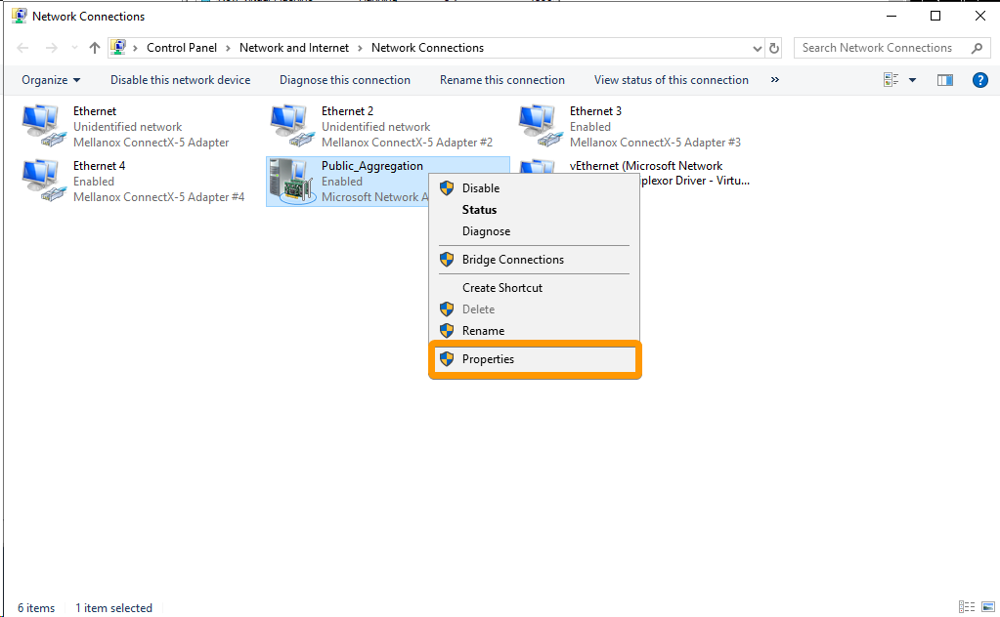
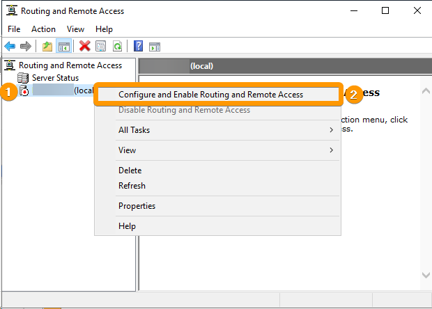
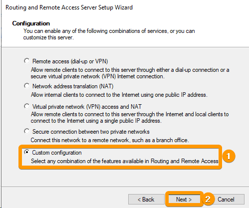
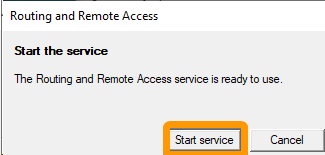

> [!primary]
> Esta tradução foi automaticamente gerada pelo nosso parceiro SYSTRAN. Em certos casos, poderão ocorrer formulações imprecisas, como por exemplo nomes de botões ou detalhes técnicos. Recomendamos que consulte a versão inglesa ou francesa do manual, caso tenha alguma dúvida. Se nos quiser ajudar a melhorar esta tradução, clique em "Contribuir" nesta página.
>

**Última atualização: 15/11/2021**

## Objetivo

Nas gamas High Grade & SCALE, o funcionamento dos IP fail-over em modo *bridged* (através de MAC virtuais) não é possível. Por isso, é necessário configurar os IP Failover em modo roteado ou através do vRack.

**Saiba como configurar a rede em Windows Server com Hyper-V.**

## Requisitos

* Dispor de um [servidor dedicado OVHcloud](https://www.ovhcloud.com/pt/bare-metal/)
* Dispor de um endereço [IP Failover](https://www.ovhcloud.com/pt/bare-metal/ip/)
* Estar ligado à [Área de Cliente OVHcloud](https://www.ovh.com/auth/?action=gotomanager&from=https://www.ovh.pt/&ovhSubsidiary=pt).

> [!warning]
>
> Nenhum MAC virtual deve ser aplicado aos IP Failover na Área de Cliente OVHcloud.
>

## Instruções

> [!primary]
>
> Nessas gamas de servidores, há 4 placas de rede. As duas primeiras para o público, as duas últimas para o privado. Para beneficiar do conjunto da largura de banda, devem ser criados agregados.
>

### IP Failover em modo roteado nas interfaces de rede pública

#### Explicações

Deve:

- configurar NIC Teaming;
- instalar as funções Hyper-V e RRAS;
- configurar RRAS para atuar como router.

#### Identificação das interfaces e configuração de NIC Teaming

Abra o Windows Powershell e execute o comando `Get-NetAdapter`:

```powershell
PS C:\Windows\system32> Get-NetAdapter

Name                      InterfaceDescription                    ifIndex Status       MacAddress             LinkSpeed
----                      --------------------                    ------- ------       ----------             ---------
Ethernet                  Mellanox ConnectX-5 Adapter                   9 Up           04-3F-72-D5-C3-38        25 Gbps
Ethernet 4                Mellanox ConnectX-5 Adapter #4                7 Up           0C-42-A1-DD-37-B3        25 Gbps
Ethernet 2                Mellanox ConnectX-5 Adapter #2                6 Up           04-3F-72-D5-C3-39        25 Gbps
Ethernet 3                Mellanox ConnectX-5 Adapter #3                4 Up           0C-42-A1-DD-37-B2        25 Gbps
```

Neste exemplo:

- as interfaces públicas são `Ethernet 3` e `Ethernet 4`;
- as interfaces privadas são `Ethernet` e `Ethernet 2`.

> [!primary]
>
> Verifique que a sua configuração é semelhante. Dispõe das informações relativas aos MAC e interfaces públicas ou privadas na sua [Área de Cliente OVHcloud](https://www.ovh.com/auth/?action=gotomanager&from=https://www.ovh.pt/&ovhSubsidiary=pt) ou através da API OVHcloud.
>

Volte ao Server Manager, vá ao `Local Server`{.action} e clique em `Disabled`{.action} junto de "NIC Teaming".

{.thumbnail}

Na página seguinte, clique com o botão direito do rato sobre uma das interfaces públicas previamente identificadas e, a seguir, em `Add to New Team`{.action}.

{.thumbnail}

Atribua um nome ao seu *teaming* e adicione a segunda interface ao *teaming*. A seguir, abra as propriedades adicionais, defina "Teaming Mode" em "LACP" e clique em `OK`{.action}.

#### Configurar um IP estático

Para evitar a perda de ligação durante a reinicialização, temos de configurar o IP de forma estática no *teaming*.

Carregue em `Windows Key` + `R` para abrir uma janela Run. Introduza `ncpa.cpl` e clique em `OK`{.action}. Isto abrirá a janela "Ligações de rede".

{.thumbnail}

Clique com o botão direito do rato no *teaming* que criou e clique em `Properties`{.action}.

{.thumbnail}

Clique duas vezes em `Internet Protocol Version 4 (TCP/IPv4)`{.action}.

{.thumbnail}

Selecione `Use the following IP address and insert your IP address`.

A máscara de sub-rede e a gateway predefinida serão: 255.255.255.255 e 100.64.0.1 (como indicado abaixo).

Para os servidores DNS, pode escolher os seus. No nosso exemplo, utilizamos 213.186.33.99 e 8.8.8.8.

Depois de introduzir os endereços, clique em `OK`{.action} para fechar a janela e novamente em `OK`{.action} para fechar a janela das propriedades do adaptador.

{.thumbnail}

#### Adicione as funções Hyper-V e RRAS

No Server Manager, selecione o `Dashboard`{.action} e clique em `Add roles and feature`{.action}.

{.thumbnail}

Siga o passo do assistente até atingir a secção "Server Roles". Selecione `Hyper-v` e `Remote Access`.

{.thumbnail}

De seguida, prossiga até à secção "Virtual Switches" de "Hyper-V" e selecione o seu *NIC teaming* criado anteriormente.

{.thumbnail}

De seguida, continue até à secção "Role Services" de "Remote Access" e selecione `Routing`.

{.thumbnail}

Por fim, na secção "Confirmation", selecione `Restart the destination server automatically if required` e clique em `Install`{.action}.

#### Configurar Routing and Remote Access

Abra a nova aplicação chamada "Routing and Remote Access", clique com o botão direito do rato no seu servidor e clique em `Configure and Enable Routing and Remote Access`{.action}.

{.thumbnail}

Escolha `Custom configuration` e clique em `Next`{.action}.

{.thumbnail}

De seguida, selecione `LAN Routing` e clique em `Next`{.action}.

{.thumbnail}

Por fim, clique em `Finish`{.action} e, a seguir, em `Start Service`{.action}, na janela que aparecerá.

{.thumbnail}

#### Definir os endereços IP estáticos principal e suplementar na interface Hyper-V

Agora, temos de transferir a configuração IP para a interface Hyper-V.

Carregue em `Windows Key` + `R` para abrir uma janela Run. Introduza `ncpa.cpl` e clique em `OK`{.action}. Isto abrirá a janela "Ligações de rede".

{.thumbnail}

Clique com o botão direito do rato no seu cartão vEthernet e clique em `Properties`{.action}.

{.thumbnail}

Clique duas vezes em `Internet Protocol Version 4 (TCP/IPv4)`{.action}.

{.thumbnail}

Selecione `Use the following IP address` e insira o seu endereço IP.

A máscara de sub-rede e a gateway predefinida serão: 255.255.255.255 e 100.64.0.1 (como indicado abaixo).

Para os servidores DNS, pode escolher os seus. No nosso exemplo, utilizamos 213.186.33.99 e 8.8.8.8.

{.thumbnail}

A seguir, clique no botão `Advanced...` e, na nova janela, em `Add...`{.action} e em endereços IP.

Adicione o endereço IP e a máscara de sub-rede correspondente ao seu IP Failover e clique em `Add`{.action}

{.thumbnail}

Depois de introduzir todos os endereços, clique em `OK`{.action} para fechar a janela avançada, novamente em `OK`{.action} para fechar os parâmetros TCP/IPv4 e, uma última vez, em `OK`{.action} para fechar a janela das propriedades do cartão.

> [!warning]
>
> Esta etapa pode provocar uma perda de ligação. Se isso acontecer, ligue-se através do [IPMI](https://docs.ovh.com/pt/dedicated/usar-ipmi-servidores-dedicados/) e altere novamente a configuração. Poderá verificar que a gateway predefinida voltou ao estado vazio. Adicione a gateway 100.64.0.1.
>

#### Adicionar uma estrada estática

Abra uma linha de comando enquanto administrador e execute o comando `route print interface`:

```console
C:\Users\admin>route print interface
===========================================================================
Interface List
 22...0c 42 a1 dd 37 b2 ......Hyper-V Virtual Ethernet Adapter
 10...04 3f 72 d5 c3 38 ......Mellanox ConnectX-5 Adapter
  7...04 3f 72 d5 c3 39 ......Mellanox ConnectX-5 Adapter #2
  1...........................Software Loopback Interface 1
===========================================================================
```

No nosso exemplo, pode ver que o nosso cartão Hyper-V tem o ID 22.<br>
Tome nota do seu cartão Hyper-V e execute o comando `route add -p 192.xxx.xxx.16 mask 255.255.255.255 0.0.0.0 si 22` (substitua o IP e o ID de interface pelo que recebeu).<br>
Deveriam obter o resultado "OK!".

```console
PS C:\Users\admin> route add -p 192.xxx.xxx.16 mask 255.255.255.255 0.0.0.0 if 22
 OK!
```

Uma vez criadas e configuradas, as suas VM devem dispor de um acesso à Internet.

#### Exemplo de configuração de uma VM cliente em Ubuntu

Conteúdo do ficheiro `/etc/netplan/ip.yaml`:

```bash
network:
        version: 2
        ethernets:
                eth0:
                        dhcp4: no
                        addresses:
                                - 192.xxx.xxx.16
                        nameservers:
                                addresses:
                                        - 213.186.33.99
                                        - 8.8.8.8
                        routes:
                                - to: 0.0.0.0/0
                                  via: 100.64.0.1
                                  on-link: true
```


### IP Failover através do vRack

#### Requisitos

- Ter reservado um bloco público de endereços IP na sua conta, com um mínimo de quatro endereços.
- Ter acesso ao intervalo de endereços de IP privados escolhidos.
- Dispor de um [servidor compatível com o vRack](https://www.ovhcloud.com/pt/bare-metal/){.external}.
- Ter ativado um serviço [vRack](https://www.ovh.pt/solucoes/vrack/){.external}.
- Ter acesso à [Área de Cliente OVHcloud](https://www.ovh.com/auth/?action=gotomanager&from=https://www.ovh.pt/&ovhSubsidiary=pt){.external}.

#### Explicações

Tem de:

* criar um agregado;
* criar um bridge ligado ao agregado;

#### Identificação das interfaces e configuração de NIC Teaming

Abra o Windows Powershell e execute o comando `Get-NetAdapter`

```powershell
PS C:\Windows\system32> Get-NetAdapter

Name                      InterfaceDescription                    ifIndex Status       MacAddress             LinkSpeed
----                      --------------------                    ------- ------       ----------             ---------
Ethernet                  Mellanox ConnectX-5 Adapter                   9 Up           04-3F-72-D5-C3-38        25 Gbps
Ethernet 4                Mellanox ConnectX-5 Adapter #4                7 Up           0C-42-A1-DD-37-B3        25 Gbps
Ethernet 2                Mellanox ConnectX-5 Adapter #2                6 Up           04-3F-72-D5-C3-39        25 Gbps
Ethernet 3                Mellanox ConnectX-5 Adapter #3                4 Up           0C-42-A1-DD-37-B2        25 Gbps
```

Neste exemplo:

- as interfaces públicas são `Ethernet 3` and `Ethernet 4`;
- as interfaces privadas são `Ethernet` e `Ethernet 2`.

> [!primary]
>
> Verifique que a sua configuração é semelhante. Dispõe das informações relativas aos MAC e interfaces públicas ou privadas na sua [Área de Cliente OVHcloud](https://www.ovh.com/auth/?action=gotomanager&from=https://www.ovh.pt/&ovhSubsidiary=pt) ou através da API OVHcloud.
>

Volte ao Server Manager, vá ao `Local Server`{.action} e clique em `Disabled`{.action} junto de "NIC Teaming".

{.thumbnail}

Na página seguinte, clique com o botão direito do rato sobre uma das interfaces privadas anteriormente identificadas e, a seguir, em `Add to New Team`{.action}.

{.thumbnail}

Atribua um nome ao seu *teaming* e adicione a segunda interface ao *teaming*. A seguir, abra as propriedades adicionais, defina "Teaming Mode" em "LACP" e clique em `OK`{.action}.

#### Criar o comutador virtual na Hyper-V

Vamos precisar de criar um switch virtual que ligará as nossas VMs ao *teaming* que criámos.

Em primeiro lugar, abra o gestor Hyper-V e clique em `Virtual Switch Manager`{.action}.

{.thumbnail}

Nesta página, certifique-se de que selecionou "External" e clique em `Create Virtual Switch`{.action}.

{.thumbnail}

Atribua um nome ao seu comutador, escolha o seu novo adaptador de *teaming*, clique em `Apply`{.action} e depois em `OK`{.action}.

{.thumbnail}

Está agora pronto para criar a sua VM e configurar a rede para esta.

#### Configurar um endereço IP utilizável

No caso do vRack, o primeiro, o penúltimo e o último endereço de um determinado bloco de IP são sempre reservados, respetivamente, ao endereço de rede, ao gateway de rede e ao *broadcast* da rede. Isto significa que o primeiro endereço utilizável é o segundo endereço do bloco, como indicado a seguir:

```sh
46.105.135.96   # Reservado: endereço de rede
46.105.135.97   # Primeiro IP utilizável
46.105.135.98
46.105.135.99
46.105.135.100
46.105.135.101
46.105.135.102
46.105.135.103
46.105.135.104
46.105.135.105
46.105.135.106
46.105.135.107
46.105.135.108
46.105.135.109   # Último IP utilizável
46.105.135.110   # Reservado: gateway de rede
46.105.135.111   # Reservado: broadcast
```

Para configurar o primeiro endereço IP utilizável, é preciso editar o ficheiro de configuração de rede, como indicado abaixo. Neste exemplo, utilize uma máscara de sub-rede **255.255.255.240**.

> [!primary]
>
> A máscara de sub-rede utilizada neste exemplo adequa-se ao nosso bloco de endereços IP. A sua máscara de sub-rede pode diferir em função da dimensão do bloco. Quando comprar o seu bloco de endereços IP, receberá um e-mail com a máscara de sub-rede que deve utilizar.
>

#### Exemplo de configuração VM cliente Ubuntu

Conteúdo do ficheiro `/etc/netplan/vrack.yaml`:

```bash
network:
        version: 2
        ethernets:
                eth0:
                        dhcp4: no
                        addresses:
                                - 46.105.135.97/28
                        nameservers:
                                addresses:
                                        - 213.186.33.99
                                        - 8.8.8.8
                        routes:
                                - to: 0.0.0.0/0
                                  via: 46.105.135.110
                                  on-link: true
```

## Quer saber mais?
 
Fale com a nossa comunidade de utilizadores: <https://community.ovh.com/en/>.
