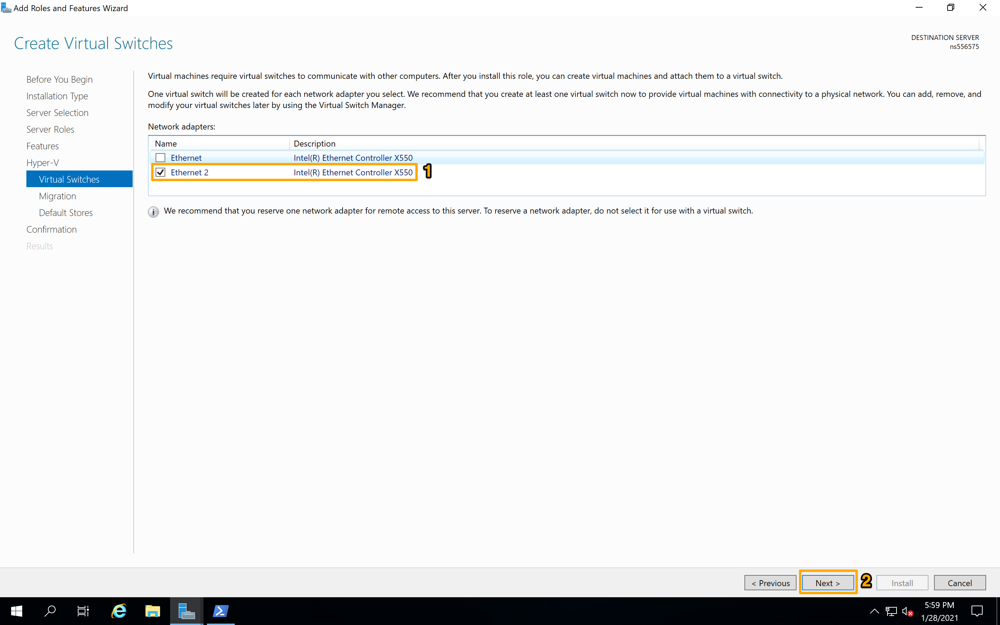
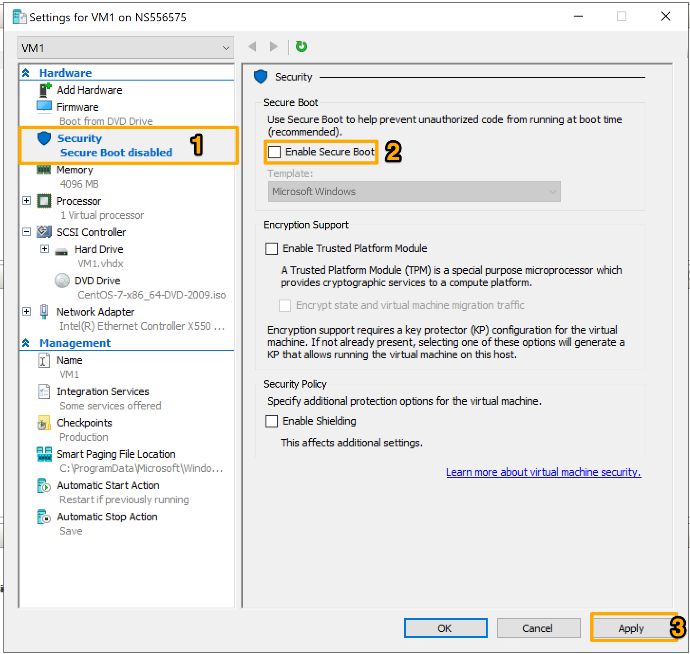

> [!primary]
> Diese Übersetzung wurde durch unseren Partner SYSTRAN automatisch erstellt. In manchen Fällen können ungenaue Formulierungen verwendet worden sein, z.B. bei der Beschriftung von Schaltflächen oder technischen Details. Bitte ziehen Sie beim geringsten Zweifel die englische oder französische Fassung der Anleitung zu Rate. Möchten Sie mithelfen, diese Übersetzung zu verbessern? Dann nutzen Sie dazu bitte den Button «Mitmachen» auf dieser Seite.
>

**Stand 26.04.2021**

## Ziel

Verfolgen Sie den Hyper-V Installationsprozess, die Kombination eines virtuellen Switch und die Konfiguration einer virtuellen Maschine, um mit Failover-IPs auf einem vRack zu arbeiten.

**Hier erfahren Sie, wie Sie eine virtuelle Maschine mit Failover- und Hyper-V-IPs auf einem vRack konfigurieren.**

## Voraussetzungen

- Ein dedizierter Server ([vRack](https://www.ovh.de/loesungen/vrack/) kompatibel), auf dem Windows Server installiert ist.
- Ein ISO-Image für das Betriebssystem, das auf Ihrer virtuellen Maschine installiert wird (CentOS 7 wird in dieser Anleitung als Beispiel verwendet).
- Ein vRack, geliefert auf Ihrem OVHcloud Account.
- einen IP-Block mit 4 oder mehr IP-Adressen.
- Sie sind im OVHcloud [Kundencenter eingeloggt](https://www.ovh.com/auth/?action=gotomanager&from=https://www.ovh.de/&ovhSubsidiary=de).

## In der praktischen Anwendung

In dieser Anleitung wird davon ausgegangen, dass Sie bereits Windows Server installiert haben, über den Remotedesktop eingeloggt sind und Ihren dedizierten Server und Ihren IP-Block bereits einem vRack zugewiesen haben. Weitere Informationen zu diesen Schritten finden Sie in den Schritten 1 bis 4 unserer Anleitung: [Mehrere dedizierte Server im vRack konfigurieren](../mehrere-dedizierte-server-im-vrack-konfigurieren/).

### Hyper-V Installation

Installieren Sie zunächst Hyper-V.

Klicken Sie im Server-Manager auf `Add Roles and Features`{.action}

{.thumbnail}

Klicken Sie im Assistenten auf `Next`{.action}, um zur nächsten Seite zu gelangen.

{.thumbnail}

Überprüfen Sie, ob die Option "Role-Based or feature-based installations"ausgewählt wurde, und klicken Sie dann auf `Next`{.action}.

{.thumbnail}

Überprüfen Sie, dass die Option "Select a server from the server pool" ausgewählt wurde, sowie der Server, an dem Sie in der unten stehenden Liste arbeiten. Klicken Sie anschließend auf `Next`{.action}.

{.thumbnail}

Setzen Sie in der Liste der Rollen einen Haken bei "Hyper-V"und klicken Sie dann auf `Next`{.action}.

{.thumbnail}

Auf der folgenden Seite ("Features") klicken Sie auf `Next`{.action}.

{.thumbnail}

Identifizieren Sie die Netzwerkverbindung Ihres Servers, den Sie für den virtuellen Switch verwenden möchten.

Um diese zu identifizieren, öffnen Sie ein Command Prompt oder PowerShell und führen Sie den Befehl ipconfig /all `aus`.

In unserem Beispiel ist `Ethernet` das für vRack verwendete Interface. Es ist jedoch möglich, dass die vRack Netzwerkkarte ein anderes Interface verwendet. Verwenden Sie ein Interface, das nicht die Haupt-IP-Adresse des Servers besitzt oder eine selbst zugewiesene IP-Adresse verwendet (169.254.x.x).

{.thumbnail}

Wenn Sie diese Informationen erhalten haben, gehen Sie auf das Wizard `Add Roles and Features`{.action} und klicken Sie auf `Next`{.action}.

{.thumbnail}

Wählen Sie den Adapter für das vRack aus, das Sie im Command Prompt oder PowerShell identifiziert haben, und klicken Sie dann auf `Next`{.action}.

{.thumbnail}

Auf den beiden folgenden Seiten können Sie die Optionen für Migration und Storage auswählen. Sie können sie nach Belieben konfigurieren.

Wenn Sie die Bestätigungsseite erreicht haben, setzen Sie einen Haken im Feld "Restart the destination server automatically if required", klicken Sie auf `Yes`{.action} und dann auf `Install`{.action}.

{.thumbnail}

Hyper-V wird nun installiert und der Server soll neu gestartet werden.

### Eine virtuelle Maschine erstellen und konfigurieren

Sobald der Server neu gestartet ist, loggen Sie sich ein und öffnen Sie den Hyper-V Manager.

Wählen Sie links Ihren Server aus, klicken Sie auf `New`{.action} und wählen Sie "Virtual Machine" aus.

{.thumbnail}

Konfigurieren Sie die virtuelle Maschine in "New Virtual Machine Wizard", wie Sie möchten. Wenn Sie auf den Schritt "Configure" zugreifen, wählen Sie den virtuellen Switch aus. Klicken Sie nach der Auswahl auf `Next`{.action}, um fortzufahren.

{.thumbnail}

Wenn Sie den Abschnitt "Installation Optionen"erreicht haben, fügen Sie bitte das ISO-Image für das Betriebssystem, das Sie installieren möchten, hinzu. Klicken Sie auf `Next`{.action}, um fortzufahren.

{.thumbnail}

Wenn Sie auf die Seite "Summary"zugreifen, überprüfen Sie, ob die Einstellungen des virtuellen Switch und des Betriebssystems korrekt sind, und klicken Sie dann auf `Finish`{.action}.

{.thumbnail}

### Betriebssystem installieren und IP konfigurieren

Starten Sie die Virtuelle Maschine. Die Installation des Betriebssystems muss automatisch beginnen. Ist das nicht der Fall, wird folgende Fehlermeldung angezeigt:

> "The unsigned image hash is not allowed (DB)"

In diesem Fall müssen Sie den "Secure Boot" deaktivieren.

Schalten Sie die Virtuelle Maschine aus und klicken Sie dann auf `Settings`{.action}.

{.thumbnail}

Klicken Sie auf `Security`{.action}, wählen Sie "Enable Secure Boot"aus und klicken Sie dann auf `Apply`{.action}.

{.thumbnail}

Wenn Sie fertig sind, starten Sie die Virtuelle Maschine neu.

Konfigurieren Sie das Betriebssystem so, wie Sie möchten.

Für die Netzwerkeinstellungen muss eine statische IP-Adresse festgelegt werden.

In unserem Beispiel ist der dem vRack zugewiesene IP-Block 192.xxx.xxx.80/29. Die Verteilung des Blocks:

 
192.xxx.xxx.80 - Netzwerkadresse (reserviert - nicht verwendbar) 
192.xxx.xxx.81 - Erste verwendbare IP-Adresse 
192.xxx.xxx.82 
192.xxx.xxx.83 
192.xxx.xxx.84 
192.xxx.xxx.85 - Letzte verwendbare IP-Adresse 
192.xxx.xxx.86 - Standardgateway (reserviert - nicht verwendbar) 
192.xxx.xxx.87 - Broadcast-Adresse (reserviert - nicht verwendbar) 
 

192.xxx.xxx.81 in unserem Beispiel verwenden. Die Konfiguration muss wie folgt lauten:

 
Adresse: 192.168.xxx.81 
Subnet Mask: 255.255.255.248 
Gateway:  192.xxx.xxx.86 
DNS: 213.186.33.99 (Sie können auf Wunsch einen anderen DNS hinzufügen) 
 

Sobald das Betriebssystem installiert ist. Er sollte schon verbunden sein.

Das nachstehende Beispiel zeigt, wie die ifcfg-eth` `o-Datei erscheinen soll.

{.thumbnail}

## Weiterführende Informationen

Für den Austausch mit unserer User Community gehen Sie auf <https://community.ovh.com/en/>.
